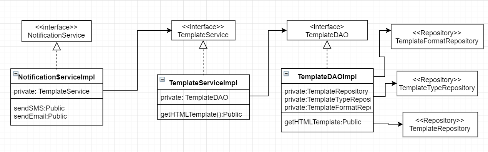
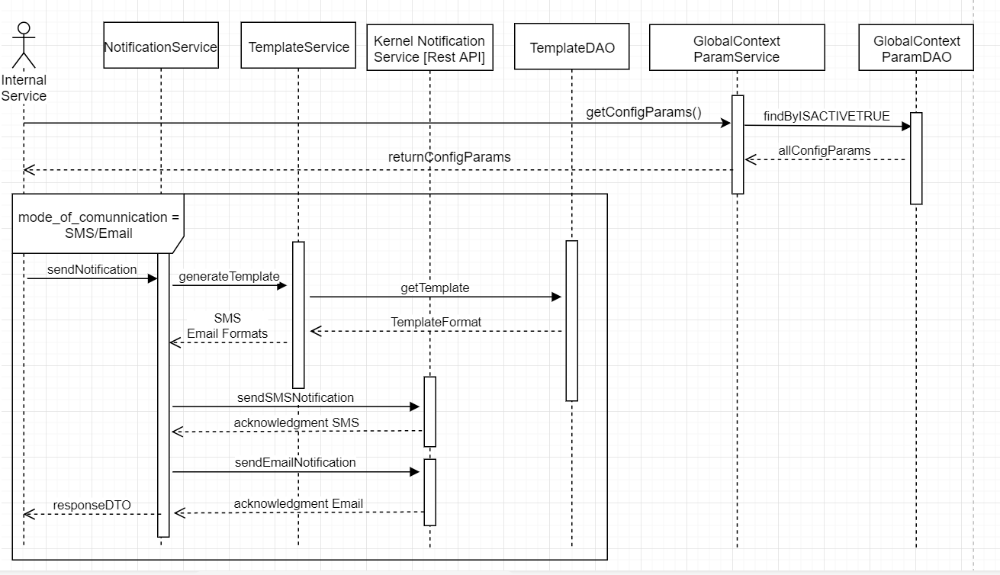

Design -- Acknowledgement Notification

**Background**

Once the user captures the demographic details, biometrics and other
details of the individual and ready for packet generation, an
acknowledgement template has to be triggered as SMS/Email to
individual's registered mobile number and email address. The template,
type and file format details are configured in DB. So application has to
get the template configuration to set the template and trigger the
SMS/Email.

The **target users** are

-   Registration officer

-   Registration Supervisor

The key **requirements** are

-   The system should trigger the acknowledgement SMS/Email based on the
    template defined by the admin at the country level.

-   The system should trigger the SMS/Email to the mobile number/email
    provided during registration.

-   The System should send the notification post the registration
    process.

-   The SMS/Email should contain the registration number.

-   The system should trigger the SMS/Email regardless of the applicant
    being an adult or child as determined by the date of birth.

-   The system will not be able to send SMS/Email if the client is not
    online at the time of registration completion.

-   The system should capture the transaction details for audit purposes
    and store the data locally.

The key **non-functional requirements** are

-   Security:

    -   Should not store any sensitive information as plain text
        information.

    -   The data which resides in the data-base should be in encrypted
        format.

-   Network:

    -   Should able to communicate to the configured URL with proper
        authentication.

    -   The http read timeout parameter to be explicitly set, if client
        unable to connect to the REST service.

    -   Connectivity should happen through SSL mode. The respective key
        to be loaded during the call.

-   Authentication:

    -   While connecting to the server, user authentication is required
        to authenticate by providing the valid credentials.

    -   Invoke the Authenticate service to get the 'JWT token' and pass
        it along with the request to authenticate the request by the
        server.

-   Database:

    -   Get all necessary SMS and email template information to be sent.

    -   All connection should be closed once DB process completed.

**Solution**

The key solution considerations are --

> **Mode of Communication for acknowledgment**

-   Get the property '**mode\_of\_communication'** in the
    > **GLOBAL\_CONTEXT\_PARAM** table by using
    > **GlobalContextParamDAO** calling method **getConfigParams**().

    -   The values should be SMS/Email/SMS, Email/None

-   We need to validate the property, if value exists we need to send
    > the notification.

**Service**

-   Get the Template details by using the **Template Service** by
     calling **generateTemplate(). **

    -   Internally calls the **Template DAO** to fetch the Details from
        DB

    -   Template DAO having the below methods to fetch the data.

        -   List\<Template\> getAllTemplates()

        -   List\<TemplateType\> getAllTemplateTypes();

        -   List\<TemplateFileFormat\> getAllTemplateFileFormats();

 We will fetch the HTML template by using above details.

-   Create **NotificationService with the following methods.**

-   **sendSMS** -- invokes the SMS trigger API from kernel to trigger
    SMS to registered mobile number of the individual.

-   **sendEmail** -- invokes the Email trigger API from kernel to
    trigger Email to registered email address of the individual.

Note: The status of the call should be updated in the
RegistrtaionTransaction Table.

-   Handle exceptions in using custom Exception handler and send correct
    response to client.

**UI**

Create the proper alert success/error to intimate the user.

 **Apply the below common criteria**

-   Audit

-   Log

-   Java Documentation

-   Junit

**Classes**:

**Service**: TemplateConfigurationService

-   getHtmlTemplate()

    NotificationSerivice

-   sendSMS ()

-   sendEmail ()

 **DAO**: TemplateDAO

**Repository**: TemplateRepository

Class Diagram:

Sequence Diagram:

