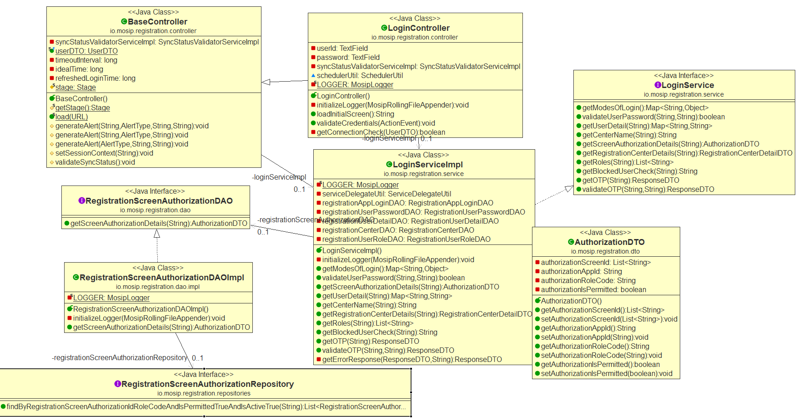
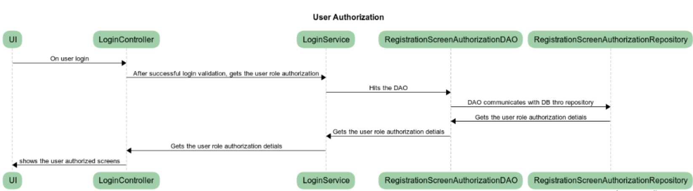

Design for the Registration -- Authorization Module

**Background**

Registration client application should provide the facility to control
the user role based authorization across the application in all the
screens. Each user of the application will be provided with the separate
role. The role based list of screen level access to be configured. Based
on the role, the user should be allowed to view / act on specific set of
screens. All should be configurable. If any changes required, the
changes should be done in Admin portal and sync to the 'Registration
client' application. There shouldn't be any option provided to modify
the configuration at client application.

The **target users** are

-   Registration officer, Supervisor and Admin person will have an
    access to the application. Based on their role configuration, the
    respective screens should be displayed.

The key **requirements** are

-   Role Creation.

-   User role mapping.

-   Screen configuration.

-   Role based screen mapping.

-   Before displaying screen to the user, validate the user role and
    access permission to the specific screen and render the screen or
    respective error message.

The key **non-functional requirements** are

-   Connectivity:

    -   Should able to communicate to the configured URL with proper
        authentication to invoke the respective sync job to get the
        configuration from server.

-   Authentication:

    -   While connecting to the server, user authentication is required
        to authenticate by providing the valid credentials.

    -   Invoke the Oauth service to get the 'Access token' and pass it
        along with the request to authenticate the request by the
        server.

-   Security:

    -   No one should have permission to alter the data stored in the
        local db.

    -   The role access should be modifiable at admin portal only and
        later to be sync to the client application through the
        respective job.

-   Database:

    -   Store the data retrieved in the sync job to the database table.

    -   All connection should be closed once db process completed.

**Solution**

**The key solution considerations are --**

-   LoginServiceImpl.java - When the user login validation is completed
    successfully then load the user specific role detail from
    "reg.user\_role" table.

-   Fetch the role specific list of screen id access from
    'reg.screen\_authorization' table.

-   RegistrationScreenAuthorizationDAO.java -- implement the DAO
    specific logic into this component.

-   RegistrationScreenAuthorizationRepository -- create
    'findByRegistrationScreenAuthorizationIdRoleCodeAndIsPermittedTrueAndIsActiveTrue'
    method to fetch the role specific data.

-   Load the list of valid screen ids and role to the UserContext object
    by invoking setSessionContext() method.

 **Screen Render Validation:**

-   BaseController.validateScreenAuthorization() - Implement the logic
    to validate the current screen id against the data in the User
    Context object. If screen id available then allow the request to
    proceed. Otherwise display the information alert in the screen
    'Please get permission to view this screen'.

-   Extend the current UI specific controller with 'BaseController' and
    invoke the method 'validateScreenAuthorization' to validate the
    screen accessibility permissions.

 **UI **

Create the proper alert success/error to intimate the user.

 Apply the below common criteria

-   Audit

-   Log

-   Java Documentation

-   Junit

Class Diagram:

Sequence Diagram:

