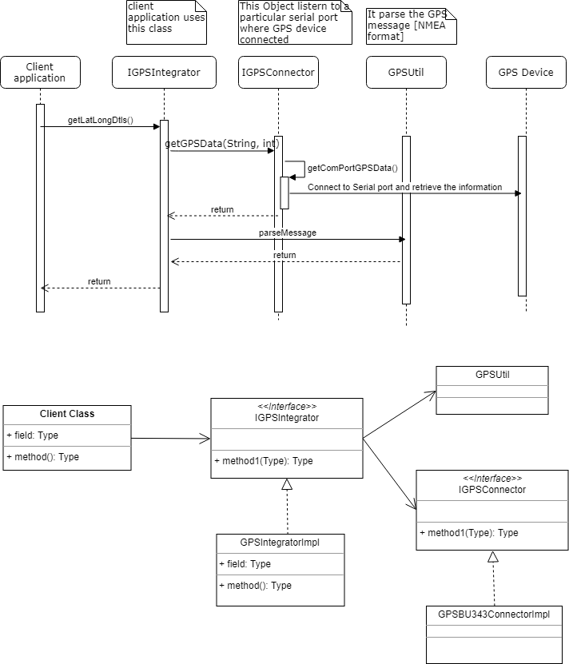
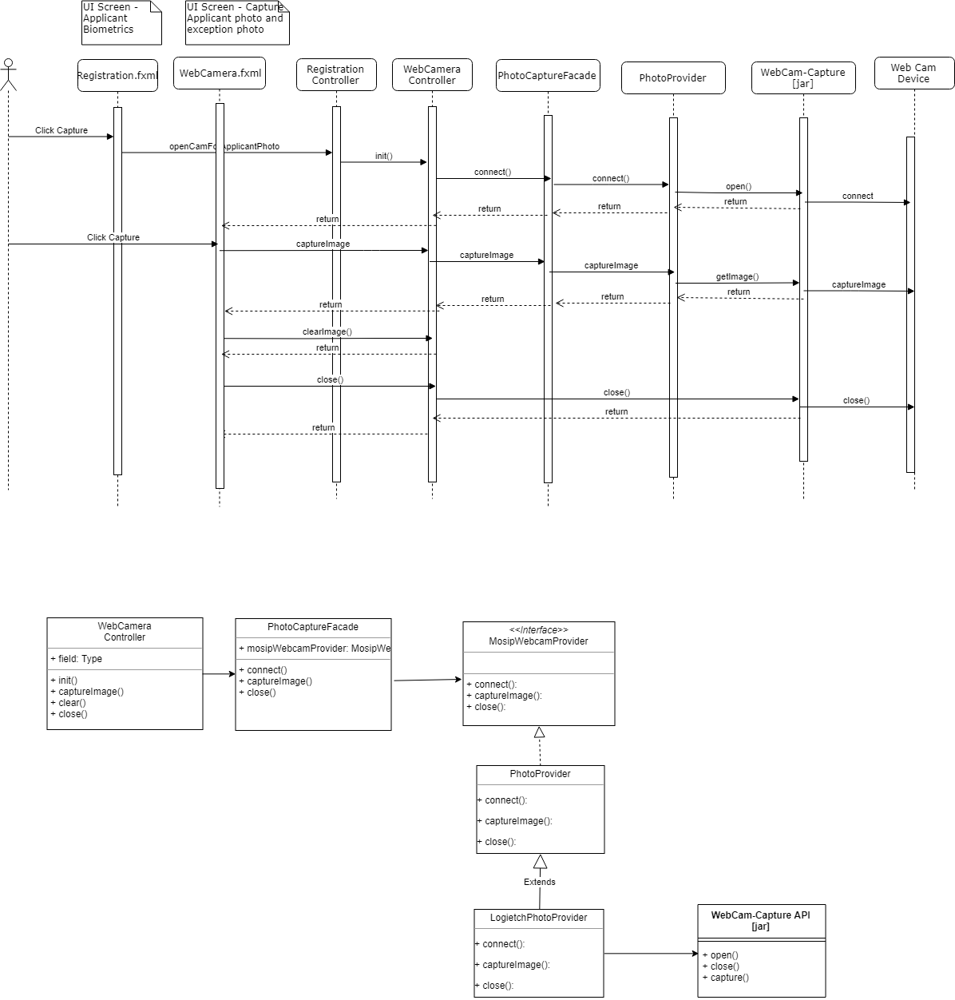
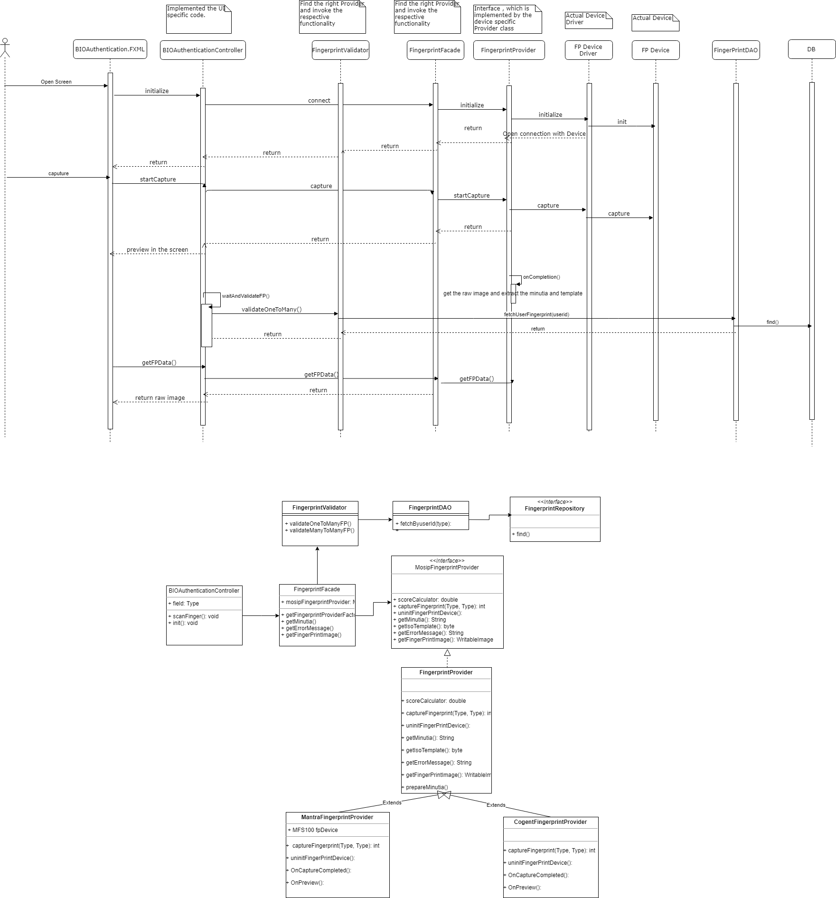
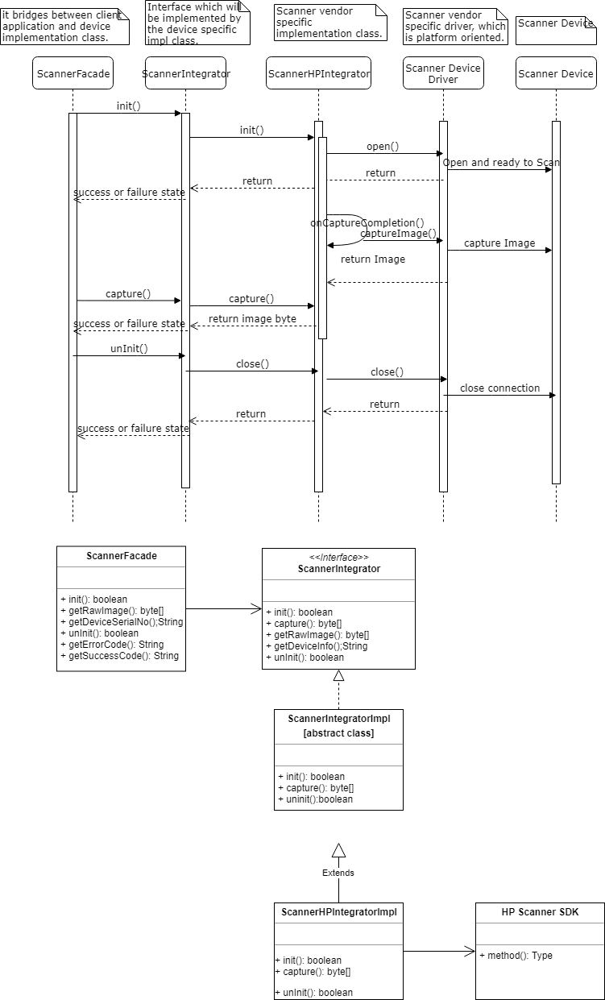

**Design - Device Integration**

**Functional Background**

The functional scope of device integration is to detect the device and communicate 
with the same to capture the required information using the respective API. 
The type of applicable devices connected to the Registration center are 
mentioned in this document is pluggable to the application.

This includes following devices:
-   GPS
-   Biometric devices (Fingerprint and Iris capture)
-   Camera
-   Scanner
-   Printer

The target users are
-   Super Admin
-   Registration Supervisor
-   Registration officer

The key **requirements** are

GPS
-   Use GPS to capture the Registration client machine longitude and latitude.
-   Based on the longitude and latitude calculate the distance from the Registration center.

Photo
-   During new registration process, as part of demographic detail capture the applicant’s photo.
-   Allow exception photo capture only if an exception has been marked.
-   Captured image should be displayed for preview.
-   Calculate the quality of image and match it against the pre-defined threshold value.[Based on the Photo SDK]
-   Allow the user to capture the images multiple time and choose the best clear imgae.

Finger Print
-   Allow the user to login to the application using any one of their finger print.
-   Authenticate the registration process by capturing the RO/RS finger print.
-   EOD Process – before approve/ reject the registration packet, capture the supervisior authentication.
-   Capture the applicant fingerprint image.
-   De-duplicate validation against the list of operator or supervisor enrolled in the machine.

IRIS
-   Allow the user to login to the application using IRIS.
-   Authenticate the registration process by capturing RO/RS IRIS.
-   Capture the applicant IRIS image.
-   De-duplicate validation against the list of operator or supervisor IRIS with the applicant IRIS.

Scanner
-  Allow the user to scan the applicant [POB, POI, POA, POR] documents and attach it to the application during 
   Registration or UIN Update and Lost UIN process.
-  Only one file per document will be supported. Merge multiple pages while scanning and make it is a single docuemnt.
 
The key **non-functional requirements** are

IO Connection:

-   While communicating with the device the connection should be opened and same should be closed
    once it is completed. More than one user can't connect to the device at a time.

**Solution - GPS**

The integration with the GPS device happening through the respective serial port [Com1..N].
Based on the user connected port the serial port number will vary.
During runtime the program will scan across the port and identify the GPS related port and communicate with the same.
-  Create IGPSIntegrator, IGPSConnector, GPSUtil classes.

     GPSIntegrator – 
          It communicates between the client class and GPSConnector class.
          Based on the input it identifies the required Device specific connector class
          and invoke getGPSData() to receive the data from GPS.
     
     IGPSConnector – [GPSBU353S4Connector]
          This interface should be implemented by the device specific implementation class.
          The device specific implementation class should connects to the GPS device through
          Serial com port and wait for some specified interval to receive the data.
          The received will contain the raw GPS data [NEMA – standard format],
          which will contain the required information. The same will be sent to the invoking class.
     
     GPSUtil –
          This will have method to parse the GPS standard format [NEMA] data and provide
          the required longitude and latitude as a String object if we get the good signal from GPS device.
          If the signal is week, then the message [GPRMC] will have the respective indication [V].
          Based on the signal the data will be provided to the application.
      
     Handle exceptions in using custom Exception handler and send correct response to client.

          Classes:
               Integrator: GPSIntegrator.java
               API Interface: IGPSConnector.java
               API Implementation: GPSBU343Connector.java
               Utility: GPSUtil.java

**Sequence and Class Diagram**

**Solution - Photo Capture**

-   Webcam-capture – open source library should be used to capture the data from webcam device.
-   The respective controller, service and interfaces should be created before 
    invoking the api method from ‘Webcam-capture’ lib.
-   Integrate with the webcam api through ‘WebCamDeviceImpl’ class, 
    where the device open, capture and close should be implemented. 
    When ‘open’ method is invoked, need to close if there is any device already been opened.
-   This functionality can be used for both capture applicant and exception photo.
-   If any error occurred, the same to be notified to the user.

          Classes:           
               Controller: WebCameraController.java
               Service: PhotoCaptureService.java
               API Integration: WebCamDeviceImpl.java

**Sequence and Class Diagram **

**Solution - Finger Print**

Facade and Factory pattern should be introduced to invoke the vendor specific implementation class
at run time. The device specific code should be encapsulated within the device specific implementation code.
None of the client classes should invoke the device specific classes directly. 

-    BIOAuthentication.FXML – where ever authentication required, this component
          should be rendered to capture the user authentication by passing the required BIO type as input.
					
-    BIOAuthenticationController –
          It captures the data from UI object and render value to the UI
          object and invoke the FP façade and validator classes to complete
          the FP related action triggered from UI component.

-    FingerprintValidator –
		  It does validation of finger print minutia.
		  
         boolean validateOneToManyFP(String userId, String userInputMinutia)
               Fetch user id specific minutia alone for all FPs from db table.
               Then compare against the user input single FP minutia with minutia 
                    fetched from db using façade and FP api.
               return true – when match found.
               return false – when match not found.

         boolean validateManyToManyFP(String userId, DTO <UserFingerPrintDTO>)
               Fetch all the active user id for a particular machine id from db table.
               Fetch user id specific minutia alone for all FPs from db table.
               Run through all the FP of an userInputDTO and match against
                    all FPs of a particular user id fetched from DB. Validate one to one 
                    FP mapping like: input thumb FP to db thumb fb. 
               The above step should be completed for all the fetched user id from db.
               Invoke the façade to match the minutia between two FPs.
               return true – when match found break the loop.
               return false – when match not found.
     
-    FingerprintFacade –
		      It acts between client and FP interface to invoke the
          right vendor specific class and perform the client required operation in
          vendor specific class. Client doesn’t aware of which vendor specific method to be invoked. 
          That will be taken care in this Façade class.

-    FingerprintProvider –
		      Interface which contains all the required 
          functionality that needs to be implemented by the vendor specific classes. 
          The client classes will work on this interface rather using the 
          implementation [vendor specific] classes directly . 
					
-    MantraFingerprintProvider –
          Vendor specific class to interact with their specific
          SDK classes to communicate with the device drivers and does the required functionality.
          FP Device Driver     - which is provided by the third party device specific vendor 
          to capture the finger print and transfer to the invoking client application.
          It interface between client application and device.
          
      
**Sequence and Class Diagram**

**Solution - IRIS**

Facade and Factory pattern should be introduced to invoke the IRIS device vendor specific implementation class
at run time. The device specific code should be encapsulated within the device specific implementation code.
None of the client classes should invoke the device specific classes directly . 

The sequence flow and class level detail are provided in the respective diagram. 

UI controller should wait for some time to capture the BIO image from device implementation class.

**Sequence and Class Diagram**

**Solution - Scanner**

Facade and Factory pattern should be introduced to invoke the Scanner device vendor specific implementation class
at run time. The device specific code should be encapsulated within the device specific implementation code.
None of the client classes should invoke the device specific classes directly. 

While capturing the different pages for the docuemnt types [POA/POI/POB/POR], capture all the pages into the in-memoery.
While saving and creating the single docuemnt, merge all the pages and make it as a single document.

The docuemnt format is a configurable one, we need to fetch from the global_param table

The sequence flow and class level detail are provided in the respective diagram. 

UI controller should wait for some time to capture the Scanner image from device implementation class.

**Sequence and Class Diagram**

