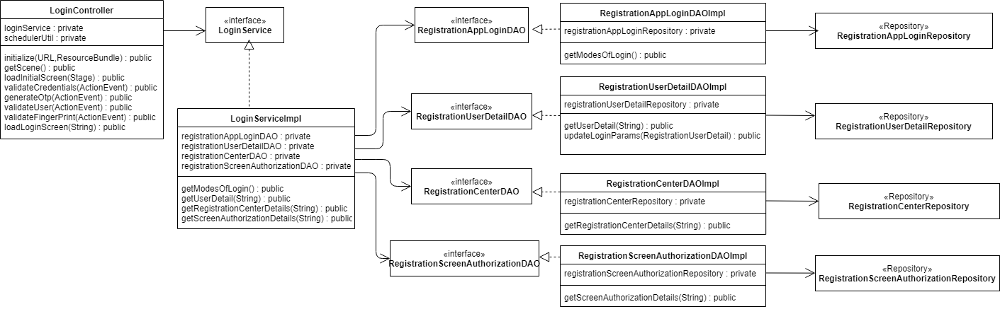
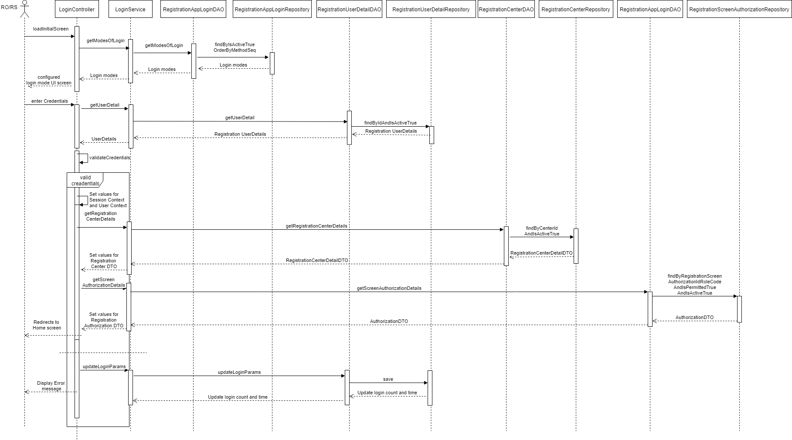

**Design -- Login**

[Username-Password / OTP/ Bio]

**Background**

The Registration Officer/Supervisor can be used the provided ways to
login to the registration client. The provided ways are
Username/Password, OTP and Bio \[Fingerprint/Iris/Face\]. The login will
be maintained by the configurable un-successful login attempts. If the
RO/RS crossed the limit the same should be locked and release after the
configurable login period.

The **target users** are

-   Supervisor

-   Officer

-   Admin

The key **requirements** are

-  Registrtaion Client has two types of users 
    1. Admin
    2. Others [Officer/Supervisior]
- The login screen should be a configurbale one and get the details as part of the master sync. 

-   Provide login screen to validate for the Admin and Registration officer/supervisor credentials.

-   Mode of login:

<!-- -->

-   Offline

<!-- -->

-   User id and Password

1.  User has to be authenticated WRT to the login details exists in the
    local DB

2.  The password should be converted into secure-hashed format \[SSHA-256\] using the 
    respective user's salt and compare it with the data available in the db.

-   Finger Print\[Thumb\] Authentication

1.  User can provide any finger print to login to the application.

2.  The finger print validation should be checked against the local DB
    finger print miniature/ ISO template image.

-   Online

<!-- -->

-   User id and Password

1.  Invoke the 'Auth' online service, to validate the user id and
    password and receive valid token id.

-   OTP

1.  As initial login the user can provide his UIN number to get the OTP.

2.  The OTP has limited time validity and the RO/RS has to enter the
    OTP.

3.  The OTP will be validated against the server.

4.  The Resend-OTP should able to communicate the individual with the
    new OTP.

    -   All the desired login methodologies \[Password / OTP / Bio\] or
        should be configurable. Based on this configuration the screen
        should be displayed.

    -   Country can even enable the multifactor authentication. \[Like:
        password and OTP based login\]

    -   Admin can configure the number of un-successful login attempts
        and the un-locking period.

    -   For the each un-successful login attempts \[any mode\] should be
        captured and stored in the DB.

    -   On un-successful login attempts reached, the respective user
        account will be locked.

    -   After the un-locking period the same account will be un-locked
        and RO/RS can able to login.

    -   If any point of time, with in the limit of un-successful
        attempts if the RO/RS will be able to login successfully then
        the un-successful attempts will be rested.

The key **non-functional requirements** are

-   Security:

    -   No ware we should not store the RO/RS plain text credentials or
        any sensitive information.

    -   The password should be not stored as raw data. It should be
        stored in hashed format.

    -   Based on the policy the password should get modified by synching
        with the server.

    -   Don't store the OTP data into the db.

    -   Don't pull the finger print /bio information from the server to
        local machine.

    -   Entire Session object should be cleared off once the user log
        off from the application.

-   Log the each state of the packet view/approve/reject/hold:

    -   As a security measures the UIN or any sensitive individual
        information should not be logged.

-   Cache:

    -   The bio data shouldn't be cached into the session object.

    -   Once logged off the session object should be cleared.

-   Other standard NFR, need to be taken care:

    -   Logging, audit, exception handling.

**Solution**

  The detailed technical process for Registration Login is provided
  below:

**Login API:**

-   Create a UI for login with the User ID a text field prompt to enter the details. 
    
-   Create a UI to accept and submitted credentials from the client application. Please refer the latest registraion design.

-   Create a Java component as 'LoginController' with 'login' method to
    accept the Defined [DTO structure](#_Entity_Object_Structure:).

-   Based on the user input check the role of login (user id )and display the respective authenticaiton screen
    (password, OTP and fingerprint thumb login).

-   Create java component "ValidateUser" with 'validate' method to
    accept the Defined [DTO structure](#_Entity_Object_Structure:).

-   The validation should be performed based on the configuration.

-   Check the client system is connected with internet and verify the
    user credentials synched job is done.

-   Login with user id and password:

    -   As part of the initial login to the system, the RO/RS should be
        in online.

    -   In case system doesn't have internet connection get the password
        against the user ID from DB. Then check the entered credentials
        are valid.
        
This process is reuqired for the initial setup and User -Onboarding. 

    -   If the system has internet connection getTokenID from server by
        passing user id and password as parameter to the REST service
        call.

        -  RestClientAuthAdvice 
            - addAuthZToken : Add the token to each third party calls.

    -   Return the appropriate alert message to user based on the
        response as success or failure message.

-   Login With OTP:

<!-- -->

-   Internet connectivity is must to login with OTP.

-   Invoke the respective REST service to get the OTP from the service.

-   If request for generate or regenerate OTP, respective service has to
    be called to generate the same.
    
    If the system has internet connection getTokenID from server by
        passing user id and password as parameter to the REST service
        call.

        -  RestClientAuthAdvice 
            - addAuthZToken : Add the token to each third party calls.

-   Then the requested and response OTP has been validated.

-   Return the appropriate alert message to user based on the response
    as success or failure message.

<!-- -->

-   Login with Bio\[Fingerprint/Iris/Photo\]:

<!-- -->

-   All the Bio image \[ISO template\] and miniature should be available
    in db table.

-   Capture the single finger image from the user and validate against
    all the fingers of a specific user. If the match reaches the
    threshold limit then allow the user to login.

-   Capture the Iris image from the user and validate against the iris
    of a specific user. If the match reaches the threshold limit then
    allow the user to login.

-   Capture the Photo image form the user and validate against the photo
    of a specific user. If the match happened then allow the user to
    login.

<!-- -->

-   Login attempts:

<!-- -->

-   Get the Admin configured number of un-successful login attempts and
    the un-locking time period.

-   If any mode, the RO/RS login failure should be counted.

-   If the RO/RS while reaching the limits, the respective account
    should be locked.

-   The same account should be unlocked, after the un-locking period
    time reached.

> **Logout API:**

-   When user click on the 'logout' button in the screen, invoke the
    respective method in the *BaseController.logoff()* control to kill
    the current session context and audit the information and logout the
    application.

    -   Refer the Session context document to know more about it.

Solution

Class Diagram

Sequence Diagram

