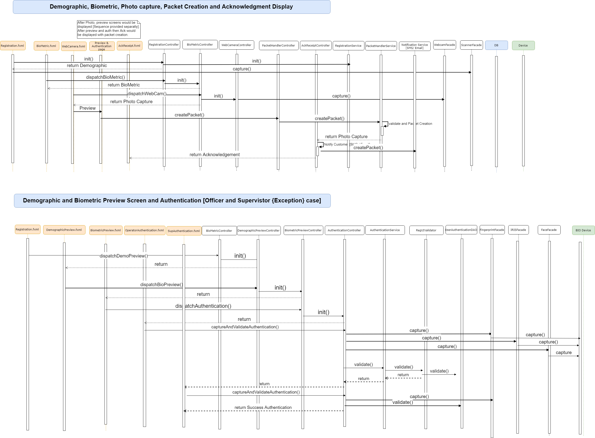

**Design - Lost UIN**
====================

**Background**

On login successful, the user can select the "Lost UIN" option in the
screen if any individual requested for the same. The key requirement and
respective technical design is covered below.

The **target users** are

-   Individual
-   Registration officer
-   Registration Supervisor

The key **requirements** are

-   The Registration Officer navigates to the Lost UIN page.
-   User enters demographic data of the individual who has lost his/her UIN.
-   User uploads supporting documents.
-   User marks biometric exceptions if any,
-   User captures all fingerprints and irises.
-   User captures face photograph, and exception photograph if applicable.
-   User views a preview of details captured.
-   User performs operator authentication by providing credentials in the configured mode.
-   User requests Supervisor to provide credentials to authenticate if biometric exceptions were marked.
-   User views acknowledgement of Lost UIN request with a Registration ID assigned to it.
-   An SMS and email confirmation is sent to the individual.

The key **non-functional requirements** are

-   Security:
    -   We should not store the RO/RS plain text credentials or any
        sensitive information.

**Solution**

1.  Get the required configuration to display for the Lost UIN screen
    from the Global Configuration Parameter table.

2.  Create the controller for the **RegistrtaionController** to
    display the list of the required demographic fields on the screen.

3.  Once demographic fields are captured then render the Biometric screen using the respective Controller.

4.  Once Biometric captured then display the Photo capturing screen to capture the Applicant photo and exceptional photo.

5.  Display the Preview page once all the detail are captured. 
    Then capture the authentication from the user to approve the packet.
    
6.  After enter all the fields from the screen, we will call the Packet
    Handler service to do the rest of the packet creation process.

7.  Finally the desired data will be persisted as part of the
    Registration and Registration Transaction tables.

Note:

	Write a class and the respective sequence as per the provided diagram. 
    The entire flow is same as New Registration process, so the same technical 
    process will be followed.  	
    While creating the packet, specify the 'applicationType' as 'LostUIN'. This would 
    help the Registration processor to handle the packet differently. 

**Class Diagram:**

**Sequence Diagram:**

