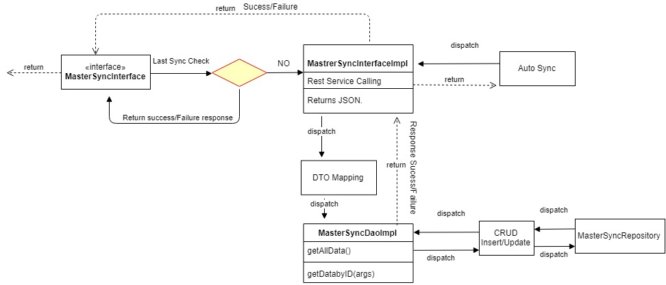

**Design -- Master Data Sync**

**Background**

Registration application maintains the master data for the registration
of the individual by using the configurable information. The master sync
data will help the registration system identifying the list of
documents, holidays, center ids, gender types, blocked user list,
machine, devices list, template list. These data should act as a
configuration for the registration application

The **target users** are

-   Registration application

-   Manual trigger by the RO/RS\[Master Data Sync\]

-   Kernel

The key **requirements** are

1.  Allow the client to receive request to sync master data from a
    manual trigger or scheduled job.

    1.  The timing and frequency of the scheduled job is set up through
        the back end.

    2.  There should be no limit to the number of times and timing of
        triggering the manual sync.

2.  Send request to server for master data sync.

3.  Receive response from server with master data.

    1.  Only the incremental changes (additions, deletions and
        modifications) made since the last sync should be received.

    2.  Machine related master data should be received only for the
        specific machine from which request is initiated.

    3.  Registration Centre related data should be received only for the
        specific Registration Centre mapped to the machine from which
        request is initiated \*\* covered in MOS‌-1280 \*\*.

    4.  Device related data should be received only for devices mapped
        to the same Registration Centre as the machine from which
        request is initiated.

    5.  Supervisor and Officer related data should be received only for
        those users mapped to the same Registration Centre as the
        machine from which request is initiated \*\* covered in
        MOS‌-1263 \*\*.

4.  Save the incremental changes in the local machine.

5.  Send success or failure message to the UI.

6.  Display an alert in case of sync failure.

    1.  The on-screen message should only indicate if the sync was a
        success or failure.

    2.  Detailed errors can be viewed in the transaction logs.

7.  When a sync is running, the client should not allow the end user to
    perform any other action.

8.  If the client is not online or not open during a scheduled sync, the
    sync should be queued up and executed later.When the client is next
    launched and is online, check if the previous scheduled sync was
    executed. If not executed earlier, immediately start the sync.

MOSIP - Data Classification

  Type of Master                                            Data Type
  
  -------------------------------------------------------- -------------
  
  Country                                                  Master Data
  
  Region                                                    Master Data
  
  Province                                                 Master Data
  
  City                                                     Master Data
  
  Local Administrative Authority                           Master Data
  
  Postal code                                              Master Data
  
  List of Holidays                                         Master Data
  
  Blacklisted Words                                        Master Data
  
  Document Type                                            Master Data
  
  Documents Category                                       Master Data
  
  Registration Centre Data                                 Master Data
  
  List of Machines                                         Master Data
  
  List of Devices                                          Master Data
  
  Title                                                    Master Data
  
  Template Master                                          Master Data
  
  Location Heirarchy                                       Lookup Data
  
  Machine specification                                    Lookup Data
  
  Device specification                                     Lookup Data
  
  Language                                                 Lookup Data
  
  Types of Gender                                          Lookup Data
  
  Biometric Type                                           Lookup Data
  
  Biometric Attribute                                      Lookup Data
  
  ID Type                                                  Lookup Data
  
  Machine Type                                             Lookup Data
  
  Registration Center Type                                 Lookup Data
  
  Template Type                                            Lookup Data
  
  Packet - Rejection Reason Master (EOD Process)           Lookup Data
  
  Packet -- On Hold Reason Master                          Lookup Data
  
  Packet - Rejection Reason Master (Manual Adjudication)   Lookup Data
  
  List of Roles                                            IAM
  
  User Details                                             IAM
  
  User Pwd                                                 IAM

The key **non-functional requirements** are

-   Security:

    -   We should not store the RO/RS plain text credentials or any
        sensitive information.

    -   The password should be not stored as raw data. It should be
        stored in hashed format.

    -   The session key should be stored in the DB for each
        pre-registration packet.

    -   The data resided in the database should be encrypted.

-   Network

    -   URL should be communicated using the SSL mode.

-   Log the each state of the packet Yet To Receive/Received/RID
    Generated/Deleted:

    -   As a security measures the UIN or any sensitive individual
        information should not be logged.

-   Other standard NFR, need to be taken care:

    -   Logging, audit, exception handling.

**Solution**

1.  Create the **MasterSyncJob** with following methods as

    a.  executeJob - ( triggerPoint)
    
2.  Call the configured URL to the master sync system to get the configurtaion
    by using the TPM public key. [Whcih was registered for the each machine.
    
3. Call the ServiceDelegatUtil --> invoke method to call the sync URL.
   Each URL was secured by token. 
     - If the trigger mode is batch the clienID/secret based token should be 
        embedded as part of the header.
    - If the trigger mode is manual the token  should be passed based on the userid/pwd
        token should be embedded as part of the header.
4.  Once got the response JSON, parse and store it to the respective master tables.

**Class and Sequence Diagram :**

