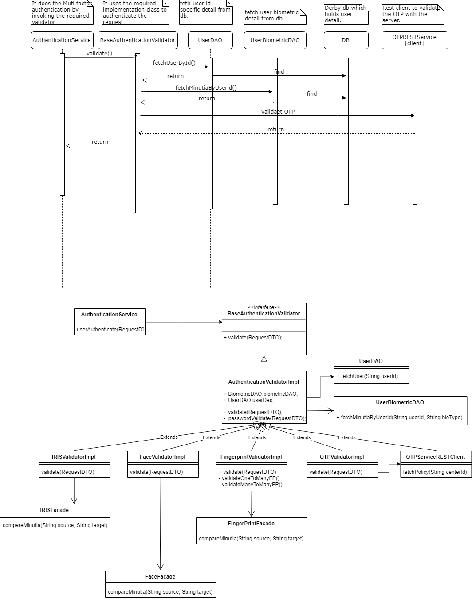

Design - Mutifactor Authentication

**Background**

The application should have capabilities to support the multifactor authentication 
at the required places. 

The **target users** are

-   Admin
-   Supervisor
-   Officer

The key **requirements** are

-   Login - user should have the facility to login with muti factors based on configuration, which is synced 
    from server.
-   Registration Authentication by Officer - user should have the facility to authenticate the registration 
    process with muti factors based on configuration, which is synced from server.
-   Registration Override Authentication by Supervisor - user should have the facility to authenticate the 
    exception cases with muti factors based on configuration, which is synced from server.
-   EOD Authentication by Supervisor - user should have the facility to authenticate the EOD 
    process with muti factors based on configuration, which is synced from server.
    
The key **non-functional requirements** are

-   User Biometric information should not be stored in session object.
-   User credential should not be stored in session object.
-   While doing biometric comparison should not load all the minutia/ images into the memory.
 
	
**Solution**

Fetch the applicable authentication mode from configuration table and render the UI section accordingly.

Once user provide the required authentication based on the authentication mode the respective validator should be
invoked by the AuthenticationService to perform validation.

1.	AuthenticationService 
-   It does the multifactor authentication based on the authentication type passed from UI controller.
-   Based on authentication type[IRIS, FP, OTP, FACE, PASSWORD], it invokes respective Validator to validate
    the authentication.
    

**Sequence and Class Diagram**

