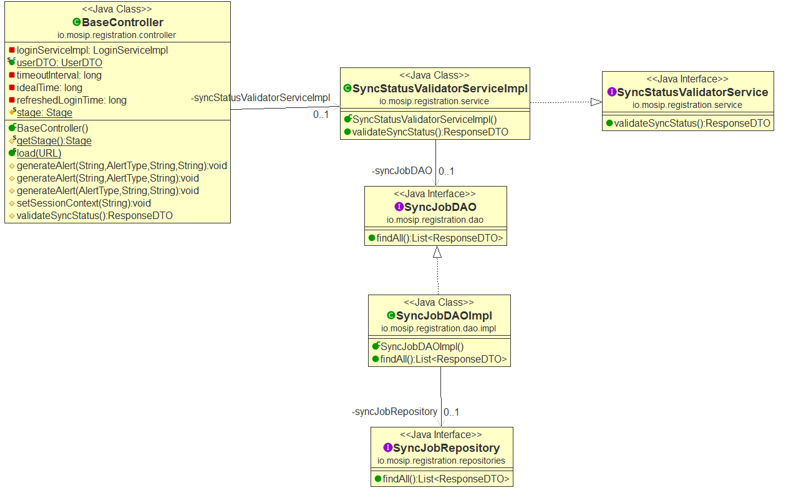
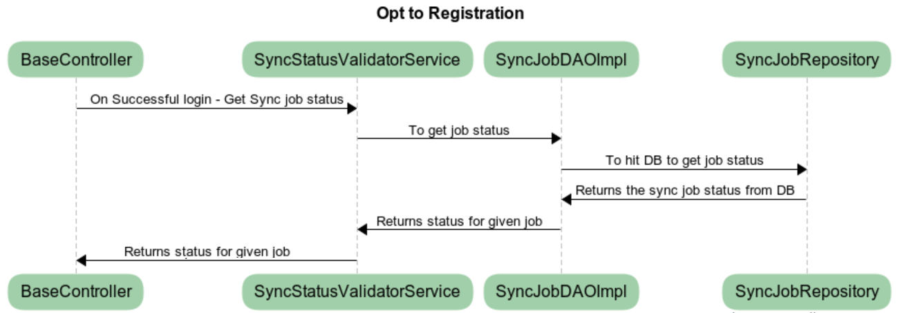

**Design for Opt to Register**

**Background**

On login successful, we are bound to check for the list of sync jobs run
successfully or not, before flashing the "New Registration" screen.
Functionally, on start of the application, we need to get the list of
sync jobs (Job IDs) which we are configured as part of the configuration
and hit DB for the corresponding job completion status. All jobs synch
status is verified based on the frequency configured as part of the
configuration. If all jobs status fall under the configured frequency
all got success status, we are ought to provide the "New Registration"
screen. In case of any failure or non-completion status of any of the
configured list of jobs, an alert message to be displayed saying "Please
wait for the sync to complete" or "Sync is in progress" or "Please start
a manual sync" (any of the message that is apt).

The **target users** are

-   Individual

-   Registration officer

-   Registration Supervisor

The key **requirements** are

-   Get list of sync job (job IDs) from the configuration.

-   Hit the service with a job ID to check for the completion status in
    DB

-   Get the Map\<Job ID, Status\>

    -   Possible Job status:

        -   Completed

        -   In-Progress

        -   On-hold

        -   Suspended

-   If all Job ID status marks to Complete then show "New Registration"
    screen.

-   If one or more job status is In-Progress then show alert message
    "Sync in progress!! Please wait for Sync to complete".

-   If one or more job is suspended then alert message "Sync is
    suspended!! Please trigger manual sync".

The key **non-functional requirements** are

-   Security:

    -   Should not store any sensitive information as plain text
        information.

    -   The data which resides in the data-base should be in encrypted
        format.

-   Network:

    -   Should able to communicate to the configured URL with proper
        authentication.

    -   The http read timeout parameter to be explicitly set, if client
        unable to connect to the REST service.

    -   Connectivity should happen through SSL mode. The respective key
        to be loaded during the call.

-   Authentication:

    -   While connecting to the server, user authentication is required
        to authenticate by providing the valid credentials.

    -   Invoke the Authenticate service to get the 'JWT token' and pass
        it along with the request to authenticate the request by the
        server.

-   Database:

    -   Get all the required status across the job ID.

    -   All connection should be closed once DB process completed.

**Technical Approach**

The key solution considerations are --

**Service**

-   Create ***SyncStatusValidatorService*** and create DTO and DAO layer
    for the same.

    -   Get list of Sync Job by ID which all are configured as part of
        the configuration properties.

    -   Make Service to Dao to fetch the status for the list of Job IDs.

    -   After getting the status, form a Map\<Job ID, Status\> and send
        it in response.

-   Handle exceptions in using custom Exception handler and send correct
    response to client.

**UI **

Create the proper alert success/error to intimate the user.

**Apply the below common criteria**

-   Audit

-   Log

-   Java Documentation

-   Junit

**Classes**:

**Controller**: LoginController

**Service**: SyncStatusValidatorService

**DTO**: SyncJobDTO

**DAO**: SyncJobDAOImpl --findAll ()

**DB scripts:**

Need DB script.zip

List of Sync Job Status:

  C   Completed
  --- -------------
  I   In-Progress
  H   On-hold
  S   Suspended

Note: "validateSyncStatus()" method from Base controller is pluggable
from any other controller as required.

Class Diagram:

Sequence Diagram:

