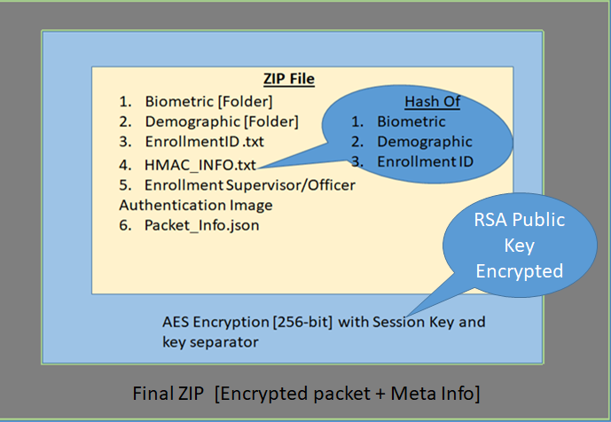
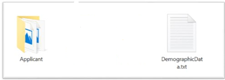
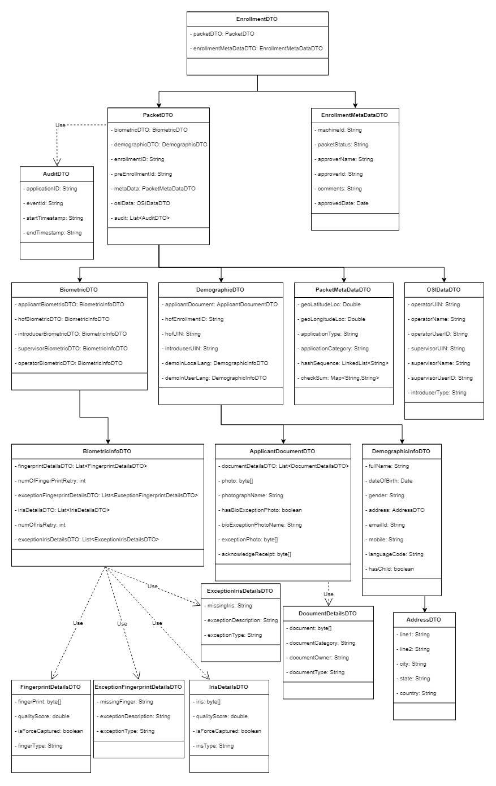
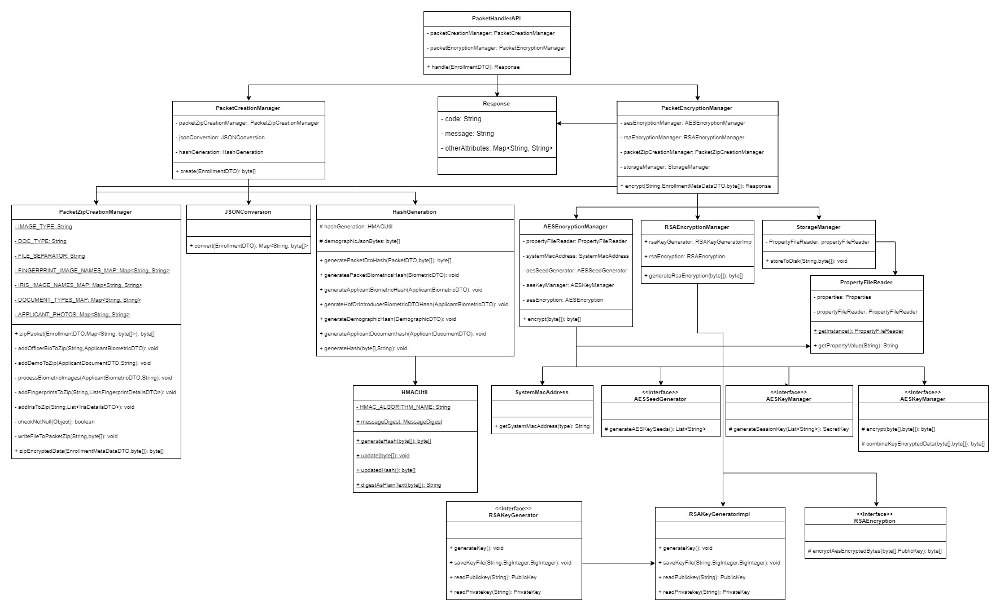
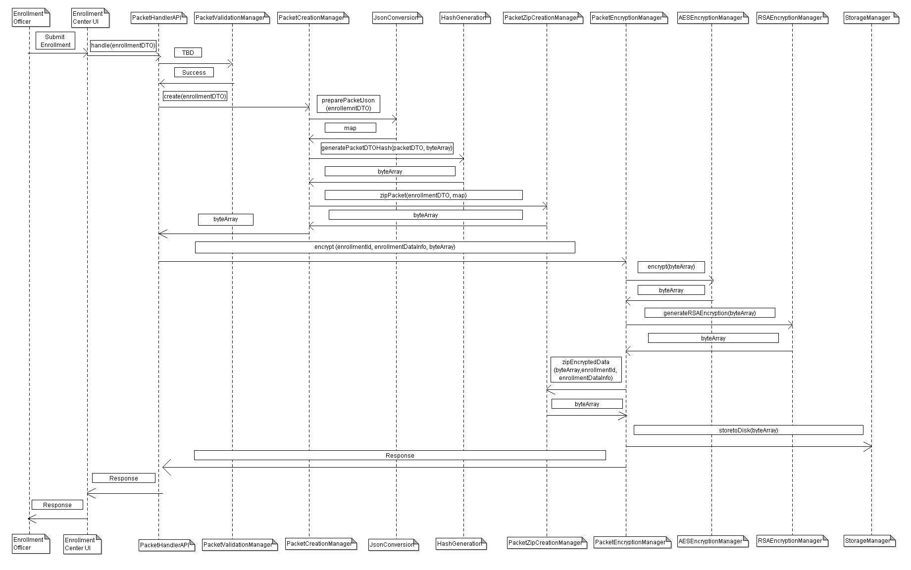

**Design - Packet Creation**

**Background**

As part of the registration process,RO will capture all the details of the 
individual and the infomration called as packet should be stored in desired location. 
The packet should be encrypted before saving into the location. 
This docomuent illustrtaes about the information we are capturing as part 
of the packet and the encryption logic we are using to encrypt the packet.


The **target users** are

-   Supervisor
-   Officer

The key **requirements** are

-   Expose the API to create the Registration packet, where the data
    captured in the ID Issuance client UI application should be stored.

-   Packet should have the detail of:

    -   Applicant -- Demo and Bio-metric 
    -   Introducer -- Demo and Bio-metric
    -   Officer / Supervisor -- Bio-Metric
    -   Registration Id.
    -   Packet Metadata.
    -   Hash sequnece 1 
    -   Hash sequence 2
    
- Bio-metric will be stored as CBEFF xml format inside the packet. 
	- If the applicant bio-metric captured it will be 
	  saved into the file as name as "application_CBEFF.xml"
	- If the introducer bio-metric captured it will be 
	  save into the file as name as "authenticaiton_CBEFF.xml"
	
-   Registration packet should be stored in encrypted format in the local
    hard disk.

-   Once the packet is created the same shouldn't be sent to the server
    until it is approved by the Registration Supervisor.

-   The API should return the success / failure status code along with
    the respective message.

The key **non-functional requirements** are

-   Security :

    -   The Registration packet shouldn't be decryptable other than
        Registration Server.

    -   Hash out the data -- the hash code of the data should be sent
        along with the packet.

    -   Along with the packet, the hash should also be using RSA public
        encrypted.

    -   Un-encrypted data shouldn't be stored in local hard disk during
        the creation of Registration packet.

    -   The IDIS application able to get the RSA public key from Core
        Kernel module.

    -   The IDIS able to generate the AES key seed **[256-bit]** by using
        the EO ID, MAC of the machine and timestamp.

-   Log the each state of the packet creation:

    -   As a security measures the UIN or customer information should
        not be logged.

-   Cache :

    -   Registration packet data shouldn't be cached and clear off all the
        data from the JVM local memory once the packet is created in
        local hard disk.

-   Audit :

    -   Each state of the packet creation should be stored into the DB
        for audit purpose.

    -   UIN and important detail of the customer should not be audited.

-   Exception :

    -   Any exception occurred during the packet creation the same will
        be reported to the user with the user understandable exception.

-   Data History :

    -   The IDIS able to authenticate by using the Core Kernal module.

    -   Maintain the Registration id, status and other high level info in
        the database table.

-   Configuration:

    -   Public Key -- the respective byte values will be present in the
        database table along with the expiry detail.

    -   Before initiating the Registration process, the key expiry to be
        validated.


**Solution**

The detailed technical process for Registration packet creation is
provided below:


**Packet API:**

-   Create a Java component as 'PacketHandler' with 'createPacket'
    method to accept the Defined [DTO
    structure](#entity-object-structure) from the client application.

-   Validate the request object against the Business rule and render the
    respective error message [user defined] to the invoking client
    application if any rule failed. [this activity will be taken care
    in the next sprint]

-   If the provided request object is valid then continue with the rest
    of the process.

-   Prepare the Zip object, which is to be stored into a configured
    location.

-   Get the Demographic byte stream from the respective DTO object and
    store it into the Zip object using right folder path.

-   Get the Biometric byte stream from the respective DTO object and
    store it into the Zip object using right folder path.

-   Get the Proof of documents byte stream from the respective DTO
    object and store it into the Zip object using right folder path.

-   Get the 'Registration ID' from the respective request object, write
    the same into the File object and save the file object into the Zip
    object.

-   Hash :

    -   Generate the Hash for the Biometric, Demographic and EID of
        Resident Information.

    -   Use the HMAC generation from Java 8 **[MD5 Hashing -- SHA256]**

-   Store the generated Hash in a file and append to the created Zip
    object.

-   Capture the Registration Officer/Supervisor Authentication finger
    image from the respective DTO object and append to the Zip object.

-   Create the Packet Info JSON file, which contains the **Meta data**
    information about packet and appended to the existing Zip object.

-   Session Key Encryption:

    -   Session key generation is **random for each packet**
        should not exceed 32 characters.

    -   Pass the created Zip object **[in-memory]** through the AES-256
        bit encryption.

    -   Pass the Random Session Key as a seed to this AES encryption.

    -   Get the Registration Officer Id from user context object. 

-   RSA Public Key Encryption:

    -   AES Session key bytes pass through the RSA public key
        encryption.

-   Use the **#KEY_SPLITTER#** as a key separator for the AES encrypted
    bytes and the RSA Public key encrypted Session key seed.

-   Append the RSA Public key Encrypted Session Key, Key Separator to
    the AES encrypted bytes.

-   Save the encrypted data as a ZIP in local file system under the
    defined location in configuration file.

-   Append the EO and machine information as a META-INFO JSON file and
    create another ZIP out of it. **[Packet Zip + META-INFO JSON]**

-   Audit the exception/start/exit of the each stages of the packet
    encryption mechanism using AuditManager component.

-   The final zip name should be as enrollemntid+CurrentTimestamp **[29
    digit]**.

-   Timestamp format is **[DDMMYYYYHHMMSSS]**

-   Once the packet has been successfully created then update the packet
    information in the 'Registration' table.

**Client [UI] Application:**

-   Invoking client application should store all information about the
    resident as desired format of [DTO
    objects](#entity-object-structure).

-   Registration ID should have already been generated and pass it in the
    RegistrationDTO object.

-   Invoke the 'PacketHandler'.createPacket(RegistrationDTO) method to
    prepare the Registration packet at the configured location in local
    machine.

**Packet Archival:**

-   Get the Packet status using the 'Registration packet status' reader
    REST service. If the status is UIN generated /Updated, we need to
    update the same info to the database and clean the packet. 

**Packet Structure**
	

-   Create date wise folder, if not exists. \[Sample: 12-SEP-2018 \]

-   Biometric and Demographic folders should have the below sub folder
    structure.

    -   Applicant
    -   Introducer
    -   HOF
    
    **Biometric File :**

    

   **Demographic :**
   

Folder level Data: 

1.  **Biometric**

a.  Applicant

    -   applicant_cbeff.xml
    -   authentication_cbeff.xml
2.  **Demographic**

    a.  Applicant

        -   ID.JSON
	-   ProofOfIdentity.pdf/jpg
        -   ProofOfResidenty.pdf/jpg
        -   ProofOfAddress.pdf/jpg
        -   ExceptionPhoto.jpg/png \[If Exceptional cases\]

    b.  ID.json  - Follwed the Mosip ID spec and generated this Json structure. It contains the entire text data captured in the UI application. 
    
``` Sample ID Json.
{
  "identity": {
    "IDSchemaVersion": 1.0,
    "UIN": 981576026435,
    "fullName": [
      {
        "language": "ara",
        "value": "ابراهيم بن علي"
      },
      {
        "language": "fre",
        "value": "Ibrahim Ibn Ali"
      }
    ],
    "dateOfBirth": "1955/04/15",
    "age": 45,
    "gender": [
      {
        "language": "ara",
        "value": "الذكر"
      },
      {
        "language": "fre",
        "value": "mâle"
      }
    ],
    "addressLine1": [
      {
        "language": "ara",
        "value": "عنوان العينة سطر 1"
      },
      {
        "language": "fre",
        "value": "exemple d'adresse ligne 1"
      }
    ],
    "addressLine2": [
      {
        "language": "ara",
        "value": "عنوان العينة سطر 2"
      },
      {
        "language": "fre",
        "value": "exemple d'adresse ligne 2"
      }
    ],
    "addressLine3": [
      {
        "language": "ara",
        "value": "عنوان العينة سطر 2"
      },
      {
        "language": "fre",
        "value": "exemple d'adresse ligne 2"
      }
    ],
    "region": [
      {
        "language": "ara",
        "value": "طنجة - تطوان - الحسيمة"
      },
      {
        "language": "fre",
        "value": "Tanger-Tétouan-Al Hoceima"
      }
    ],
    "province": [
      {
        "language": "ara",
        "value": "فاس-مكناس"
      },
      {
        "language": "fre",
        "value": "Fès-Meknès"
      }
    ],
    "city": [
      {
        "language": "ara",
        "value": "الدار البيضاء"
      },
      {
        "language": "fre",
        "value": "Casablanca"
      }
    ],
    "postalCode": "570004",
    "phone": "9876543210",
    "email": "abc@xyz.com",
    "CNIENumber": 6789545678909,
    "localAdministrativeAuthority": [
      {
        "language": "ara",
        "value": "سلمى"
      },
      {
        "language": "fre",
        "value": "salma"
      }
    ],
    "parentOrGuardianRIDOrUIN": 212124324784912,
    "parentOrGuardianName": [
      {
        "language": "ara",
        "value": "سلمى"
      },
      {
        "language": "fre",
        "value": "salma"
      }
    ],
    "proofOfAddress": {
      "format": "pdf",
      "type": "drivingLicense",
      "value": "fileReferenceID"
    },
    "proofOfIdentity": {
      "format": "txt",
      "type": "passport",
      "value": "fileReferenceID"
    },
    "proofOfRelationship": {
      "format": "pdf",
      "type": "passport",
      "value": "fileReferenceID"
    },
    "proofOfDateOfBirth": {
      "format": "pdf",
      "type": "passport",
      "value": "fileReferenceID"
    },
    "individualBiometrics": {
      "format": "cbeff",
      "version": 1.0,
      "value": "fileReferenceID"
    },
    "parentOrGuardianBiometrics": {
      "format": "cbeff",
      "version": 1.0,
      "value": "fileReferenceID"
    }
  }
}
```
3.  **RegistrationID.txt**

4.  **HMAC File 1.txt**

5.  **HMAC File 2.txt**

6.  **Packet\_MetaInfo.json**

``` Sample Json File.
{
  "identity" : {
    "biometric" : {
      "applicant" : {
        "leftEye" : {
          "language" : "en",
          "label" : "label",
          "imageName" : "LeftEye",
          "type" : "iris",
          "qualityScore" : 79.0,
          "numRetry" : 2,
          "forceCaptured" : false
        },
        "rightEye" : null,
        "leftIndex" : {
          "language" : "en",
          "label" : "label",
          "imageName" : "LeftIndex",
          "type" : "fingerprint",
          "qualityScore" : 80.0,
          "numRetry" : 3,
          "forceCaptured" : false
        },
		"leftMiddle" : {
          "language" : "en",
          "label" : "label",
          "imageName" : "LeftMiddle",
          "type" : "fingerprint",
          "qualityScore" : 80.0,
          "numRetry" : 3,
          "forceCaptured" : false
        },
		"leftRing" : {
          "language" : "en",
          "label" : "label",
          "imageName" : "LeftRing",
          "type" : "fingerprint",
          "qualityScore" : 80.0,
          "numRetry" : 3,
          "forceCaptured" : false
        },
		"leftLittle" : {
          "language" : "en",
          "label" : "label",
          "imageName" : "LeftLitle",
          "type" : "fingerprint",
          "qualityScore" : 80.0,
          "numRetry" : 3,
          "forceCaptured" : false
        },
		"leftThumb" : {
          "language" : "en",
          "label" : "label",
          "imageName" : "LeftThumb",
          "type" : "fingerprint",
          "qualityScore" : 80.0,
          "numRetry" : 3,
          "forceCaptured" : false
        },
        "rightIndex" : {
          "language" : "en",
          "label" : "label",
          "imageName" : "RightIndex",
          "type" : "fingerprint",
          "qualityScore" : 95.0,
          "numRetry" : 2,
          "forceCaptured" : false
        },
		"rightMiddle" : {
          "language" : "en",
          "label" : "label",
          "imageName" : "RightMiddle",
          "type" : "fingerprint",
          "qualityScore" : 95.0,
          "numRetry" : 2,
          "forceCaptured" : false
        },
		"rightRing" : {
          "language" : "en",
          "label" : "label",
          "imageName" : "RightRing",
          "type" : "fingerprint",
          "qualityScore" : 95.0,
          "numRetry" : 2,
          "forceCaptured" : false
        },
		"rightLittle" : {
          "language" : "en",
          "label" : "label",
          "imageName" : "RightLittle",
          "type" : "fingerprint",
          "qualityScore" : 95.0,
          "numRetry" : 2,
          "forceCaptured" : false
        },
        "rightThumb" : {
          "language" : "en",
          "label" : "label",
          "imageName" : "rightThumb",
          "type" : "fingerprint",
          "qualityScore" : 85.0,
          "numRetry" : 0,
          "forceCaptured" : false
        }
      },
      "introducer" : {
        "introducerFingerprint" : {
          "language" : "en",
          "label" : "label",
          "imageName" : "introducerLeftThumb",
          "type" : "fingerprint",
          "qualityScore" : 0.0,
          "numRetry" : 0,
          "forceCaptured" : false
        },
        "introducerIris" : null,
        "introducerImage" : null
      }
    },
    "exceptionBiometrics" : [ {
      "language" : "en",
      "type" : "fingerprint",
      "missingBiometric" : "LeftThumb",
      "exceptionDescription" : "Due to accident",
      "exceptionType" : "Permananent"
    }, {
      "language" : "en",
      "type" : "fingerprint",
      "missingBiometric" : "LeftForefinger",
      "exceptionDescription" : "Due to accident",
      "exceptionType" : "Permananent"
    }, {
      "language" : "en",
      "type" : "iris",
      "missingBiometric" : "RightEye",
      "exceptionDescription" : "By birth",
      "exceptionType" : "Permananent"
    } ],
    "applicantPhotograph" : {
      "language" : "en",
      "label" : "label",
      "photographName" : "ApplicantPhoto",
      "numRetry" : 1,
      "qualityScore" : 89.0
    },
    "exceptionPhotograph" : {
      "language" : "en",
      "label" : "label",
      "photographName" : "ExceptionPhoto",
      "numRetry" : 0,
      "qualityScore" : 0.0
    },
    "documents" : [ {
      "documentName" : "ProofOfIdentity",
      "documentCategory" : "PoI",
      "documentOwner" : "Self",
      "documentType" : "PAN"
    }, {
      "documentName" : "ProofOfAddress",
      "documentCategory" : "PoA",
      "documentOwner" : "hof",
      "documentType" : "passport"
    }, {
      "documentName" : "RegistrationAcknowledgement",
      "documentCategory" : "RegistrationAcknowledgement",
      "documentOwner" : "Self",
      "documentType" : "RegistrationAcknowledgement"
    } ],
    "metaData" : [ {
      "label" : "geoLocLatitude",
      "value" : "13.0049"
    }, {
      "label" : "geoLoclongitude",
      "value" : "80.24492"
    }, {
      "label" : "registrationType",
      "value" : "Child"
    }, {
      "label" : "applicantType",
      "value" : "New"
    }, {
      "label" : "preRegistrationId",
      "value" : "PEN1345T"
    }, {
      "label" : "registrationId",
      "value" : "2018782130000121112018103016"
    }, {
      "label" : "machineId",
      "value" : "yyeqy26356"
    },
	{
      "label" : "dongleId",
      "value" : "yyeqy26356"
    },
	{
      "label" : "macID",
      "value" : "8F-23-12-45-FG-56"
    },
	{
      "label" : "centerId",
      "value" : "12245"
    }, {
      "label" : "uin",
      "value" : null
    }, {
      "label" : "previousRID",
      "value" : null
    }, {
      "label" : "introducerType",
      "value" : "Parent"
    }, {
      "label" : "introducerRID",
      "value" : "2018234500321157812"
    }, {
      "label" : "introducerUIN",
      "value" : null
    }, {
      "label" : "officerFingerprintType",
      "value" : "leftThumb"
    }, {
      "label" : "officerIrisType",
      "value" : null
    }, {
      "label" : "supervisorFingerprintType",
      "value" : "leftThumb"
    }, {
      "label" : "supervisorIrisType",
      "value" : null
    }, {
      "label" : "introducerFingerprintType",
      "value" : "leftThumb"
    }, {
      "label" : "introducerIrisType",
      "value" : null
    }],
    "osiData" : [ {
      "label" : "officerId",
      "value" : "op0r0s12"
    }, {
      "label" : "officerFingerprintImage",
      "value" : "officerLeftThumb"
    }, {
      "label" : "officerIrisImage",
      "value" : null
    }, {
      "label" : "supervisorId",
      "value" : "s9ju2jhu"
    }, {
      "label" : "supervisorFingerprintImage",
      "value" : "supervisorLeftThumb"
    }, {
      "label" : "supervisorIrisImage",
      "value" : null
    }, {
      "label" : "supervisorPassword",
      "value" : null
    }, {
      "label" : "officerPassword",
      "value" : null
    }, {
      "label" : "supervisorPIN",
      "value" : null
    }, {
      "label" : "officerPIN",
      "value" : null
    }, {
      "label" : "supervisorFaceImage",
      "value" : null
    }, 
	{
      "label" : "officerFaceImage",
      "value" : null
    }, 
	{
      "label" : "officerOTPAuthentication",
      "value" : true/false
    },
	{
      "label" : "supervisiorOTPAuthentication",
      "value" : true/false
    }
	],
    "hashSequence1" : [ {
      "label" : "applicantBiometricSequence",
      "value" : [ "applicant_bio_CBEFF.xml" ]
    }, {
      "label" : "introducerBiometricSequence",
      "value" : [ "introducer_bio_CBEFF.xml" ]
    }, {
      "label" : "applicantDemographicSequence",
      "value" : [ "DemographicInfo", "ProofOfIdentity", "ProofOfAddress", "ApplicantPhoto", "ExceptionPhoto", "ProofOfBirth", "ProofOfRelation" ]
    } ],
	"hashSequence2" : [ {
      "label" : "otherFiles",
      "value" : [ "officerCBEFF", "supervisiorCBEFF", "PacketMetaInfo", "Audit"]
    } ],
	"capturedRegiseredDevices" : [ {
      "label" : "fingerprint",
      "value" : "123455YRHTIFHKJI8U90U2334"
    },
	"label" : "iris",
      "value" : "123455YRHTIFHKJI8U90U5476"
    },
	"label" : "photo",
      "value" : "123455YRHTIFHKJI8U90U4648"
    }	
	],
	"capturedNonRegisteredDevices" : [ {
      "label" : "GPS",
      "value" : "123455YRHTIFHKJI8U90U2334"
    },
	"label" : "scanner",
      "value" : "123455YRHTIFHKJI8U90U5476"
    },
	"label" : "printer",
      "value" : "123455YRHTIFHKJI8U90U6786"
    }	
	],
    "checkSum" : [ {
      "label" : "registration-service.jar",
      "value" : "65gfhab67586cjhsabcjk78"
    }, {
      "label" : "registration-ui.jar",
      "value" : "uygdfajkdjkHHD56TJHASDJKA"
    } ]
  }
}

```

7.  **Registration Officer Bio Image\[JPEG\]**

8.  **Registration Supervisor Bio Image\[JPEG\]**

9.  **Exceptionphoto[JPEG]**

**Packet DTO Structure**
    

Validations:

-   Verify the Packet decryption, but this not in our scope but as a
    demo we need to show.

-   The seed length should be 256-bit.

-   The packet structure should be validated.

-   The packet name should be unique and the name of the packet
    is[RegistrationID]

**Class Diagram**
	
	

**Sequence Diagram**
	

**User Story References**

1.  **MOS-64** - <https://mosipid.atlassian.net/browse/MOS-64>
2.  **MOS-65** - <https://mosipid.atlassian.net/browse/MOS-65>
