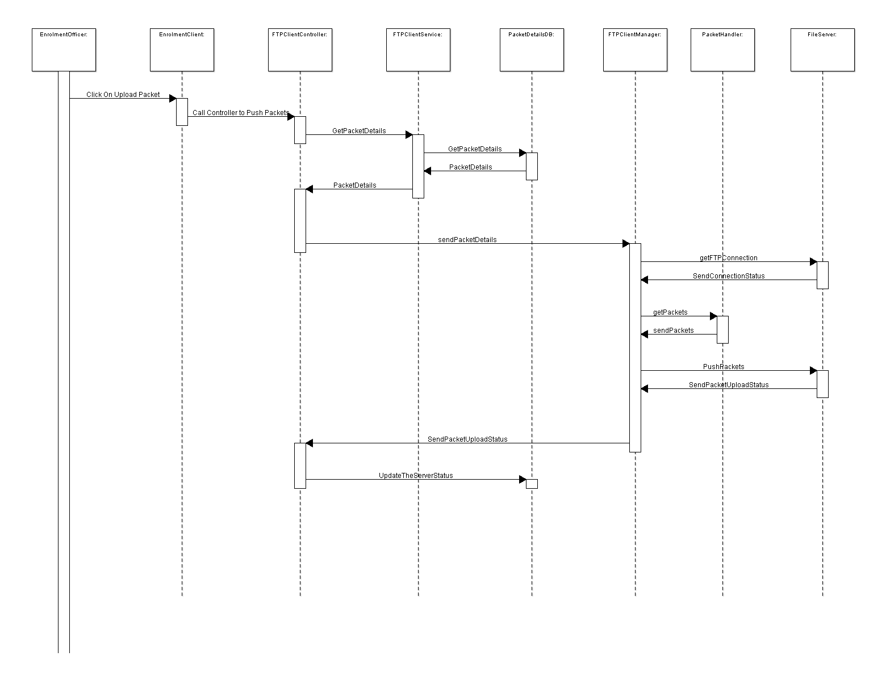

**Design - Packet Upload**

**Functional Background**

As part of the registrtaion packet created successfully the Supervsisior has to authneticate the pakets using the EOD process. 
Once done the authneitctaed packets will be uploaded to the registrtaion processor by manually or automatically. If the registrtaion application is in online and based on the EOD process authnetication the packets has to be moved to registrtaion processor.

**Online :**

 **EOD Process is Disabled:**
   - The created packet immediately pushed to the server.
   - If any packet while creating if the applciation netwrok got interuppted, the same hting will be pushed using the **batch** job.
   
 **EOD Process is enabled:**
   - The created packet should be authenticated by the supervisior and after that only pushed to the server.
   
**Offline :**

 **EOD Process is Disabled:**
   - The created packet should be waiting for the internert connection.
   
 **EOD Process is enabled:**
   - The created packet should be authenticated by the supervisior and waiting for the internet connection.
   
-   Invoke the REST service to update the pre-sync status. [With
    multiple registration IDs which are under 'yet to be synced'
    status.]

-   Once success then update the transaction and registration table.

    -   Registration -- client status with 'SYNCHED'

    -   Transaction -- update status with 'Synched'

    -   Timestamp update.

-   Invoke the Upload REST service to push the list of packets to the
    server in a sequential manner [one by one]

-   Once all packets pushed, update the respective status in the table.

    -   Registration -- client status with 'PUSHED'

    -   Transaction -- update status with 'Pushed'

    -   Timestamp update.

-   If there are any packets with the server status as 'Resend' then
    push that packet as well to the server and update the relevant
    status column.

-   The role of the supervisor, which having the access to upload the
    packets should be able to browse the upload packet location.

-   Able to provide the UI screen to the supervisor, where he can verify
    the upload information.

-   The API should return the success / failure status code along with
    the respective message.

**Non Functional Scope**

-   Security :

    -   The registrtaion packet shouldn't be decrypt-able other than
        registrtaion Server.

-   Log the each state of the packet creation:

    -   As a security measures the UIN or customer information should
        not be logged.

-   Cache :

    -   Registrtaion packet data shouldn't be cached and clear off all the
        data from the JVM local memory once the packet is created in
        local hard disk.

-   Audit :

    -   Each state of the packet upload should be stored into the DB for
        audit purpose.

    -   UIN and important detail of the customer should not be audited.

-   Exception :

    -   Any exception occurred during the packet upload the same will be
        reported to the user with the user understandable exception.

-   Data History :

    -   The IDIS able to authenticate by using the Core Kernal module.

    -   Maintain the registrtaion id, status and other high level info in
        the database table.

-   Configuration:

    -   SSH Private Key -- the respective byte values will be present in
        the database table along with the expiry detail.

    -   Before initiating the registrtaion process, the key expiry to be
        validated.

**Solution**

Design Detail

 The detailed technical process for Uploading the Packet to the server
  is provided below:
  
**Packet Sync:**
  
- Invoke the packet-sync REST service to push status of the list of pacets.
- Get the result and upload the status 'SYNCHED' to Registrtaion and Transaction tables.

**Packet Uploading:**
  
-   Invoke the Upload REST service to push the list of packets to the
    server in a sequential manner \[one by one\]

-   Once all packets pushed , update the respective status in the table.

-   Registration -- client status with 'PUSHED'

-   Transaction -- update status with 'Pushed'

-   Timestamp update.

-   If there are any packets with the server status as 'Resend' then
    push that packet as well to the server and update the relevant
    status column.

-   Create the **PacketUploadController** with below methods
        **packetUpload**  --  to upload packets one by one.
        **packetSync**    -- to synch the packet status to server
    passing the ***filePath*** as a parameter.

-   The component should get the uploading choose path from the DB 
    and call the PacketUploadController to upload the packets.

-   **PacketUploadService** having the method ***fetchSynchedPackets*** and
    by calling the method, it will provide all the packets which are having
    the status as **Synched/Re-Register/Error**.

-   Create the Java component like "***PacketUploadService"*** as
    method as "pushPackets" and the packetName as a parameter to the method.

-   Once all packets pushed , update the respective status in the table.

    -   Registration -- client status with 'PUSHED'

    -   Transaction -- update status with 'Pushed'

    -   Timestamp update.

-   The system should display the alert messages for success and failure
    messages.

-   Once the uploaded is done, the API should be able to display the
    result of the upload as a UI screen having the below table with
    columns.

-   If there are any packets with the server status as 'Resend' then
    push that packet as well to the server and update the relevant
    status column.

**Validations:**
-   Able to upload manually and automatic [batch job]

-   While uploading only packets which are not uploaded should be
    upload.

**Class Diagram**

**Sequence Diagram**

  **User Story No.**   **Reference Link**

  **MOS-559**          https://mosipid.atlassian.net/browse/MOS-559
