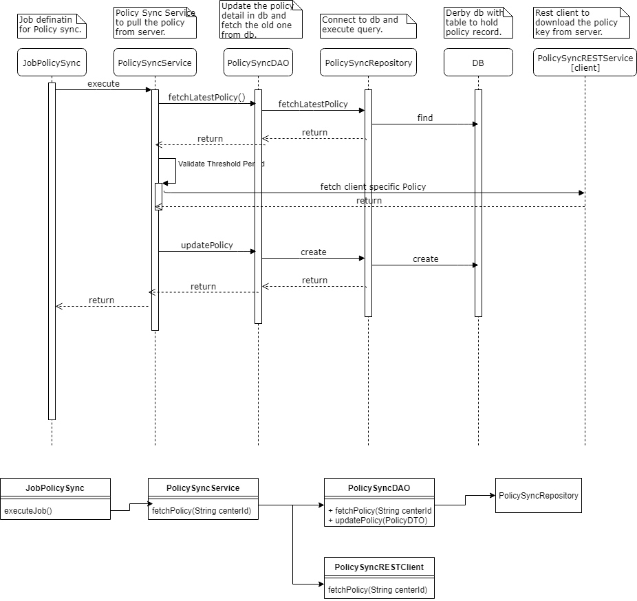

Design - Policy Sync Service

**Background**

The policy file generated for each client at server needs to be refreshed with 
client system at particular time frame and that will be used for further
data encryption. The decryption [private key] won't be provided from 
server to client application. It will be used directly at server end.

The **target users** are

-   Supervisor
-   Officer

The key **requirements** are

-   The public key generated against each station or machine id should be provided 
	to the client application before expiring of the key.
-   The key should be used to encrypt the packet before sending to the server.

The key **non-functional requirements** are

-   The private key shouldn't be sent to the client application.
-   The received public key should be maintained in the local db along with validity start and end date.
-   The client application should pull the next key before expiring of previous key by passing the 
    required date information to the server.

	
**Solution**

1.	Key sync from server if the existing is policy going to be expired.
-	Frequency of execution – once in a day. [configurable]
-	Automatic

1.	Global PARAM table: Holds the key refresh threshold period with respect to client environment.
-	Threshold period - How many days before the key file to be pulled from server?

2.	Get the latest key along with the validity expiry date from the local db table. 
-	If not available, make the online call to REST service to download the key along with the expiry date.
-	If available but within threshold period [key expiry date – today date] then download the new key and store it with new start date and end date.
-   If key available but above threshold period [key expiry date – today date] then nothing to be pulled from server.

3.	Invoke the key sync rest service call.
-	This service would provide the key valid as on that date [either existing key or new key will be generated and share the same]
-	Pass the required input parameter 
	   MachineId and current date / future date
	   
5.	Parse the response :-
-	This would provide us either existing key or new key file.
-	Expiry date.
6.	Store the received key file into the database table along with other detail.
7.  While creating the packet the public key should fetched from this table based on the current date and center id.
 

**Sequence and Class Diagram**

    