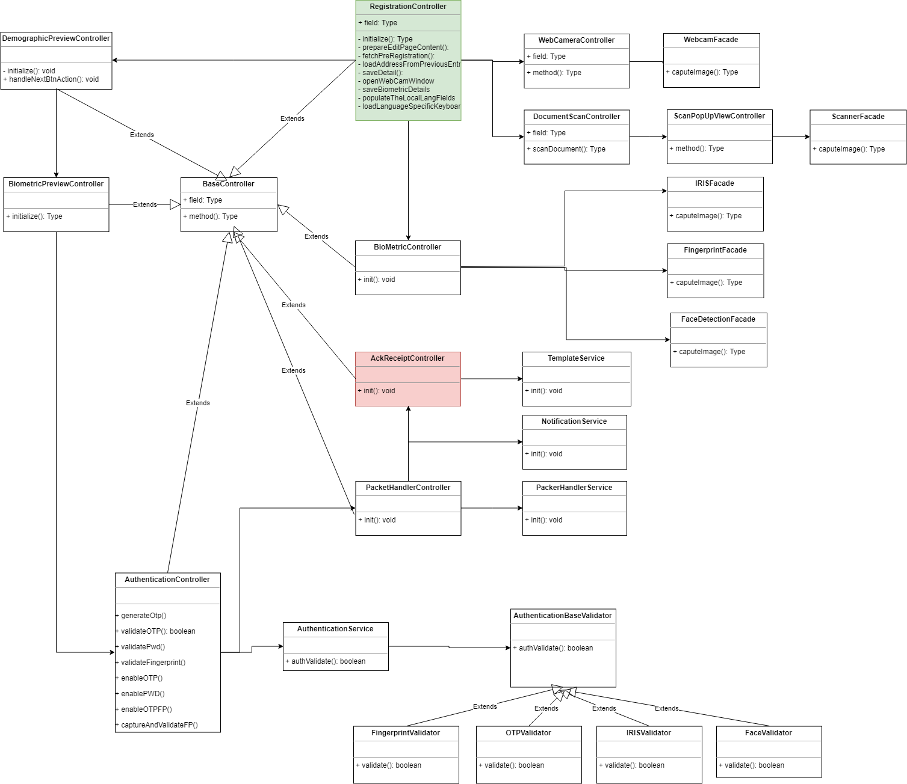

**Design - Registration Screen**

**Functional Background**

When user selects the "New Registration" option in the screen, then display the list of 
screens to capture the users Bio and demographic detail. The Registration screen is of 
two widgets based on Mosip platform language and center specific language. 
Both of which have same set of fields with different languages. 
Once we captured the information on Registration UI and that will be
created as packet and encrypt the data before store it in local disk using the required key algo. 
Along with the packet, the acknowledgement section also captured and stored into the local disk.

List of **Data** on Registration screen
-   Demographic data
-   Biometric data
-   Photographic data
-   Documents
-   Introducer
-   Exception

The **target users** are
-   Individual
-   Registration officer
-   Registration Supervisor

The key **requirements** are
-   On successful login, show the "Registration Screen"
-	Capture the individuals demographic, biometric and documents information.
-   The demographic information should be capture in two languages.	  
    -   Application specific primary language
    -   Center specific local language
-   Provide the preview features for the captured detail before submitting the application.
-   Application should be authenticated by the officer before submitting the application.
-   Supervisor should authenticate the application if any exception applicable to the user.
-  ProofOfBirth should be captured, if the verified is enabled while capturing the DateOfBirth.
-  Foreigner/Non-foreigner should be displayed displayed in the UI screen.  

The key **non-functional requirements** are
-   Security:
    -   Should not store any sensitive information as plain text
        information.
    -   The data which resides in the data-base should be in encrypted
        format.
-   Network:
    -   Should able to communicate to the configured URL with proper
        authentication.
    -   The http read timeout parameter to be explicitly set, if client
        unable to connect to the REST service.
    -   Connectivity should happen through SSL mode. The respective key
        to be loaded during the call.
-   Authentication:
    -   While connecting to the server, user authentication is required
        to authenticate by providing the valid credentials.
    -   Invoke the Authenticate service to get the 'JWT token' and pass
        it along with the request to authenticate the request by the
        server.
        
**Solution**

Refer the 'Registration Packet creation' design document to get the detail understanding of the Registration packet structure 
and the respective creation methodology.

Refer the 'Registration Device Integration' design document for detail understanding of biometric and other device integration.

As per the ID defination specification the demographic detail captured from individual is structured and stored in to the packet.

-   Create **RegistrationService** and create DTO for the same.

    -   Get the data from Registration UI
    -   Map data into Registration DTO
    -   Send an Alert message (say) "Data captured successfully" or an
        error message
-   Handle exceptions in using custom Exception handler and send correct
    response to client.

**Class Diagram:**

**Sequence Diagram:**

