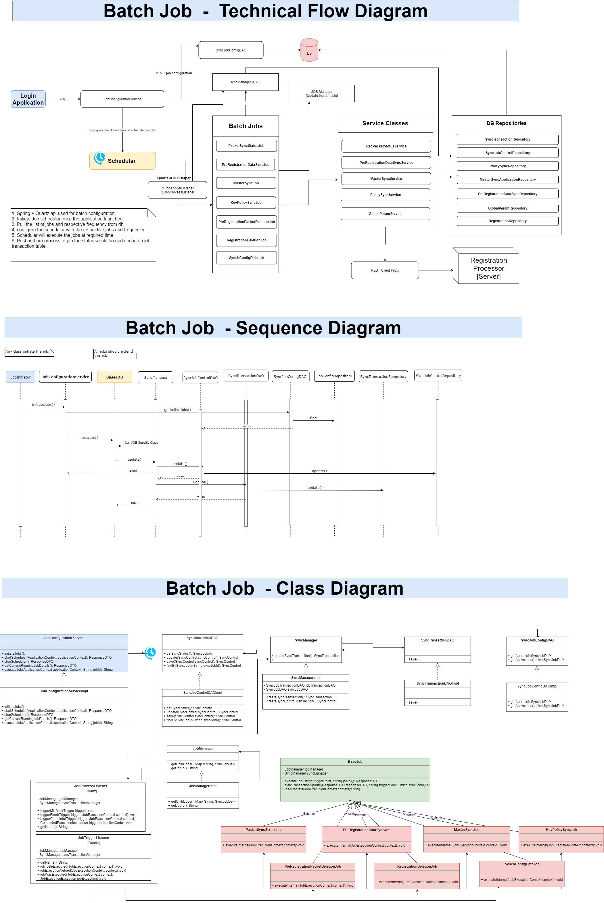

Design - Sync Job

**Background**

The job will run at the background of the Registration client application to sync some of the configuration from
server to client and also should push the packet and other detail captured at the client machine to server.

The **target users** are

-   System
-   Registration officer
-   Registration Supervisor

The key **requirements** are

-   Required Job should be configured to run at the specific interval based on the requirement.
-   Job should be running in the background of the application.
-   If the running job updates the configuration of the application in local machine 
    then display alert to the UI and stop capturing the data.
-   Should provide an option in the UI to trigger the sync jobs.
-   Should provide an option in the UI to trigger individual job.
-   Always the job should send the delta data to the server.
-   Always the job should pull the delta data from the server based on the last success update date and time.
-   Different state of the job should be captured.
-   The job should be started once the user has been logged into the application.

**List of Jobs**
-   Packet Status Reader.
-   Pre-registration packet sync from server.
-   Sync Master data from server.
-   Sync User detail from server.
-   Sync User machine mapping from client to server.
-   Sync platform configuration from server.
-   Policy sync from server.
-   Signature Key sync from server.
-   user id's salt sync from server.
-   Sync Audit data to server.
-   Clean up Jobs:
    - Registration Packet cleanup.
    - Pre-Registration Packet cleanup.
    - Audit log sync with the server.

The key **non-functional requirements** are
-   The background process should not consume too much of memory and stop the UI application.
-   During config and data sync with the server the application should not be used.
-   Each job status to be recorded into the respective job transaction table.
-   Any abnormal behavior while executing the job, the same to be notified to the user and stop the application and log the exception detail.
-   Background threads shouldn't run too many threads. 

**Solution**

The overall batch job technical process and individual job detail has been provided below.

-   Spring + Quartz job has been used to configure and execute the batch jobs.  
-   The required job(s) configuration has been externalize and configurable at DB table level along with the frequency detail. 
-   JobConfigurationServiceImpl - this is the main job class which pulls the configured jobs from table and schedule the same. 
    The scheduler will execute the each individual job which has to extend the BaseJOB class. 
-   Once the job execution completed it invokes the SyncJobManager class to update the respective status into the table.
-   Any new job created should extend the BaseJOB and configure the same at the db level along with the frequency. 
-   Individual Job can also be triggered through manually from application UI if required. 
-   Feature has been provided to fetch the list of currently running job from JobContext.
	

Technical Flow, Class and Sequence Diagram: [Batch Jobs]

Design of **[Packet Status Reader](registration-packetstatusreader.md)**

Design of **[Master Data Sync](registration-master-data-Sync.md)**

Design of **[Configuration Sync](registration-config-Sync.md)**

Design of **[Policy Sync](registration-policy-sync.md)**

Design of **[User role Sync](registration_user_role_sync.md)**

Design of **[User credentials Sync](registration-login-credentials-sync.md)**

Design of **[User On board Sync Client to Server](registration-sync_user_mapping_client_to_server.md)**
