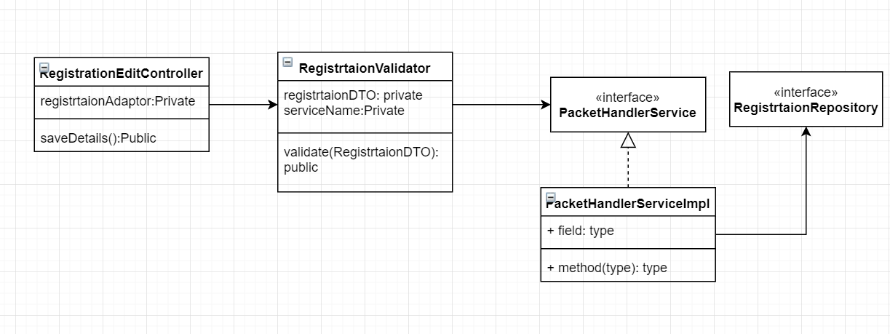
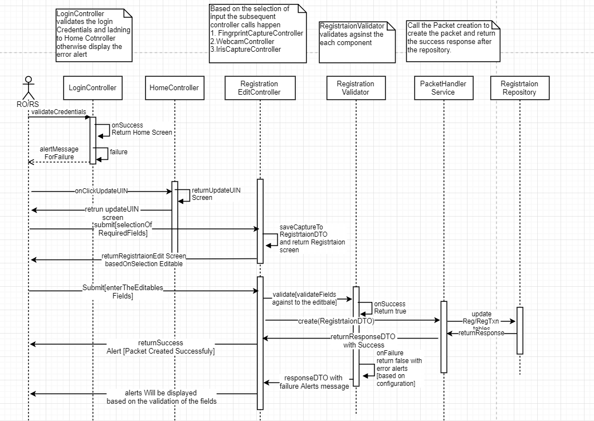

**Design -- Update UIN**
==============

**Background**

On login successful, the user can select the "Update UIN" option in the
screen if any individual requested for the same. The key requirement and
respective technical design is covered below.

The **target users** are

-   Individual
-   Registration officer
-   Registration Supervisor

The key **requirements** are

-   As part of the update UIN, the individual can provide the UIN number
    to update corresponding the details.

-   The details should be configurable from the admin configuration,
    while edit section based on this the editable columns should be
    displayed.

-   While selecting, the user can choose the relevant option to update
    as part of the UIN.

-   The individual can choose the below option to Update for UIN.

    -   Name
    -   Age/DOB
    -   Gender
    -   Address
    -   Contact Details \[Email/Mobile Number\...\]
    -   Biometric-Exception \[Finger Print/Iris/Face ...\]
    -   Biometric-Iris
    -   Biometric-Fingerprint
-   The documents should be mandaotry based on the below criteria.
    - If the **Name** is going to be updated then 
      **Proof Of Identity** document is mandatory to be scan and upload.
    - If the **Address** is going to be updated then **Proof Of Address**
      document is mandatory to be scan and upload.
-   Based on the selection the required fields should only be editable.

-   The capture of bio-metric should be a configurable form the admin
    configuration. Based on the configuration the capture should be done
    for the individual.

-   We need to provide the information to the registration processor,
    regarding this update.

The key **non-functional requirements** are

-   Security:
    -   We should not store the RO/RS plain text credentials or any
        sensitive information.

**Solution**

1.  Get the required configuration to display for the Update UIN screen
    from the Global Configuration Parameter table.

2.  Create the controller for the **RegistrtaionEditController** to
    display the list of the required editable section on the screen.
    \[Provide submit method to capture the details and maintains in the
    Registration DTO\].

3.  Display the Registration Screen based on the selection of the
    editable fields.

4.  After enter all the fields from the screen, we will call the Packet
    Handler service to do the rest of the process.

5.  The same procedure for this follows the registration procedure only
    the specific fields which are editable should be captured along the
    packet data and mention the 'applicationType' as 'UpdateUIN'.

6.  The **RegsitrationValidator** should validate the fields against
    the selection.

7.  The **RegistrtaionController** also should displays based on the
    editable sections.

8.  Finally the desired data will be persisted as part of the
    Registration and Registration Transaction tables.

Note:

    Write a Controller **RegistrtaionEditController** class for UpdateUIN which  
    would associate all the controller classes created for  
    New Registration to reuse the functionality. 

    As part of the packet Meta we need to provide which packet it is and the 
    UIN number also we need to provide. 

**Class Diagram :**

**Sequence Diagram :**

