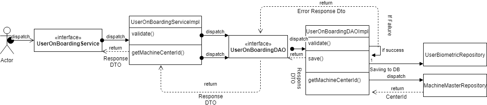
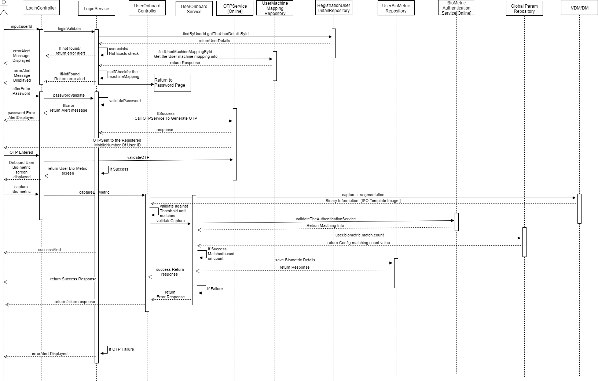

**Design - On board User**

**Background**

The user can able to self on board to the registered machine.
Users along with their bio-metric will be captured and validate against the IDA. 
Through Admin portal all the users,
machines and devices are configured per center. But mapping of the users and their
Bio-metric information to a particular machine would happen through this
screen. These bio-metric detail would be used later to perform the
de-duplication and authentication validation.

The **target users** are

-   Super Admin

-   Registration Supervisor

-   Registration officer

The key **requirements** are

User Mapping:

The default userid screen will be displayed to the user for login.
After provided userid, the validation will be validated against the local master data and also validate the machine mapping information. 
If the machine mapping to the entered userid is not mapped then it will route to the password screen. After provided the password it will be validated locally and after successful validation it will call the OPTService to generate the OTP to the user registered mobile number.
 
The User can enter the same OTP which was received and will be validate against the OTPValidation Service. After successful authentication the system route to the On board User mapping screen,  by providing the bio-metric[Fingerprint/Iris/Photo] information and the same information will be validate against the IDA server and get the success count. The success count which we got form the server and the configured threshold success count will be validated if matched or exceeded, then the user on boarded will be considered as Done.

The user can use the menu option "Update User Bio-Metirc" to update the latets bio-metrics if online alone. If the valdiation succeess as like above then the new values will be persisted otherwise older values will be retained in the system.

**Pre-requisite**

1. The user/password sync should happen from Admin to client.
2. The validation count condition check should be  based on the threshold. 

The key **non-functional requirements** are

- Security:

 	- Should not store any sensitive information as plain text
        information.
	-The data which resides in the data-base should be in encrypted
        format.

- Network:
	
   - Should able to communicate to the configured REST URL with
        proper authentication.
   - The http read timeout parameter to be explicitly set, if client
        unable to connect to the REST service.
   - Connectivity should happen through SSL mode. The respective key
        to be loaded during the call.

**Solution**

The key solution considerations are --

**UI:**

-   Design UI using FXML and map the UI individual components in
    UserOnboardController class.

-   UserOnboardController - it should communicate between UI screen and
    Service 'UserOnboardService' class to render the data to screen and
    capture the data from screen.

-   Based on validation across the POJO class from the
    UserOnboardService, build the UI screen

-   Create the proper alert success/error to intimate the user.

**Service **

- **LoginController.java**
	To validate the userid/password and which was enter by the user.
- **RegistrtaionUserDetailRepository.java**
	To get the user detail information [including the password].
- **OTPService [Online Service]**
	To generate and validate the OTP which was entered by the User
- **Bio-metric Authentication Service [Online Service]**
	To validate the Bio-metric information provided by the user.
- **UserBiometricRepostiry.java**
	To capture the validated bio-metric into the local DB of client.
-  **BiometricException.java**
	To capture the exception related information to capture.
	
-   Handle exceptions in using custom Exception handler and send correct
    response to client.

**Class Diagram:**

**Sequence Diagram:**

