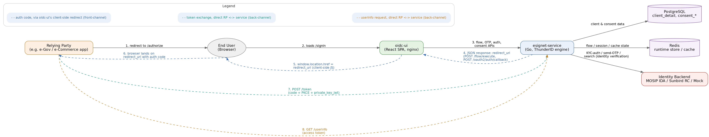

# Architecture

eSignet is MOSIP's OpenID Connect (OIDC) / OAuth2 identity provider. It lets a relying party — a government or private-sector application — authenticate an end user against a national or foundational identity system and receive standard OIDC tokens and claims back, without the relying party ever having to handle the user's raw identity credentials itself.

This page covers the shape of the system: what eSignet is made of, how a login actually flows through it end to end, and why it's built the way it is. For the full technical breakdown, module-by-module internals, the flow engine's YAML model, identity-provider implementations, security middleware, and the data model, see the Architecture Deep Dive _(Link to be added)_.

### What eSignet Is Made Of

eSignet is built from two components, sitting on top of a shared, external protocol engine rather than implementing OIDC/OAuth2 from scratch:

* **esignet-service** — the Go backend. It implements client management, consent management, and the MOSIP-specific pieces of the OIDC engine: identity-provider plugins, authentication flows, and screen/security configuration.
* **oidc-ui** — the React single-page application that renders the login, OTP/biometric/KBI, and consent screens the end user actually interacts with.

Both are built on [**ThunderID**,](https://github.com/thunder-id/thunderid) a generic external OIDC/OAuth engine that supplies the protocol machinery: token issuance, PKCE/DPoP/PAR, JWKS signing, the flow-execution runtime, and the login/consent UI rendering surface. esignet-service and oidc-ui are the MOSIP-specific configuration, provider implementations, and theming layered on top of that engine — which is what keeps the MOSIP-specific codebase small and lets the underlying protocol engine be upgraded independently of MOSIP's own code.

| Component        | Technology                    | Responsibility                                                                                                                                   |
| ---------------- | ----------------------------- | ------------------------------------------------------------------------------------------------------------------------------------------------ |
| esignet-service  | Go, ThunderID engine          | OIDC/OAuth protocol endpoints (via the engine), client and consent management APIs, MOSIP-specific auth-flow providers, identity-backend plugins |
| oidc-ui          | React, ThunderID SDK          | Login, OTP/biometric/KBI, and consent screens, theming, CAPTCHA, error/offline handling                                                          |
| PostgreSQL       | RDBMS                         | OAuth client registry, consent records and history, key material                                                                                 |
| Redis            | In-memory store               | Shared runtime store: transient flow/session state, client cache, flow-definition cache                                                          |
| Identity backend | MOSIP IDA / Sunbird RC / Mock | The actual identity verification: OTP dispatch, KYC-auth, biometric/KBI matching                                                                 |

### How a Login Actually Flows

<figure><figcaption></figcaption></figure>

A relying party never talks to eSignet's backend directly for the login itself — everything runs through the user's own browser, front-channel:

1. The relying party redirects the user's browser to eSignet's `/authorize` endpoint.
2. The browser loads oidc-ui's sign-in screen.
3. oidc-ui drives the actual login — OTP, password, biometric, or KBI, followed by consent — by calling esignet-service's flow and auth APIs. Behind the scenes, esignet-service checks client and consent records in PostgreSQL, keeps flow and session state in Redis, and verifies the user's identity against whichever identity backend is configured (MOSIP IDA, Sunbird RC, or a mock provider for testing).
4. Once the flow completes, esignet-service tells oidc-ui where to send the browser next.
5. oidc-ui redirects the browser onward.
6. The browser lands back on the relying party's own callback URL, carrying an authorization code.
7. The relying party exchanges that code for tokens directly with esignet-service — a back-channel call, authenticated with `private_key_jwt` and PKCE, that never passes through the browser.
8. The relying party calls `/userinfo` with its access token to retrieve the user's claims.

### Why It's Built This Way

* **Engine-and-plugin separation.** Protocol mechanics — token issuance, JWKS, PKCE/DPoP/PAR, the flow-execution runtime, the UI-rendering surface — live in the shared, external ThunderID engine. esignet-service and oidc-ui contribute only MOSIP-specific providers, screen theming, and identity-backend integrations, keeping the MOSIP-specific codebase small and letting the protocol core evolve independently.
* **Flow-as-configuration.** Authentication and consent journeys are declarative configuration on the backend, rendered generically by a single component on the frontend. New login methods or screen orders can be introduced without new app routes or backend endpoints.
* **Swappable identity backend.** MOSIP IDA, Sunbird RC, and a mock provider all satisfy the same authenticator interface, selected by a single setting — so the same UI and flow layer runs unchanged against production identity systems or a local mock for testing.
* **Defence in depth on the API surface.** Client-management APIs are protected independently by scope-checked bearer tokens and request-time validation, in addition to the OIDC/OAuth security the engine enforces on the protocol endpoints themselves.
* **A shared runtime store that scales horizontally.** A single Redis-backed store (or in-memory, for local development) backs client lookups, flow-definition caching, and the engine's own session state, with Redis required for any multi-replica deployment.
* **Externalized, per-deployment theming.** Language packs, themes, layouts, and images are treated as deployable configuration rather than being compiled into either component, so one build can serve multiple branded deployments.

### Want the Full Technical Breakdown?

The Architecture Deep Dive _(Link to be added)_. covers esignet-service's internal module structure, the flow engine's YAML/state-machine model, each pluggable identity provider, oidc-ui's component structure and build pipeline, the data model, and reference tables for endpoints and environment configuration.
