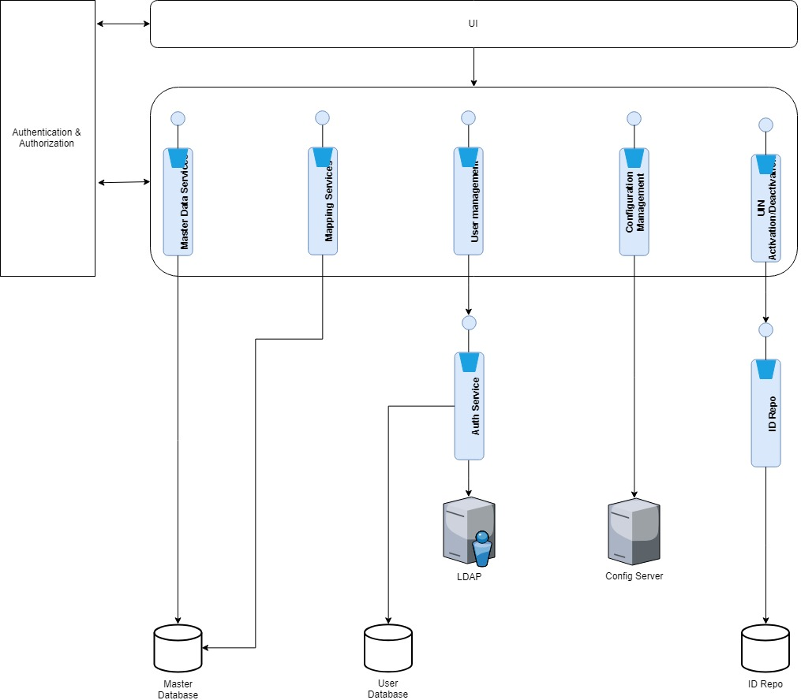

# Overview 

The MOSIP platform is configured via the Admin application. This application can be accessed only by the privileged group of admin personnel. When the MOSIP platform gets initialized, there are default configurations and seed data are setup. Post installation, following operations can be done using the Admin application:  
* Configuration entry changes 
* Master data management
* User management 
* Mapping of the master data to various resources

The module provides a single user interface to adminster the MOSIP platform.  On initial platform installation, data and configurations may be uploaded from CSV files.  

Admin application contains UI layer and Service layer. All the components in both Services and UI are secure and authenticated. Every component should be defined with the authorization module plugged in. For example, if a component's data is not supposed to be viewed except authorized personnel, no user will be able to view it. So is for creating, editing and deleting functionalities. 

# Detailed functionality

[Admin Services Functionality](Admin-Services-Functionality.md)

# Logical view

# Backend Services 

Admin uses many services available as part of Kernel in [commons repo](https://github.com/mosip/commons).  There are a few Admin specific services available in [admin repo](https://github.com/mosip/admin-services).  The code and design documentation is available in the repos.

# Frontend - Admin portal 

Reference implentation of Admin portal is availalbe in [ref impl repo](https://github.com/mosip/mosip-ref-impl)

# Build and Deploy

Build and deploy instructions available in the above repos.

# APIs

APIs from multiple services are used for Admin as follows:

* [Admin APIs](Admin-APIs.md) 
* [Document APIs](Document-APIs.md)
* [Register Center APIs](Registration-Center-APIs.md)
* [Device APIs](Device-APIs.md)
* [Machine APIs](Machine-APIs.md)
* [Common APIs](Common-APIs.md)
* [Zone APIs](Zone-APIs.md) 
* [Device Management APIs](Device-Management-APIs.md)

