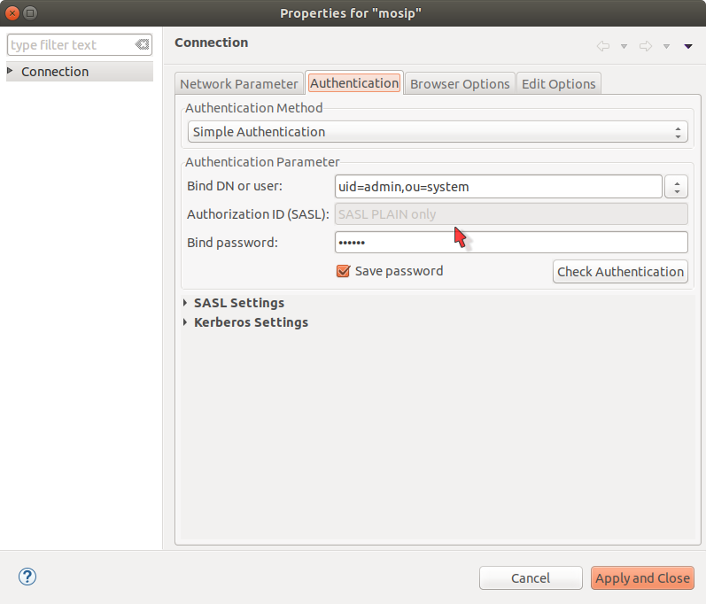
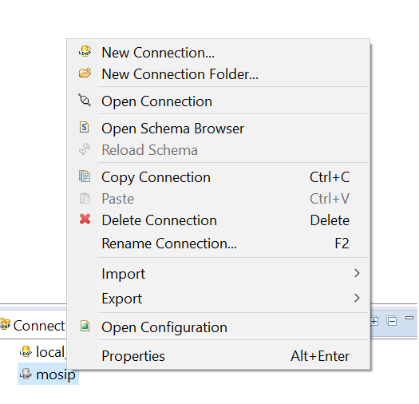
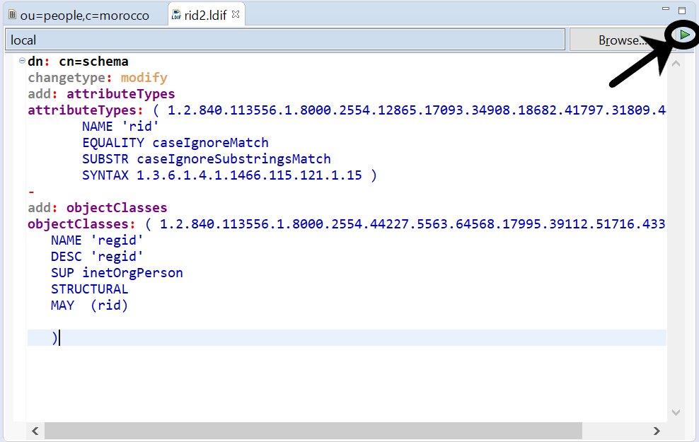
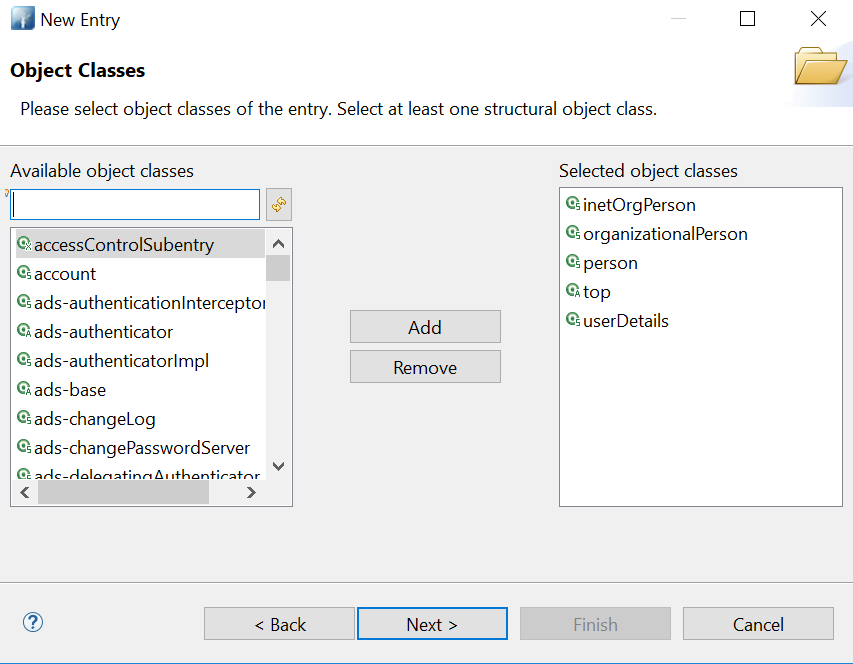
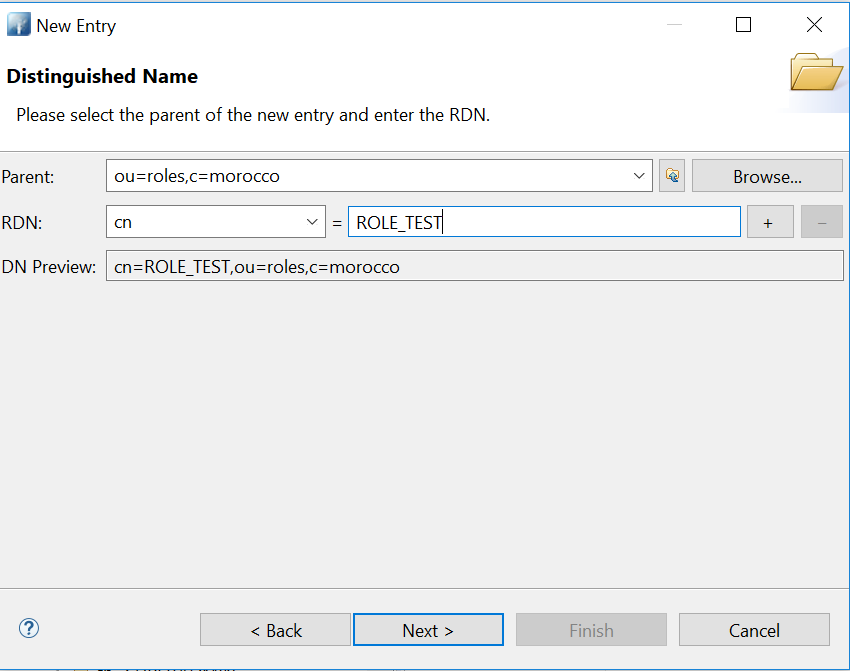
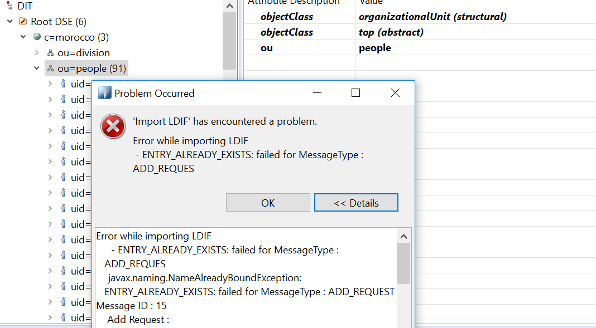

# Guide to use apache directory studio

Follow the below guidelines to use Apache Directory Studio.

## Download Apache Directory Studio

Download apache directory studio from [here](//directory.apache.org/studio/downloads.html).
Look for a ZIP file or a TAR ball.

## Install Apache Directory Studio

To install extract the downloaded ZIP or TAR files in to a particular location.

## Run Apache Directory Studio

Run the ./ApacheDirectoryStudio application in the root path of the installation.

## Create to LDAP server connection

Click on the create connection button.


On the dialog that opens enter the following details


Click next and enter the following details in the Auhentication tab

Password for default connection : secret


Now your connection is configured.

## Connect to LDAP server

Select the connection and click on connect/disconnect as shown in the figure below.


## Create a partition


To create a partition, select the connection and right click to select Open Configuration option.


In the window opened in the center of the screen, select the partitions tab in the bottom and add a partition as shown in the figure.


Once you are done with the configuration press ctrl+s to save the configurations.

**Note:**  Delete existing partition if want to import latest ldif.  When ever the configuration of the connection is changed, restart the LDAP server for the changes to take place.


## Import schemas

* To import entries, select your parent node, right click on it and select import > LDIF import...
* Now select a ldif file which has the entries that you require.
* First, Import mosip-schema-extn.ldif for custom mosip objectClass and attributes [here](_files/auth/mosip-schema-extn.ldif).
* After importing mosip-schema-extn.ldif, Import mosip-entries.ldif for initial entries [here](_files/auth/mosip-entries.ldif).


## Add Custom Attributes in LDAP (Not Required, Sample LDIF has this already created)
* Create new LDIF file [ file -> new -> LDIF file ] in Apache Directory Studio.
* Follow the below given template to create a custom attribute.
      
```
      
dn: cn=schema
changetype: modify
add: attributeTypes
attributeTypes: (  1.2.840.113556.1.8000.2554.54546.18890.37580.16565.48169.34440.63500.20900
       NAME 'dob'
       EQUALITY caseIgnoreMatch
       SUBSTR caseIgnoreSubstringsMatch
       SYNTAX 1.3.6.1.4.1.1466.115.121.1.15 )
attributeTypes: ( 1.2.840.113556.1.8000.2554.32298.14993.64180.19515.36478.12550.7623.31318
       NAME 'genderCode'
       EQUALITY caseIgnoreMatch
       SUBSTR caseIgnoreSubstringsMatch
       SYNTAX 1.3.6.1.4.1.1466.115.121.1.15{1024} )
attributeTypes: ( 1.2.840.113556.1.8000.2554.41584.39755.10371.18440.44317.44977.32952.60155
       NAME 'firstName'
       EQUALITY caseIgnoreMatch
       SUBSTR caseIgnoreSubstringsMatch
       SYNTAX 1.3.6.1.4.1.1466.115.121.1.15{1024} )
attributeTypes: ( 1.2.840.113556.1.8000.2554.64183.29326.62104.16882.47322.52880.7487.43435
       NAME 'lastName'
       EQUALITY caseIgnoreMatch
       SUBSTR caseIgnoreSubstringsMatch
       SYNTAX 1.3.6.1.4.1.1466.115.121.1.15{1024} )
attributeTypes: ( 1.2.840.113556.1.8000.2554.38419.62933.46259.18864.47652.31092.22359.63105
       NAME 'rid'
       EQUALITY caseIgnoreMatch
       SUBSTR caseIgnoreSubstringsMatch
       SYNTAX 1.3.6.1.4.1.1466.115.121.1.15{1024} ) 
attributeTypes: ( 1.2.840.113556.1.8000.2554.52069.14393.50258.17382.33911.47260.27965.41246
       NAME 'isActive'
       SYNTAX 1.3.6.1.4.1.1466.115.121.1.7 )                      
              
-
add: objectClasses
objectClasses: ( 1.2.840.113556.1.8000.2554.4819.13991.55685.16487.47941.21082.30640.10477
   NAME 'userDetails'
   DESC 'userDetails'
   SUP inetOrgPerson
   STRUCTURAL
   MAY  (dob $ genderCode $ firstName $ lastName $ rid $ isActive)
   )
   
      
```


**Description**

* Here, we have created one object class named regid & added custom attribute rid.LDAP does not
allow to create custom attribute in an existing object class.

* Each attribute and object class have unique OID (for e.g. 2.25.1284...) to avoid any conflict with other attributes within LDAP instance. You can use the above OID for experimental purpose.

* SUP inetOrgPerson : specifies that samplePerson object class inherits inetOrgPerson.
  STRUCTURcAL : specifies that samplePerson is type of structural object class & able to add entry.
  
* MAY (rid) : samplePerson class have a optional attribute. So when user select samplePerson as object class then it is not mandatory to the attribute in user entry.

* Save the file to the file system. In order to add the custom attribute follow the below image.


**Note** : If it is not showing your newly created class then just click on Refresh of Available Object Class list.

* Try to add objectclass and attribute to the created user entry. In the attribute search list, now you will be able to see the newly introduced custom attributes.

For more info [Follow](https://directory.apache.org/apacheds/basic-ug/2.3.1-adding-schema-elements.html) this link.


## Object classes

For documentation about Object classes, schemas and it's attributes, click [here](//directory.apache.org/apacheds/basic-ug/2.3-introducing-schema.html)

## Create a new User

**Note** : Create a user if required or use the existing user present in ldif.

Steps to create a new user from scratch in Apache Directory Studio.

1. Right click on ou=people then click on New -> New Entry
   

2. Select Create Entry from Scratch
    

3. Select Object classes InetOrgPerson and Userdetials from the list
   

4. Add userid using attribute uid in distinguished name table as below.
   

5. Add the mandatory attributes sn-surname and cn-common name in the table.
   

6. New User got created , If we need any attributes ,we can right click and add attributes.
   

## Create a new Role

Steps to create new role in Apache Directory Studio.

1. Right click on ou=roles , Create new Entry -> Select ObjectClasses ->OrganizationalRole
   

2. Select cn-common name for the role.
    

3. New Role is created and add description attribute for the role.
    

## User Role Mapping

Steps to create user role mapping

1. Right click on role to be mapped, Select attribute -> RoleOccupant
    

2. Try to click Browse and map the user or give the DN directly to be mapped.
   

## Troubleshooting
1 . Incase Importing Ldif throws an failure to import, due to user details already exists error.


2. Please select checkbox Update Existing entries and import the ldif entries.


3. In case of Connection lookup issues, when Ldap is not able to fetch the data.

       Please follow the steps 

       *) Login to the machine where ldap is installed.

       *) Navigate to the path where partitions are installed "/var/lib/apacheds-2.0.0.AM25/mosip/partitions".

       *) Delete the folder and it contents.

       *) Follow the above steps from "Create a partition" again.

