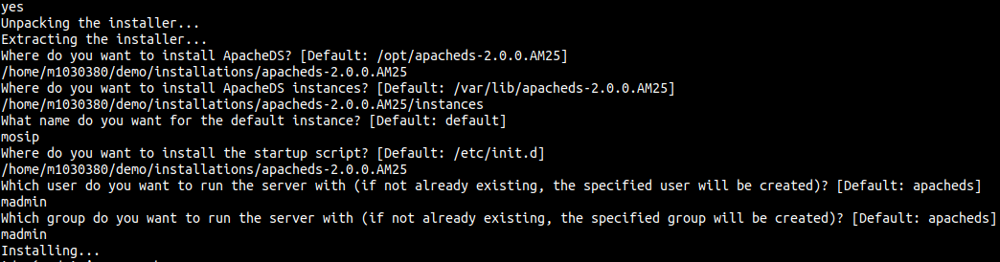

# ApacheDs Installation and Config

**Note:** The below documentation is for linux machines.

## Install Java
```
sudo yum install java-1.8.0-openjdk-devel
```

## Download ApacheDs

Use one of the three methods below to download the binary file of ApacheDs.

1. Execute the below command in the terminal.

    ```shell
    wget http://mirrors.estointernet.in/apache//directory/apacheds/dist/2.0.0.AM25/apacheds-2.0.0.AM25-64bit.bin
    ```

2. Click [here](//mirrors.estointernet.in/apache//directory/apacheds/dist/2.0.0.AM25/apacheds-2.0.0.AM25-64bit.bin) to download ApacheDs binary file in your system and move it to the VM using tools like [WINSCP](//winscp.net/eng/download.php), scp command in linux terminals etc.

3. If the download link above doesnot work, visit [ApacheDs downloads](//directory.apache.org/apacheds/downloads.html) page and select Linux binary installer to download file to your system. Then move it to the VM using tools like [WINSCP](//winscp.net/eng/download.php), scp command in linux terminals etc.

## Install ApacheDs

1. Navigate to the directory where you downloaded the ApacheDs binary file and run the follwing command.

    ```shell
    bash apacheds-2.0.0.AM25-64bit.bin
    ```

    **Note:** apacheds-2.0.0.AM25-64bit.bin is the name of the binary file we downloaded. Change it if your file name differs.

2. Now you will see a Apache License agreement as shown in the screenshot below.

    

    Press Enter key to read through the license agreement untill you are prompted to agree with terms with yes as shown in the screen shot below.

    

3. Once you accept the license terms, you are asked to enter the installation paths as shown below.

    

    **Note:** All the paths provided in the above screenshot are set to defaults in current implementation where as the instance name, user name and group name are provided as shown in the diagram.

4. After providing all the paths, successful installation message is displayed as shown in the below screenshot.

    


## go to the location (cd /etc/init.d) Start, Stop and check status ApacheDs server.

* To run ApacheDs server, run the below command 
      
    ```shell
    ./apacheds-2.0.0.AM25-mosip start
    ```

* To check status of ApacheDs server, run the below command

    ```shell
    ./apacheds-2.0.0.AM25-mosip status
    ```

* To stop ApacheDs server, run the below command

    ```shell
    ./apacheds-2.0.0.AM25-mosip stop
    ```

