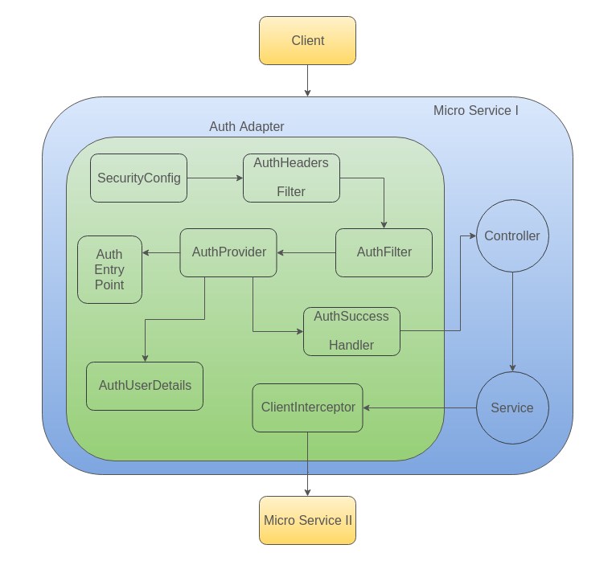

# Auth Adapter

Auth adapter is a package that needs to be injected into Mosip's applications exposing REST API's inorder to secure them.

Auth Adapter includes following class definitions:

1. [SecurityConfig](Auth-Adapter.md#SecurityConfig)
2. [AuthFilter](Auth-Adapter.md#AuthFilter)
3. [AuthHeadersFilter](Auth-Adapter.md#AuthHeadersFilter)
4. [AuthProvider](Auth-Adapter.md#AuthProvider)
5. [AuthSuccessHandler](Auth-Adapter.md#AuthSuccessHandler)
6. [AuthEntryPoint](Auth-Adapter.md#AuthEntryPoint)
7. [AuthToken](Auth-Adapter.md#AuthToken)
8. [AuthUserDetails](Auth-Adapter.md#AuthUserDetails)
9. [ClientInterceptor](Auth-Adapter.md#ClientInterceptor)
10. [MosipUser](Auth-Adapter.md#MosipUser)
11. [AuthControllerAdvice](Auth-Adapter.md#AuthControllerAdvice)

## SecurityConfig

Holds the main configuration for authentication and authorization using spring security.

Inclusions:

* AuthenticationManager bean configuration:
  * This is assigned an [AuthProvider](Auth-Adapter.md#AuthProvider) that we implemented.
  * RETURNS an instance of the ProviderManager.
* [AuthFilter](Auth-Adapter.md#AuthFilter) bean configuration:
  * This extends **AbstractAuthenticationProcessingFilter**.
  * Instance of the [AuthFilter](Auth-Adapter.md#AuthFilter) is created.
  * This filter comes in line after the [AuthHeadersFilter](Auth-Adapter.md#AuthHeadersFilter).
  * Binds the AuthenticationManager instance created with the filter.
  * Binds the [AuthSuccessHandler](Auth-Adapter.md#AuthSuccessHandler) created with the filter.
  * RETURNS an instance of the [AuthFilter](Auth-Adapter.md#AuthFilter).
* RestTemplate bean configuration:
  * Binds the [ClientInterceptor](Auth-Adapter.md#ClientInterceptor) instance with the RestTemplate instance created.
  * RETURNS an instance of the RestTemplate.
* Secures endpoints using antMatchers and adds filters in a sequence for execution.

## AuthFilter

AuthFilter is bound with AuthenticationManager to attempt authentication.

Attempt Authentication tasks:

* Receives **"Authorization"** Header from request headers.
* Use the assigned Authentication manager to authenticate with the token.

## AuthHeadersFilter

This filter is going to act as a CORS filter. It is assigned before [AuthFilter](Auth-Adapter.md#AuthFilter) in the filter chain.

Tasks:

* Sets headers to allow cross origin requests.
* Sets header to allow and expose **"Authorization"** header.

## AuthProvider

Contacts auth server to verify token validity.

Tasks:

* Contacts auth server to verify token validity.
* Stores the response body in an instance of [MosipUser](Auth-Adapter.md#MosipUser).
* Updates token into **SecurityContext**.
* Bind [MosipUser](Auth-Adapter.md#MosipUser) instance details with the [AuthUserDetails](Auth-Adapter.md#AuthUserDetails) that extends Spring Security's UserDetails.

## AuthSuccessHandler

Handles successful authentication. If any action needs to be done after successful authentication, this is where you have to do it.

## AuthEntryPoint

Captures and sends **"UnAuthorized"** error.

## AuthToken

* Used in [AuthProvider](Auth-Adapter.md#AuthProvider) for token details.
* This extends **UsernamePasswordAuthenticationToken** class.

## AuthUserDetails

Used by spring security to store user details like roles and use this across the application for Authorization purpose.

## ClientInterceptor

It is used to intercept any http calls made using rest template from this application.

Config:

This is added to the list of interceptors in the RestTemplate bean created in the [SecurityConfig](Auth-Adapter.md#SecurityConfig).

Tasks:

* Intercept all the requests from the application and do the below tasks.
* Intercept a request to add auth token to the **"Authorization"** header.
* Intercept a response to modify the stored token with the **"Authorization"** header of the response.

## MosipUser

Mosip user is the standard spec that will be tuned based on the details stored in ldap for a user.

## AuthControllerAdvice

Adds latest token to the response headers before it is committed.
