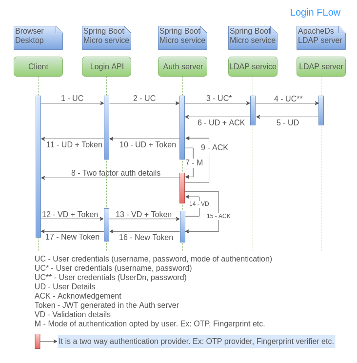
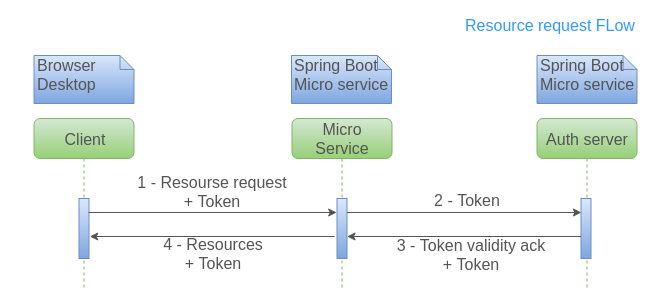
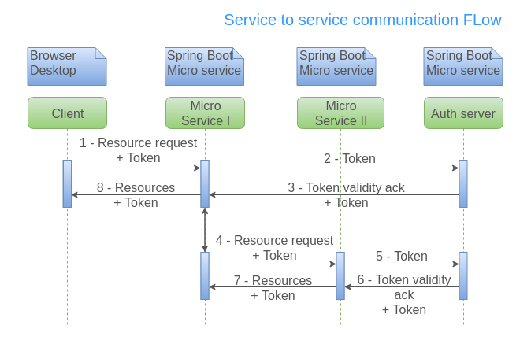

# Auth Implementation

Please find below the sequence diagrams for auth flows.

**Login flow:**

**Resource request flow:**

**Service to Service communication:**

## Documentations for the Auth Implementations

1. [Auth Adapter Documentation](Auth-Adapter.md)
2. [Auth Angular User Guide](Auth-Angular-User-Guide.md)
3. [Auth SpringBoot User Guide](Auth-SpringBoot-User-Guide.md)
