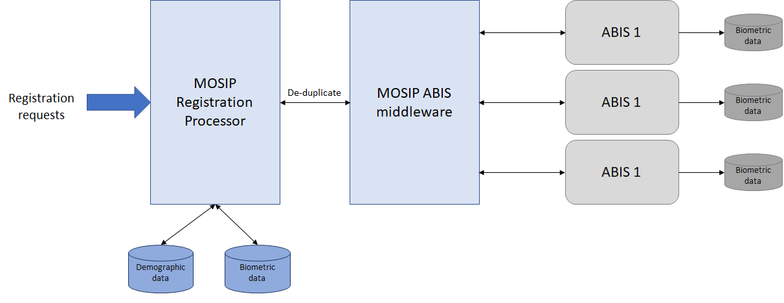

Providing unique identity for an individual is one of key features of MOSIP platform. To do this MOSIP will 

- Use multi modal biometric information of an individual
- Leverage Automated Biometric Identification System (ABIS) to de-duplicate Individual's biometric data
- Design for integrating with multiple ABIS providers to leverage expertise of different ABIS providers
- Not use ABIS for authentication (deduplication only)

This document will provide the specification an ABIS provider must implement to meet MOSIP's requirements.

# Overview


- MOSIP will interact with ABIS only via message queues
- JSON format will be used for all control messages like INSERT, IDENTIFY etc... to interact with ABIS
- CBEFF XML format will be used to send biometrics data to ABIS
  (Please refer to [**MOSIP Biometric Data Specifications**](MOSIP-Biometric-Data-Specifications) for cbeff data sample)
- Inside the CBEFF XML individual biometrics data must be in respective ISO format

Biometric data sent to ABIS will follow the below standards.

- CBEFF: ISO/IEC 19785-3 (Please refer to [**MOSIP Biometric Data Specifications**](MOSIP-Biometric-Data-Specifications) for 
  details)
- Fingerprints
  * Finger Print Minutiae Record (FMR) - ISO/IEC 19794-2
  * Finger Print Image Record (FIR) - ISO/IEC 19794-4

- IRIS
  * Iris Image Record (IIR) - ISO/IEC 19794-6

- Face
  * Face Image Data (FID) - ISO/IEC 19794-5

ABIS should support the following types of biometric images
- Unsegmented fingerprint images (4-4-2), or 
- Unsegmented fingerprint images (4-1-4-1), or
- Unsegmented fingerprint images (2-2-2-2-2), or 
- Individual fingerprint images (segmented)
- IRIS images (Left, and Right)
- Face photograph


ABIS should support the following requests

Management | Registration
-----------|-------------
Ping   | Insert
GetPendingRequests      | Identify
GetReferenceCounts      | Delete
Configure| Ping


## Key terminologies
### ABIS
Automated Biometric Identification System whose primary responsibility is de-duplication of biometric data (finger print & Iris).

### Candidate list
Each Identify request to ABIS can return zero or more records that match the provided biometric data. The returned records is referred to as the candidate list

### Reference Database
The database maintained with the ABIS system which stores the biometrics data of an individual

### Gallery
A subset of the population in the Reference Database used as a target to search for a specific entry. ABIS should have a provision to take an Identify or Verify request with a target gallery parameter

### ID Repository
The database within MOSIP which contains the ID details (demographic & biometric) of an Individual. This database is not related to Reference Database.

### TargetFPIR
FPIR is False Positive Identification Rate. This metric tells how many false positive identification an ABIS achieved. An ABIS should be able to send the FMR as defined below.
```
round (-10 * log10 (achieved targetFPIR))
```

The acceptable values are

Target FPIR | score
------------------------|------
1 in 1,000              | 30
1 in 10,000             | 40
1 in 100,000            | 50


## API's to interact with an ABIS system

[**ABIS APIs**](ABIS-APIs) details the API's that an ABIS system must support