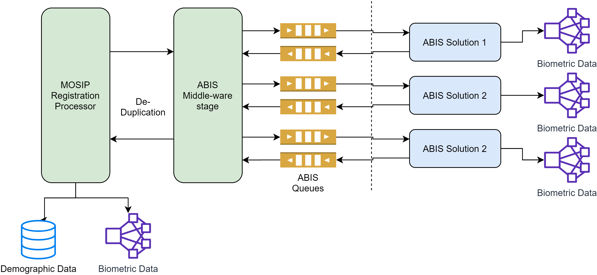
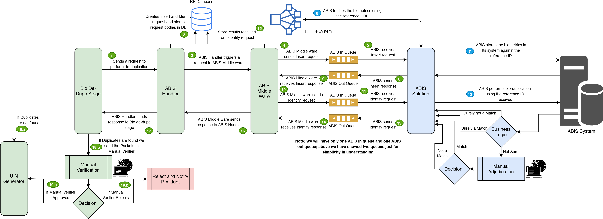

## Overview

Providing unique identity for a resident is one of key features of any identity platform. To achieve this, MOSIP interfaces with an **Automated Biometric Identification System (ABIS)** to perform de-duplication of a resident's biometric data. 

MOSIP is designed to integrate with multiple ABISs to leverage expertise of different ABIS providers. A country may use one ABIS for fingerprint and another for Iris or use multiple ABISs for the same biometric data and evaluate the best ABIS based on de-duplication quality. 

The ABIS system never comes to know about resident's identity. Any Personally Idenfiable Information (PII) such as demographic details or RID (Request ID for Registration) is not shared with the ABIS system. Internally, MOSIP maintains a mapping between the ABIS specific referenceID and RID of the resident.


 ABIS is used for 1:N deduplication. For 1:1 authentication [Biometric SDK](Biometric-SDK.md) is used. MOSIP does not recommend using an ABIS for 1:1 authentication.


## ABIS middleware
MOSIP's ABIS middleware has the following components
- MOSIP ABIS request handler 
- Request router (based on routing policy, an ABIS request is routed to the correct ABIS system)
- ABIS response handler

## MOSIP-ABIS interface

MOSIP interacts with ABIS only via message queues. JSON format is used for all control messages in the queue. MOSIP ABIS middleware sends requests to inbound queue address and receives responses from outbound queue address.
For details refer to the [ABIS API Specifications](ABIS-APIs.md).

ABIS must support the following types of biometric images:
* Individual fingerprint images (segmented)
* Iris images (left, right)
* Face image

Biometrics data in MOSIP is exchanged as per formats defined in [Biometric Data Specification](Biometric-Data-Specification.md). 

## ABIS deployment
* ABIS must comply to [ABIS API Specifications](ABIS-APIs.md).
* The queques can be configured in [RegistrationProcessorAbis-env.json](https://github.com/mosip/mosip-config/blob/master/config-templates/RegistrationProcessorAbis-env.json) file.
 ABIS system connects to the queues using a pre-defined user id and password. 
* It is recommended that ABIS is deployed in the same secure zone (military zone) where the registration processor is deployed. 
* ABIS system is not recommended to connect to any external network.

