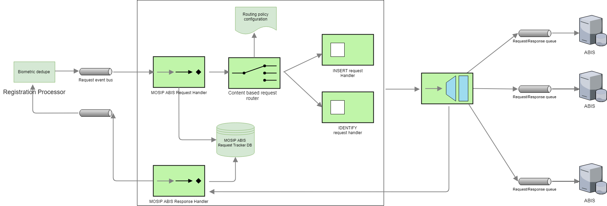

## Overview

Providing unique identity for an individual is one of key features of any identity platform.  To achieve this, MOSIP interfaces with Automated Biometric Identification System (ABIS) to de-duplicate an individual's biometric data. MOSIP is designed to integrate with multiple ABISs to leverage expertise of different ABIS providers. A country may use one ABIS for fingerprint and another for Iris or use multiple ABISs for the same biometric data and evaluate the best ABIS based on de-duplication quality.  Note that ABIS is used for deduplication during registration, but not for authentication.

## MOSIP ABIS Middleware
MOSIP ABIS middleware has the following components
- MOSIP ABIS request handler 
- Request router (based on routing policy, an ABIS request is routed to the correct ABIS system)
- ABIS response handler

## MOSIP-ABIS interface
MOSIP interacts with ABIS only via message queues.  JSON format is used for all control messages.  Biometrics data is exchanged as per [**MOSIP Biometric Data Specifications**](MOSIP-Biometric-Data-Specifications.md) 

ABIS must support the following types of biometric images
* Unsegmented fingerprint images (4-4-2), (4-1-4-1) and (2-2-2-2-2).
* Individual fingerprint images (segmented)
* IRIS images (left, right)
* Face photograph

ABIS must support the following requests

Management | Registration
-----------|-------------
Ping   | Insert
GetPendingRequests      | Identify
GetReferenceCounts      | Delete
Configure| Ping

ABIS must support [**ABIS APIs**](ABIS-APIs.md)

### Configure ABIS queue
ABIS queue can be configured in [RegistrationProcessorAbis-env.json](https://github.com/mosip/mosip-config/blob/master/config-templates/RegistrationProcessorAbis-env.json) file. registration-processor-abis-middleware-stage communicates to ABIS through queue configured. It sends request to inbound queue address and receives response from outbound queue address. If there are multiple ABIS, then it can be added in same file.