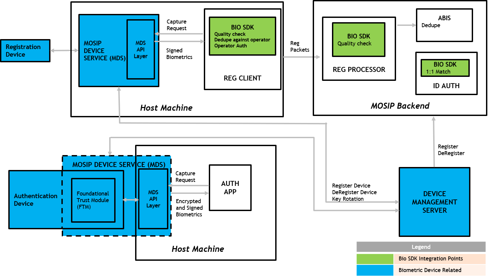
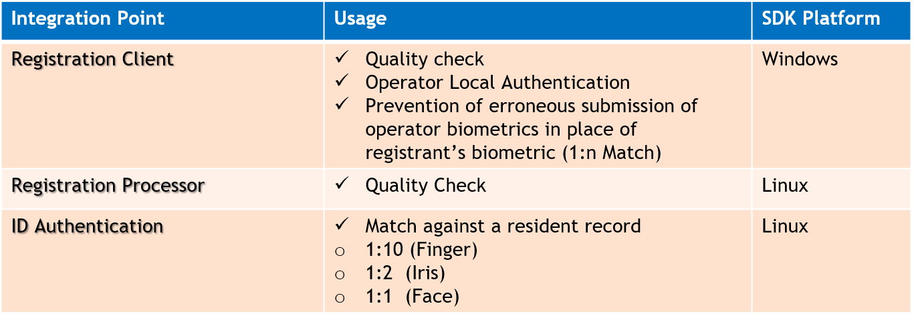

# Introduction

MOSIP uses biometrics - fingerprint, iris, face - in registration and authentication processes.  This requires specialized processing of biometrics data for biometric quality check and matching two biometric images.  Biometric SDK consists of software libaries that provide these functions.  Note that MOSIP platform does not include such an SDK.  

# Biometric SDK integration points

Below are the list of integration points where we are currently using biometric SDKs in MOSIP.

# Biometric SDK Features 

## Quality Checker
Quality checker, checks the quality of input biometrics and returns quality score for the same.

### Use Cases
* When a biometric  image is received by MOSIP in the registration client using a forced capture, this method is used to check the quality of the image
* Server side validation of quality of biometric images uses this method
* When external biometric images are received to be put on record this method is used to determine the quality of the received biometric image

## Matcher
Matcher, matches the captured biometric record or a list of biometric records (based on single match or composite match), matches it against list of stored biometric records. It then returns a matching score against each stored biometric record or a composite matching score for the list of input biometric records. 

### Use Cases
* Used for matching one or multiple modes of biometric received in an auth transaction with a list of biometrics record
* Used for authentication of operators in offline mode
* Used for prevention of erroneous submission of operator biometrics in place of registrant’s biometric on registration client
* Match is expected to be capable of image-image, extract-extract and extract-image comparisons

## Extractor
Extractor, extracts salient features and patterns of input biometric record to use in fast comparison. It returns the extracted biometric record.

## Use Cases
* Used to extract salient features and patterns of a biometric to use in fast comparison
* In case of fingerprints this is called Minutiae and a standard representation of minutiae is an ISO template for FMR

# Segmenter
Segmenter, segments single biometric record into multiple biometric records and returns list of segmented biometric records. Eg: Split thumb slab into multiple fingers and eyes into left and right eye.

## Use Cases
* Used to split images into individual biometric segments when received from external sources

# Biometric SDK API Specification

The SDK needs to comply to [Biometric SDK API Specification](Biometric-SDK-API-Specification.md)

