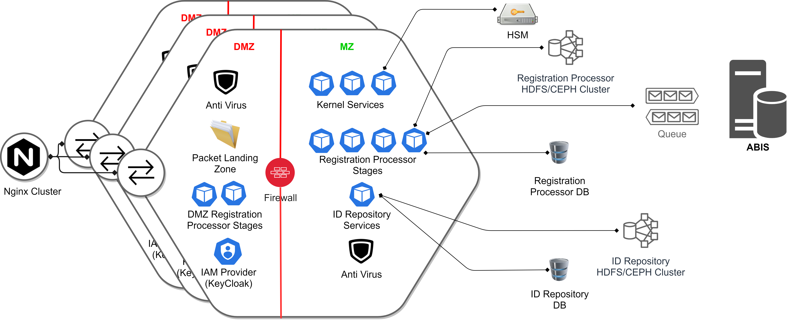

## Context
Scalability of complex systems is non-trivial especially when there are multiple running components like microservices, databases, storage clusters etc. with complex interactions.  End-to-end performance modelling of such a system poses
signifcant challenges as the performance of the 'whole' does not have a straight-forward linear relationship to its 'parts'.

MOSIP recommends a cell architecture where hardware and software within a cell is fixed (canned), and the cell is benchmarked for output capacity.  Such cells, then, may be replicated to scale up capacity in a production depolyment with traffic diverted to them via a load balancer.  Ideally, each cell must be islolated from each other without any cross-dependencies.  Practically, however, they may share certain resources.  Scalabilty of such common resources needs to addressed separately.

This document presents cell architecture for all major MOSIP modules for production deployment.

## Registration Processor Cell

The following resources are shared across cells:
* [ABIS](Automated-Biometric-Identification-System-ABIS.md)
* ABIS Queue
* Registration Process DB
* ID Repository HDFS/CEPH cluster
* ID Repository DB

The communication between Demiliatrized Zone (DMZ) and Militarized Zone (MZ) is strictly via a firewall.

The encrypted packets from registration client first land into the Packet Landing Zone in the DMZ. Some of the Registration Processor stages run in the DMZ for initial packet handling.  

