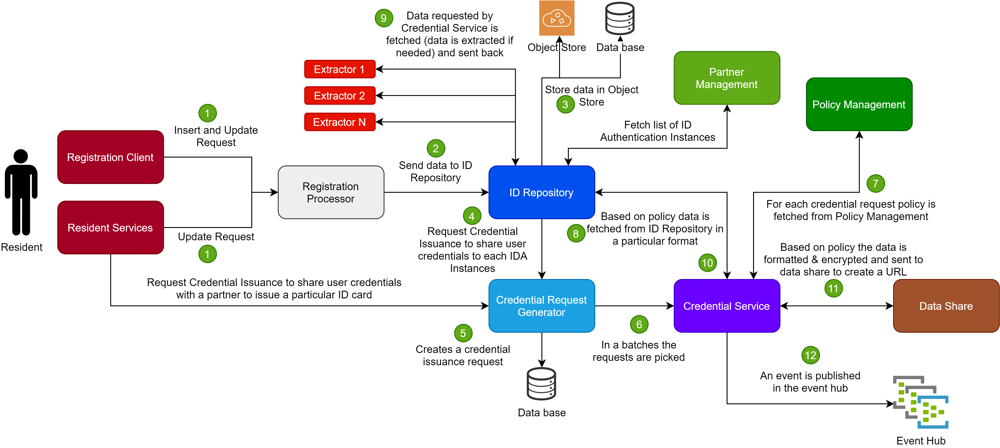

## Credentials
Credential share is responsible to share the user's data to a credential partner for printing, issuing cards, verifying data, etc.

The credential share is a functional service that interacts with the id repository and collects the user attributes as per policy defined for the credential partner. The service responsibilities are as follows.

* Retrive an individual's details from ID repository as per policy.
* If required collect the biometrics of the individual; based on policy the extracted biometrics are collected from ID repository.
* Encrypt the data as per the policy.
* Construct a simple map and store the details of the individual.
* All shared data is signed before encryption and shared as a Data Share URL (configurable as per policy).

## Credential Share Process Flow for Print

* User requests for credentials via resident service with VID, provider(subscriber/partner), pin(password), Authentication request(bio or OTP based auth request)
* Resident service will authenticate the user using IDA
* Upon successful authentication, residential services will call credential service create API
	* We get VID, Credential Type (Policy), Provider as details, User-provided encryption pin, list of data to be shared
* Credential Service will store a request in the database and return a request ID
	* Prior to return, it will validate the request for the policy, provider and will check if the service can be rendered. If not an error is returned right away.
	* Stores all the policy details and preferred SDK partner.
	* User authentication is already handled by the resident services and only the user details are passed here
* Batch Service (Part of the spring-boot) will pick up the request and process it
	* Uses policy to identify the list of data needed
		* If the user has provided a list then an intersection of both is taken
	* For demographic information needed it queries the id repository DB to get the information
	* For biometric information needed it queries the id repository biometric store to get the information
	* If biometrics need to be extracted, then credential service uses the SDK Partner calls the extract API for this.
	* Now that we have all the data needed if any specific elements are to be encrypted as per the policy the same is done.
	* If a user pin is to be used for the information to be encrypted the same is used. (This API should be in key manager) This should use HKBDF
	* Using this information a Verifiable Credential document is created.
	* A data share is created with the verifiable credential to be shared with the print service
	* An event is raised to the print service that it can start work on the request-id
	* Status of the request is marked as notified to print provider
* Print service webhook is called
	* Print service parses the notification and gets the data share URL in the event
	* It fetches the verifiable credential from the data share
	* Based on the credential type to be issued, it picks formatting template for the same to create a verifiable presentation of alternate presentation (qr code)
	* It processes and formats the credential data into final form
		* This can include additional encryption, signature or hash computation as needed
	* Print service persists the presentation it created (in case of digital credentials)
		* The physical credential is printed/flashed
	* Print service notifies the delivery service that the credential is ready for dispatch
	* Status update API is called
* Delivery service webhook is called
	* Delivery service gets reference id to get access to the presentation (same request-id could be used)
	* Datashare or email or SMS or other means are used to deliver the presentation to the user
	* Status update API is called
	
## Process Flow Diagram

In the below process flow diagram, we have detailed the flow for credential issuance, when,

* Share of credentials to authentication instances during issuance or update of Identity
* Share of credentials to print partners when a resident requests for an ID

