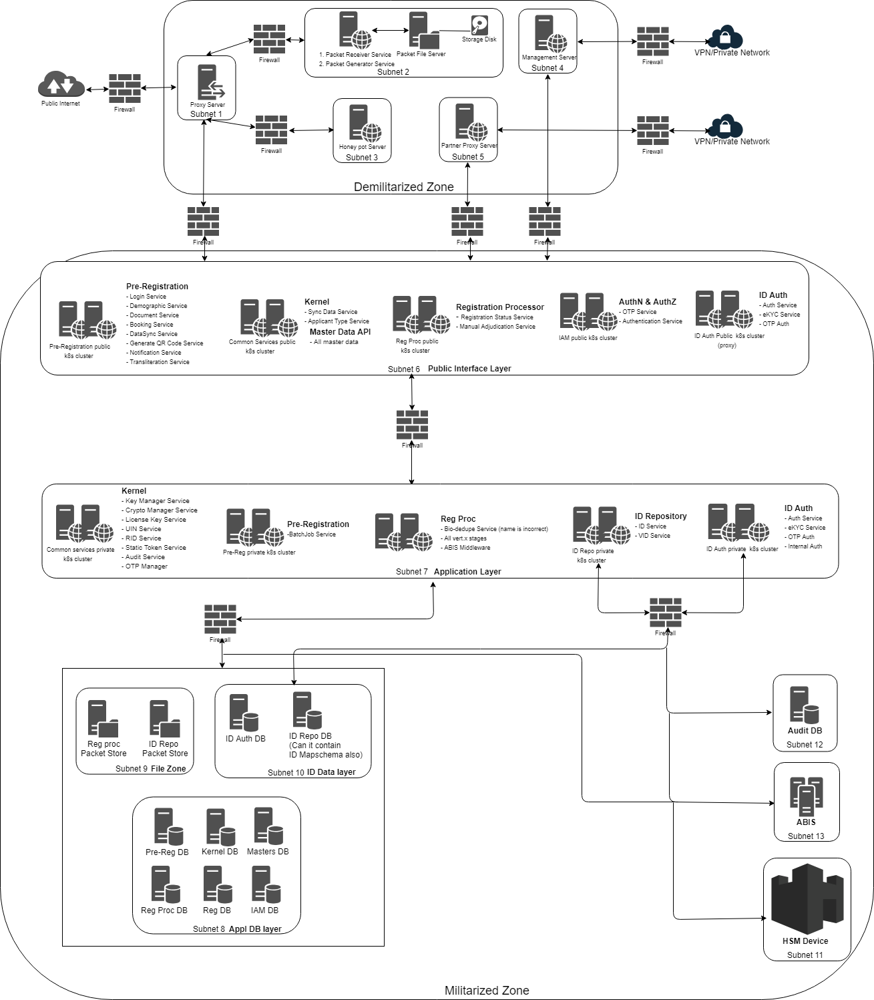
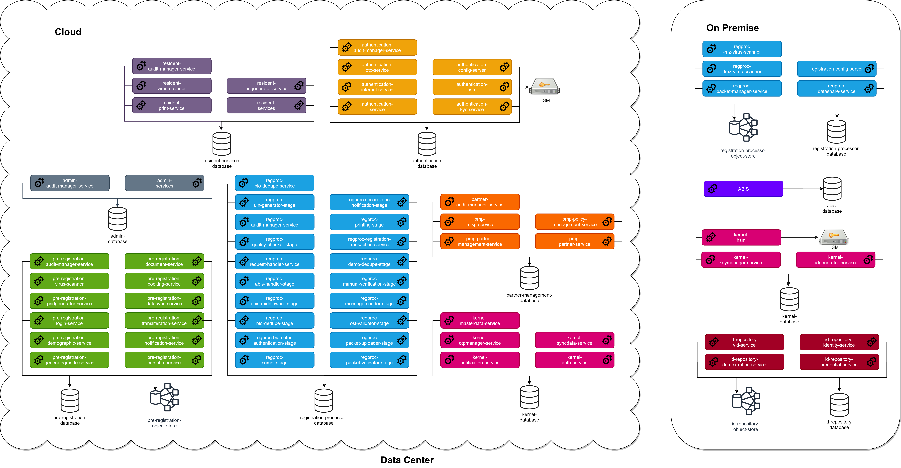

## Introduction

Running a national ID system is no mean task and involves numerous challenging aspects. The software system at the core is a critical infrastructure and needs to address high availability, reliability, scalability, security, resilience, and manageability. Choosing the right deployment architecture plays an important role  in helping achieving architectural goals while also catering to the law of the land. Cost of implementing such an architecture also matters.

Mosip has a micro-services architecture that organizes functionality into myriad small services and execution units. Each of these can be scaled separately as well as replaced / upgraded. This makes the platform powerful and provides plenty of flexibility  and configurability in the hands of the implementor. There is also the corresponding complexity of dealing with a higher number of components in the system in the areas of configuration, security, deployment, dependency management, monitoring and testing.

## Deployment architecture choices

In order to get the best out of mosip and keep manageability high the deployment architecture plays a crucial role. Let us take a look at a few of the common deployment architecture options available based on various perspectives.

* Packaging choices
  * Option 'Jar' - Spring boot services in Virtual Machines|
  * Option ‘Docker’ - Dockers on a Kubernetes container management setup

* Infrastructure choices
  * Option ‘On Premise’ - Deploy in a private or own data center
  * Option ‘Cloud’ - Deploy in a cloud
  * Option ‘Hybrid’ - Cloud + On Premises

* Platform choices
  * Option 'Open Source' - Proven community favored platforms
  * Option 'Cloud Native' - Cutting edge supported cloud technologies from AWS, Azure, GCP et al
  * Option 'Commercial' - Established and well supported priced packages

## Security: Deployment with secure zones

The architecture proposed may be deployed on-premise or cloud.  Here, all MOSIP modules are installed with clear separation between militarised and demilitarised zones.

## Scalability: Cell based architecture
For linear scaling of capacity and provisioning of hardware, a cell based architecture (along with secure zones) may be preferred.

[Cell based architecture](https://docs.mosip.io/platform/build-and-deploy/cell-based-deployment-architecture)

## Rapid deployment: Hybrid architecture
A hybrid architecture may be considered where benefits of cloud and on-premise are leveraged. While cloud provides rapid deployment and ease of  management, on-premise can facilitate data localization and any other policy requirements. 

An example of hybrid architecture is given below:

