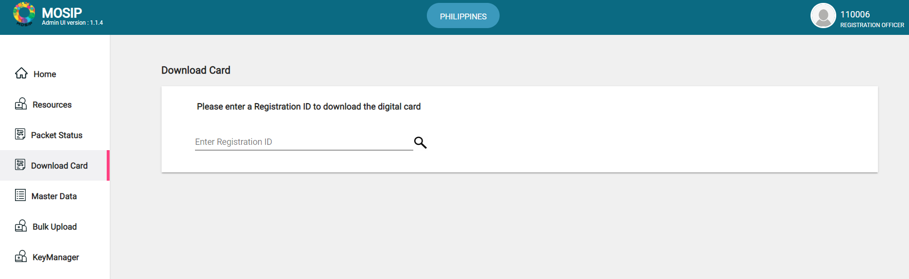

The printing and delivery of cards in a foundational ID system highly depend upon the printing capacity and postal infrastructure of the country. The last mile delivery of the resident's card is unreliable in many developing countries. Based on the need of the hour, in MOSIP we have added a new feature to download the resident's card using the resident service APIs or receive the card at an assisted kiosk using the admin portal.

## Download cards using the admin portal
The admin with the role "DIGITALCARD_ADMIN" has the privilege to download the digital copy of the UIN card for the residents (currently as a PDF). Here the resident reaches the centre and requests the admin to provide a PDF version of their ID card.

To download the card, 
1. The admin logs into the admin portal and navigate to the **Download Card** option on the left navigation pane.
2. The admin now enters the registration ID shared by the resident and clicks on the search icon to check if the registration ID exists and proceeds for further verification. The admin can use a QR code or barcode scanner to scan the registration ID from the registration slip available with the resident instead of typing the same to avoid mistakes.
3. If a card is available for that registration ID, the photograph along with the date of birth of the resident is displayed on the screen.
4. Now the admin can perform a manual verification to confirm the identity of the resident or the country can customize this section to add an SDK to perform local authentication.
5. If the identity of the resident can be verified, the admin has to provide consent by clicking on the *"I have verified the face"* option and downloading the card.
6. If the face does not match then the request for downloading the card is rejected.
7. The card downloaded here can be printed and a physical copy of the same can be shared with the resident.



## Restrictions and auditing
* The admins who have the additional role "DIGITALCARD_ADMIN" only have the privilege to see the option to download a card.
* There is a limit added for the admins per day to search a registration ID but the limit doesn't reduce when there is a failed attempt. The limit here is configurable by the country.
* All the transactions successful or failed are logged in the audit table which can be further used for analytics.
* As of now there are no time restrictions on the availability of the registration ID but there is a restriction on the number of times a particular registration ID might be shared in the policy.
* The PDFs that are generated are password protected. The passwords are configurable.

## Download the card using resident services APIs
If this API is added to the resident portal of the country, then the resident should be able to download the digital copy of his/her card using OTP authentication. The details about the API are listed below:

### Request OTP using RID

#### Request URL
`POST https://{base_url}/resident/v1/req/rid-otp`

#### Request body
```
{
  "id": "mosip.resident.ridotp",
  "individualId": "10002100300001520220726101639",
  "metadata": {},
  "otpChannel": [
    "EMAIL"
  ],
  "requestTime": "2022-07-26T11:54:43.013Z",
  "transactionID": "1234567890",
  "version": "v1"
}
```

#### Response body
```
{
  "id": "mosip.identity.otp.internal",
  "version": "1.0",
  "transactionID": "1234567890",
  "responseTime": "2022-07-26T12:24:36.152Z",
  "errors": null,
  "response": {
    "maskedMobile": null,
    "maskedEmail": "XXiXXaXX.XX@gmail.com"
  },
  "metadata": null
}
```

### Request to download card

#### Request URL
`POST https://{base_url}/resident/v1/req/rid-digital-card`

#### Request body
```
{
  "id": "mosip.resident.ridotp",
  "request": {
    "individualId": "10002100300001520220726101639",
    "otp": "111111",
    "transactionID": "1234567890"
  },
  "requesttime": "2022-07-26T11:54:43.013Z",
  "version": "v1"
}
```

#### Response
A password-protected PDF file containing the digital version of the resident's ID card.

## Deployment Notes

### Docker images
Docker Images required on top of 1.1.5.5 version of MOSIP.
* digital-card-service : 1.1.5.6
* id-repository : 1.1.5.6
* resident-services : 1.1.5.4
* artifactory-ref-impl : 1.1.5.6
* admin-ui : 1.1.5.1
* admin-services : 1.1.5.4

### Database changes
* Add key policy for DIGITAL_CARD in key_policy_def and key_policy_def_h tables.
```
INSERT INTO keymgr.key_policy_def
	(app_id, key_validity_duration, is_active, cr_by, cr_dtimes, upd_by, upd_dtimes, is_deleted, del_dtimes)
	VALUES('DIGITAL_CARD', 1095, true, 'mosipadmin', '2020-12-15 15:15:54.411', NULL, NULL, NULL, NULL);
  
INSERT INTO keymgr.key_policy_def_h
	(app_id, eff_dtimes, key_validity_duration, is_active, cr_by, cr_dtimes, upd_by, upd_dtimes, is_deleted, del_dtimes)
	VALUES('DIGITAL_CARD', '2020-12-15 15:15:54.442', 1095, true, 'mosipadmin', '2020-12-15 15:15:54.442', NULL, NULL, NULL, NULL);
```
* Add a new partner and policy for digital card where the partner ID is "mpartner-default-digitalcard" and the credential type is "PDFCard". The partner management APIs can be used to add the below details.
```
//Create a new policy group called "mpolicygroup-deafult-digitalcard".

INSERT INTO pms.policy_group
(id, "name", descr, user_id, is_active, cr_by, cr_dtimes, upd_by, upd_dtimes, is_deleted, del_dtimes)
VALUES('mpolicygroup-deafult-digitalcard', 'mpolicygroup-deafult-digitalcard', 'mpolicygroup-deafult-digitalcard', 'superadmin', true, 'superadmin', '2020-12-16 12:30:14.100', 'superadmin', '2020-12-16 12:30:14.100', NULL, NULL);

//Create a new partner with partner ID as "mpartner-default-digitalcard".

INSERT INTO pms.partner
(id, policy_group_id, "name", address, contact_no, email_id, certificate_alias, user_id, partner_type_code, approval_status, is_active, cr_by, cr_dtimes, upd_by, upd_dtimes, is_deleted, del_dtimes)
VALUES('mpartner-default-digitalcard', 'mpolicygroup-default-digitalcard', '<Partner Orgnaization Name as per Certificate>', '<Address of the Partner>', '<Phone Number of the Partner>', '<Email ID of the Partner>', '94d4ae61-31f0-42ca-97ae-8f4953f41fb6', 'mpartner-default-digitalcard', 'Credential_Partner', 'approved', true, 'superadmin', '2020-12-16 12:30:13.973', '110006', '2022-06-01 08:01:35.025', false, NULL);

INSERT INTO pms.partner_h
(id, eff_dtimes, policy_group_id, "name", address, contact_no, email_id, certificate_alias, user_id, partner_type_code, approval_status, is_active, cr_by, cr_dtimes, upd_by, upd_dtimes, is_deleted, del_dtimes)
VALUES('mpartner-default-digitalcard', '2020-12-16 12:30:14.306', 'mpolicygroup-deafult-digitalcard', '<Partner Orgnaization Name as per Certificate>', '<Address of the Partner>', '<Phone Number of the Partner>', '<Email ID of the Partner>', '94d4ae61-31f0-42ca-97ae-8f4953f41fb6', 'mpartner-default-digitalcard', 'Credential_Partner', 'approved', true, 'superadmin', '2020-12-16 12:30:14.306', 'superadmin', '2020-12-16 12:30:14.306', NULL, NULL);

//Insert a policy for mpolicygroup-deafult-digitalcard

INSERT INTO pms.auth_policy
(id, policy_group_id, "name", descr, policy_file_id, policy_type, "version", policy_schema, valid_from_date, valid_to_date, is_active, cr_by, cr_dtimes, upd_by, upd_dtimes, is_deleted, del_dtimes)
VALUES('mpolicy-default-digitalcard', 'mpolicygroup-deafult-digitalcard', 'mpolicy-default-digitalcard', 'To Share Data', '{"dataSharePolicies":{"typeOfShare":"Data Share","validForInMinutes":"250","transactionsAllowed":"1000","encryptionType":"none","shareDomain":"datashare-service","source":"Print"},"shareableAttributes":[]}', 'Datashare', '1.0', 'https://schemas.mosip.io/v1/auth-policy', '2022-04-04 12:48:58.193', '2022-10-01 12:49:05.712', true, '110068', '2022-04-04 12:48:58.193', '110068', '2022-04-04 12:49:05.712', false, NULL);

INSERT INTO pms.auth_policy_h
(id, eff_dtimes, policy_group_id, "name", descr, policy_file_id, policy_type, "version", policy_schema, valid_from_date, valid_to_date, is_active, cr_by, cr_dtimes, upd_by, upd_dtimes, is_deleted, del_dtimes)
VALUES('mpolicy-default-digitalcard', '2020-11-14 05:59:00.000', 'mpolicygroup-deafult-digitalcard', 'mpolicy-default-digitalcard', 'mpolicy-default-digitalcard', '{"dataSharePolicies":{"typeOfShare":"Data Share","validForInMinutes":"30","transactionsAllowed":"2","encryptionType":"none","shareDomain":"datashare-service","source":"Print"},"shareableAttributes":[]}', 'DataShare', '1', 'https://schemas.mosip.io/v1/auth-policy', '2020-12-16 12:30:14.343', '2025-05-02 09:37:00.000', true, 'admin', '2020-12-16 12:30:14.343', 'admin', '2020-12-16 12:30:14.343', NULL, NULL);

//Insert a policy for mpolicygroup-deafult-PDFCard

INSERT INTO pms.auth_policy
(id, policy_group_id, "name", descr, policy_file_id, policy_type, "version", policy_schema, valid_from_date, valid_to_date, is_active, cr_by, cr_dtimes, upd_by, upd_dtimes, is_deleted, del_dtimes)
VALUES('mpolicy-default-PDFCard', 'mpolicygroup-deafult-digitalcard', 'string', 'string', '<Policy for the Data to be added in the PDF>', 'DataShare', 'string', 'https://schemas.mosip.io/v1/auth-policy', '2020-12-16 12:30:14.183', '2025-04-28 09:37:00.000', true, 'admin', '2020-12-16 12:30:14.183', 'service-account-mosip-creser-client', '2021-02-09 06:50:22.065', false, NULL);

INSERT INTO pms.auth_policy_h
(id, eff_dtimes, policy_group_id, name, descr, policy_file_id, policy_type, "version", policy_schema, valid_from_date, valid_to_date, is_active, cr_by, cr_dtimes, upd_by, upd_dtimes, is_deleted, del_dtimes)
VALUES('mpolicy-default-PDFCard', '2020-11-13 05:58:00.000', 'mpolicygroup-deafult-digitalcard', 'mpolicy-default-PDFCard', 'mpolicy-default-PDFCard', '<Policy for the Data to be added in the PDF>', 'DataShare', '1', 'https://schemas.mosip.io/v1/auth-policy', '2020-12-16 12:30:14.343', '2025-05-01 09:37:00.000', true, 'admin', '2020-12-16 12:30:14.343', 'admin', '2020-12-16 12:30:14.343', NULL, NULL);

//Create an entry for mapping partner and policy

INSERT INTO pms.partner_policy_request
(id, part_id, policy_id, request_datetimes, request_detail, status_code, cr_by, cr_dtimes, upd_by, upd_dtimes, is_deleted, del_dtimes)
VALUES('mpartner_policy_PDFCard_req', 'mpartner-default-digitalcard', 'mpolicy-default-PDFCard', '2022-02-21 07:02:26.292', 'mpolicy-default-PDFCard', 'approved', 'admin', '2022-02-21 07:02:26.292', 'admin', '2022-02-21 07:02:26.292', NULL, NULL);

INSERT INTO pms.partner_policy_request
(id, part_id, policy_id, request_datetimes, request_detail, status_code, cr_by, cr_dtimes, upd_by, upd_dtimes, is_deleted, del_dtimes)
VALUES('mpartner_policy_digitalcard_req', 'mpartner-default-digitalcard', 'mpolicy-default-digitalcard', '2022-02-21 07:02:26.292', 'mpolicy-default-digitalcard', 'approved', 'admin', '2022-02-21 07:02:26.292', 'admin', '2022-02-21 07:02:26.292', NULL, NULL);

//API key for the partner & policy mapping

INSERT INTO pms.partner_policy
(policy_api_key, part_id, policy_id, valid_from_datetime, valid_to_datetime, is_active, cr_by, cr_dtimes, upd_by, upd_dtimes, is_deleted, del_dtimes)
VALUES('mpolicy_part_digitalcard_api', 'mpartner-default-digitalcard', 'mpolicy-default-digitalcard', '2022-04-04 13:21:20.172', '2022-07-03 13:21:20.172', true, 'service-account-mosip-regproc-client', '2022-04-04 13:21:20.172', NULL, NULL, false, NULL);

INSERT INTO pms.partner_policy
(policy_api_key, part_id, policy_id, valid_from_datetime, valid_to_datetime, is_active, cr_by, cr_dtimes, upd_by, upd_dtimes, is_deleted, del_dtimes)
VALUES('mpolicy_part_PDFCard_api', 'mpartner-default-digitalcard', 'mpolicy-default-PDFCard', '2022-02-21 07:02:26.223', '2025-12-01 05:31:00.000', true, 'admin', '2022-02-21 07:02:26.223', 'admin', '2022-02-21 07:02:26.223', false, NULL);

//Add extractor details if needed for the policy

INSERT INTO pms.partner_policy_bioextract
(id, part_id, policy_id, attribute_name, extractor_provider, extractor_provider_version, biometric_modality, biometric_sub_types, cr_by, cr_dtimes, upd_by, upd_dtimes, is_deleted, del_dtimes)
VALUES('146110', 'mpartner-default-digitalcard', 'mpolicy-default-PDFCard', 'photo', 'mock', '1.1', 'face', NULL, 'admin', '2022-02-21 07:02:26.256', 'admin', '2022-02-21 07:02:26.256', false, NULL);
INSERT INTO pms.partner_policy_bioextract
(id, part_id, policy_id, attribute_name, extractor_provider, extractor_provider_version, biometric_modality, biometric_sub_types, cr_by, cr_dtimes, upd_by, upd_dtimes, is_deleted, del_dtimes)
VALUES('146111', 'mpartner-default-digitalcard', 'mpolicy-default-PDFCard', 'iris', 'mock', '1.1', 'iris', NULL, 'admin', '2022-02-21 07:02:26.256', 'admin', '2022-02-21 07:02:26.256', false, NULL);
INSERT INTO pms.partner_policy_bioextract
(id, part_id, policy_id, attribute_name, extractor_provider, extractor_provider_version, biometric_modality, biometric_sub_types, cr_by, cr_dtimes, upd_by, upd_dtimes, is_deleted, del_dtimes)
VALUES('146112', 'mpartner-default-digitalcard', 'mpolicy-default-PDFCard', 'fingerprint', 'mock', '1.1', 'finger', NULL, 'admin', '2022-02-21 07:02:26.256', 'admin', '2022-02-21 07:02:26.256', false, NULL);

//Map the credential type

INSERT INTO pms.partner_policy_credential_type
(part_id, policy_id, credential_type, is_active, cr_by, cr_dtimes, upd_by, upd_dtimes, is_deleted, del_dtimes)
VALUES('mpartner-default-digitalcard', 'mpolicy-default-PDFCard', 'PDFCard', true, 'service-account-mosip-regproc-client', '2022-04-04 13:29:10.383', NULL, NULL, false, NULL);

```
* A new database "mosip_digitalcard" has to be created to store the details of the digital cards that are getting generated. The details for the same are [available here](https://github.com/mosip/digital-card-service/tree/1.1.5.6/db_scripts/mosip_digitalcard).

### Configuration Changes

The configuration changes can be picked up from the below github branch:
https://github.com/mosip/mosip-config/tree/qa3-1.1.5/sandbox/

* application-mz.properties
```
  #----------------------- CBEFF Util--------------------------------------------------
	# Cbeff URL where the files will be stored in git, change it accordingly in case of change of storage location.
	mosip.kernel.xsdstorage-uri=${spring.cloud.config.uri}/${spring.application.name}/${spring.profiles.active}/${spring.cloud.config.label}/
	# Cbeff XSD file name in config server
	mosip.kernel.xsdfile=mosip-cbeff.xsd
	# Language Supported By Platform - ISO 
	mosip.supported-languages=eng,ara,fra
	#iam adapter
	mosip.auth.adapter.impl.basepackage=io.mosip.kernel.auth.defaultadapter
```
* digital-card-mz.properties - is newly added
* identity-mapping.json - modification as per the policy 
* registration-processor-print-text-file.json - modification as per policy
* mosip-context.json - modification as per policy
