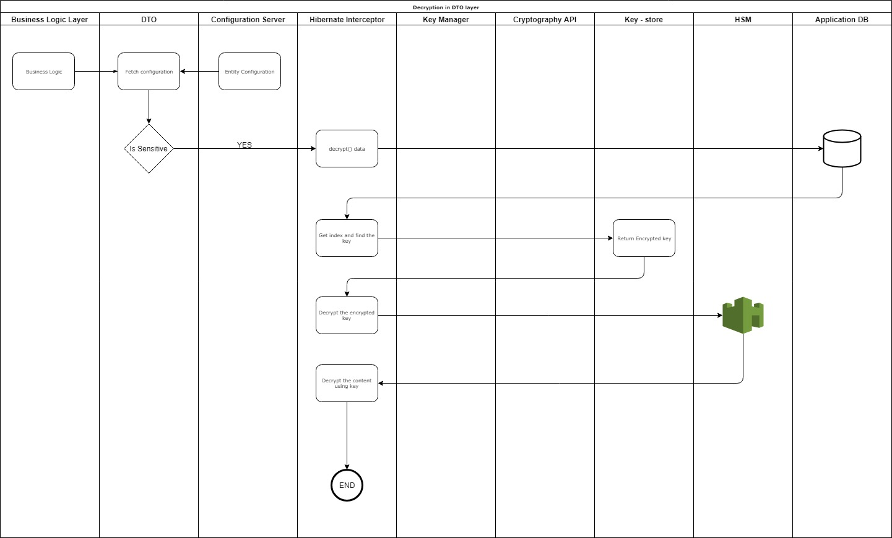

# Encryption in DTO layer

#### Background

The data level encryption is handled in the DTO layer in the application. 

#### Solution

**The key solution considerations are**

- Following are the key considerations of the encryption in the DTO layer, 

	- The data are classified into, 
		- Sensitive
		- Non-Sensitive 
	- The Sensitive data is encrypted in the DTO layer.
	- AES-256 algorithm is used for the encryption. 
	- The data are classified and kept in the configuration file. The application layer reads this configuration and the sensitivity property is injected to the DTO layer. 
	- Hibernate interceptors are used to intercept the fields in the DTO layer. 
	- During reading of these fields, once again Hibernate interceptors are called to decrypt the data.
        - The key expiration is in-built to the key store.

- Following are the various components in the system, 
	- Keys are stored in "Key Store". This is a database table in which the keys are maintained along with the index. 
	- Indexes are persisted in a separate store. When a request comes to a system to encrypt, the current index is retrieved and using this index, the key for encyrption is took. Indexes are stored along with the encrypted data as the prefix separated by colon. For example, 4:sdf*)(8S@#YFLSJ&*hfdlkj23h
	- Scheduler runs a job on some specific time, when the necessity of re-encryption arises. 
	- HSM devices are used to store the Master keys. These master keys are used to encrypt the keys in the Key store. 
	
- Encryption:
	- The properties in the entities which are supposed to be encrypted are configured in the config server.
	- During the encryption, a listener is installed in the DAO layer to intercept the incoming entity objects. If those property are supposed to be, encrypted or not, is received from the config server. 
	- The data is encrypted and prefixed with the index of the key, which is used for the encryption, and stored in the data store. 
	- The key itself is encrypted with the master key from HSM and stored in a separate data store. 
	- The index is incremented, if the old index is expired. 
	
**Encryption**

		

- Decryption:
	- When a request is received, the DTO fields are checked for the sensitivity, from the config server.
	- If the DTO field is sensitive, the decryption() method is called. 
	- During the decryption, the index is calculated by the delimiter. This index is used to find the Key, which was used for the encryption. 
	- The Key itself have to decrypted by the master key from HSM, before decrypting the content. 
	
**Decryption**

	
	

- Key rotation
	
	- On Demand:
		- The keys are stored with the expiry date. 
		- When a request comes to the system, the key is checked for the expiry. 
		- If the old key had expired, then a new index is generated and persisted in the Indexes. If there is no key exists in the Key store, a new key is created for the encryption. And the new key is used for further encryptions. 
	- Bulk:
		- There are times, that the total encrypted data are re-encrypted again. A scheduler is maintained to oversee this. During the scheduled time, the encrypted data is read and re-encrypted once again and saved. The newly encrypted data will have the new index in front of the encrypted content separated by a delimiter. 
		- Bulk mode is used to removed the expired keys and data is encrypted with the new key.

		

- <TODO:> How do we handle failures during the bulk re-encryption?
- <TODO:> How to handle the load, if it is extremely high?