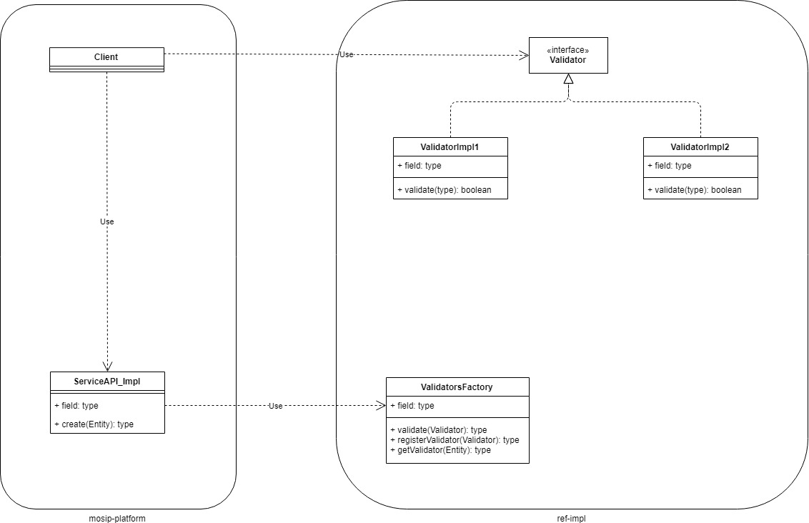

# Generic Master Data

## Background
There can be new master data added to the system. The common service API can cater to the fetch operations of the master data. This API accepts the entity and the selection criteria as input and returns back the necessary master data.

## Solution
**The key solution considerations are**

Following are the key considerations for the generic master data functionality, 

### Fetch master data

#### Common Fetch API
* The fetch service API accepts the ENTITY  in the HTTP Request body.
* Along with the Entity name, the set of query parameters are also passed in the HTTP request body. This is used as the CONDITION for the query.
* The OPERATORS in the CONDITION is passed in the parameters. For example, =, !=, >, < etc.,
* Also the necessary CLAUSE OPERATORS are passed. For example, AND, OR, NOT etc., 

I/p:
	Entity name. Eg., table_name
	Condition & Operators. Eg.,  date > '12-oct-2019'
	Clause operators. Eg., AND

Please refer the [API spec](Generic-Master-Data-API.md) for further details. 

## Criteria and Limitations

i. Following data types are supported, 
	i. string
	ii. int
	iii. boolean
	iv. date
ii. Following are the OPERATORS in CONDITION are supported, 
	i. EQUALS
	ii. GREATER THAN
	iii. LESS THAN 
iii. Following are the clause operatos are supported, 
	i. AND
	ii. OR
iv. Return JSON will be of flat structure. No nested structure is supported.
v. Return JSON structure will not have any types such as number, boolean or string.

## Addition of new master data
* Database
	* New Database tables and constraints have to be added in the database
* Service API
	* No Change
* Data API
	* New validators have to be developed for the business level validations by the developer
	* These validators have to extend the default validators and inject to the Generic entity.

## Custom Validators
* In case is any body wants to introduce a business validation, one has to extend the generic service API and have to inject the dependency of the Validator. To do this, the developer implements a Validator interface. Then for a specific entity, an implementation is created from Generic entity and injects the validators. 
* The custom validators are placed in a separate respository of the ref-impl.
	
	