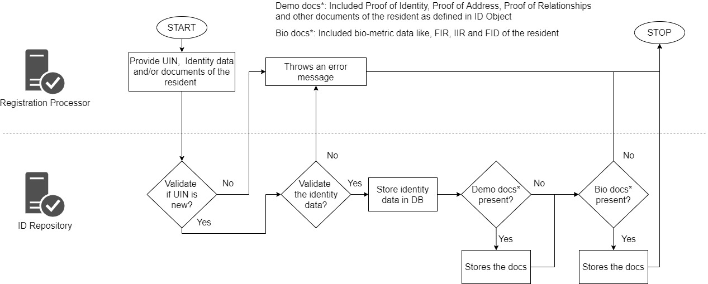
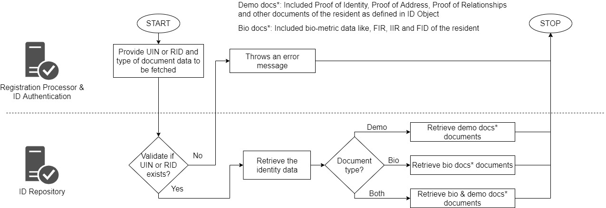
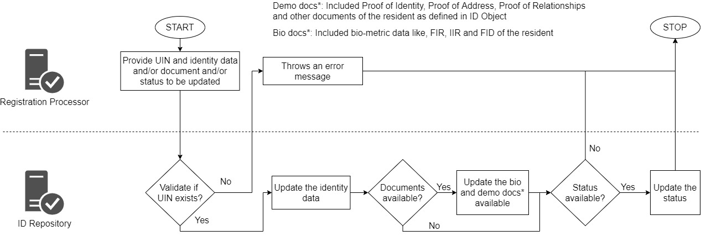
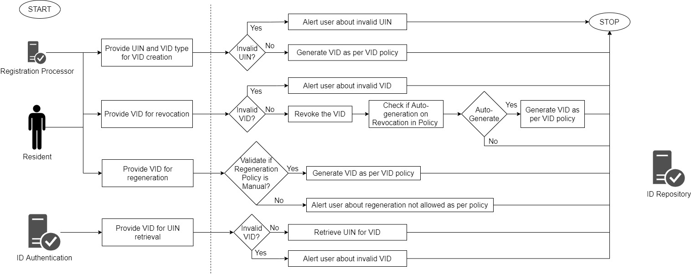

# Overview

ID Repository contains the record of identity for an individual, and provides API based mechanism to store, retrieve and update identity details by other MOSIP modules. ID Repository is used by: 
* Registration Processor
* ID Authentication
* Resident services

#  Key Features 

* Store identity information for a given UIN.
* Update identity information partially or status of UIN.
* Read identity Information associated with a valid UIN.
* Read identity Information for a given RID.
* Check status of UIN for validating a UIN.

The identity data stored inside the ID Repository is encrypted. This is the most critical storage repository and is configured keeping the following non-functional aspects in mind:

* Scalability 
* Performance
* High availability

#  ID Repository functionality

## Store identity data and documents 

Upon receiving the request to store identity details of an individual, the system validates input ID attributes in the request against MOSIP ID defined for the country.

1. Stores ID JSON, biometric documents, proof documents of an individual generated during registration.
1. On successful storage of identity for an individual, status of UIN of the individual by default is marked as 'ACTIVATED'.

## Retrieve stored identity details by UIN or RID 

Upon receiving a request to retrieve identity details of an individual based on input UIN or RID and type as an optional parameter, the system performs the following steps:

1. Validates if input UIN is 'ACTIVATED'.
1. Retrieves latest ID attributes of the individual.
1. The system retrieves and sends demographic or biometric details or both. 

## Update identity data and documents 

Upon receiving a request to update identity details of an individual, the system performs the following steps:

1. Validates if input UIN is 'ACTIVATED'
1. Updates input ID attributes of the individual.
1. Updates demographic/biometric/both 
1. Updates status of UIN as 'DEACTIVATED' or 'BLOCKED' if requested.
1. Sends the response with updated ID details of the individual.

## De-activate/re-activate UIN and its associated VIDs 

An individual's UIN/VIDS can be de-activated or re-activated.  

## Lock/Unlock of authentication types

An individual can lock or unlock a particular authentication type using resident services, for example, locking demographic and/or biometric authentication, the system locks the requested authentication type after certain validations. After the requested authentication type is locked for the individual, then he/she will not be able to authenticate himself/herself by using locked authentication type. Similarly, the individual can choose to unlock these authentication types.

# Process flow

## Identity service - Store identity data and documents
 

## Identity service - Retrieve stored identity details by UIN or RID 
 

## Identity service - Update identity data and documents 
 

## VID service
 

# Logical view

# Services

The services, code, design and documentation are available in [commons repo/id-repository](https://github.com/mosip/commons/tree/master/id-repository)

# Build and Deploy

Refer to build and deploy instructions in [commons repo/id-repository](https://github.com/mosip/commons/tree/master/id-repository)

# APIs

[ID Repository APIs](ID-Repository-APIs.md)
