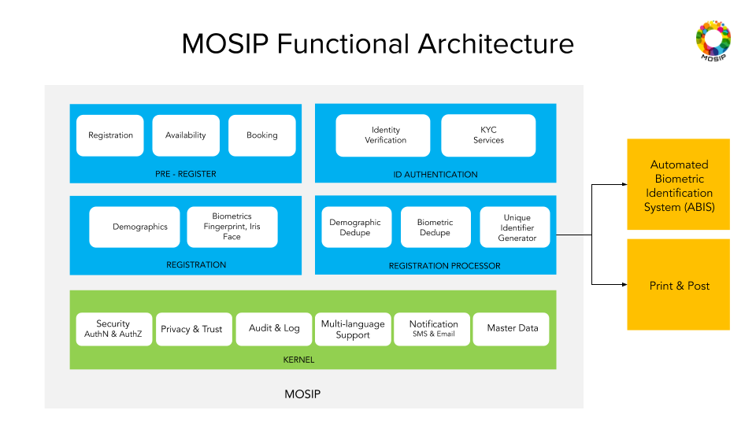

# Architecture Principles
[Architecture Principles](architecture_principles)

# Modules
* [Pre-Registration](pre_registration)
* [Registration](registration_clinet)
* [Registration Processor](registration_processor)
* [ID Authentication](id_authentication)
* [Resident Services](resident_services)
* [Partner Management](partner_management)
* [Admin](admin)

# Functional Architecture

# Logical Architecture

# Data Architecture
[MOSIP Data Architecture](data_architecture)

# Design choices
* Microservice based architecture for all platform services for modularity and scalability.
* Staged Event Driven Architecture (SEDA) for processing Registration data for extensibility.
* Thick client architecture for Registration client

[architecture_principles]:MOSIP-Architecture-Principles.md
[pre_registration]:Pre-Registration.md
[registration_clinet]:Registration-Client.md
[registration_processor]:Registration-Processor.md
[id_authentication]:ID-Authentication.md
[resident_services]:Resident-Services.md
[partner_management]:Partner-Management.md
[admin]:Admin.md
[data_architecture]:MOSIP-Data-Architecture.md