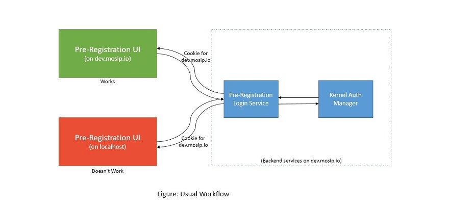
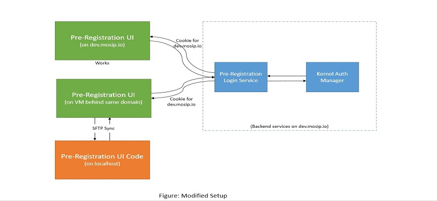

# Pre-Registration UI (Developer Enviornment Setup)
Pre-Registration UI (Developer Enviornment Setup)
This document will help you in setting up the development environment for Pre-registration UI.
## Problem: 
The problem that we face through the usual local Angular development is that our backend services are deployed for a developer environment on a domain such as https://mosip.io/... So the authentication services generate cookies for the mosip.io domain. So when we connect our localhost code to mosip.io it fails on the authentication stage as cookies generated for some domain can not be used in other domain.



## Solution:
The solution involve creating a Virtual Machine behind same proxy/domain (such as mosip.io) and running our development angular code into that machine so that it get hosted on the same domain as the domain of our backend services. Since we wanted to do the development on the local laptop, we can sync our local code with the code of that virtual machines. So whenever we are doing any change in the local system, it will get updated in the VM and in turn will be available on the same domain instantly.



## Steps to follow - 
1. First create a virtual machine and create a folder for your Angular Code (for e.g. pre-reg-ui-dev).
2. Now in your local system MS Visual Studio Code, download SFTP plugin v1.12.7 (https://marketplace.visualstudio.com/items?itemName=liximomo.sftp). This plugin will help us in doing sftp sync.
3. Now configure SFTP plugin to sync up Pre-registration UI with your remote folder created in the VM. So that every file change (or file save) get reflected in the remote automatically.
4. Now come to remote repository and run this command
    ```
     ng serve --port 9094 --host 0.0.0.0 --base-href . --disable-host-check
    ```
5. Now your Angular code is running on port 9094 of that VM.
6. Next step is to map this VM IP along with Port number on the proxy server of your domain. So that this service is accessible on your domain (such as dev.mosip.io/pre-reg-ui-dev). Now this live development site is available to access from browser.
7. After the site is open in the browser. Development work can be continued on the local machine. And every file changes will be available on next site refresh.

Note: Since the ng serve is running behind proxy, live reload might not work. Also this process is only for development purpose. Please don't perform actual deployment of the UI through it as above method doesn't provide version controlling.