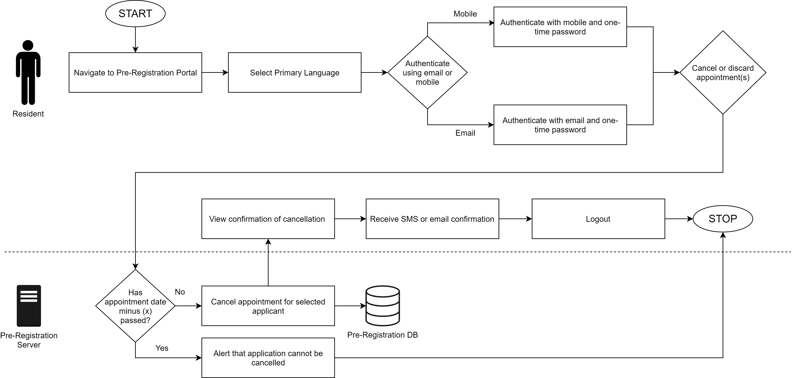

# Overview
This module enables a resident to:

* Enter demographic data & upload supporting documents
* Book an appointment for one or many users for registration by choosing a suitable registration center and time slot
* Receive appointment notifications
* Reschedule and cancel appointments

Resident data is sent to the designated registration center before appointment that can be used during the registration process.

# Detailed functionality

For detailed functionality of Pre-registration features please view our page, [Pre-registration Functionality](Pre-Registration-Functionality.md).

# Process flow

Process flow diagram for create and update flows in Pre-registration.

Process flow diagram for cancel and discard flows in Pre-registration.

# Services

For detailed description of Pre-registration services refer to [pre-registration repo](https://github.com/mosip/pre-registration).

For high level and low level design refer to [pre-registration repo/design](https://github.com/mosip/pre-registration/design)

# Logical View

Below is the diagram for on the logical architecture of Pre-registration,

# Build and deploy
Refer to build and deploy instructions in [pre-registration repo](https://github.com/mosip/pre-registration).

# APIs
For detailed functionality of Pre-registration APIs please view our page, [Pre-registration APIs](Pre-Registration-APIs.md)

# UI Reference Implementation
MOSIP provides a reference implementation of the Pre-registration UI that may be customized as per country needs. The implementation is is available on [ref impl repo](https://github.com/mosip/mosip-ref-impl).
