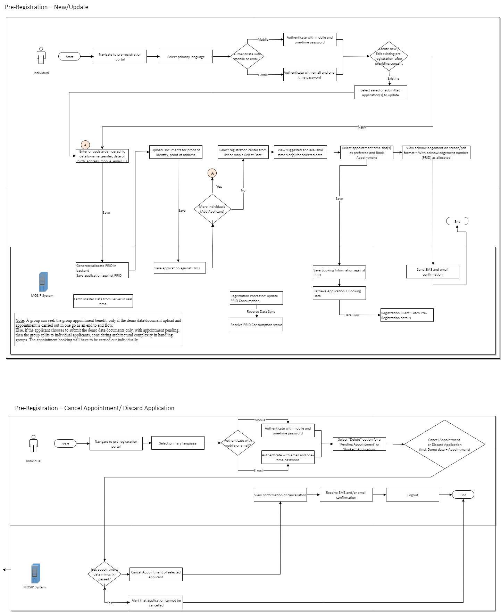

# Overview
Pre-registration is the web channel of MOSIP. This module enables a user to

* Book an appointment for one or many users for registration by choosing a suitable registration center and time slot
* Enter demographic data & upload supporting documents
* Receive appointment notifications
* Reschedule and cancel appointment

Resident data is sent to registration center before appointment, which can be used during registration.

# Detailed functionality
[Pre-Registration Functionality](Pre-Registration-Functionality.md)

# Process Flow

# Build 
Refer to build instructions in [pre-registration repo](https://github.com/mosip/pre-registration).

For deploying, refer [here](Build-and-Deploy#Deploy).
  
# Pre-Registration APIs
[Pre-Registration APIs](Pre-Registration-APIs)

# Pre-Registration UI Reference Implementation
MOSIP provides a reference implementation of pre-registration UI that may be customised as per country needs. The implementation is available in [ref impl repo](https://github.com/mosip/mosip-ref-impl).
