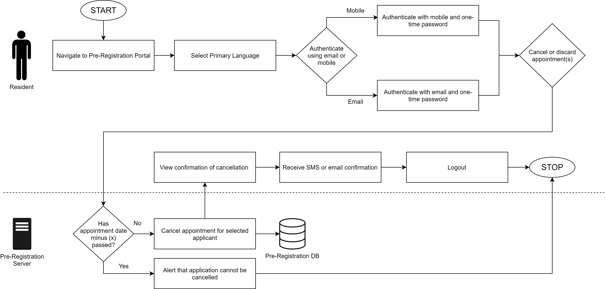

# Pre-Registration

## Overview

This module enables a resident to:

* Enter demographic data & upload supporting documents
* Book an appointment for one or many users for registration by choosing a suitable registration center and time slot
* Receive appointment notifications
* Reschedule and cancel appointments

Resident data is sent to the designated registration center before appointment that can be used during the registration process.

## Detailed functionality

For detailed functionality of Pre-registration features please view our page, [Pre-registration Functionality](Pre-Registration-Functionality.md).

## Process flow

Process flow diagram for create and update flows in Pre-registration.

 (1).png>)

Process flow diagram for cancel and discard flows in Pre-registration.

## Services

For detailed description of Pre-registration services refer to [pre-registration repo](https://github.com/mosip/pre-registration).

## Logical View

Below is the diagram depicts the logical architecture of Pre-registration,

 (1).png>)

## Build and deploy

Refer to the build and deploy instructions in the [pre-registration repo](https://github.com/mosip/pre-registration).

## APIs

For detailed functionality of Pre-registration APIs please view our page, [Pre-registration APIs](Pre-Registration-APIs.md)

## UI Reference Implementation

MOSIP provides a reference implementation of the Pre-registration UI that may be customized as per country needs. The implementation is is available on [ref impl repo](https://github.com/mosip/mosip-ref-impl).
