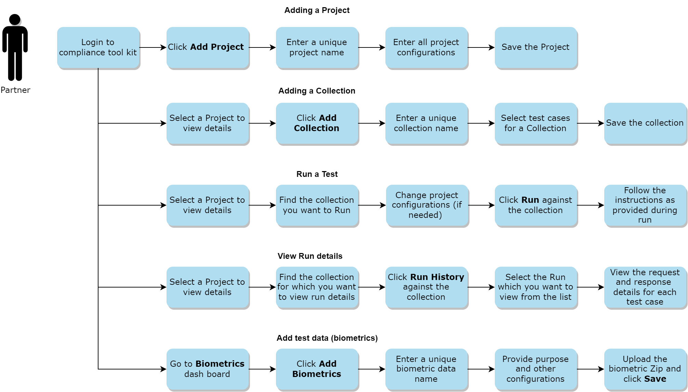
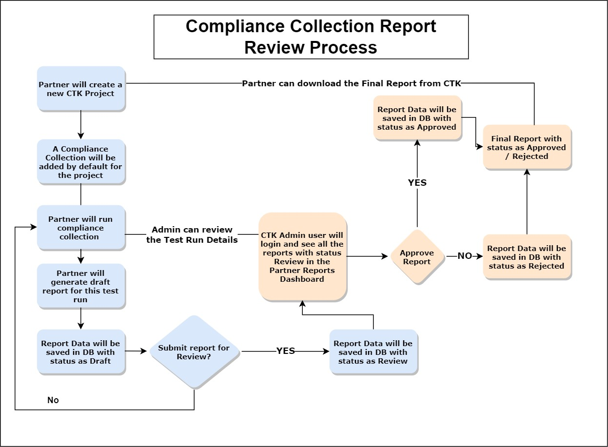

# Overview

Compliance Tool Kit (CTK) is an online portal that can be used by MOSIP partners to test the compliance of their product developed as per specifications (specs) published/adopted by MOSIP.

Currently, CTK supports testing of compliance with the below specifications:

1.  **SBI**: Secure Biometric Interface (SBI) is used to interface with biometric devices. Device partners are required to build a software layer that provides a unified communication protocol for all biometric capture use cases. The specifications that should be followed are defined as Secure Biometrics Interface (SBI) specs. The compliance tool kit ensures that the interface built by the device provider follows the specs, and a certain level of security and integrity is defined in the SBI spec. The device hardware security features are not tested as part of this toolkit.

    CTK also supports the testing with [Android SBI specifications](https://docs.mosip.io/1.1.5/biometrics/mosip-device-service-specification#android-sbi-specification).
2. **SDK**: Biometric Service Providers (BSPs) provide SDK implementation which supports quality check, match, extraction, and conversion of biometrics. MOSIP defines an [iBioAPI](https://github.com/mosip/commons/blob/master/kernel/kernel-biometrics-api/src/main/java/io/mosip/kernel/biometrics/spi/IBioApi.java) as the specification for this SDK implementation. Biometric SDK providers are also required to integrate this [HTTP service](https://github.com/mosip/biosdk-services/tree/release-1.2.0) into their solution. This allows running the SDK as an independent HTTP service. The compliance tool kit would make sure that these interfaces are as per the MOSIP-defined specifications for smooth interaction.
3. **ABIS**: To provide a unique identity for a resident, MOSIP has to ensure that the uniqueness of the resident's biometrics is maintained. To achieve this, MOSIP interfaces with an Automated Biometric Identification System (ABIS) to perform the de-duplication of a resident's biometric data. ABIS is used for 1:N deduplication. MOSIP interacts with ABIS only via message queues. The JSON format is used for all control messages in the queue. ABIS must comply with the interface defined in [ABIS API Specifications](https://docs.mosip.io/1.2.0/biometrics/abis-api).

### How does Compliance Tool Kit work?

* To support compliance with the specifications, CTK has predefined test cases for each of the above specs.
* Each test case is run on a given method of the specs. Each test case defines the attributes required to create the request to be sent to the method.
* Each test case also defines the response expected from the method. In this response, various validators are run. Each validator will perform a predefined check on the response. If all validations are successful, the test case is passed otherwise it is a failed test case.
* Partners can use CTK to run these test cases to check if their implementation adheres to the MOSIP’s specs or not.

<figure><figcaption></figcaption></figure>

### Architecture

The diagram below illustrates the architecture of Compliance Tool Kit.

### Default Collections for CTK

* When a new project is created, two new collections will be automatically added to the project.&#x20;
* The first collection is the **Compliance Collection**, which is applicable for all project types. The second collection is the **Quality Assessment Collection**, specifically for SBI projects.

### Quality Assessment Process (only for SBI)

* The Quality Assessment Collection can be run to collect biometric scores for various groups of individuals (age wise, gender wise, occupation wise etc.).
* The biometric scores will be given using BQAT SDK.
* The scores will be used to perform quality assessment of the SBI partner.

### Compliance Collection Reporting Process (for all project types)

* Partners can run the Compliance Collection and they can generate `Draft Report` for the same.
* After self-review, the partners can submit the Draft Report for review by the CTK Admin.
* CTK Admin can review the partner's test run, project details and all other details before _Approving_ or _Rejecting_ the Report.
* Final report can be downloaded by both, the partner and CTK Admin.

Summarizing as below:

* `Partner > Add Project > Compliance Collection > Run Collection (Test Run) > View Test Run > Download Draft Report > Submit for Review`
* `CTK Admin > View Draft Report / View Test Run > Approve / Reject Report`

<figure><figcaption></figcaption></figure>

### Compliance Tool Kit Portal

To set up the Compliance Tool Kit, refer to [How to set up CTK](setup-steps-0.0.9.md).

To use the CTK portal, refer to the [Compliance Tool Kit User Guide](user-guide.md).

### Build and deploy

To access the build and read through the deployment instructions, refer to the below-mentioned READMEs:

1. [Compliance Tool Kit README (backend)](https://github.com/mosip/mosip-compliance-toolkit/tree/develop#readme)
2. [Compliance Tool Kit UI README](https://github.com/mosip/mosip-compliance-toolkit-ui/tree/develop#readme)

### Configurations

For details related to the Compliance Tool Kit configurations, refer [Compliance Tool Kit configuration document](https://github.com/mosip/mosip-compliance-toolkit/tree/0.0.9-B1).

### Developer Guide

To be able to add new test cases to CTK, refer to [How to add more test cases](test-cases.md).

### Source code

To access the source code for Compliance Tool Kit, refer,

* [Compliance Tool Kit Backend](https://github.com/mosip/mosip-compliance-toolkit/tree/0.0.9-B1)
* [Compliance Tool Kit UI](https://github.com/mosip/mosip-compliance-toolkit-ui/tree/0.0.9-B1)
