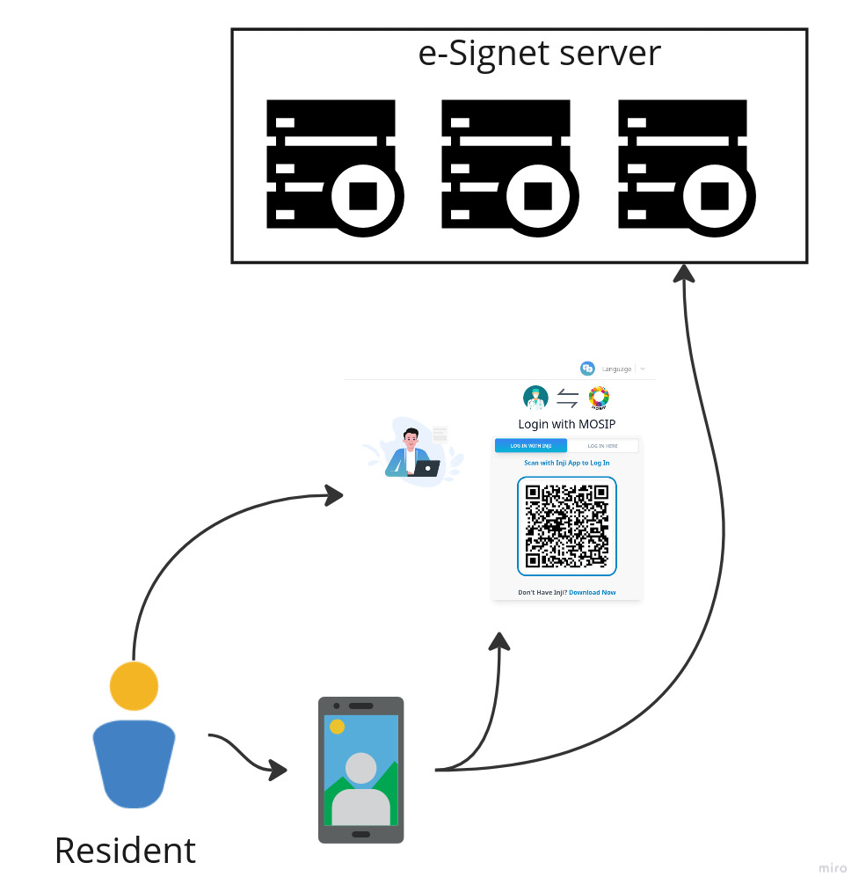
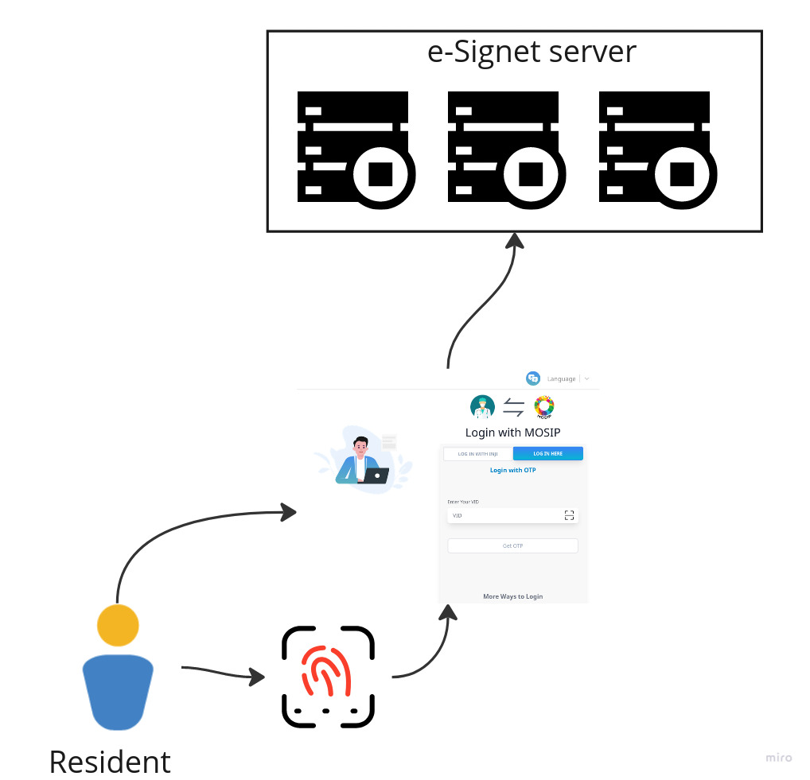

# 🌐 eSignet

In today’s digital-first world, most services are transitioning online, making a secure and trusted digital identity more important than ever. A secure and trusted digital identity is crucial to facilitate personalized access to these online services.&#x20;

**eSignet** strives to provide a user-friendly and effective method for individuals to authenticate themselves and utilize online services while also having the option to share their profile information. Moreover, eSignet supports multiple modes of identity verification to ensure inclusivity and broaden access, thereby reducing potential digital barriers.

Additionally, eSignet offers a seamless and straightforward solution for incorporating an existing trusted identity database into the digital realm. By enabling digital identities and providing identity verification and service access, eSignet delivers a sophisticated and user-friendly experience.

#### **Addressing Privacy & Inclusivity**

While existing verification methods offer security, they often lack inclusivity and do not fully address privacy concerns. At eSignet, we are continuously exploring ways to **bridge the digital divide** while prioritizing **user privacy and control** over personal data.

👉 Learn more about[ **identity verification**](https://docs.esignet.io/glossary#identity-verification) methods.\
👉 Explore[ **Inji** ](https://docs.inji.io/)to understand modern verification techniques using verifiable credentials for decentralized authentication.

The images below depict the eSignet user login process, showcasing different authentication methods:

 

#### **What can eSignet be used for?**

✅ **Seamless Login:** eSignet is a reliable login provider for a relying party application that allows access to the service without the need for additional login credentials.

✅ **Identity Verification:** eSignet also offers a secure method for verifying an individual's identity against trusted identity providers such as national identity databases, driver's license systems, passport systems, or other reputable sources. The level of assurance is determined by the authentication factor utilized, with biometric authentication providing an added layer of user presence confirmation.

✅ **Consented Data Sharing:** Additionally, eSignet facilitates consented data sharing for profile creation or meeting electronic Know Your Customer (eKYC) requirements for relying parties. When a relying party requests authentication, they can also request a specific set of attributes needed for profile creation or compliance with eKYC norms.

🔒 User data is only shared with explicit consent during the authentication process.

#### **How is eSignet different from other services?**

eSignet re-imagines authentication services to factor in emerging trends and the need for assured digital identities. It brings critical capabilities to the authentication process.

**Key features include:**

* **Seamless integration** - Framework to seamlessly integrate existing identity stores for authentication and KYC (Know Your Customer) requirements.
* **Advanced biometric authentication** - for enhanced security.
* **Comprehensive support** - for wallet-based authentication.

#### Who Can Use eSignet?

eSignet is a contemporary and adaptable system for verifying digital identities. This solution is not involved with the issuance and management of IDs. It is designed to be compatible with any ID repository through a straightforward integration model.&#x20;

**Any ID repository that provides authentication and attribute retrieval capabilities can utilize eSignet with ease!** 🚀&#x20;
