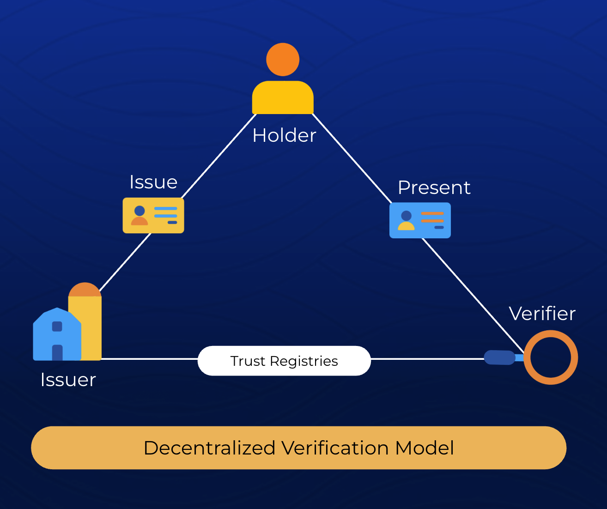

<!--
Content Update
Copied: 13 July 2025
Reviewed and Edited: 13-14 July 2025
-->

# Overviews
Inji  is a verifiable credentialing stack that provides a way to share tamper-proof, instantly verifiable data which is cryptographically signed by a trusted issuer, and users can store them securely on their devices or browsers and share them when needed.

# Inji's "Triangle of Trust" with Verifiable Credentials
The VC model operates on a "triangle of trust" involving three main roles:

* **Issuer**: The entity that issues the credential and makes claims about the subject (e.g., a university issuing a degree, a government issuing a passport, an employer issuing a work permit). The issuer cryptographically signs the VC. Inji's 'Issuance-module' is called [Inji Certify](./inji-certify/overview/README.md).
* **Holder**: The individual or entity which possesses the credential (e.g., the student with the degree, the citizen with the passport, the employee with the work permit). The holder stores and manages their VCs. Inji's 'Holder-module' is called [Inji Wallet](./inji-wallet/inji-mobile/README.md).
* **Verifier**: The entity that requests and verifies the credential to confirm a claim (e.g., an employer checking a degree, a border agent checking a passport, a landlord checking a work permit). The verifier checks the cryptographic proofs to ensure the VC's authenticity and integrity. [Inji Verify](./inji-verify/overview/README.md).

Some everyday examples of 'Verifiable Credentials' include:
* A national ID issued as a digital credential
* A diploma issued by a university
* A background verification report from an employer
* A subsidy or benefit eligibility certificate from a government agency

VCs allow:
* Instant verification, even offline
* User control over when and how data is shared
* Interoperability across platforms and borders
* Reduced fraud and manual checks

For a quick overview of **Inji**, which primarily includes **Inji Wallet, Inji Verify** and the **Inji Certify** as key components, you can watch the video titled _"Inji Stack End To End Use Case Demonstration"._ This video provides a visual walkthrough of the key features and showcases how all modules interact through a persona-based demonstration, highlighting its real-world application. Head to the section titled “_What Does Inji Include_” for a comprehensive overview of how Inji functions, explaining how each component operates independently, while maintaining the interoperability necessary for seamless and secure credential verification.



## Inji’s Key Capabilities
**Secure Issuance**: Issue verifiable credentials with digital signatures, ensuring authenticity.
Cross-Platform Accessibility: Available via mobile app or web interface, ensuring inclusivity for all users.
Privacy-Preserving Sharing: Users control what they share, with whom, and for how long.
Offline Compatibility: Works in low-connectivity or offline environments, critical for inclusion.
Fast, Trusted Verification: Credentials can be verified quickly and securely, even by non-technical service providers.

## Inji Stack Components
Inji Certify – Credential Issuance
Enables trusted entities to issue digitally signed credentials. Supports:

* Multiple formats: JSON-LD, SD-JWT,mDOC and many more.
 A tool that enables issuers to seamlessly connect with existing data sources to issue verifiable credentials.
* Connecting with existing databases and offering configurable credential schemas, it caters to diverse use cases across different sectors and industries.

## Inji Wallet – Credential Holding and Sharing
Empowers users to manage their credentials on different devices:
* Inji Mobile: Android and iOS app to download, store, and present credentials securely
* Inji Web: Browser-based wallet for users without smartphones, offering print and share features

## Inji Verify – Credential Verification
Allows service providers and organizations to:
* Scan and validate credentials
* Check credential status (validity, expiry, revocation)
* Integrate with existing onboarding or service workflows

## Inji Infra – Supporting Infrastructure(Upcoming)
Provides foundational services for:
* Revocation management
* Ledger and credential status checks
* Federation and audit trail support
Inji Govern – Governance and Policy Management(Upcoming)
Manages rules, schemas, and compliance:
* Policy definition for credential lifecycle
* Schema and credential registry management
* Assurance levels for ecosystem participants

# Real-World Applications
Healthcare: Immunization records, medical certification
Education: Degrees, training certificates, and learning records
Social Welfare: Benefit eligibility, ration cards
Finance: KYC credentials, account onboarding
Mobility: Driving licenses, transportation passes
Employment: Job credentials, background checks
Many more……….

# Interoperability and Standards
Inji follows widely adopted open standards, ensuring flexibility and long-term sustainability:
* W3C Verifiable Credentials Data Model
* OpenID for Verifiable Presentation (OpenID4VP)
* OpenID for Verifiable Credential Issuance (OpenID4VCI)
* Claim 169
* ISO/IEC 18013-5: mDoc/mDL
* IETF SD-JWT-based Verifiable Credentials
* W3C based SD-JWT-based Verifiable Credentials
* DID (Decentralised Identifiers) support
* Can interoperate with existing IAM and identity ecosystems

# Component Diagram
This section will contain a clear diagram illustrating the interaction between Inji Certify, Inji Wallet (mobile + web), Inji Verify. The diagram should also show the components involved to build Inji.

## How it works?
* **Issuance**: An issuer creates a digital credential with claims about a subject and cryptographically signs it.
* **Holding**: The signed credential is then given to the holder, who stores it securely in a digital wallet or similar application.
* **Presentation**: When needed, the holder can present the VC (or a verifiable presentation, which can include multiple VCs or selectively disclosed information) to a verifier.
* **Verification**: The verifier uses the cryptographic proofs within the VC to confirm that it was issued by a trusted party and has not been tampered with. This verification often involves checking against a "Verifiable Data Registry" where public keys of issuers are stored.

[inji-home-page-component-diagram](./.gitbook/assets/inji-home-page-component-diagram.png)

# Summary
Inji provides a secure, inclusive, and interoperable solution for issuing and managing digital credentials. By enabling individuals to hold their credentials and share them when needed, Inji supports faster access to services while protecting privacy and reducing fraud.
Whether you are:
* A user needing better control over their identity and credentials,
* An issuer needing to deliver secure digital certificates, or
* A verifier needing reliable proof of information,
Inji offers the tools you need to make digital credentialing simple, trusted, and universal.

<!--

# Inji

In today's fast-paced, interconnected world, ensuring seamless access to essential services—such as healthcare, financial inclusion, global mobility, and social support—has never been more critical. The need for **trusted identity authentication and secure data exchange** is at the heart of accessing these services. Traditionally, individuals have relied on multiple physical identification documents and certificates to prove their eligibility for various rights and services. However, managing physical documents is cumbersome and exposes individuals to risks of loss, fraud, and inefficiencies. Additionally, millions of people remain excluded from the formal economy due to an outdated reliance on paper-based credentials that cannot be verified digitally.

To address this, Inji offers a transformative solution – enabling the secure **issuance, digitalization, storage, exchange and seamless verification of trusted data** as verifiable credentials, through a comprehensive set of tools. By shifting away from physical documents to a digital-first approach, Inji simplifies the process, enhances security, and empowers a digital economy. With Inji, individuals can experience a future where accessing essential services is as simple as a few clicks, reducing the complexity of juggling numerous physical documents while maintaining the highest level of trust and security.

For a quick overview of **Inji**, which primarily includes **Inji Wallet, Inji Verify** and the **Inji Certify** as key components, you can watch the video titled _"Inji Stack End To End Use Case Demonstration"._ This video provides a visual walkthrough of the key features and showcases how all modules interact through a persona-based demonstration, highlighting its real-world application. Head to the section titled “_What Does Inji Include_” for a comprehensive overview of how Inji functions, explaining how each component operates independently, while maintaining the interoperability necessary for seamless and secure credential verification.



#### **Introducing Inji: Enabling User-Centric Digital Credentialing**

Inji, meaning "knowing" or "recognizance" in Korean, is evolving into a comprehensive digital credential stack with a strong focus on user empowerment. Inji simplifies the management and verification of credentials by providing secure solutions that work across multiple interfaces. It aims to streamline the process of creating, sharing, and verifying all types of digital and physical credentials by offering:

* **Secure Issuance of Verifiable Credentials**: Credentials are issued in both digital and physical formats, ensuring they are cryptographically secure and easy to share.
* **User-Centric Credential Management**: Inji empowers individuals by providing them with tools to securely manage and share their credentials.
* **Simplified Instant Verification**: It offers utilities that verify the authenticity of credentials, making the process efficient and user-friendly.
* **Interoperability**: By adhering to global standards like the Verifiable Credentials Data Model (W3C VC) and OpenID for Verifiable Credential Issuance (OI4VCI), Inji facilitates seamless interactions across government, social, and private sectors.

#### **What Does Inji Include?**

Inji provides a complete solution for issuing, managing and exchanging trusted data as verifiable credentials across its entire lifecycle. Key components include:

* **Inji Certify**: **Converting data to trustworthy credentials**, it enables trusted issuers to create, sign, issue, and bind credentials, in multiple formats.
* **Inji Wallet**: **Making data trustworthy and portable**, it consists of two main interfaces that cater to diverse user needs:
  * **Inji Mobile**: A secure, decentralized mobile wallet that enables users to download, manage, share, and verify verifiable credentials directly from their smartphones. This mobile-first approach provides a seamless, trustworthy way to handle credentials on the go.
  * **Inji Web**: A user-friendly web interface that complements the mobile application, allowing individuals without access to smartphones, to manage their credentials through a browser. It provides features to download, print, store, and share credentials physically, ensuring broad accessibility across different platforms.
* **Inji Verify**: **Enabling exchange of trusted data with service providers,** it is an essential tool to verify the authenticity of shared credentials.
* **Inji Infra**: Supports functionalities like revocation, ledger management, status checks, and federation for verifiable credentials.
* **Inji Govern**: Offers a governance framework to define policies, schemas, and assurance mechanisms, ensuring the security and trustworthiness of the ecosystem.

In summary, Inji provides a comprehensive solution that ensures all credential interactions - from issuance to verification - are secure, efficient, and aligned with global standards. This fosters high levels of trust at a low cost, supporting the development of a trusted digital economy. By bridging the gap between traditional and digital systems, Inji establishes a foundation for inclusive, secure, and transparent frameworks, paving the way for a more accessible and digital future for all, thereby ensuring widespread access to essential services.

-->