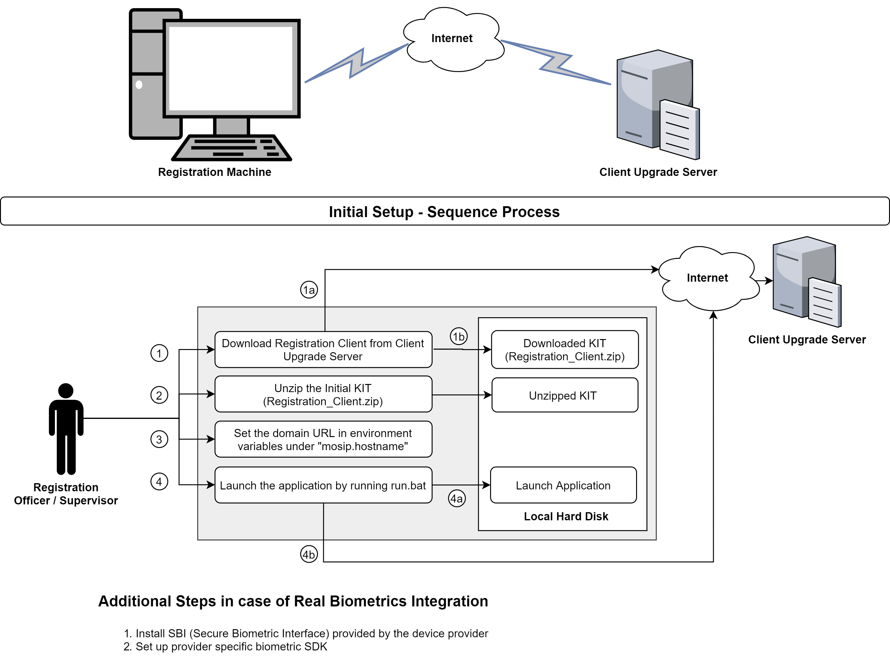

**Registration Client - Installation and Configuration:** 
***

This document contains the 'Registration client (Reg Client App)' application initial setup, update and configuration process.       

Registration Client application is a desktop based application, that can be used to captures the Demographic and Biometric details of an Individual along with supporting information (proof documents & information about parent /guardian /introducer) and packages the information in a secure way using RSA based algorithm. The information packet can be sent to the server in an online or offline mode for processing.  

The Registration client application leverages the TPM capabilities and secure the data and mark the senders identity in the request before sending to external system. The MOSIP server would validate the request and make sure that the request received from the right source. Every individual machine's TPM public key should be registered at MOSIP server to accept and process the data send by them.   

A Trusted Platform Module (TPM) is a specialized chip on a local machines that stores RSA encryption keys specific to the host system for hardware authentication. Each TPM chip contains an RSA key pair called the Endorsement Key (EK). The pair is maintained inside the chip and cannot be accessed by software. By leveraging this security feature every individual machine would be uniquely registered and identified by the MOSIP server component. 

   

## Application Build:  

   JDK 8u181 [Oracle] or later version to Build the application.  
   **Registration client application is built with four different modules.**     
     registration-client - it contains only UI related code.  
     registration-libs - it contains the code to generate the initial run.bat.   
     registration-MDM-service - Mosip Device Manager service to integrate with BIO device and render the required data in a standard format and that will be consumed by the 'registration-services' module.   
     registration-services - it contains the Java API, which would be called from UI module to render the services to the User and capture the detail from User and store it in DB or send to external systems through services.    

   **Following files to be modified before building the application:**    
     -  spring.properties - [registration-services module] - It contains the environment based REST client URL to make different service calls and all the required properties.  
	 -  mosip-application.properties - [registration-libs module] - It contains Reg-Client Download , Configuration URL and Properties to check application online/offline status and Reg client download url from JFrog repository and all the required properties.
     -  As part of the Jenkins, the required environment should be passed as run time argument **environment** for the build. Ex: "mvn clean install -Denvironment=mosip.hostname".
     -  Post completion of above-mentioned changes, build 'mosip-parent' pom.xml file to build the application.  
     -  Make sure that 'maven-metadata.xml' is generated under the '**registration-client**' module, post successful build generation. Which is referred by the reg-client application to download the required jars based on the version.   
     - Post-build process 'META-INF.MF' file also should be present in the Secure JFROG repository[Https --> Hostname], which consists of the jar files checksum.   

## Prerequisites:  

**System Prerequisites:**  
   - CPU - Dual Core Processor - 2GHZ  
   - Ram - 16 GB  
   - Local Storage Disk Space - 500 GB 
   - USB 2.0 ports or equivalent hub.  
   - Physical machine with TPM 2.0 facility.   
   - Windows OS [10 v] 

**Application Prerequisites:**  
   Before running the 'Registration client' application, following prerequisites to be completed.

   - Before building the 'registration-services' module, all the external [dependent services](#dependent-services-) URLs should be configured in the **'spring.properties'** and **'mosip-application.properties'** files.     
   - [Property file](#property-file-) - **[spring.properties]** should be updated with right environment [env] and other detail.     
   - All **Master data** should be loaded at MOSIP kernel database [Refer MOISP document](https://github.com/mosip/mosip-docs/wiki/Getting-Started#7-configuring-mosip-).    
   - User, machine, center mapping, and all other required table and data setup should exist in MOSIP kernel database along with the profile and desired roles configuration in LDAP server.    [This is required until the Admin module is delivered. Post-delivery, all the configuration can be done through the Admin module.]   
   - User's machine should have online connectivity to access the Secure JFrog artifactory repository[Https --> Hostname], where the application binaries are available.   
   - If TPM enabled, a logged-in user to windows machine should have permission to get the public key from TPM device.  
   - The initial DB embedded with the setup process should contain all the required tables along with the data for few tables.    
   - Through the sync process, the data would be updated into the local database from the server.  
   - All the required [dependent services](#dependent-services-) should be installed, up and running before running the client application.    
        
## Anti Virus - ClamAV Setup and Configuration in local machine: 

   Installation of Open Source Anti Virus Software [ClamAV]:  
   1.	Download the ClamAV (Version: 0.101.2) Anti Virus Software - [link](http://www.clamav.net/downloads)  
   2.	Install the downloaded .exe file.  
   	
   **ClamAV Config Setup:**     
    1. Rename the **clamd.conf.sample** to **clamd.conf** from the installed directory of ClamAV.   
        Ex: C:\Program Files\ClamAV\conf_examples\clamd.conf.sample file   
            save as  C:\Program Files\ClamAV\conf_examples\clamd.conf   
    2.Rename the **freshclam.conf.sample** to **freshclam.conf** from the installed directory of ClamAV.  
        Ex: C:\Program Files\ClamAV\conf_examples\ freshclam.conf.sample file  
            save as C:\Program Files\ClamAV\conf_examples\ freshclam.conf  
    3.Comment the line# 8(Example) in both the files  
    4.Download the Antivirus database from the following urls and placed it in the database folder(C:\Program Files\ClamAV\database)  
       - http://database.clamav.net/main.cvd  
       - http://database.clamav.net/daily.cvd  
       - http://database.clamav.net/bytecode.cvd  
    5. Update Config files:  
    **clamd.conf file changes:**  
      1.	Uncomment LogFile "C:\Program Files\ClamAV\clamd.log"(Line 14)
   
    **freshclam.conf file changes:**  
     Uncomment the below mentioned lines in the file,  
    1.	DatabaseDirectory - "C:\Program Files\ClamAV\database"(Line 13)  
    2.	UpdateLogFile     - "C:\Program Files\ClamAV\freshclam.log"(Line 17)  
    3.	DatabaseMirror    - db.XY.clamav.net(Line 69)  change XY to our country code [Eg: IN]
    4.	DatabaseMirror    - database.clamav.net(Line 75)   
    5.	Checks 24(Line 113)  
    6.	LocalIPAddress aaa.bbb.ccc.ddd(Line 131)  change to our machine IP address   

   **Once all the Configurations are done run the freshclam.exe and then run clamd.exe. If required, restart the machine.**   
 
## Registration Client installation:  

**Download - Application Initial Setup file:**  
   
   1. User login to the Secure JFROG artifactory[Https --> Hostname] portal and download the client application initial setup ZIP file [mosip-sw-0.12.*.zip].   
   2. Once downloaded then unzip the file into a particular location. It contains the following folder structure.  
      - bin: It contains the client UI and service binaries in an encrypted format.
      - lib: It contains the library required for the application to run.  
      - cer: It contains the certificate used to communicate with the MOSIP server.  
      - db: It contains the encrypted derby database.   
      - run.bat: batch file to launch the application.  
      - jre: It contains the java runtime engine along with the required DLLs. 
      
   3. Click the 'run.bat' to initiate the setup process.  
   
   When the user clicks on the 'run.bat' it does the following :  
   1. Loads the binary repository URL from a property file.  
   2. Communicate with the  Secure JFrog repository[Https --> Hostname] through a secured connection and download the maven-metadata.xml file to identify the latest jar versions.    
   3. Download the latest build Manifest.mf file from the server, where all the jars (including shared lib) name and checksums are provided.  
   4. Compare the checksum of the local version of jar files with the data present in the latest downloaded Manifest.mf file.    
   5. Identify the list of binary files and Download the required jars.  
   6. Once download completed then communicate with TPM to decrypt the key{if TPM enabled}, which is used to decrypt the UI and service jars and start the application.   
   
**Application Startup:**  
   - User should initially be online to validate their authentication against the MOSIP server. Post which, the sync process would be initiated.     
   - Once the sync process completed then restart the application to pick the local configuration.  
   - User should perform the self onboarding before start using the application.  

## Update Process: 
   The application refers to the 'maven-metadata.xml' to verifies any new version exists or not. [Which is generated under 
   the '**registration-client**' module post successful Jenkins build.]
   
   mosip.rollback.path - Make sure that the rollback path is provided in this variable, which is available in 'spring.properties' file; as part of the **registration-services** module. 
       
   **Application update:**
   - During the startup of the application, the software check will be validating against the maven-metadata.xml file from artifactory repository. If any diffs found, the application prompts the user with 'Update Now' or 'Update Later' options to install immediately or later. Apart from this, there is another menu option available in the application to trigger the 'Update' process post login to the application. The update process would update both the application binaries and DB.
    
   - During the update process, the running application refer to the 'rollback' path and take the back up of 'lib, bin, MANIFEST.MF' files inside rollback folder with the new folder as 'Version_timstamp' format. 
   - Download and Update the required binary libraries and DB script into the existing running folder and restart the application.  
        
   **Database update:**  
   - The database update can be rolled out through the binary update process. If any changes in the script then the respective script would be attached inside 'registration-service/resource/sql/version folder [like: 0.12.8]' and deliver the jar with the newer version. During the update process, the jar would be downloaded and script inside the jar would be executed.  It would also contains the 'rollback' {registration-service/resource/sql/version folder_rollback [like: 0.12.8_rollback]} script if update process to be rollbacked due to any technical error.  

## Configuration:  

   The application provided with the facility of multiple configurations for a different set of parameters. Each attribute level configuration changes should be performed at 'Config' server and same should be sync to the local machine through kernel services.  Here few of the configurations are listed out that provide the facility to enable and disable the biometric. 

Refer the configuration maintained in [QA](https://github.com/mosip/mosip-configuration/blob/master/config/registration-qa.properties) environment. 

|**S.No.**| **Config Key**| **Sample Values**|**Description**|
|:------:|-----|---|---|
|1	.|	mosip.registration.fingerprint_enable_flag                            | y	/ n			| To disable the fingerprint capture. |	
|2	.|	mosip.registration.iris_enable_flag                                   | y	/ n			| To disable the IRIS capture. |	
|3	.|	mosip.registration.face_enable_flag                                   | y	/ n			| To disable the Face capture. |	
|4	.|	mosip.registration.document_enable_flag                               | y	/ n			| To disable the document capture. | 	
|5	.|	mosip.registration.iris_threshold									   | 0 - 100				|	
|6	.|	mosip.registration.leftslap_fingerprint_threshold                      | 0 - 100				|	
|7.|	mosip.registration.rightslap_fingerprint_threshold                 | 0 - 100				|	
|8.|	mosip.registration.thumbs_fingerprint_threshold                    | 0 - 100					|	
|9	.|	mosip.registration.num_of_fingerprint_retries                          | 3				|	
|10	.|	mosip.registration.num_of_iris_retries                                 | 3				|	
|11	.|	mosip.registration.supervisorverificationrequiredforexceptions         | true			| To capture Supervisor approval for exception case. |
|12	.|	mosip.registration.gpsdistanceradiusinmeters                           | 3				|	
|13	.|	mosip.registration.packet.maximum.count.offline.frequency              | 100			| No. of packets can be created in offline mode. |	
|14	.|	mosip.registration.user_on_board_threshold_limit                       | 1				| No. of biometric required to be captured. |	
|15	.|	mosip.registration.finger_print_score                                  | 100			|	
|16	.|	mosip.registration.pre_reg_no_of_days_limit                            | 5				|	
|17	.|	mosip.registration.reg_pak_max_cnt_apprv_limit                         | 100			| Max No. of packets waiting for approval.	|
|18	.|	mosip.registration.reg_pak_max_time_apprv_limit                        | 30				| Max time wait for approval in mins. |	
|19	.|	mosip.registration.eod_process_config_flag                             | y	/ n			| Enable/ Disable EOD process. |
|20	.|	mosip.registration.invalid_login_count                                 | 3				| 	
|21	.|	mosip.registration.invalid_login_time                                  | 2				|	
|22	.|	mosip.registration.gps_device_enable_flag                              | y	/ n			| Enable / Disable GPS |	
|23	.|	mosip.registration.uin_update_config_flag                              | y	/ n		    | Enable / Disable update feature. |
|24.|	mosip.registration.lost_uin_disable_flag                    |  y	/ n| Enable / Disable Lost UIN functionality. |
|25.|	mosip.registration.webcam_name                           |logitech|
|26.|	mosip.registration.document_scanner_enabled				|no|
|27.|	mosip.registration.send_notification_disable_flag        |y	/ n| Enable/ Disable additional notification. |  
|28.|	mosip.registration.onboarduser_ida_auth        |Y	/ N| To enable the bio auth validation during user 'On Boarding' process and validated against the IDA Auth service. | 

Refer the **Global configuration** maintained in [QA](https://github.com/mosip/mosip-configuration/blob/master/config/application-qa.properties) environment. 

|**S.No.**| **Config Key**| **Sample Values**|**Description**|
|:------:|-----|---|---|
|1.|	mosip.primary-language        |fra / ara/ eng| French/ Arabic/ English |  
|2.|	mosip.secondary-language        |fra / ara/ eng| French/ Arabic/ English |

**TPM [Trusted Platform Module]:**  

   To enable or disable the TPM functionality, modify the mentioned key in 'registrtaion-services/src/main/resources/spring.properties' file.    
    - mosip.client.tpm.registration = { Y - to enable the TPM, N - to disable the TPM}.

**MDM [Mosip Device Manager] Service:**  
   It integrates the Registration application with Bio-devices [IRIS/ Finger Print/ Face]
   
|**S.No.**| **Config Key**| **Sample Values and Description**|
|:------:|-----|-----|
|1.|	mosip.mdm.enabled=N        | Y - Enable , N - Disable |  
|2.|	mosip.reg.mdm.server.port=8080        | To run the MDM service in local machine's port.  |

## Real biometric service installation to windows.
Please refer to the detailed [**Real-bio-metric-service-integration**](Registration-client---Real-bio-metric-service-integration.md)

**Network Connectivity Check:**  
   Registration client verifies the below-configured URL to check whether the system is in online or not. The application uses this URL to perform the health check before communicating with the external services.
   
|**S.No.**| **Config Key**| **Sample Values and Description**|
|:------:|-----|-----|
|1.|	mosip.reg.healthcheck.url={URL} | Ex: https\://domainname.com/v1/authmanager/actuator/health |  

	
## Property File :

   Property attributes and the respective sample values are provided below. Before building the **registration-services**, the required below properties needs to be changed.
   
   **File Location:** registration-services/src/main/resources/spring.properties       
     - mosip.reg.logpath=../logs  
     - mosip.reg.packetstorepath={where the registration packet should be stored}. 
     - mosip.reg.healthcheck.url={Application uses this url to perform the health check before communicating with the external services. Default value: https://${environment}/v1/authmanager/actuator/health }  
     - mosip.reg.rollback.path={where the application backup should be taken during software update} [Default: ../BackUp]  
     - mosip.reg.db.key={contains the key to be used to connect to the derby database and decrypt the data}. 
     - mosip.reg.cerpath=/cer//mosip_cer.cer
     - mosip.reg.xml.file.url={Secure JFrog repository[Https --> Hostname] url with maven-metadata.xml file.}  
     - mosip.reg.dbpath=db/reg
     - mosip.reg.app.key={contains the key to be used to decrypt the application binaries during run time}.  
     - mosip.reg.client.tpm.availability={ Y - to enable the TPM, N - to disable the TPM, default N}.

**File Location:** /registration-libs/src/main/resources/props/mosip-application.properties 
     - mosip.reg.client.url={Reg client download url from JFrog }
     - mosip.reg.logpath=../logs  
     - mosip.reg.packetstorepath={where the registration packet should be stored}. 
     - mosip.reg.healthcheck.url={Application uses this url to perform the health check before communicating with the external services. Default value: https://${environment}/v1/authmanager/actuator/health }  
     - mosip.reg.rollback.path={where the application backup should be taken during software update} [Default: ../BackUp]  
     - mosip.reg.db.key={contains the key to be used to connect to the derby database and decrypt the data}. 
     - mosip.reg.cerpath=/cer//mosip_cer.cer
     - mosip.reg.xml.file.url={Secure JFrog repository[Https --> Hostname] url with maven-metadata.xml file.}  
     - mosip.reg.dbpath=db/reg
     - mosip.reg.app.key={contains the key to be used to decrypt the application binaries during run time}.  
     - mosip.reg.client.tpm.availability={ Y - to enable the TPM, N - to disable the TPM, default N}.   
     	    	
     	
## Dependent Services :    

   In Registration client application, only user mapping to the local machine can be performed. Rest of the data setup should be performed at MOSIP Admin portal.
Through sync process the data would be sync between local machine and server based on machine's mac-id and center id.  There are other services are available to send the created packet from local machine to remote system.   

|**S.No.**| **Service Name**| **Service Description**| **Module Name**|
|:------:|-----|---|----|
|1	.|	User Detail Sync  | To synchronize the user related information. Without this sync user can't login to the application. | Kernel|
|2	.|	User Salt Sync  | User's password is validated using this salt. Without this sync user can't login to the app.  |Kernel|
|3	.|	Master Data Sync  | Reg. client application related master data are sync from server using this sync. Without this sync, the app won't work. |Kernel|
|4 	.|	Application configuration Sync  | Reg. client app related dynamic configuration parameters are sync from server. Without this sync, the app won't work.|Kernel|
|5	.|	Policy Sync  | Sync the key required for packet creation based on center and machine id. Packet can't be created without this sync.|Kernel|
|6	.|	MOSIP public key Sync  | To synchronize the MOSIP public key, which is used during response sign validation. |	Kernel|
|7	.|	Pre-registration Data Sync  | To download the center specific pre-registration packet data based on date range. |Pre-Registration|
|8	.|	Packet Sync  | To upload the list of packet related information before uploading actual packet. Without this sync, the packet can't be uploaded to the server .|Registration-Processor|	
|9	.|	Packet Status reader  | At regular interval read the status of the uploaded packet and update the same in local db. |Registration-Processor|
|10	.|	Packet Upload  | To upload the packet generated out of New/ Lost UIN / Update UIN process to MOSIP server. |Registration-Processor|
|11	.|	Send OTP  | To send OTP message to the user's mobile no. during authentication process. |Kernel|
|12	.|	Auth Service - UserName and Password  | To get the auth token based on user provided user name and password. This token would be attached in the request while making any service calls in the same user context. |Kernel|	
|13	.|	Auth Service - UserName and OTP | To get the auth token based on user provided user name and OTP. |Kernel|
|14	.|	Auth Service - Client id and Secret Key  | To get the auth token based on client id and secret key. |Kernel|
|15	.|	Validate / Invalidate auth Token  | To validate and invalidate the generated token. |Kernel|
|16	.|	Notification Service (SMS / EMAIL) | To send notification through SMS / Email channel at the end of Registration process. |Kernel|	
|17	.|	ID-Authentication API | To on board the user based on user's bio authentication. Without this service, user onborading screen won't work if bio auth enabled. |ID-Authentication|

   
   
## External hardware Driver(s): 

   This section covers the list of drivers required to communicate with the external devices.  
   - To integrate with Scanner, windows WIA libraries are used. So, the respective service should be running and also the scanner specific driver should also be installed.  
   - The application has been currently tested with CANON LiDE 120.  
   - Printer should be available to take the print out from application and the respective driver should be installed.    
   - Camera and the respective driver should be available to capture the applicant photo. Application tested with Logitech camera.  
   - If GPS enabled through configuration then the respective device/ model specific driver should be installed to communicate through application.  
   
   
