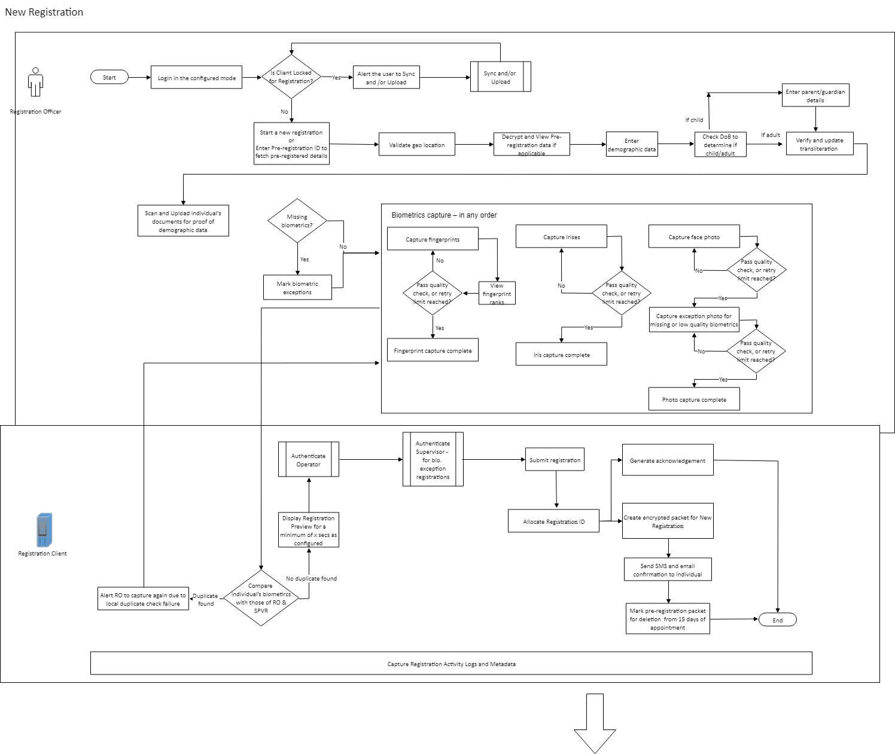
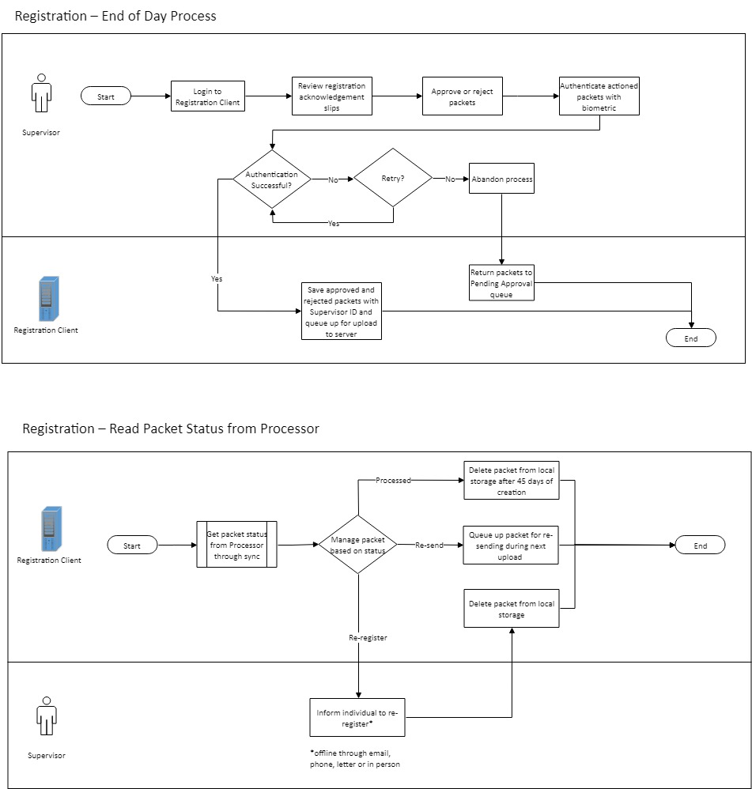
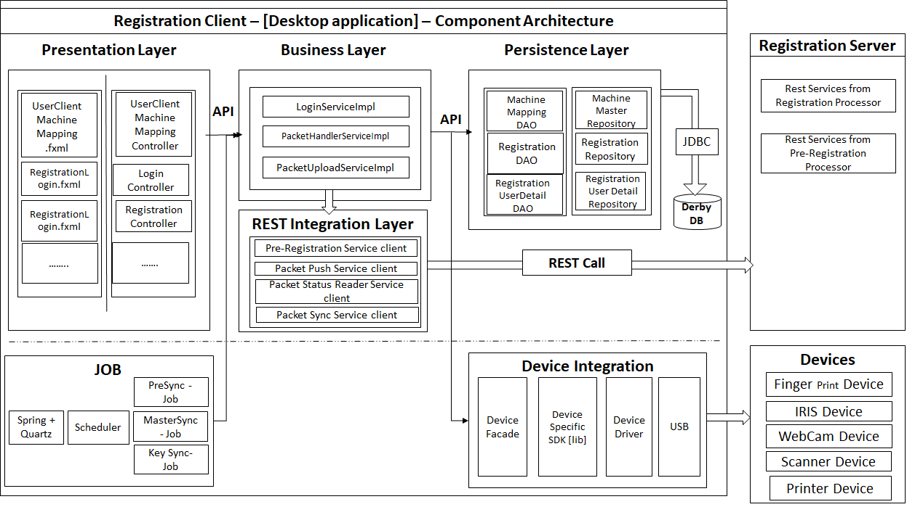

# Introduction
Registration client application captures the demographic and biometric details of an individual along with supporting information (proof documents & information about parten/guardian/introducer) and packages the information in a secure way. The information packet is sent to the server in online or offline mode for processing. 

Important considerations are as follows.  Registration client must provide the following:
* **Secure** way of capturing an individual's demographic and biometric data. An individual's demographic and biometric data is private. So, ensuring security and privacy of the data during capture is very important. The captured data must be cryptographically secure such that the data cannot be tampered with. 
* **Interfaces to biometric devices** that comply to industry standards. Since there are many manufacturers of biometric devices around the world, best way to ensure compatibility with a device is to comply to industry standards. This ensure that any device manufactured as per standards will work with MOSIP.
* Work in **online and offline** mode. In remote areas where Internet connectivity is a challenge, registration client must work in an offline mode to capture data. Client must provide option to transfer data to server when online. This helps in uninterrupted registrations. 
* **Remote software update software** capability. Client must have the ability to update itself for patch upgrades (bug fixes/enhancements) in a remote way. There could be hundreds of client instances running on laptops/desktops. Updates on all of them must be controlled by the client and a central server.
* **Tamper-proof client software**. Since registration client must work in offline mode, there is a possibility of client software itself being tampered with. There must be enough checks and balances to detect tampering and reject such packets.

# Detailed functionality
[Registration Functionality](Registration-Functionality)

# Process flow
## Registration Officer Onboarding

## Registration preparation

## Individual registration

## Packet upload

## End of day (EOD) process

## UIN update

## Lost UIN

## Software update

## Logical view

## Component Architecture  

# Registration packet structure

All the registration information is zipped and encrypted in a packet and send to the server. The structure of the packet is given [here](Registration-Packet)

# Registration client reference App

MOSIP provides an Windows based reference implementation of the client that has UI and business logic to perform the above process flows.  The code, design, App setup, build documentation is available in [registration client repo](https://github.com/mosip/registration/registration).  The App may be modified according to a country's need.  

* [App setup guide](Registration-Client-Setup)
* [APIs used by App]

# First user on-boarding

TBD

