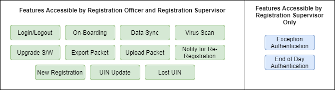
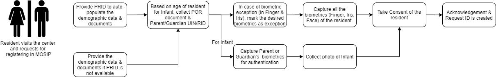
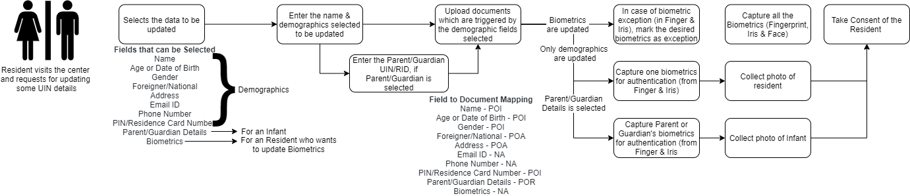

# Operators in MOSIP
The operators is the one who can login to the registration client application and perform various activities. The roles associated to an operator in MOSIP can be of a Supervisor or an Officer. Below are features accessed by a supervisor and an officer in the registration client.


The list given above corresponds to the default configuration and can be changed by the MOSIP adoptor.


## Operator on-boarding
When an operator tries to login to his/her registration client for the very first time they need to be online and would be re-directed automatically to the on-boarding page. During on-boarding the operator needs to provide his/her biometrics, which would be stored and mapped to the client machine locally post authentication.

Operator's biometrics are captured during on-boarding to support login using biometrics, local duplicate checks, and registration submission via. biometric authentication in registration client.


On-boarding is successful for an operator if and only if,
* The operator should be active.
* The operator should not be blacklisted.
* The operator & the machine should belong to the same center.
* The operator's User ID should be mapped to his/her UIN. 
* The operator's biometric authentication should be successful during on-boarding.
* The system should online during on-boarding.


## Login & Logout

### First time login
When an operator whats to login to the registration client for the first time, he/she needs to have the registration client in online mode. The first time login for any user in registration client is mandated to be using user name and and password based login. After the first login and successful on-boarding; the registration client would mandate the operator to login with the configured mode deceided by the administrator.


Any number of officers or supervisors can login to a registration client but,
* They need to be mapped to the same center where the machine is registered.
* They should have on-boarded to the registration client successfully.


### Modes of login
MOSIP supports single factor and multi factor login including password, OTP, iris, fingerprint, and face authentication for registration client. An administrative configuration setting determines the mode of login.

The registration client can authenticate an operator in offline mode using the locally stored biometrics (face/finger/iris) & password, but it has to be online to authentication an operator using OTP.


While a operator attempts to login to registration client, the system will match the user name with the locally stored user names using a case-insensitive logic.


### Temporarily lock the operator
The registration client temporarily locks the operator’s account in case he/she provides an invalid password, fingerprint, iris, face for five times continuously to login. The temporarily account lock lasts for 30 minutes (which is configurable).

### Logout
An Operator can logout of the registration client by just, 
* Clicking the logout button, 
* Closing the registration client, or 
* Being in-active on the registration client for configured amount of time after which he/she is automatically logged out.

Upon logout, any unsaved data will be lost. Data will not be automatically saved in the database and will not be retained in memory though transaction details which is used for auditing will be captured & stored (except for PII data).


Registration client provides an alerts to the operator, ‘x’ minutes before reaching the auto logout time limit. Registration client displays a countdown timer in the alert. The operator can choose to dismiss the alert and continue working. This will also reset the timer to zero.


# Data Sync

## Master data sync
In order to run the registration client application in online or offline mode it need some master data. When the client machine is switching from offline to online mode, the locally saved data can be synced with the server & changes from server can be synced backed to client. The data sync can happen through an automated process at a set frequency or an operator can manually initiate a sync.

## Configuration sync
When an operator performs data sync the configurations related to registration client also gets synced. Based on the configuration (turn on or turn off), the system allows the operator to capture applicable biometrics, authenticates, and completes the registration activities.

## Client to server sync
Registration Client syncs back some information back to the server whenever a sync is triggered:

1. Operator on-boarding details such as mapping of user, machine & center.
2. List of registration packets that are newly created.
3. The registration packets are also uploaded to the registration processor.


Only the additions, deletions, and modifications made since the last sync are sent to the server.


## Packet status sync
During the sync operation the registration client request for the registration server for the status of some of the packets that it has already synced in the server. Knowing the status of the packets helps the registration client to, 

1. Delete the packets from it's local file system based on the countries policy.
2. Re-Upload the packet if it is missing in the server.
3. Inform the resident to re-register if packet processing fails in server.

## Pre-registration data download
An Operator can download the pre-registration data of his/her center for a date range (current date - end date) while being online (where the date range is configurable) and store it locally in the registration machine for offline use. Now when the system is offline and the pre-registration data is already downloaded; the operator can enter the pre-registration id to auto-populate the registration form with the demographic details of the resident.

Now if the registration machine is online the operator can enter the resident's pre-registration data in real time irrespective of the center selected by the resident while filling the pre-registration form.


Date Range of pre-registration data to be downloaded and storage location of pre-registration data in the registration machine is configurable.


# Health check

## Peripherals check
The registration client has the provision to show if the registration machine has internet connectivity or not.

## Disk space check
Upon receiving a request to create a registration packet at the end of data capture and authentication steps, registration client validates if the disk space available on the registration machine to store the registration packet is sufficient or not.  
If disk space is insufficient, registration client displays an error message and data entered by registration officer is not saved. Then registration officer needs to clean up the registration machine to make sufficient space and try the registering the resident again.

## Virus scan/Security scan
When the registration client application is open, the application scans the registration packets at a configured frequency for viruses. If the registration client application is not open at the configured time, the scan will be queued up and will run when the client application is open.

# Registration services

## New registration
An operator can initiate the process of registering an new applicant in the MOSIP ecosystem by filling the new registration form with the resident. Below are few of the processes needed to complete a new registration.

### Enter demographic data and upload documents of a resident
If the resident has a pre-registration id, the operator can auto-populate the demographic data and the documents by entering the pre-registration id.

If the resident doesn't have a pre-registration id, the operator can enter the resident’s demographic details (such as Name, Gender, DOB, Residential Address, etc.) & upload the documents  (such as Proof of Address, Proof of Identity, Proof of Birth) based on the [ID Object defined](MOSIP-ID-Object-Definition.md) by the country.

After the demographic details are entered the registration client validates the entered demographic data as per the Id validation rules defined in the ID Object UI Specification and appropriate error messages are shown in case the validation fails.

### Capture biometrics of a resident
The capture of biometrics is governed by the country, i.e. capture of each modality (fingerprint, iris or face) can be controlled by the country using the global configuration to turning on or off, capture of a particular biometrics.

When the operator clicks on the capture button and tries to capture the biometrics of the resident, the device needs to make the capture when the quality of the biometrics is more than the threshold configured by the country. The device will try to capture the biometrics until the quality threshold has crossed or the device capture timeout has crossed which is also configurable. 

Post the timeout has occurred and the captured quality of biometrics is less than the threshold, registration client provide an option to the operator to retry capture of biometrics but for a particular number of times which is also configurable.

If the resident has a biometric exception (resident is missing a finger/iris or quality of finger/iris is very poor) the resident can mark that particular biometrics as exception but the resident has provide an exception photo after providing the biometrics.

### Device validation
The biometric devices connected to the registration machine to perform registration needs to registered devices and hence device validation is a very important process. The devices are validated using the master data that is received from the server during sync. Once the validation is successful and the device is connected to the registration machine a three way mapping of the center, machine & device is created and synced back to the server.

### Capture consent from the resident for data storage and utilization
For every registration, the registration client provides an option for the operator to mark an individual's consent as Yes or No. The operator marks consent after confirming with the resident. Whether the consent is marked as Yes or No, it will not have any impact on issuance of UIN for that resident and the registration processor will not execute any validations in this regard during packet processing.

### New registration for an infant
The registration flow for an infant is slightly different from that of registering an adult. The categorization of normal resident and infant is determined based on the age calculated by when the resident provides the date of birth. The age of infant is a configurable parameter (in the current configuration age of infant is set to 5 years).

For an infant registration client doesn't collect the biometrics (except for photo) but it collects the parent/guardian UIN or RID and biometrics for authentication in the server side. Apart from parent/guardian details the resident need to provide a Proof of Relationship document defined by the country.

## Update resident's details
When a resident visits the registration center to update his/her demographic or biometrics details, the operator captures the updated data as provided by the resident in the registration client.

Process Flow using which data gets captured by registration client for updating a resident's data:


*The UIN update feature is configurable by a country. The Admin can turn ON or OFF, the UIN update feature using the configuration.*


## Find a lost UIN
There might be a situation when a resident might have lost his UIN and visits the registration center for retrieving the same, the operator then captures the biometrics and demographic details of the individual and processes a request to retrieve the lost UIN. The system sends a notification to the individual upon successful creation of the UIN retrieval request.

## Acknowledgement and Notifications

### Printing the registration receipt
Once the registration process (new registration, UIN update or lost UIN) is completed, the registration client generates an unique request id and a registration receipt which contains labels & data in configured language. This data also contains a QR code of the RID, photograph of the resident and ranking of each finger from 1 to 10 (1 being the finger with the best quality). This receipt is print friendly and can be used for printing using any printer.

### Sending email and SMS notifications
Once a registration process is completed, a notification is sent to the resident using the email ID and mobile number that was provided as part of demographic data. This notification sent is driven by a template created as part of master data and the language selected (primary, secondary or both) & notification mode (SMS, Email or none) is driven by configurations.

Registration Client also provides an option to send SMS and email notifications to additional recipient\s (other than the individual’s primary email ID and mobile number).

## Use of biometric SDKs in registration client

### Local biometric authentication for operators
Registration client perform authentication for registration officers and supervisors during various scenarios in registration client. In order to perform authentication using biometrics in such scenarios registration client need to integrate with a biometric SDK. The scenarios where biometric authentication is performed in registration client are:

1. When operator wants to login to registration client
2. When operator creates a packet
3. When an exception packet is created we need to perform supervisor authentication
4. When supervisor performs end of day verification
5. When supervisor performs resident about re-registration


*For performing all the above mentioned authentication scenarios, registration client uses the operator's biometrics captured during on-boarding. The match threshold for authentication is a configurable parameter.*


### Local biometric de-duplication
There could be a scenario where an operator in-order to show a demonstration to the resident might capture his/her own biometrics, which could let to packet processing failure in the server side. Hence, in order to avoid such cases we perform de-duplication of biometrics of the resident against the operator's biometrics who have on-boarded to that registration machine.

## Registration officer and supervisor approvals

### Approval for packet creation
An operator needs authenticate himself/herself when the registration process is completed. After successful authentication an encrypted packet is created in registration client. During this process if biometrics is used as the mode of authentication, the operator's biometrics is sent to server as part of the packet for verification in the server side.

### Approval of exception packet
If a packet is created for a resident who has marked his/her biometrics as exception, the registration client performs a second round of authentication for packet creation. During this authentication the supervisor needs to provide his/her credentials. If biometrics is provided during this authentication, it is sent as part of the packet to the server.

### Approval during "re-registation"
During pre-processing of the packet, if the registration processor finds an error in the packet such as decryption failure, then an individual will not be communicated automatically to re-register. In such cases, registration processor marks the status of the packet as "re-register" so that a supervisor informs the individual to "re-register" his/her application. After informing the resident the officer needs to authneticate himself/herself using his/her credentials.

# Geo-location
We have a feature to capture geo location of a device before any registration is performed. This is driven by a configuration. If capture of geo location is turned on, the system performs the following steps:
* Validates that an on-boarded GPS device is connected to the machine.
	* If an on-boarded GPS device is not found, then displays an error message.
	* If more than one on-boarded GPS device is connected, then proceeds with the first GPS device that the system finds as it scans the ports of the machine.
* Requests the GPS device to capture a location.
* Receives the latitude and longitude from the GPS device.
	* If signal is weak and GPS device is unable to capture location, then displays an error message.
* Proceeds to perform following validations:
	* If location capture is required only at the beginning of day, the co-ordinates are stored and validations are performed when opting to start a new registration.
	* If location capture is required only at the beginning of day and location could not be captured at beginning of the day, then attempts to capture the location during the first registration of the day.
	* The latitude and longitude will be stored in the packet when the packet is created.
* System captures and stores the transaction details for audit purpose (except PII data).

# Language Support
The Registration Client supports two languages, a primary language in which all pages of the application are rendered, and demographic details of an individual are also rendered in secondary language for convenience of the officer. The default primary and secondary languages are driven by an administrator configuration and can be setup by the admin as required. Transliteration from the primary to secondary language is supported for registration officer entered text fields.

In the below listed scenarios, system will render an error message on the Login page and inhibit Registration, and hence, the language configurations should be appropriately setup by the administrator.
* If Primary Language is set to a specific value and Secondary Language is not set by Admin, or
* If Secondary Language is set to a specific value and Primary Language is not set by Admin, or
* If both Primary and Secondary Language are not set by Admin 


Then the system will render the stated Error Message: “The system has encountered a technical error. Administrator to setup the necessary language configuration(s).” 


This error message will not have an option to exit, hence not allow the user to proceed further. On page refresh, the system will render the error message again and hence, inhibit registrations. Therefore, it is important for the administrator to setup the configurations appropriately. In case configurations are setup correctly, but post Login, if a sync is initiated through the option in the homepage, and then if it is identified that either Primary/Secondary language/both are not defined, then the system will render the same error message on the homepage and not allow the user to proceed further.

Considering a scenario, wherein if Primary language and Secondary language is configured to be the same, EG: English then:
* The system will render the demographic page (with both left and right side for Primary and Secondary language) in the same language
* Values entered on the left side (Primary Language) will not be transliterated but auto-copied on the right side
* Values on the right side will remain un-editable
* As part of the packet, system will send/store data in one language only, if language code is identified to be the same – EG: ENG (English)
	
Therefore, it is important for the administrator to setup the configurations appropriately.

## Translation
A Registration Officer can view static data translated to secondary language.
* In MOSIP, the primary and secondary languages are configured by the admin.
* Admin configures all the static data in both primary and secondary languages so that the registration officer can view all the pages of client application in primary (default) and second (translated) languages.
* If the both languages are configured in one language, the system displays the text in default language only.

## Transliteration
Registration Client enables viewing transliterated data.

The Registration Client application supports two type of languages: Primary language (the language in which the registration officer enters data) and secondary language (transliteration language). The secondary language is country specific and is set by the administrator.

When the officer starts a new registration, update or lost UIN process and provides demographic data (Full Name, Address Line 1, Address Line 2, Address Line 3, and parent/guardian Name) of an individual in the primary language. The system transliterates the data and displays in the corresponding secondary language fields.

An Officer can invoke the virtual keyboard to edit transliterated data and proceeds with registration. The following rules are followed during transliteration.
* Editing transliterated language does not change the data entered in the primary language.
* The system also validates the maximum character length in the transliterated language and in primary language.
* If secondary language is not configured, the system does not do any transliteration and will display empty space instead.
* Numeric data are not transliterated. The same numeric data are displayed in the secondary language section of the page, which are not editable.

Master data selections are not transliterated. Instead, the master data as setup in the secondary language is displayed in the relevant section.

The system then enables the officer to view the registration confirmation page. The data, which are transliterated and edited earlier are also shown in the secondary language.

# Packet Upload

## Registration Packet Upload

### Upload the packet
* The system allows a registration officer to view a list of packets and may opt to upload one or multiple packets from a list of packets.
* After the registration officer selects the packet(s), he/she can upload the selected packet(s) to server.

### Push those packets that are marked 'Resend' to the server
* When the registration officer or supervisor navigates to the ‘Upload Packets’ page, the list of RIDs that are pending packets to upload will be displayed.
	* Pending packets are those packets, which are not sent to the server due to various reasons (e.g. Sanity Check and Validation failure in the Registration Processor) and have been marked for resending.
* When the registration officer or supervisor selects the ‘Upload’ option, the pending packets will be uploaded to the server.
* The result of each packet uploaded will be displayed as ‘Success’ or ‘Failure’.
	* Packets that are successfully sent or resent will not be sent again unless the server requests for them.
	* Packets for which upload fails will continue to be in pending state.
* System captures and stores the transaction details for audit purpose (except PII data).

### Enable a real time packet upload when system is online upon registration submission

* When EoD process is turned ON
	* Registration Client checks if the system is online as soon as the assigned approver (such as supervisor) approves or rejects a new registration or UIN update.
	* If client is online, the Registration Client sends Registration ID to server and then the packets are marked as “Ready to upload” and auto uploaded to server.
	* If client is offline or on low bandwidth, then when the client next comes online, the Registration ID’s are sent to server through scheduled or manual sync and the packets are then marked as “ready to upload”.
	* Once the packets are ready for upload, packets are uploaded in two ways:
		* The registration officer can initiate upload to server using upload function.
		* Export to external storage device for subsequent upload as required.
* When EoD process is turned OFF
	* Registration Client checks if system is online as soon as the registration officer submits a new registration or UIN update.
	* If client is online, the Registration Client sends Registration Id to server and then the packets are marked as “Ready to upload” and auto uploaded to server.
	* If client is offline or on low bandwidth, then when the client next comes online, the Registration ID’s are sent to server through scheduled or manual sync and the packets are then marked as “ready to upload”.
	* Once the packets are ready for upload, packets are uploaded in two ways:
		* The registration officer can initiate upload to server using client’s upload function.
		* Export to external storage device for subsequent upload as required.

### Packet Exporter & Offline Upload from External Device

#### Export Packets to External Device
System exports registration packet data from client machine to an external device as follows:
* This feature allows the registration officer to select a destination folder to export the packets. By default all packets that are listed/eligible to be uploaded, are exported to the external device
* The destination folder includes the laptop/desktop, an external hard drive or a remote location
* External storage devices are not necessary to be MOSIP-registered devices
* When the destination folder is selected, registration officer initiates export of packets
* System exports the packets to the selected folder and performs the following steps:
	* Identifies the packets in ‘Ready to Upload’ state.
	* If EoD process is turned ON, packets that have been approved or rejected and packet ID sync is completed are considered ‘Ready to Upload’
	* If EoD process is turned OFF, packets are considered ‘Ready to Upload’ as soon as the registration is submitted and packet ID sync is completed
	* Puts the packets in the destination folder
* All the Registration Officers and supervisors on-boarded to the client machine will be able to export all packets
* Supports the partial export. If the system is able to export some packets to the folder and no other files due to lack of storage space or unavailability of the folder, the successfully exported packets will remain in the destination folder.
* For partial or full failure, the system displays error message

#### Upload Packets from External Device to Server (To be Developed)
Once the server acknowledges that the packets have been received (which is uploaded from the external device to the server through a defined mechanism - Yet to be defined/developed), the packets in the client will be marked as ‘Uploaded’ upon the next sync with Server.
* Packets that remain in ‘Ready to Upload’ status will be exported again when the next export is executed.
* Packets in ‘Uploaded’ or any other status will not be exported again.

# Analytics and Audit Logs
System captures and stores details of each transaction during registration process for audit purpose (except PII data). The audit data is stored in the audit database. When the client machine is working in an offline mode, the audit log is synced with the server as when the client machine is online. 

# Data Security 
Registration Client integrates with Trusted Platform Model (TPM) data integrity. For enhanced security and integrity purposes, data captured from individuals are saved securely in local system and then shared to server. The details saved locally will be encrypted. Database encryption is also mandatory.

MOSIP performs the following:

1. Signing the data (This process is called as Signature) using Private Key provided by the TPM
   * This process will ensure that the request to the server has been dispatched from a registered or trusted Registration Client machine
2. Validates the signature against the actual data using the Public Key or Public Part. The application does not connect or access the underlying TPM to validate the Signature. This validation ensures that the request is from a registered or trusted Registration Client machine
1. Encrypts and decrypts the data using RSA algorithm in TPM. 
**System security and tampering of packets**

The system uses a machine and centre specific public key to encrypt. Only the server which has the respective private key, machine id and centre id can decrypt the encrypted packet. The data stored in database and application binaries are encrypted using TPM public key and registration officers will not be able to access directly.

# Installation and Software Version Upgrade

## A. Registration Officer or Supervisor can download and unzip the client application set up kit

For initial installation of the client software on a particular machine, supervisor or registration officer will download an installable software (setup kit). Then unzip the setup kit and install it in the client machine.

When a registration officer or supervisor opts to download setup kit and selects the OS-specific setup kit to download, the system allows the registration officer to download the setup kit to the storage location chosen by the registration officer. 

1. Registration officer then unzips the setup kit.
1. Extract the files and folders from the zip file to the chosen location.
1. Allows the registration officer to verify that the files and folder structure are as described in the design document.
1. System captures and stores the download transaction details for audit purpose (except PII data). 

## B. Update the client software from the server
If a software update is available, then the system will provide an option to supervisor or registration officer to update either immediately or later. If the maximum number of days without software update has been exceeded, then the system will mandate a registration officer to update the software.

The system follows the following steps during the update process:

1. When the client is online, the system automatically checks for updates if available.
1. If an update is available, the system displays a message “Updates are available” and provides two options to the registration officer 
   * Update now or 
   * Update later.
1. If the registration officer opts to select “Update now” option, then the registration officer can download and installs software and launches the application.
1. The updates are downloaded as patch updates.
1. When installation is in progress, the registration officer cannot perform any action on the client.
1. Once installation is completed, the registration officer can start working on the client.
1. If update is not successful, the system provides error message and provides both the options (Update Now or Update Later) again.
1. If the registration officer opts to select “Update later” option, then the system checks if the freeze period has been reached.
   * If the freeze period has not been reached, the system allows the registration officer to continue with registration
   * If freeze period has been reached, the system does not allow the registration officer for registration without updating the software.
   * The client will be locked for registration, if x days (configuration setting) have passed since the last check for updates and mandates the registration officer to update the software.
1. If updates are not available, the system launches the application.
1. If update is not successful, the client returns to its earlier version.
1. System captures and stores the transaction details for audit purpose (except PII data).

# Clean up

Pre-registration and registration data are automatically deleted from the client machine upon consumption and upon intimation from the server respectively. 
* Pre-registration data is deleted from the client machine immediately after consumption for a registration.
* Registration packets that are identified as ‘processed’ are deleted by a periodic process.
* Audit data is deleted after it is sent to the server.
* All deletion is executed by a periodic process after retention of the data for a configured duration.

## Data retention policies

### A. Read packet status and delete packets

When the Registration Client receives a request through manual trigger or scheduled job to sync data, the system performs the following steps to read a packet status and delete the packets:

1. Sends the data sync request to server.
1. Receives response from server with packet statuses.
   * Server sends status of those registration packets that were created in the specific machine, and that status that has changed since the last sync.
1. Saves the statuses ‘Processing’, ‘Processed’ or ‘Resend’ as received for each packet. Statuses of other packets are not updated.
1. Immediately deletes the packets from the local machine whose status is received as ‘Processed’.
1. Displays an alert in case of sync failure.
   * The on-screen message is only indicated if the sync was a success or failure.
   * Detailed errors can be viewed in the transaction logs.
1. The system does not allow registration officer to perform any activities when the data sync is running.
1. If the Registration Client is not online or not open during a scheduled sync, the sync will be queued up and will be executed later. 
1. When the Registration Client is next launched and is online, checks if the previous scheduled sync was executed. If not executed earlier, then immediately starts the sync.
1. System captures and stores the transaction details for audit purpose (except PII data).

### B. Delete transaction history (audit logs) post sync with server and the retention period
 
When a set of audit data is uploaded to the server and the server has acknowledged receipt of the audit data, the system performs the following steps to delete transaction history (audit logs) post sync with server and the retention period:

1. Runs on a daily process to identify audit data that has been sent to the server and acknowledgement is received from the server.
   * The audit data acknowledgement received from the server >= x hours ago. X is configured at a country level.
2. Deletes the identified audit data from the client machine.
1. Executes at a time and frequency as configured. 
   * The process takes place only when the Registration Client is in open and running situation. If the Registration Client is not open during a scheduled run, it is executed as soon as the client is next started up.
4. Does not delete audit data, if that is yet to be sent to the server.
1. System captures and stores the transaction details.

## Machine Retirement

Machine is termed as machine retirement due to following reason:
* If the machine has obsolete specification.
* When the machine is moved from one center to another (re-mapped), then the machine will retire from that old center.

Before the machine is decommissioned, the following checks must be performed:

1. All packets created must either be uploaded to server or exported to external device.
2. All pending end of day approvals are completed and re-registrations pending action are cleared, refer below for more details
3. All data locally saved in the machine must be cleaned up.

Re-mapping of Machine:

If a Machine has been re-mapped to another center, then:

1. Officer will not be allowed to do any operation in Registration Client except,
    * Login/Logout
    * Approve packets as part of End of Day Approval process
    * Upload Packets
    * Inform Residents to Re-Register and mark action accordingly
2. Once Packet Approval and Informing Resident is Completed, then
    * Packets will be auto uploaded if anything is pending
    * Initial Sync Flag is Turned On
3. Once the Officer logs out and tries to login again, then
    * New Master data gets downloaded for the newly mapped Center
