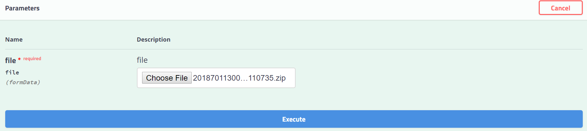

This section details about the service APIs in the Registration-Processor modules

[1. Packet receiver API](#1-packet-receiver-api)

[2. Registration status API](#2-registration-status-api)

[3. Sync Registration API](#3-sync-registration-api)

[4. Manual Verification APIs](#4-manual-verification-apis)

[5. Bio Dedupe API](#5-bio-dedupe-api)

[6. Packet Generator API](#6-packet-generator-api)

[7. Packet Uploader API](#7-packet-uploader-api)

[8. Request Handler API](#8-request-handler-api)

[9. Registration Transaction API](#9-registration-transaction-api)

[10. Uincard API](#10-uincard-api)

[11. Lost UIN Or RID API](#11-lost-uin-or-rid-api)

[12. Update UIN API](#12-update-uin-api)

# 1 Packet Receiver API

- #### `POST /registrationprocessor/v1/packetreceiver/registrationpackets`

This API receives registration packet from reg-client. Before moving packet to landing zone virus scan is performed and then trustworthiness of the packet is validated using hash value and size.


#### Resource URL
https://mosip.io/registrationprocessor/v1/packetreceiver/registrationpackets

#### Resource details

Resource Details | Description
------------ | -------------
Request format | MULTIPART
Response format | JSON
Requires Authentication | Yes

#### Request Path Parameters
Name | Required | Description | Comment
-----|----------|-------------|---------------|
MultipartFile|Yes|The encrypted zip file| 

#### Request


#### Response
#### Response Header
##### Response-Signature = `<the response signature>`
##### Success response
###### Status Code: 200
###### Description: Packet is in PACKET_RECEIVED status

```JSON
{
	"id" : "mosip.registration.packet",
	"version" : "1.0",
	"responsetime" : "2019-02-02T06:12:25.288Z",
	"response" : {
		"status" : "Packet is in PACKET_RECEIVED status"
	},
	"errors": null
}
```
#### Failure response

###### Status Code: 200
###### Description: The request received is a duplicate request to upload a Packet

```JSON
{
  "id" : "mosip.registration.packet",
  "version" : "1.0",
  "responsetime": "2019-02-02T06:12:25.288Z",
  "response": null,
  "errors" : [{
		"errorcode": "RPR-PKR-005",
	    "message": "The request received is a duplicate request to upload a Packet"
	}]
}
```

#### Failure details
Error Code | Error Message | Error Description
-----|----------|-------------
RPR-PKR-005 |	Duplicate Request Received	| Duplicate Packet
RPR-PKR-006 |	Packet Not Available in Request	|   Packet missing
RPR-PKR-003 |	Invalid Packet Format	|   Format doesnot match configuration
RPR-PKR-002 |	Invalid Packet Size	|  Size more then configured
RPR-RGS-001 |	Unable to Access Registration Table	|  Database error
RPR-SYS-005 |	Timeout Error	|   Timeout Error
RPR-SYS-001 |	Unexpected exception	|   Unexpected exception
RPR-PKR-004 |	Packet Validation Failed	|   Packet Validation Failed
RPR-AUT-01 |	Invalid Token Present	|   Invalid Token Present
RPR-AUT-02 |	Access Denied 	|   Access Denied 
RPR-DBE-001 |	Data integrity violation exception	|   Data integrity violation exception
RPR-PKR-001 |	Packet Not Found in Sync Table	|   Packet Not Found in Sync Table
RPR-PKR-007 |	Unknown Exception Found	|  Unknown Exception Found
RPR-PKR-013 |	Packet Size is Not Matching	|  Packet Size is Not Matching
RPR-PKR-010 |	Virus was Found in Packet	|  Virus was Found in Packet
RPR-PKR-008 |	Virus Scan Service is Not Responding	| Virus Scan Service is Not Responding
RPR-PKR-009 |	Packet HashSequence did not match	| Packet HashSequence did not match


# 2 Registration Status API

- ### `POST /registrationprocessor/v1/registrationstatus/search`

This API return the registration current status for list of registration ids.

#### Resource URL
https://mosip.io/registrationprocessor/v1/registrationstatus/search

#### Resource details

Resource Details | Description
------------ | -------------
Request format | JSON
Response format | JSON
Requires Authentication | Yes

#### Parameters
Name | Required | Description | Comment |
-----|----------|-------------|---------------|
registrationIds|Yes|List of registration ids|

#### Request
```JSON
{
  "id" : "mosip.registration.status",
  "version" : "1.0",
  "requesttime": "2019-02-14T12:40:59.768Z",
  "request" : [
	{
		"registrationId" : "2018701130000410092012345678"
	},
	{
		"registrationId" : "2018701130000410092012345678"
	}
  ]
}
```
#### Response
Record found :
###### Status Code: 200
###### Description: Successfully retrieved information

```JSON
{
  "id" : "mosip.registration.status",
  "version" : "1.0",
  "responsetime": "2019-02-14T12:40:59.768Z",
  "response" : [
  {
    "registrationId": "2018701130000410092012345678",
    "statusCode": "PROCESSING"
  },
  {
    "registrationId": "2018701130000410092018110735",
    "statusCode": "PROCESSED"
  }
],
"errors": null
}
```
Record not found :
###### Status Code: 200
###### Description: Successfully retrieved information

```JSON
{
    "id": "mosip.registration.status",
    "version": "1.0",
    "responsetime": "2019-12-06T04:16:07.070Z",
    "response": [],
    "errors": [
        {
            "registrationId": "10014100180046820190619064012",
            "errorCode": "RPR-RGS-031",
            "errorMessage": "RID Not Found"
        },
        {
            "registrationId": "10006100420001120190613130943",
            "errorCode": "RPR-RGS-031",
            "errorMessage": "RID Not Found"
        }
    ]
}

```

#### Failure details
Error Code | Error Message | Error Description
-----|----------|-------------
RPR-AUT-002 |	Access Denied	| Access Denied for the role
RPR-RGS-001 |	Unable to Access Registration Table	| Unable to Access Registration Table
RPR-RGS-016 |	JSON Mapping Failed	| JSON Mapping Failed
RPR-RGS-017 |	JSON Parsing Failed	| JSON Parsing Failed
RPR-SYS-002 |	Bad Gateway	| Bad Gateway
RPR-DBE-001 |	Data integrity violation exception	| Data integrity violation exception
RPR-AUT-01 |	Invalid Token Present	| Invalid Token Present
RPR-RGS-015 |	Invalid Request Value - Input Data is Incorrect	| Invalid Request Value - Input Data is Incorrect
RPR-RGS-031 |	RID Not Found	| RID Not Found


# 3 Sync registration API
The registration ids has to be synced with server before uploading packet to landing zone. This API is used to sync registration ids.

- #### `POST /registrationprocessor/v1/registrationstatus/sync`

#### Resource URL
https://mosip.io/registrationprocessor/v1/registrationstatus/sync

#### Resource details

Resource Details | Description
------------ | -------------
Request format | JSON
Response format | JSON
Requires Authentication | Yes

### Parameters
Name | Required | Description | Comment
-----|----------|-------------|---------------|
id|Yes|the id for sync|mosip.registration.sync
version|Yes|the version for sync|1.0
requesttime|Yes|the requesttime for sync|2019-02-14T12:40:59.768Z
request|Yes|the request object|1.0
registrationId|Yes|the registration id|80006444440002520181208094000
registrationType|Yes|the type of the registration|NEW, UPDATE, LOST, ACTIVATE, DEACTIVATE, RES_UPDATE
packetHashValue|Yes|the hash value of the encrypted packet|D7C87DC5D3A759D77433B02B80435CFAB5087F1A942543F51A5075BC441BF7EB
packetSize|Yes|size of encrypted packet in bytes|5242880
supervisorStatus|Yes|supervisor decision|APPROVED, REJECTED
supervisorComment|No|supervisor comments|rejected because of error
optionalValues|No|additional values to be passed during sync|key, value pair
langCode|Yes|language code used |eng or ara


#### Request Header
##### Center-Machine-RefId = `10011_10011`
##### timestamp = `2019-02-14T12:40:59.768Z`

#### Request
```JSON
// NOTE : the actual request will be an encrypted json. This is an example of decrypted request json.
{
	"id": "mosip.registration.sync",
	"version": "1.0",
	"requesttime": "2019-02-14T12:40:59.768Z",
	"request": [{
			"registrationId": "80006444440002520181208094000",
			"registrationType": "NEW",
			"packetHashValue": "D7C87DC5D3A759D77433B02B80435CFAB5087F1A942543F51A5075BC441BF7EB",
			"packetSize": 5242880,
			"supervisorStatus": "APPROVED",
			"supervisorComment": "Approved, all good",
			"langCode": "eng",
			"optionalValues": [{
				"key": "CNIE",
				"value": "122223456"
			}]
		},
		{
			"registrationId": "10011100110002520181208094000",
			"registrationType": "UPDATE",
			"packetHashValue": "D7C87DC5D3A759D77433B02B80435CFAB5087F1A942543F51A5075BC441BF7EB",
			"packetSize": 4242880,
			"supervisorStatus": "REJECTED",
			"supervisorComment": "Rejected due to error",
			"langCode": "eng",
			"optionalValues": [{
				"key": "CNIE",
				"value": "3456789o"
			}]
		}
	]
}
```
#### Response
#### Response Header
##### Response-Signature = `<the response signature>`
###### Response Code: 200
###### Description: Successfully synced

Success response :
```JSON
{
  "id" : "mosip.registration.sync",
  "version" : "1.0",
  "responsetime": "2019-02-14T12:40:59.768Z",
  "errors": null,
  "response" : [
	  {
		"registrationId": "1234575",
		"status": "SUCCESS"
	  },
	  {
		"registrationId": "12345678901234567890123456789",
		"status": "SUCCESS"
	  },
	  {
		"registrationId": "27847657360002520181208183052",
		"status": "SUCCESS"
	  }
	]
}
```
Failure response
```JSON
// response 1 : decryption failed
{
  "id" : "mosip.registration.sync",
  "version" : "1.0",
  "responsetime": "2019-02-14T12:40:59.768Z",
  "response": null,
  "errors" : [
	  {
		"status": "FAILURE",
                "errorCode": "RPR-RGS-001",
		"errorMessage": "Decryption failed"
	  }
	]
}

// response 2 : validation failed

{
  "id" : "mosip.registration.sync",
  "version" : "1.0",
  "responsetime": "2019-02-14T12:40:59.768Z",
  "response": null,
  "errors" : [
	  {
		"registrationId": "1234575",
		"status": "FAILURE",
                "errorCode": "RPR-RGS-009",
		"errorMessage": "RegistrationId Length Must Be 29"
	  },
	  {
		"registrationId": "12345678901234567890123456789",
		"status": "FAILURE",
		"errorCode": "RPR-RGS-007",
                "errorMessage": "Invalid Time Stamp Found in RegistrationId"
	  },
	  {
		"registrationId": "27847657360002520181208183052",
		"status": "FAILURE",
		"errorCode": "RPR-RGS-012",
		"errorMessage": "Parent RegistrationId Length Must Be 29"
	  }
	]
}
```

#### Failure details
Error Code | Error Message | Error Description
-----|----------|-------------
RPR-AUT-002 |	Access Denied	| Access Denied for the role
RPR-RGS-001 |	Unable to Access Registration Table	| Unable to Access Registration Table
RPR-RGS-016 |	JSON Mapping Failed	| JSON Mapping Failed
RPR-RGS-017 |	JSON Parsing Failed	| JSON Parsing Failed
RPR-SYS-002 |	Bad Gateway	| Bad Gateway
RPR-DBE-001 |	Data integrity violation exception	| Data integrity violation exception
RPR-AUT-01 |	Invalid Token Present	| Invalid Token Present
RPR-RGS-015 |	Invalid Request Value - Input Data is Incorrect	| Invalid Request Value - Input Data is Incorrect

# 4 Manual Verification APIs
## 4.1 Manual Verification Assignment API

- #### `POST /registrationprocessor/v1/manualverification/assignment`
This API is used to assign one single unassigned applicant record to the input user.

#### Resource URL
https://mosip.io/registrationprocessor/v1/manualverification/assignment

#### Resource details

Resource Details | Description
------------ | -------------
Request format | JSON
Response format | JSON
Requires Authentication | Yes

#### Parameters
Name | Required | Description | Comment
-----|----------|-------------|---------------|
String|Yes|The user id|

#### Request
```JSON
{
  "id" : "mosip.manual.verification.assignment",
  "version" : "1.0",
  "requesttime": "2019-02-14T12:40:59.768Z",
  "request" : {
	"userId": "mono29",
        "matchType" : "all"
  }
}
```
#### Response
###### Status Code: 200
###### Description : response code is always 200 if server receives the request.

Success response
```JSON
{
  "id" : "mosip.manual.verification.assignment",
  "version" : "1.0",
  "responsetime": "2019-02-14T12:40:59.768Z",
  "response" : {
	  "regId": "27847657360002520181208123456",
	  "mvUsrId": "mono29",
	  "statusCode": "ASSIGNED",
	  "matchedRefId": "27847657360002520181208123456",
	  "matchedRefType": "UIN",
	  "reasonCode": null
	},
	"errors": null
}
```
Failure response
```JSON
{
  "id" : "mosip.manual.verification.assignment",
  "version" : "1.0",
  "responsetime": "2019-02-14T12:40:59.768Z",
  "response": null,
	"errors" : [{
		"errorCode" : "RPR-FAC-003",
		"message" : "Cannot find the Registration Packet"
	}]
}
```
#### Failure details
Error Code | Error Message | Error Description
-----|----------|-------------
RPR-MVS-005 | fields can not be empty  | fields can not be empty
RPR-MVS-004 | No Assigned Record Found  | No Assigned Record Found 
RPR-MVS-006 | Missing Input Parameter - requesttime  | Missing Input Parameter - requesttime 
RPR-MVS-007 | Missing Input Parameter - id  | Missing Input Parameter - id 
RPR-MVS-008 | Invalid Input Parameter - version  | Invalid Input Parameter - version 
RPR-MVS-011 | Invalid Argument Exception  | Invalid Argument Exception 
RPR-MVS-012 | Unknown Exception  | Unknown Exception 
RPR-MVS-013 | Request Decoding Exception  |  Request Decoding Exception
RPR-MVS-017 | User Id should not empty or null  | User Id should not empty or null
RPR-MVS-015 | User is not in ACTIVE status  | User is not in ACTIVE status
RPR-MVS-020 | Match Type is Invalid  | Match Type is Invalid
RPR-MVS-022 | TablenotAccessibleException in Manual verification  | TablenotAccessibleException in Manual verification

## 4.2 Manual Verification Decision API

- #### `POST /registrationprocessor/v1/manualverification/decision`

This API is used to get the decision from manual verifier for an applicant and update the decision in table. The packet is sent for further processing based on decision.

#### Resource URL
https://mosip.io/registrationprocessor/v1/manualverification/decision

#### Resource details

Resource Details | Description
------------ | -------------
Request format | JSON
Response format | JSON
Requires Authentication | Yes

#### Parameters
Name | Required | Description | Comment
-----|----------|-------------|---------------|
ManualVerificationDTO|Yes|Dto containing manual adjudication info|

#### Request
```JSON
{
  "id" : "mosip.manual.verification.decision",
  "version" : "1.0",
  "requesttime": "2019-02-14T12:40:59.768Z",
  "request" : {
	  "matchedRefId": "27847657360002520181208123987",
	  "matchedRefType": "RID",
	  "mvUsrId": "mono",
	  "reasonCode": "Problem with biometrics",
	  "regId": "27847657360002520181208123456",
	  "statusCode": "APPROVED"
	}
}
```
#### Response
###### Status Code: 200
###### Description : response code is always 200 if server receives the request.

Success response
```JSON
{
  "id" : "mosip.manual.verification.decision",
  "version" : "1.0",
  "responsetime": "2019-02-14T12:40:59.768Z",
  "response" : {
	  "regId": "27847657360002520181208123456",
	  "mvUsrId": "mono",
	  "statusCode": "APPROVED",
	  "matchedRefId": "27847657360002520181208123987",
	  "matchedRefType": "RID",
	  "reasonCode": "Problem with biometrics"
	},
	"errors": null
}
```
Failure response
```JSON
{
  "id" : "mosip.manual.verification.decision",
  "version" : "1.0",
  "responsetime": "2019-02-14T12:40:59.768Z",
  "response": null,
	"errors" : [{
		"errorCode" : "RPR-MVS-003",
		"message" : "Invalid status update"
	}]
}
```
#### Failure details
Error Code | Error Message | Error Description
-----|----------|-------------
RPR-MVS-003 | Invalid status update  |  Invalid status update
RPR-MVS-005 | fields can not be empty  | fields can not be empty
RPR-MVS-004 | No Assigned Record Found  | No Assigned Record Found 
RPR-MVS-018 | Packet Not Found in Packet Store  | Packet Not Found in Packet Store 
RPR-MVS-006 | Missing Input Parameter - requesttime  | Missing Input Parameter - requesttime 
RPR-MVS-007 | Missing Input Parameter - id  | Missing Input Parameter - id 
RPR-MVS-008 | Invalid Input Parameter - version  | Invalid Input Parameter - version 
RPR-MVS-011 | Invalid Argument Exception  | Invalid Argument Exception 
RPR-MVS-012 | Unknown Exception  | Unknown Exception 
RPR-MVS-013 | Request Decoding Exception  |  Request Decoding Exception
RPR-MVS-017 | User Id should not empty or null  | User Id should not empty or null
RPR-MVS-015 | User is not in ACTIVE status  | User is not in ACTIVE status
RPR-MVS-016 | Reg Id should not be null or empty  | Reg Id should not be null or empty
RPR-MVS-021 | Manual verification rejected  | Manual verification rejected
RPR-MVS-022 | TablenotAccessibleException in Manual verification  | TablenotAccessibleException in Manual verification

## 4.3 Manual Verification Applicant Biometric API

- #### `POST /registrationprocessor/v1/manualverification/applicantBiometric`

The manual verifier would need to verify the applicant biometric and demographic records. This API is used to get the applicant biometric file from packet.

#### Resource URL

https://mosip.io/registrationprocessor/v1/manualverification/applicantBiometric

#### Resource details

Resource Details | Description
------------ | -------------
Request format | JSON
Response format | byte[]
Requires Authentication | Yes

#### Parameters
Name | Required | Description | Comment
-----|----------|-------------|---------------|
FileRequestDto|Yes|Dto containing registration id and file name|

#### Request
```JSON
{
  "id" : "mosip.manual.verification.biometric",
  "version" : "1.0",
  "requesttime": "2019-02-14T12:40:59.768Z",
  "request" : {
	  "regId": "27847657360002520181208123456"
	}
}
```
#### Response
###### Status Code: 200
###### Description : response code is always 200 if server receives the request.

Success :
```JSON
{
  "id" : "mosip.manual.verification.biometric",
  "version" : "1.0",
  "responsetime": "2019-02-14T12:40:59.768Z",
  "response" : {
	  "file": "<?xml version=\"1.0\" encoding=\"UTF-8\" standalone=\"yes\"?>\n<BIR xmlns=\"http://standards.iso.org/iso-iec/19785/-3/ed-2/\">\n    <BIRInfo>\n        <Integrity>false</Integrity>\n    </BIRInfo>\n    <BIR>\n        <Version>\n            <Major>1</Major>\n            <Minor>1</Minor>\n        </Version>\n        <CBEFFVersion>\n            <Major>1</Major>\n            <Minor>1</Minor>\n        </CBEFFVersion>\n        <ns2:TestFinger xmlns:ns2=\"testschema\">Duplicate</ns2:TestFinger>\n        <BIRInfo>\n            <Integrity>false</Integrity>\n        </BIRInfo>\n        <BDBInfo>\n            <Index>9317b2fd-d022-4bdf-8edb-24078e63a673</Index>\n            <Format>\n                <Organization>Mosip</Organization>\n                <Type>7</Type>\n            </Format>\n            <CreationDate>2019-09-05T05:45:26.385Z</CreationDate>\n            <Type>Finger</Type>\n            <Subtype>Left IndexFinger</Subtype>\n            <Level>Raw</Level>\n            <Purpose>Enroll</Purpose>\n            <Quality>\n                <Algorithm>\n                    <Organization>HMAC</Organization>\n                    <Type>SHA-256</Type>\n                </Algorithm>\n                <Score>90</Score>\n            </Quality>\n        </BDBInfo>\n        <BDB>Rk1SACAyMAAAAAEaAAABPAFiAMUAxQEAAAAoKoCKAMcjUIB3ANAuZEB9AOkiZICKAIEOZIDNAIvjZIBsARIVZECMAST8ZEBGAQ8jIUA7ARCUIUBBAGkcXUDlAFfuZICvAVx3FEC+ACr2ZIBfACATXYCYAK6tUICaAJz/V0C/APhXZICuAH6LZEB9ARcMZEDKAHfsZIDrAHxsZIEOANlZZICBAFKcZIDPAUH6ZEDYATx7ZEA4AToIV0AxAUjfQ0DzACnuZICDAK4hXYC3AKLeXYBkAOUvZEDXAPBUZIC2ARl1ZEBeAQ4dZECDATXzZEBNAR0SXUBbATb8XUEiAM3XQ0D1ATdpZIDjADp0ZICkABsGZIDFABaDZAAA</BDB>\n    </BIR>\n    <BIR>\n        <Version>\n            <Major>1</Major>\n            <Minor>1</Minor>\n        </Version>\n        <CBEFFVersion>\n            <Major>1</Major>\n            <Minor>1</Minor>\n        </CBEFFVersion>\n        <ns2:TestFinger xmlns:ns2=\"testschema\">Duplicate</ns2:TestFinger>\n        <BIRInfo>\n            <Integrity>false</Integrity>\n        </BIRInfo>\n        <BDBInfo>\n            <Index>8272d67e-879b-4e5b-8993-6919c1f4ec53</Index>\n            <Format>\n                <Organization>Mosip</Organization>\n                <Type>7</Type>\n            </Format>\n            <CreationDate>2019-09-05T05:45:26.386Z</CreationDate>\n            <Type>Finger</Type>\n            <Subtype>Left LittleFinger</Subtype>\n            <Level>Raw</Level>\n            <Purpose>Enroll</Purpose>\n            <Quality>\n                <Algorithm>\n                    <Organization>HMAC</Organization>\n                    <Type>SHA-256</Type>\n                </Algorithm>\n                <Score>90</Score>\n            </Quality>\n        </BDBInfo>\n        <BDB>Rk1SACAyMAAAAAD8AAABPAFiAMUAxQEAAAAoJUB5ANY3ZICRALXPZICNARUmZICSAJ7tZICyAJ5pZIC5AJbZZEC7ATsYKIBlAH4ZZIAhAQ8kXUCuAGjpZEBeAV8EUIAsAU4VNYCtAE7tZICoAOGzZECeALnNZEB4AR6cZICnAR4pZIDJAK1ZXUA+AL+zZIBGASscZECxAUUASYCGAVcAUIBdAVYSUEDhAVL0DYBYAFiiXUCVAMC4ZEB2AQ0nZEBMAOYyZIDUAOK9ZEDhANDKUEBjATkcXUCVAUsNUEDlAKHRZEDMAUp/B0DPAHBqZEBLAGMgV4B+AE0CZAAA</BDB>\n    </BIR>\n    <BIR>\n        <Version>\n            <Major>1</Major>\n            <Minor>1</Minor>\n        </Version>\n        <CBEFFVersion>\n            <Major>1</Major>\n            <Minor>1</Minor>\n        </CBEFFVersion>\n        <ns2:TestFinger xmlns:ns2=\"testschema\">Unique</ns2:TestFinger>\n        <BIRInfo>\n            <Integrity>false</Integrity>\n        </BIRInfo>\n        <BDBInfo>\n            <Index>82dba636-f294-47d0-b3d6-88a02069c189</Index>\n            <Format>\n                <Organization>Mosip</Organization>\n                <Type>7</Type>\n            </Format>\n            <CreationDate>2019-09-05T05:45:26.386Z</CreationDate>\n            <Type>Finger</Type>\n            <Subtype>Left MiddleFinger</Subtype>\n            <Level>Raw</Level>\n            <Purpose>Enroll</Purpose>\n            <Quality>\n                <Algorithm>\n                    <Organization>HMAC</Organization>\n                    <Type>SHA-256</Type>\n                </Algorithm>\n                <Score>90</Score>\n            </Quality>\n        </BDBInfo>\n        <BDB>Rk1SACAyMAAAAAD8AAABPAFiAMUAxQEAAAAoJYCKALVpV4B8AHv1ZEC/AI1PZEBhAGsWZEDPAPJQZEBEAPslZICpASeHXYBOARoXZIC3ADl8Q0CKATwHZICWABb8ZEB4AVD+SUA+AVIFQ4BsAKn3Q4BdAJUXZEA+AJgoZIC+APVYZEDOAGPSZEDJAEdoXYB5AScPZEB5ADQGZEAQAMMnZEDeADvQQ4BGACAbXYBYABObXUCzANNKZIB4AOiSQ0CqAPxjZICIAQWSZECcAReFXUCoADz1ZIDEAR5pXUDaAEtLXYDmARBbSUDrADtASYC2ABZ7L0AdAS4YZAAA</BDB>\n    </BIR>\n    <BIR>\n        <Version>\n            <Major>1</Major>\n            <Minor>1</Minor>\n        </Version>\n        <CBEFFVersion>\n            <Major>1</Major>\n            <Minor>1</Minor>\n        </CBEFFVersion>\n        <ns2:TestFinger xmlns:ns2=\"testschema\">Duplicate</ns2:TestFinger>\n        <BIRInfo>\n            <Integrity>false</Integrity>\n        </BIRInfo>\n        <BDBInfo>\n            <Index>a4fe79e2-11f8-4a09-b5e4-8519bd7e098f</Index>\n            <Format>\n                <Organization>Mosip</Organization>\n                <Type>7</Type>\n            </Format>\n            <CreationDate>2019-09-05T05:45:26.386Z</CreationDate>\n            <Type>Finger</Type>\n            <Subtype>Left RingFinger</Subtype>\n            <Level>Raw</Level>\n            <Purpose>Enroll</Purpose>\n            <Quality>\n                <Algorithm>\n                    <Organization>HMAC</Organization>\n                    <Type>SHA-256</Type>\n                </Algorithm>\n                <Score>90</Score>\n            </Quality>\n        </BDBInfo>\n        <BDB>Rk1SACAyMAAAAAFcAAABPAFiAMUAxQEAAAAoNYCJAMS4Q4B7ALUBQ4BnAMK2ZICmAKrLZIBvAPAwXUBUAOa2ZIBbAPg5XYDOAOzCZEDSAJnOXYBfARghZICWAF31ZEBbAFIfZIDuARrEXUBCAE0eZEBsADygZICDAVkNG4DXAU+4L4AcAUEtB0B/AMmzPEB4AN4zXYCQAO+tXYC4ALVTXYBiAKQnZIBoAPguXYCUAQ6kZEB4AQ8oZEA8AOe0ZIBGAQszZIBPASEhZID3AIPVZIDkASq6ZEDKAEhpZEDtAFzdZEC1AVUlSUD0AFJgZEB0AAwHZICBAL/GQ4CoANBHZICJAJ7sZIB9APWmXUCGAIj7ZIDJAKzHXYBeAI+sZICLAHX9ZIDlANDKZEC1AGl0ZIDHAGNoZEA2ASQqUEB/AD8QZICHADeXZECfAVYQPEAxAT4cQ0A+AVIOQwAA</BDB>\n    </BIR>\n    <BIR>\n        <Ve........................................................................."
  },
  "errors": null
}
```
Failure :
```JSON
{
  "id" : "mosip.manual.verification.biometric",
  "version" : "1.0",
  "responsetime": "2019-02-14T12:40:59.768Z",
  "response": null,
  "errors" : [{
	"errorCode" : "RPR-MVS-002",
	"message" : "Requested file is not present"
  }]
}
```
#### Failure details
Error Code | Error Message | Error Description
-----|----------|-------------
RPR-MVS-001 | Invalid file requested | Invalid file requested
RPR-MVS-002 | Requested file is not present  | Requested file is not present
RPR-MVS-005 | fields can not be empty  | fields can not be empty
RPR-MVS-018 | Packet Not Found in Packet Store  | Packet Not Found in Packet Store 
RPR-MVS-006 | Missing Input Parameter - requesttime  | Missing Input Parameter - requesttime 
RPR-MVS-007 | Missing Input Parameter - id  | Missing Input Parameter - id 
RPR-MVS-008 | Invalid Input Parameter - version  | Invalid Input Parameter - version 
RPR-MVS-011 | Invalid Argument Exception  | Invalid Argument Exception 
RPR-MVS-012 | Unknown Exception  | Unknown Exception 
RPR-MVS-013 | Request Decoding Exception  |  Request Decoding Exception
RPR-MVS-016 | Reg Id should not be null or empty  | Reg Id should not be null or empty
RPR-MVS-022 | TablenotAccessibleException   | TablenotAccessibleException 

## 4.4 Manual Verification Applicant Demographic API

- #### `POST /registrationprocessor/v1/manualverification/applicantDemographic`

The manual verifier has to verify the applicant demographic information. This API is used to get the applicant demographic information from packet.

#### Resource URL
https://mosip.io/registrationprocessor/v1/manualverification/applicantDemographic


#### Resource details

Resource Details | Description
------------ | -------------
Request format | JSON
Response format | byte[]
Requires Authentication | Yes

#### Parameters
Name | Required | Description | Comment
-----|----------|-------------|---------------|
FileRequestDto|Yes|Dto containing registration id and file name|

#### Request
```JSON
{
  "id" : "mosip.manual.verification.demographic",
  "version" : "1.0",
  "requesttime": "2019-02-14T12:40:59.768Z",
  "request" : {
	  "regId": "27847657360002520181208123456"
	}
}
```
#### Response
###### Status Code: 200
###### Description : response code is always 200 if server receives the request.

```JSON
{
  "id" : "mosip.manual.verification.demographic",
  "version" : "1.0",
  "responsetime": "2019-02-14T12:40:59.768Z",
  "response" : {
	  "file": "{\r\n  \"identity\" : {\r\n    \"fullName\" : [ {\r\n      \"language\" : \"eng\",\r\n      \"value\" : \"Rounak Adult\"\r\n    }, {\r\n      \"language\" : \"ara\",\r\n      \"value\" : \"قخعىشن شيعمف\"\r\n    } ],\r\n    \"dateOfBirth\" : \"1991/04/29\",\r\n    \"age\" : 28,\r\n    \"gender\" : [ {\r\n      \"language\" : \"eng\",\r\n      \"value\" : \"Male\"\r\n    }, {\r\n      \"language\" : \"ara\",\r\n      \"value\" : \"الذكر\"\r\n    } ],\r\n    \"residenceStatus\" : [ {\r\n      \"language\" : \"eng\",\r\n      \"value\" : \"Non-Foreigner\"\r\n    }, {\r\n      \"language\" : \"ara\",\r\n      \"value\" : \"غير أجنبي\"\r\n    } ],\r\n    \"addressLine1\" : [ {\r\n      \"language\" : \"eng\",\r\n      \"value\" : \"Address 1\"\r\n    }, {\r\n      \"language\" : \"ara\",\r\n      \"value\" : \"شييقثسس ١\"\r\n    } ],\r\n    \"addressLine2\" : [ {\r\n      \"language\" : \"eng\",\r\n      \"value\" : \"Address 2\"\r\n    }, {\r\n      \"language\" : \"ara\",\r\n      \"value\" : \"شييقثسس ٢\"\r\n    } ],\r\n    \"region\" : [ {\r\n      \"language\" : \"eng\",\r\n      \"value\" : \"Rabat Sale Kenitra\"\r\n    }, {\r\n      \"language\" : \"ara\",\r\n      \"value\" : \"جهة الرباط سلا القنيطرة\"\r\n    } ],\r\n    \"province\" : [ {\r\n      \"language\" : \"eng\",\r\n      \"value\" : \"Kenitra\"\r\n    }, {\r\n      \"language\" : \"ara\",\r\n      \"value\" : \"القنيطرة\"\r\n    } ],\r\n    \"city\" : [ {\r\n      \"language\" : \"eng\",\r\n      \"value\" : \"Kenitra\"\r\n    }, {\r\n      \"language\" : \"ara\",\r\n      \"value\" : \"القنيطرة\"\r\n    } ],\r\n    \"postalCode\" : \"14080\",\r\n    \"phone\" : \"8763740607\",\r\n    \"email\" : \"rounak.nayak@mindtree.com\",\r\n    \"referenceIdentityNumber\" : \"8763740607\",\r\n    \"zone\" : [ {\r\n      \"language\" : \"eng\",\r\n      \"value\" : \"Ouled Oujih\"\r\n    }, {\r\n      \"language\" : \"ara\",\r\n      \"value\" : \"اولاد اوجيه\"\r\n    } ],\r\n    \"proofOfAddress\" : {\r\n      \"value\" : \"POA_Rental contract\",\r\n      \"type\" : \"RNC\",\r\n      \"format\" : \"jpg\"\r\n    },\r\n    \"proofOfIdentity\" : {\r\n      \"value\" : \"POI_Voter Identification card\",\r\n      \"type\" : \"DOC004\",\r\n      \"format\" : \"jpg\"\r\n    },\r\n    \"individualBiometrics\" : {\r\n      \"format\" : \"cbeff\",\r\n      \"version\" : 1.0,\r\n      \"value\" : \"applicant_bio_CBEFF\"\r\n    },\r\n    \"IDSchemaVersion\" : 1.0\r\n  }\r\n}"
  },
  "errors": null
}
```
Failure :
```JSON
{
  "id" : "mosip.manual.verification.demographic",
  "version" : "1.0",
  "responsetime": "2019-02-14T12:40:59.768Z",
  "response": null,
  "errors" : [{
	"errorCode" : "RPR-MVS-002",
	"message" : "Requested file is not present"
  }]
}
```
#### Failure details
Error Code | Error Message | Error Description
-----|----------|-------------
RPR-MVS-002 | Requested file is not present  | Requested file is not present
RPR-MVS-005 | fields can not be empty  | fields can not be empty
RPR-MVS-018 | Packet Not Found in Packet Store  | Packet Not Found in Packet Store 
RPR-MVS-006 | Missing Input Parameter - requesttime  | Missing Input Parameter - requesttime 
RPR-MVS-007 | Missing Input Parameter - id  | Missing Input Parameter - id 
RPR-MVS-008 | Invalid Input Parameter - version  | Invalid Input Parameter - version 
RPR-MVS-011 | Invalid Argument Exception  | Invalid Argument Exception 
RPR-MVS-012 | Unknown Exception  | Unknown Exception 
RPR-MVS-013 | Request Decoding Exception  |  Request Decoding Exception
RPR-MVS-016 | Reg Id should not be null or empty  | Reg Id should not be null or empty
RPR-MVS-022 | TablenotAccessibleException in Manual verification  | TablenotAccessibleException in Manual verification

## 4.5 Manual Verification Packet Info API

- #### `POST /registrationprocessor/v1/manualverification/packetInfo`

The manual adjudicator has to verify the operator/supervisor/introducer etc information. This API fetches the additional information from packet.

#### Resource URL
https://mosip.io/registrationprocessor/v1/manualverification/packetInfo


#### Resource details

Resource Details | Description
------------ | -------------
Request format | JSON
Response format | byte[]
Requires Authentication | Yes

#### Parameters
Name | Required | Description | Comment
-----|----------|-------------|---------------|
FileRequestDto|Yes|Dto containing registration id and file name|

#### Request
```JSON
{
  "id" : "mosip.manual.verification.packetinfo",
  "version" : "1.0",
  "requesttime": "2019-02-14T12:40:59.768Z",
  "request" : {
	  "regId": "27847657360002520181208123456"
	}
}
```
#### Response
###### Status Code: 200
###### Description : response code is always 200 if server receives the request.

```JSON
{
  "id" : "mosip.manual.verification.packetinfo",
  "version" : "1.0",
  "responsetime": "2019-02-14T12:40:59.768Z",
  "response" : {
	  "file": "{\r\n    \"response\": {\r\n        \"identity\": {\r\n            \"biometric\": {\r\n                \"applicant\": {\r\n                    \"leftEye\": {\r\n                        \"language\": null,\r\n                        \"label\": null,\r\n                        \"imageName\": null,\r\n                        \"type\": null,\r\n                        \"qualityScore\": 0,\r\n                        \"numRetry\": 1,\r\n                        \"forceCaptured\": false\r\n                    },\r\n                    \"rightEye\": {\r\n                        \"language\": null,\r\n                        \"label\": null,\r\n                        \"imageName\": null,\r\n                        \"type\": null,\r\n                        \"qualityScore\": 0,\r\n                        \"numRetry\": 1,\r\n                        \"forceCaptured\": false\r\n                    },\r\n                    \"leftThumb\": {\r\n                        \"language\": null,\r\n                        \"label\": null,\r\n                        \"imageName\": null,\r\n                        \"type\": null,\r\n                        \"qualityScore\": 0,\r\n                        \"numRetry\": 1,\r\n                        \"forceCaptured\": false\r\n                    },\r\n                    \"rightThumb\": {\r\n                        \"language\": null,\r\n                        \"label\": null,\r\n                        \"imageName\": null,\r\n                        \"type\": null,\r\n                        \"qualityScore\": 0,\r\n                        \"numRetry\": 1,\r\n                        \"forceCaptured\": false\r\n                    },\r\n                    \"leftIndex\": {\r\n                        \"language\": null,\r\n                        \"label\": null,\r\n                        \"imageName\": null,\r\n                        \"type\": null,\r\n                        \"qualityScore\": 0,\r\n                        \"numRetry\": 1,\r\n                        \"forceCaptured\": false\r\n                    },\r\n                    \"leftMiddle\": {\r\n                        \"language\": null,\r\n                        \"label\": null,\r\n                        \"imageName\": null,\r\n                        \"type\": null,\r\n                        \"qualityScore\": 0,\r\n                        \"numRetry\": 1,\r\n                        \"forceCaptured\": false\r\n                    },\r\n                    \"leftRing\": {\r\n                        \"language\": null,\r\n                        \"label\": null,\r\n                        \"imageName\": null,\r\n                        \"type\": null,\r\n                        \"qualityScore\": 0,\r\n                        \"numRetry\": 1,\r\n                        \"forceCaptured\": false\r\n                    },\r\n                    \"leftLittle\": {\r\n                        \"language\": null,\r\n                        \"label\": null,\r\n                        \"imageName\": null,\r\n                        \"type\": null,\r\n                        \"qualityScore\": 0,\r\n                        \"numRetry\": 1,\r\n                        \"forceCaptured\": false\r\n                    },\r\n                    \"rightIndex\": {\r\n                        \"language\": null,\r\n                        \"label\": null,\r\n                        \"imageName\": null,\r\n                        \"type\": null,\r\n                        \"qualityScore\": 0,\r\n                        \"numRetry\": 1,\r\n                        \"forceCaptured\": false\r\n                    },\r\n                    \"rightMiddle\": {\r\n                        \"language\": null,\r\n                        \"label\": null,\r\n                        \"imageName\": null,\r\n                        \"type\": null,\r\n                        \"qualityScore\": 0,\r\n                        \"numRetry\": 1,\r\n                        \"forceCaptured\": false\r\n                    },\r\n                    \"rightRing\": {\r\n                        \"language\": null,\r\n                        \"label\": null,\r\n                        \"imageName\": null,\r\n                        \"type\": null,\r\n                        \"qualityScore\": 0,\r\n                        \"numRetry\": 1,\r\n                        \"forceCaptured\": false\r\n                    },\r\n                    \"rightLittle\": {\r\n                        \"language\": null,\r\n                        \"label\": null,\r\n                        \"imageName\": null,\r\n                        \"type\": null,\r\n                        \"qualityScore\": 0,\r\n                        \"numRetry\": 1,\r\n                        \"forceCaptured\": false\r\n                    }\r\n                },\r\n                \"introducer\": null\r\n            },\r\n            \"exceptionBiometrics\": [],\r\n            \"applicantPhotograph\": {\r\n                \"language\": null,\r\n                \"label\": null,\r\n                \"photographName\": null,\r\n                \"numRetry\": 0,\r\n                \"qualityScore\": 0\r\n            },\r\n            \"exceptionPhotograph\": null,\r\n            \"documents\": [],\r\n            \"metaData\": null,\r\n            \"osiData\": null,\r\n            \"hashSequence1\": null,\r\n            \"hashSequence2\": [\r\n                {\r\n                    \"label\": \"otherFiles\",\r\n                    \"value\": [\r\n                        \"audit\"\r\n                    ]\r\n                }\r\n            ],\r\n            \"capturedRegisteredDevices\": [\r\n                {\r\n                    \"label\": \"Finger Print Scanner\",\r\n                    \"value\": \"3000026\"\r\n                },\r\n                {\r\n                    \"label\": \"Iris Scanner\",\r\n                    \"value\": \"3000046\"\r\n                },\r\n                {\r\n                    \"label\": \"Camera\",\r\n                    \"value\": \"3000066\"\r\n                },\r\n                {\r\n                    \"label\": \"Document Scanner\",\r\n                    \"value\": \"3000086\"\r\n                },\r\n                {\r\n                    \"label\": \"Printer\",\r\n                    \"value\": \"3000106\"\r\n                },\r\n                {\r\n                    \"label\": \"Finger Print Scanner\",\r\n                    \"value\": \"3000125\"\r\n                },\r\n                {\r\n                    \"label\": \"Iris Scanner\",\r\n                    \"value\": \"3000134\"\r\n                },\r\n                {\r\n                    \"label\": \"Camera\",\r\n                    \"value\": \"3000143\"\r\n                },\r\n                {\r\n                    \"label\": \"Document Scanner\",\r\n                    \"value\": \"3000152\"\r\n                },\r\n                {\r\n                    \"label\": \"Printer\",\r\n                    \"value\": \"3000161\"\r\n                },\r\n                {\r\n                    \"label\": \"Finger Print Scanner\",\r\n                    \"value\": \"3000181\"\r\n                },\r\n                {\r\n                    \"label\": \"Iris Scanner\",\r\n                    \"value\": \"3000182\"\r\n                },\r\n                {\r\n                    \"label\": \"Camera\",\r\n                    \"value\": \"3000183\"\r\n                },\r\n                {\r\n                    \"label\": \"Document Scanner\",\r\n                    \"value\": \"3000184\"\r\n                },\r\n                {\r\n                    \"label\": \"Printer\",\r\n                    \"value\": \"3000185\"\r\n                },\r\n                {\r\n                    \"label\": \"Finger Print Scanner\",\r\n                    \"value\": \"3000186\"\r\n                },\r\n                {\r\n                    \"label\": \"Iris Scanner\",\r\n                    \"value\": \"3000187\"\r\n                },\r\n                {\r\n                    \"label\": \"Camera\",\r\n                    \"value\": \"3000188\"\r\n                },\r\n                {\r\n                    \"label\": \"Document Scanner\",\r\n                    \"value\": \"3000189\"\r\n                },\r\n                {\r\n                    \"label\": \"Printer\",\r\n                    \"value\": \"3000190\"\r\n                },\r\n                {\r\n                    \"label\": \"Finger Print Scanner\",\r\n                    \"value\": \"3000191\"\r\n                },\r\n                {\r\n                    \"label\": \"Iris Scanner\",\r\n                    \"value\": \"3000192\"\r\n                },\r\n                {\r\n                    \"label\": \"Camera\",\r\n                    \"value\": \"3000193\"\r\n                },\r\n                {\r\n                    \"label\": \"Document Scanner\",\r\n                    \"value\": \"3000194\"\r\n                },\r\n                {\r\n                    \"label\": \"Printer\",\r\n                    \"value\": \"3000195\"\r\n                },\r\n                {\r\n                    \"label\": \"Finger Print Scanner\",\r\n                    \"value\": \"3000196\"\r\n                },\r\n                {\r\n                    \"label\": \"Iris Scanner\",\r\n                    \"value\": \"3000197\"\r\n                },\r\n                {\r\n                    \"label\": \"Camera\",\r\n                    \"value\": \"3000198\"\r\n                },\r\n                {\r\n                    \"label\": \"Document Scanner\",\r\n                    \"value\": \"3000199\"\r\n                },\r\n                {\r\n                    \"label\": \"Printer\",\r\n                    \"value\": \"3000200\"\r\n                },\r\n                {\r\n                    \"label\": \"Finger Print Scanner\",\r\n                    \"value\": \"3000201\"\r\n                },\r\n                {\r\n                    \"label\": \"Iris Scanner\",\r\n                    \"value\": \"3000202\"\r\n                },\r\n                {\r\n                    \"label\": \"Camera\",\r\n                    \"value\": \"3000203\"\r\n                },\r\n                {\r\n                    \"label\": \"Document Scanner\",\r\n                    \"value\": \"3000204\"\r\n                },\r\n                {\r\n                    \"label\": \"Printer\",\r\n                    \"value\": \"3000205\"\r\n                },\r\n                {\r\n                    \"label\": \"Finger Print Scanner\",\r\n                    \"value\": \"3000206\"\r\n                },\r\n                {\r\n                    \"label\": \"Iris Scanner\",\r\n                    \"value\": \"3000207\"\r\n                },\r\n                {\r\n                    \"label\": \"Camera\",\r\n                    \"value\": \"3000208\"\r\n                },\r\n                {\r\n                    \"label\": \"Document Scanner\",\r\n                    \"value\": \"3000209\"\r\n                },\r\n                {\r\n                    \"label\": \"Printer\",\r\n                    \"value\": \"3000210\"\r\n                },\r\n                {\r\n                    \"label\": \"Finger Print Scanner\",\r\n                    \"value\": \"3000211\"\r\n                },\r\n                {\r\n                    \"label\": \"Iris Scanner\",\r\n                    \"value\": \"3000212\"\r\n                },\r\n                {\r\n                    \"label\": \"Camera\",\r\n                    \"value\": \"3000213\"\r\n                },\r\n                {\r\n                    \"label\": \"Document Scanner\",\r\n                    \"value\": \"3000214\"\r\n                },\r\n                {\r\n                    \"label\": \"Printer\",\r\n                    \"value\": \"3000215\"\r\n                },\r\n                {\r\n                    \"label\": \"Finger Print Scanner\",\r\n                    \"value\": \"3000216\"\r\n                },\r\n                {\r\n                    \"label\": \"Iris Scanner\",\r\n                    \"value\": \"3000217\"\r\n                },\r\n                {\r\n                    \"label\": \"Camera\",\r\n                    \"value\": \"3000218\"\r\n                },\r\n                {\r\n                    \"label\": \"Document Scanner\",\r\n                    \"value\": \"3000219\"\r\n                },\r\n                {\r\n                    \"label\": \"Printer\",\r\n                    \"value\": \"3000220\"\r\n                },\r\n                {\r\n                    \"label\": \"Finger Print Scanner\",\r\n                    \"value\": \"3000221\"\r\n                },\r\n                {\r\n                    \"label\": \"Iris Scanner\",\r\n                    \"value\": \"3000222\"\r\n                },\r\n                {\r\n                    \"label\": \"Camera\",\r\n                    \"value\": \"3000223\"\r\n                },\r\n                {\r\n                    \"label\": \"Document Scanner\",\r\n                    \"value\": \"3000224\"\r\n                },\r\n                {\r\n                    \"label\": \"Printer\",\r\n                    \"value\": \"3000225\"\r\n                },\r\n                {\r\n                    \"label\": \"Finger Print Scanner\",\r\n                    \"value\": \"3000226\"\r\n                },\r\n                {\r\n                    \"label\": \"Iris Scanner\",\r\n                    \"value\": \"3000227\"\r\n                },\r\n                {\r\n                    \"label\": \"Camera\",\r\n                    \"value\": \"3000228\"\r\n                },\r\n                {\r\n                    \"label\": \"Document Scanner\",\r\n                    \"value\": \"3000229\"\r\n                },\r\n                {\r\n                    \"label\": \"Printer\",\r\n                    \"value\": \"3000230\"\r\n                },\r\n                {\r\n                    \"label\": \"Finger Print Scanner\",\r\n                    \"value\": \"3000231\"\r\n                },\r\n                {\r\n                    \"label\": \"Iris Scanner\",\r\n                    \"value\": \"3000232\"\r\n                },\r\n                {\r\n                    \"label\": \"Camera\",\r\n                    \"value\": \"3000233\"\r\n                },\r\n                {\r\n                    \"label\": \"Document Scanner\",\r\n                    \"value\": \"3000234\"\r\n                },\r\n                {\r\n                    \"label\": \"Printer\",\r\n                    \"value\": \"3000235\"\r\n                },\r\n                {\r\n                    \"label\": \"Finger Print Scanner\",\r\n                    \"value\": \"3000236\"\r\n                },\r\n                {\r\n                    \"label\": \"Iris Scanner\",\r\n                    \"value\": \"3000237\"\r\n                },\r\n                {\r\n                    \"label\": \"Camera\",\r\n                    \"value\": \"3000238\"\r\n                },\r\n                {\r\n                    \"label\": \"Document Scanner\",\r\n                    \"value\": \"3000239\"\r\n                },\r\n                {\r\n                    \"label\": \"Printer\",\r\n                    \"value\": \"3000240\"\r\n                },\r\n                {\r\n                    \"label\": \"Finger Print Scanner\",\r\n                    \"value\": \"3000241\"\r\n                },\r\n                {\r\n                    \"label\": \"Iris Scanner\",\r\n                    \"value\": \"3000242\"\r\n                },\r\n                {\r\n                    \"label\": \"Camera\",\r\n                    \"value\": \"3000243\"\r\n                },\r\n                {\r\n                    \"label\": \"Document Scanner\",\r\n                    \"value\": \"3000244\"\r\n                },\r\n                {\r\n                    \"label\": \"Printer\",\r\n                    \"value\": \"3000245\"\r\n                },\r\n                {\r\n                    \"label\": \"Finger Print Scanner\",\r\n                    \"value\": \"3000246\"\r\n                },\r\n                {\r\n                    \"label\": \"Iris Scanner\",\r\n                    \"value\": \"3000247\"\r\n                },\r\n                {\r\n                    \"label\": \"Camera\",\r\n                    \"value\": \"3000248\"\r\n                },\r\n                {\r\n                    \"label\": \"Document Scanner\",\r\n                    \"value\": \"3000249\"\r\n                },\r\n                {\r\n                    \"label\": \"Printer\",\r\n                    \"value\": \"3000250\"\r\n                },\r\n                {\r\n                    \"label\": \"Finger Print Scanner\",\r\n                    \"value\": \"3000251\"\r\n                },\r\n                {\r\n                    \"label\": \"Iris Scanner\",\r\n                    \"value\": \"3000252\"\r\n                },\r\n                {\r\n                    \"label\": \"Camera\",\r\n                    \"value\": \"3000253\"\r\n                },\r\n                {\r\n                    \"label\": \"Document Scanner\",\r\n                    \"value\": \"3000254\"\r\n                },\r\n                {\r\n                    \"label\": \"Printer\",\r\n                    \"value\": \"3000255\"\r\n                },\r\n                {\r\n                    \"label\": \"Finger Print Scanner\",\r\n                    \"value\": \"3000256\"\r\n                },\r\n                {\r\n                    \"label\": \"Iris Scanner\",\r\n                    \"value\": \"3000257\"\r\n                },\r\n                {\r\n                    \"label\": \"Camera\",\r\n                    \"value\": \"3000258\"\r\n                },\r\n                {\r\n                    \"label\": \"Document Scanner\",\r\n                    \"value\": \"3000259\"\r\n                },\r\n                {\r\n                    \"label\": \"Printer\",\r\n                    \"value\": \"3000260\"\r\n                },\r\n                {\r\n                    \"label\": \"Finger Print Scanner\",\r\n                    \"value\": \"3000261\"\r\n                },\r\n                {\r\n                    \"label\": \"Iris Scanner\",\r\n                    \"value\": \"3000262\"\r\n                },\r\n                {\r\n                    \"label\": \"Camera\",\r\n                    \"value\": \"3000263\"\r\n                },\r\n                {\r\n                    \"label\": \"Document Scanner\",\r\n                    \"value\": \"3000264\"\r\n                },\r\n                {\r\n                    \"label\": \"Printer\",\r\n                    \"value\": \"3000265\"\r\n                },\r\n                {\r\n                    \"label\": \"Finger Print Scanner\",\r\n                    \"value\": \"3000266\"\r\n                },\r\n                {\r\n                    \"label\": \"Iris Scanner\",\r\n                    \"value\": \"3000267\"\r\n                },\r\n                {\r\n                    \"label\": \"Camera\",\r\n                    \"value\": \"3000268\"\r\n                },\r\n                {\r\n                    \"label\": \"Document Scanner\",\r\n                    \"value\": \"3000269\"\r\n                },\r\n                {\r\n                    \"label\": \"Printer\",\r\n                    \"value\": \"3000270\"\r\n                },\r\n                {\r\n                    \"label\": \"Finger Print Scanner\",\r\n                    \"value\": \"3000271\"\r\n                },\r\n                {\r\n                    \"label\": \"Iris Scanner\",\r\n                    \"value\": \"3000272\"\r\n                },\r\n                {\r\n                    \"label\": \"Camera\",\r\n                    \"value\": \"3000273\"\r\n                },\r\n                {\r\n                    \"label\": \"Document Scanner\",\r\n                    \"value\": \"3000274\"\r\n                },\r\n                {\r\n                    \"label\": \"Printer\",\r\n                    \"value\": \"3000275\"\r\n                },\r\n                {\r\n                    \"label\": \"Finger Print Scanner\",\r\n                    \"value\": \"3000276\"\r\n                },\r\n                {\r\n                    \"label\": \"Iris Scanner\",\r\n                    \"value\": \"3000277\"\r\n                },\r\n                {\r\n                    \"label\": \"Camera\",\r\n                    \"value\": \"3000278\"\r\n                },\r\n                {\r\n                    \"label\": \"Document Scanner\",\r\n                    \"value\": \"3000279\"\r\n                },\r\n                {\r\n                    \"label\": \"Printer\",\r\n                    \"value\": \"3000280\"\r\n                },\r\n                {\r\n                    \"label\": \"Finger Print Scanner\",\r\n                    \"value\": \"3000281\"\r\n                },\r\n                {\r\n                    \"label\": \"Iris Scanner\",\r\n                    \"value\": \"3000282\"\r\n                },\r\n                {\r\n                    \"label\": \"Camera\",\r\n                    \"value\": \"3000283\"\r\n                },\r\n                {\r\n                    \"label\": \"Document Scanner\",\r\n                    \"value\": \"3000284\"\r\n                },\r\n                {\r\n                    \"label\": \"Printer\",\r\n                    \"value\": \"3000285\"\r\n                },\r\n                {\r\n                    \"label\": \"Finger Print Scanner\",\r\n                    \"value\": \"3000286\"\r\n                },\r\n                {\r\n                    \"label\": \"Iris Scanner\",\r\n                    \"value\": \"3000287\"\r\n                },\r\n                {\r\n                    \"label\": \"Camera\",\r\n                    \"value\": \"3000288\"\r\n                },\r\n                {\r\n                    \"label\": \"Document Scanner\",\r\n                    \"value\": \"3000289\"\r\n                },\r\n                {\r\n                    \"label\": \"Printer\",\r\n                    \"value\": \"3000290\"\r\n                }\r\n            ],\r\n            \"capturedNonRegisteredDevices\": null,\r\n            \"checkSum\": null,\r\n            \"uinUpdatedFields\": null\r\n        }\r\n    },\r\n    \"errors\": null,\r\n    \"id\": \"mosip.manual.verification.packetinfo\",\r\n    \"version\": \"1.0\",\r\n    \"responsetime\": \"2019-09-27T06:57:57.882Z\"\r\n}"
  },
  "errors": null
}
```
Failure :
```JSON
{
  "id" : "mosip.manual.verification.packetInfo",
  "version" : "1.0",
  "responsetime": "2019-02-14T12:40:59.768Z",
  "response": null,
  "errors" : [{
	"errorCode" : "RPR-MVS-002",
	"message" : "Requested file is not present"
  }]
}
```
#### Failure details
Error Code | Error Message | Error Description
-----|----------|-------------
RPR-MVS-002 | Requested file is not present  | Requested file is not present
RPR-MVS-005 | fields can not be empty  | fields can not be empty
RPR-MVS-018 | Packet Not Found in Packet Store  | Packet Not Found in Packet Store 
RPR-MVS-006 | Missing Input Parameter - requesttime  | Missing Input Parameter - requesttime 
RPR-MVS-007 | Missing Input Parameter - id  | Missing Input Parameter - id 
RPR-MVS-008 | Invalid Input Parameter - version  | Invalid Input Parameter - version 
RPR-MVS-011 | Invalid Argument Exception  | Invalid Argument Exception 
RPR-MVS-012 | Unknown Exception  | Unknown Exception 
RPR-MVS-013 | Request Decoding Exception  |  Request Decoding Exception
RPR-MVS-016 | Reg Id should not be null or empty  | Reg Id should not be null or empty
RPR-MVS-022 | TablenotAccessibleException in Manual verification  | TablenotAccessibleException in Manual verification

# 5 Bio Dedupe API

- #### `GET /registrationprocessor/v1/bio-dedupe/biometricfile/{referenceid}`

The abis would call bio-dedupe callback API to get the biometric cbeff file.

#### Resource URL
https://mosip.io/registrationprocessor/v1/bio-dedupe/biometricfile/{referenceid}

#### Resource details

Resource Details | Description
------------ | -------------
Request format | JSON
Response format | byte[]
Requires Authentication | Yes

#### Parameters
Name | Required | Description | Comment
-----|----------|-------------|---------------|
byte[]|Yes|byte array of CBEFF file|

#### Response
###### Status codes: 200
###### Description : response code is always 200 if server receives the request.
Success :
```JSON
// byte array of CBEFF xml file
```

Failure :
```JSON
{
  "id" : "mosip.registration.biometrics",
  "version" : "1.0",
  "responsetime": "2019-02-14T12:40:59.768Z",
  "response": null,
  "errors" : [{
	"errorCode" : "RPR-MVS-001",
	"message" : "Access Denied"
  }]
}
```
#### Failure details
Error Code | Error Message | Error Description
-----|----------|-------------
RPR-MVS-001 |	Access Denied	| Access Denied for the role
RPR-AUT-01 |	Invalid Token Present	| Invalid Token Present


# 6 Packet Generator API
- #### `POST /registrationprocessor/v1/requesthandler/packetgenerator`
The residence service portal would call packet generator API to activate or deactivate uin.

#### Resource URL
https://mosip.io/registrationprocessor/v1/requesthandler/packetgenerator

#### Resource details

Resource Details | Description
------------ | -------------
Request format | JSON
Response format | JSON
Requires Authentication | Yes

#### Parameters
Name | Required | Description | Comment
-----|----------|-------------|---------------|
PacketGeneratorRequestDto|Yes|Dto containing information required for activate or deactivate packet|

#### Request
```JSON
{
  "id": "mosip.registration.packetgenerator",
  "version": "1.0",
  "requesttime": "2019-02-02T06:12:25.288Z",
  "request": {
    "centerId": "10031",
    "machineId": "10011",
    "reason": "something",
    "registrationType": "DEACTIVATED",
    "uin": "4215839851"
  }
}
```
#### Response
###### Status Code:200
###### Description : response code is always 200 if server receives the request.
Success :
```JSON
{
  "id": "mosip.registration.packetgenerator",
  "version": "1.0",
  "responsetime": "2019-02-02T06:12:25.288Z",
  "response": {
    "registrationId": "10031100110005020190313110030",
    "status": "SUCCESS",
    "message": "Packet created and uploaded"
  },
  "errors": null
}
```

Failure :
```
{
  "id": "mosip.registration.packetgenerator",
  "version": "1.0",
  "responsetime": "2019-02-02T06:12:25.288Z",
  "response": null,
  "errors": [
    {
      "errorCode": "RPR-MVS-001",
      "message": "Access Denied"
    }
  ]
}
```
#### Failure details
Error Code | Error Message | Error Description
-----|----------|-------------
RPR-MVS-001 |	Access Denied	| Access Denied for the role
RPR-AUT-01 |	Invalid Token Present	| Invalid Token Present
RPR-PGS-001 |	The Packet store set by the System is not accessible	| The Packet store set by the System is not accessible
RPR-PGS-002 |	The key is invalid or illegal argument	| The key is invalid or illegal argument
RPR-PGS-003 |	The Api resource is not available	| The Api resource is not available
RPR-PGS-004 |	reg Based checked exception	| reg Based checked exception
RPR-PGS-005 |	Exception while parsing object to JSON	| Exception while parsing object to JSON
RPR-PGS-007 |	Exception occurred while encrypting the packet Invalid data	| Exception occurred while encrypting the packet Invalid data
RPR-PGS-008 |	Exception occurred while encrypting the packet Invalid Key	| Exception occurred while encrypting the packet Invalid Key
RPR-PGS-009 |	Packet meta info converter error	| Packet meta info converter error
RPR-PGS-010 |	Missing Input Parameter	| Missing Input Parameter
RPR-PGS-011 |	Invalid Input Parameter 	| Invalid Input Parameter 
RPR-PGS-012 |	Input Data Validation Failed	| Input Data Validation Failed

# 7 Packet Uploader API
- #### `POST /registrationprocessor/v1/uploader/securezone`
The dmz camel-bridge calls packet uploader API to upload the packet in file system(Hdfs, ceph etc). This service is a bridge between dmz and secure network. It accepts json request and connects to dmz VM to get the packet and move it to archive location.

#### Resource URL
https://mosip.io/registrationprocessor/v1/uploader/securezone

#### Resource details

Resource Details | Description
------------ | -------------
Request format | JSON
Response format | String
Requires Authentication | Yes

#### Parameters
Name | Required | Description | Comment
-----|----------|-------------|---------------|
MessageDto|Yes|Dto being transferred in each and every stage of reg-proc|

#### Request
```JSON
{
  "rid": "10003100030000420190625111842",
  "reg_type" : "NEW",
  "isValid": true,
  "internalError": false,
  "messageBusAddress": "packet-receiver-bus-out",
  "retryCount": 0
}
```
#### Success Response
```JSON
Packet with registrationId 10003100030000420190625111842 has been forwarded to next stage
```

#### Failure Response
```JSON
Packet with registrationId 10003100030000420190625111842 has not been uploaded to file System
```
###### Status Code:200
###### Description : response code is always 200 if server receives the request.

# 8 Request Handler API
- #### `POST /registrationprocessor/v1/requesthandler/reprint`
The residence service portal would call this api to reprint uin card upon receiving request from the applicant.

#### Resource URL
https://mosip.io/registrationprocessor/v1/requesthandler/reprint

#### Resource details

Resource Details | Description
------------ | -------------
Request format | JSON
Response format | JSON
Requires Authentication | Yes

### Parameters
Name | Required | Description | Comment
-----|----------|-------------|---------------|
id|Yes|reprint id|mosip.uincard.reprint
version|Yes|the version for sync|1.0
requesttime|Yes|the requesttime for sync|2019-02-14T12:40:59.768Z
request|Yes|the request object|1.0
cardType|Yes|the type of the card|'UIN' OR 'MASKED_UIN' 
idType|Yes|type of id provided|'UIN' OR 'VID' 
id|Yes|the id provided|5647294083
registrationType|Yes|This indicates the registration type in registration processor. The camel route is decided based on this|RES_REPRINT
centerId|Yes|center id required to create packet|10003
machineId|Yes|machine id required to create packet|10003
reason|No|The reason for reprint| Any string

#### Request
```JSON
{
  "id": "mosip.uincard.reprint",
  "request": {
    "cardType": "UIN",
    "centerId": "10003",
    "id": "5647294083",
    "idType": "UIN",
    "machineId": "10003",
    "reason": "testing",
    "registrationType": "RES_REPRINT"
  },
  "requesttime": "2019-09-13T11:34:13.827Z",
  "version": "1.0"
}
```
#### Response
###### Status Code:200
###### Description : response code is always 200 if server receives the request.

```JSON
{
    "id": "mosip.uincard.reprint",
    "version": "1.0",
    "responsetime": "2019-09-13T11:54:55.313Z",
    "response": {
        "registrationId": "10003100030000120190913115453",
        "status": "Packet has reached Packet Receiver",
        "message": "Packet created and uploaded"
    },
    "errors": null
}
```

Error response

```
{
  "id": "mosip.uincard.reprint",
  "version": "1.0",
  "responsetime": "2019-09-13T11:49:56.180Z",
  "response": null,
  "errors": [
    {
      "errorCode": "RPR-PGS-011",
      "message": "Invalid Input Parameter - requesttime"
    },
    {
      "errorCode": "RPR-RGS-015",
      "message": "Invalid Request Value - Input Data is Incorrect"
    }
  ]
}
```
#### Failure details
Error Code | Error Message | Error Description
-----|----------|-------------
RPR-MVS-001 |	Access Denied	| Access Denied for the role
RPR-AUT-01 |	Invalid Token Present	| Invalid Token Present
RPR-PGS-001 |	The Packet store set by the System is not accessible	| The Packet store set by the System is not accessible
RPR-PGS-002 |	The key is invalid or illegal argument	| The key is invalid or illegal argument
RPR-PGS-003 |	The Api resource is not available	| The Api resource is not available
RPR-PGS-004 |	reg Based checked exception	| reg Based checked exception
RPR-PGS-005 |	Exception while parsing object to JSON	| Exception while parsing object to JSON
RPR-PGS-007 |	Exception occurred while encrypting the packet Invalid data	| Exception occurred while encrypting the packet Invalid data
RPR-PGS-008 |	Exception occurred while encrypting the packet Invalid Key	| Exception occurred while encrypting the packet Invalid Key
RPR-PGS-009 |	Packet meta info converter error	| Packet meta info converter error
RPR-PGS-010 |	Missing Input Parameter	| Missing Input Parameter
RPR-PGS-011 |	Invalid Input Parameter 	| Invalid Input Parameter 
RPR-PGS-012 |	Input Data Validation Failed	| Input Data Validation Failed

# 9 Registration Transaction API
This API is used to find all the transactions for a registration id. This service accepts a registration id and returns all transactions associated with it.

### Resource URL
### `GET /registrationprocessor/v1/registrationtransaction/search/{langcode}/{rid}`


#### Resource details

Resource Details | Description
------------ | -------------
Response format | JSON
Requires Authentication | Yes

#### Parameters
Name | Required | Description | Comment |
-----|----------|-------------|---------------|
langcode|Yes|The language code|
registrationId|Yes|The registration id|

#### Request
```JSON
-NA-
```
#### Response
Record found :
###### Status Code: 200
###### Description: Successfully retrieved information

```JSON
{
  "id" : "mosip.registration.transaction",
  "version" : "1.0",
  "responsetime": "2019-02-14T12:40:59.768Z",
  "response" : [
  {
    "id" : "810e43c3-cc89-4581-84f0-5ee535bf7e3a",
    "registrationId": "10006100067159820190618081137",
	"transactionTypeCode" : "PACKET_RECEIVER",
	"parentTransactionId" : null,
    "statusCode": "SUCCESS",
	"statusCommentCode" : "RPR-PKR-SUCCESS-001",
	"statusComment" : "Packet is in PACKET_RECEIVED status",
	"createdDateTimes" : "2019-06-19 10:42:15.04"
  },
  {
	"id" : "76796d41-3c42-40a8-8842-02fe87bf4aab",
	"registrationId": "10006100067159820190618081137",
	"transactionTypeCode" : "PACKET_RECEIVER",
	"parentTransactionId" : "810e43c3-cc89-4581-84f0-5ee535bf7e3a",
	"statusCode": "SUCCESS",
	"statusCommentCode" : "RPR-PKR-SUCCESS-002",
	"statusComment" : "Packet is in PACKET_UPLOADED_TO_LANDING_ZONE status",
	"createdDateTimes" : "2019-06-19 10:42:16.285"
  },
  {
	"id" : "d04b74cc-7364-407f-aa40-058daa774136",
	"registrationId": "10006100067159820190618081137",
	"transactionTypeCode" : "UPLOAD_PACKET",
	"parentTransactionId" : "76796d41-3c42-40a8-8842-02fe87bf4aab",
	"statusCode": "SUCCESS",
	"statusCommentCode" : "RPR-PKU-SUCCESS-001",
	"statusComment" : "Packet 10006100067159820190618081137 is uploaded in file system.",
	"createdDateTimes" : "2019-06-19 10:42:21.507"
  },
  {
	"id" : "19be9e8f-1740-4b6e-8b07-2ea5628abc12",
	"registrationId": "10006100067159820190618081137",
	"transactionTypeCode" : "VALIDATE_PACKET",
	"parentTransactionId" : "d04b74cc-7364-407f-aa40-058daa774136",
	"statusCode": "SUCCESS",
	"statusCommentCode" : "RPR-PKV-SUCCESS-001",
	"statusComment" : "Packet structural validation is successful",
	"createdDateTimes" : "2019-06-19 10:42:34.265"
  },
  {
	"id" : "72d8099d-37e1-4bcc-a772-a4c86b441acf",
	"registrationId": "10006100067159820190618081137",
	"transactionTypeCode" : "QUALITY_CHECK",
	"parentTransactionId" : "19be9e8f-1740-4b6e-8b07-2ea5628abc12",
	"statusCode": "SUCCESS",
	"statusCommentCode" : "RPR-QCS-SUCCESS-001",
	"statusComment" : "All Quality Scores are more than threshold",
	"createdDateTimes" : "2019-06-19 10:42:35.677"
  },
  {
	"id" : "0a7baa01-2d64-4e82-89cd-a6e2bdcebe72",
	"registrationId": "10006100067159820190618081137",
	"transactionTypeCode" : "OSI_VALIDATE",
	"parentTransactionId" : "72d8099d-37e1-4bcc-a772-a4c86b441acf",
	"statusCode": "SUCCESS",
	"statusCommentCode" : "RPR-OSI-SUCCESS-001",
	"statusComment" : "OSI Validation is successful",
	"createdDateTimes" : "2019-06-19 10:42:35.677"
  },
  {
	"id" : "dd7d8892-1cdd-4af7-99fc-9b2ef59d207c",
	"registrationId": "10006100067159820190618081137",
	"transactionTypeCode" : "BIOMETRIC_AUTHENTICATION",
	"parentTransactionId" : "0a7baa01-2d64-4e82-89cd-a6e2bdcebe72",
	"statusCode": "SUCCESS",
	"statusCommentCode" : "RPR-BAS-SUCCESS-001",
	"statusComment" : "Biometric Authentication Success",
	"createdDateTimes" : "2019-06-19 10:42:35.677"
  },
  {
	"id" : "247eb4b2-3abc-4f2d-9200-01a4c6b76217",
	"registrationId": "10006100067159820190618081137",
	"transactionTypeCode" : "DEMOGRAPHIC_VERIFICATION",
	"parentTransactionId" : "dd7d8892-1cdd-4af7-99fc-9b2ef59d207c",
	"statusCode": "SUCCESS",
	"statusCommentCode" : "RPR-DDS-SUCCESS-001",
	"statusComment" : "Demographic Authentication Success",
	"createdDateTimes" : "2019-06-19 10:42:35.677"
  },
  {
	"id" : "c478ba68-64a0-4b8d-8e50-a59c12926de6",
	"registrationId": "10006100067159820190618081137",
	"transactionTypeCode" : "BIOGRAPHIC_VERIFICATION",
	"parentTransactionId" : "247eb4b2-3abc-4f2d-9200-01a4c6b76217",
	"statusCode": "IN_PROGRESS",
	"statusCommentCode" : "RPR-BDS-SUCCESS-001",
	"statusComment" : "Packet biodedupe Inprogress",
	"createdDateTimes" : "2019-06-19 10:43:22.758"
  },
  {
	"id" : "faaaf60f-a591-40a7-b5fa-b6b7fa5894bd",
	"registrationId": "10006100067159820190618081137",
	"transactionTypeCode" : "BIOMETRIC_AUTHENTICATION",
	"parentTransactionId" : "c478ba68-64a0-4b8d-8e50-a59c12926de6",
	"statusCode": "SUCCESS",
	"statusCommentCode" : "RPR-BDS-SUCCESS-002",
	"statusComment" : "Packet biodedupe successful",
	"createdDateTimes" : "2019-06-19 10:43:34.845"
  },
  {
	"id" : "66d87a75-a32e-4651-bb64-23a552a8dd69",
	"registrationId": "10006100067159820190618081137",
	"transactionTypeCode" : "UIN_GENERATOR",
	"parentTransactionId" : "faaaf60f-a591-40a7-b5fa-b6b7fa5894bd",
	"statusCode": "SUCCESS",
	"statusCommentCode" : "RPR-UIN-SUCCESS-001",
	"statusComment" : "Data updated successfully for regId  for registration Id:  10006100067159820190618081137",
	"createdDateTimes" : "2019-06-19 10:43:42.709"
  },
  {
	"id" : "42df348d-6f9f-49c2-830b-4da8e1f6123c",
	"registrationId": "10006100067159820190618081137",
	"transactionTypeCode" : "PRINT_POSTAL_SERVICE",
	"parentTransactionId" : "66d87a75-a32e-4651-bb64-23a552a8dd69",
	"statusCode": "PROCESSED",
	"statusCommentCode" : "RPR-PPS-SUCCESS-001",
	"statusComment" : "Pdf added to the mosip queue for printing",
	"createdDateTimes" : "2019-06-19 10:42:35.677"
  },
 {
	"id" : "0039b5fd-fe6a-4cb7-9456-5f2f25977bb4",
	"registrationId": "10006100067159820190618081137",
	"transactionTypeCode" : "PRINT_POSTAL_SERVICE",
	"parentTransactionId" : "66d87a75-a32e-4651-bb64-23a552a8dd69",
	"statusCode": "PROCESSED",
	"statusCommentCode" : "RPR-PPS-SUCCESS-002",
	"statusComment" : "Print and Post Completed for the regId : 10006100067159820190618081137",
	"createdDateTimes" : "2019-06-19 10:42:35.677"
  },
 {
	"id" : "53b573fd-349d-4171-ba7f-29a926345ded",
	"registrationId": "10006100067159820190618081137",
	"transactionTypeCode" : "NOTIFICATION",
	"parentTransactionId" : "66d87a75-a32e-4651-bb64-23a552a8dd69",
	"statusCode": "SUCCESS",
	"statusCommentCode" : "RPR-MSS-SUCCESS-001",
	"statusComment" : "Notification sent successfully for registrationId 10006100067159820190618081137",
	"createdDateTimes" : "2019-06-19 10:43:56.823"
  }
],
"errors": null
}
```
Record not found :
###### Status Code: 200
###### Description: Successfully retrieved information

```JSON
{
  "id" : "mosip.registration.transaction",
  "version" : "1.0",
  "responsetime": "2019-02-14T12:40:59.768Z",
  "response" : null,
  "errors" : [
	  {
		"status": "FAILURE",
		"errorCode": "RPR-RTS-001",
		"errorMessage": "Invalid RID"
	  }
	]
}
}

```
#### Failure details
Error Code | Error Message | Error Description
-----|----------|-------------
RPR-MVS-001 |	Access Denied	| Access Denied for the role
RPR-AUT-01 |	Invalid Token Present	| Invalid Token Present
RPR-RTS-001 |	RID Not Found	| RID Not Found
RPR-RTS-002 |	Unknown Exception occurred	| Unknown Exception occurred
RPR-RTS-003 |	Invalid request	| Invalid request
RPR-RTS-004 |	globalMessages not found for input langCode	| globalMessages not found for input langCode


# 10 Uincard API
- #### `POST /registrationprocessor/v1/print/uincard`
The residence service portal would call this API to get uin card upon receiving request from the applicant.

#### Resource URL
https://mosip.io/registrationprocessor/v1/print/uincard

#### Resource details

Resource Details | Description
------------ | -------------
Request format | JSON
Response format | application/pdf
Error Response format | JSON
Requires Authentication | Yes

### Parameters
Name | Required | Description | Comment
-----|----------|-------------|---------------|
id|Yes|reprint id|mosip.print
version|Yes|the version |1.0
requesttime|Yes|the requesttime |2019-02-14T12:40:59.768Z
request|Yes|the request object|1.0
cardType|Yes|the type of the card|'UIN' OR 'MASKED_UIN'
idType|Yes|type of id provided|'UIN' OR 'VID' OR 'RID'
idValue|Yes|the id provided|5647294083

#### Request
```JSON
{
  "id": "mosip.registration.print",
  "request": {
    "cardType": "UIN",
    "idValue": "5647294083",
    "idType": "UIN"
  },
  "requesttime": "2019-09-13T11:34:13.827Z",
  "version": "1.0"
}
```
#### Response
###### Status Code:200
###### Description : response code is always 200 if server receives the request.

Success response :
```JSON
// PDF bytes
```

Error response :

```
{
  "id": "mosip.registration.print",
  "version": "1.0",
  "responsetime": "2019-09-18T06:28:55.676Z",
  "errors": [
    {
      "errorCode": "RPR-PRT-011",
      "message": "UIN length should be as per configured digit."
    }
  ],
  "response": null
}
```
#### Failure details
Error Code | Error Message | Error Description
-----|----------|-------------
RPR-MVS-001 |	Access Denied	| Access Denied for the role
RPR-AUT-01 |	Invalid Token Present	| Invalid Token Present
RPR-PRT-001 |	Error while generating PDF for UIN Card	| Error while generating PDF for UIN Card
RPR-PRT-002 |	UIN not found in database	| UIN not found in database
RPR-PRT-003 |	PDF Generation Failed	| PDF Generation Failed
RPR-PRT-004 |	Queue connection is null	| Queue connection is null
RPR-PRT-005 |	Error while generating QR Code	| Error while generating QR Code
RPR-PRT-006 |	Error while setting applicant photo	| Error while setting applicant photo 
RPR-PRT-007 |	Error while setting qrCode for uin card	| Error while setting qrCode for uin card
RPR-PRT-008 |	ID Repo response is null	| ID Repo response is null
RPR-PRT-009 |	ID Repo response has no documents	| ID Repo response has no documents
RPR-PRT-011 |	Error while print data validation	| Error while print data validation
RPR-PRT-012 |	Invalid CardType : Enter UIN or MASKED_UIN	| Invalid CardType : Enter UIN or MASKED_UIN
RPR-PRT-013 |	Invalid IdType : Enter UIN or VID or RID	| Invalid IdType : Enter UIN or VID or RID
RPR-PRT-014 |	UIN is not valid	| UIN is not valid
RPR-PRT-015 |	VID is not valid	| VID is not valid
RPR-PRT-016 |	RID is not valid	| RID is not valid
RPR-PRT-017 |	Error while creating VID	| Error while creating VID
RPR-PRT-018 |	Could not generate/regenerate VID as per policy,Please use existing VID	| Could not generate/regenerate VID as per policy,Please use existing VID
RPR-PRT-019 |	Invalid Input Parameter	| Invalid Input Parameter


# 11 Lost UIN Or RID API
- #### `POST /registrationprocessor/v1/requesthandler/lost`
The residence service portal would call this api to search lost uin OR rid. The request type is post since request json is expected in request body.

#### Resource URL
https://mosip.io/registrationprocessor/v1/requesthandler/lost

#### Resource details

Resource Details | Description
------------ | -------------
Request format | JSON
Response format | JSON
Requires Authentication | Yes

### Parameters
Name | Required | Description | Comment
-----|----------|-------------|---------------|
id|Yes|the id |mosip.registration.lost
version|Yes|the version |1.0
requesttime|Yes|the requesttime |2019-02-14T12:40:59.768Z
request|Yes|the request object|1.0
idType|Yes|the type of id|'UIN' OR 'RID'
name|Yes|Fullname of the resident|resident name
postalCode|Yes|the pincode or postalcode|postalcode of resident address
contactType|Yes|contact type of applicant|"EMAIL" or "PHONE"
contactValue|Yes|contact value|the email id or phone number
langCode|Yes|Language Code|Primary or secondary language as configured by country

#### Request
```JSON
{
  "id": "mosip.registration.lost",
  "requesttime": "2019-09-13T11:34:13.827Z",
  "version": "1.0",
  "request": {
    "idType": "UIN",
    "name": "Monobikash Das",
    "postalCode": "14022",
    "contactType": "EMAIL",
    "contactValue": "monobikash.das@mindtree.com"
  }
}
```
#### Response
###### Status Code:200
###### Description : response code is always 200 if server receives the request.


Success response :
```JSON
{
    "id": "mosip.registration.lost",
    "version": "1.0",
    "responsetime": "2019-09-13T11:54:55.313Z",
    "response": {
       "idValue": "8787567820"
    },
    "errors": null
}
```

Error response :

```
{
  "id": "mosip.registration.lost",
  "version": "1.0",
  "responsetime": "2019-09-18T06:28:55.676Z",
  "errors": [
    {
      "errorCode": "RPR-SER-001",
      "message": "No Records Found."
    }
  ],
  "response": null
}
```

#### Failure details
Error Code | Error Message | Error Description
-----|----------|-------------
RPR-PGS-021 |	No Records Found	|   No Records Found
RPR-PGS-022 |   Multiple Records Found | Multiple UIN is found
RPR-PGS-016 | Invalid Input Value - ID Type | Invalid ID Type
RPR-PGS-018 | Invalid Input Value - Name cannot be NULL or Empty| Name is Empty or NULL
RPR-PGS-017 | Invalid Input Value - Contact Type | Invalid Contact Type

# 12 Update UIN API
- #### `POST /registrationprocessor/v1/requesthandler/update`
The residence service portal would call this api to update demographic information along with documents.

#### Resource URL
https://mosip.io/registrationprocessor/v1/requesthandler/update

#### Resource details

Resource Details | Description
------------ | -------------
Request format | JSON
Response format | JSON
Requires Authentication | Yes

### Parameters
Name | Required | Description | Default Value | Example
-----|----------|-------------|---------------|--------
id | Y | API Id | | mosip.resident.uin
version | Y | API version | | v1
requestTime| Y |Time when Request was captured| | 2018-12-09T06:39:04.683Z
request: idValue| Y | UIN | | 9830872690593682
request: idType| Y | Allowed Type of Individual ID - VID, UIN | UIN 
request: identityJson|Y| Demographic data of an Individual| |
request: proofOfAddress|Y| address document of an Individual| |
request: proofOfIdentity|Y| Identity document of an Individual| |
request: proofOfRelationship|Y| Relationship proof document of an Individual| |
request: proofOfDateOfBirth|Y| DOB proof document of an Individual| |
request: centerId|Y| Constant center Id of resident service portal to generate rid| |
request: machineId|Y| Constant machine id of resident service portal to generate rid| |

#### Request
```JSON
{
  "id": "mosip.registration.update",
  "version": "v1",
  "requestTime": "2018-12-09T06:39:04.683Z",
  "request": {
      "idValue": "9830872690593682",
      "idType": "UIN",
      "centerId": "1234",
      "machineId": "12345678",
      "identityJson": "<base 64 encoded string>",
      "proofOfAddress": "<base 64 encoded string>",
      "proofOfIdentity": "<base 64 encoded string>",
      "proofOfRelationship": "<base 64 encoded string>",
      "proofOfDateOfBirth": "<base 64 encoded string>"
  }
}
```
#### Response
###### Status Code:200
###### Description : response code is always 200 if server receives the request.


Success response :
```JSON
{
  "id": "mosip.registration.update",
  "version": "v1",
  "responseTime": "2018-12-09T06:39:04.683Z",
  "response": {
    "registrationId": "10031100110005020190313110030",
    "status": "SUCCESS",
    "message": "Update request received"
  },
  "errors": null
}
```

Error response :

```
{
  "id": "mosip.registration.update",
  "version": "v1",
  "responseTime": "2018-12-09T06:39:04.683Z",
  "response": null,
  "errors": [
    {
      "errorCode": "XXX-XXX-002",
      "errorMessage": "Invalid UIN"
    }
  ]
}
```

#### Failure details
Error Code | Error Message | Error Description
-----|----------|-------------
 |	Invalid UIN	|   Invalid UIN
  |	Invalid Request type	|   Invalid Request type
