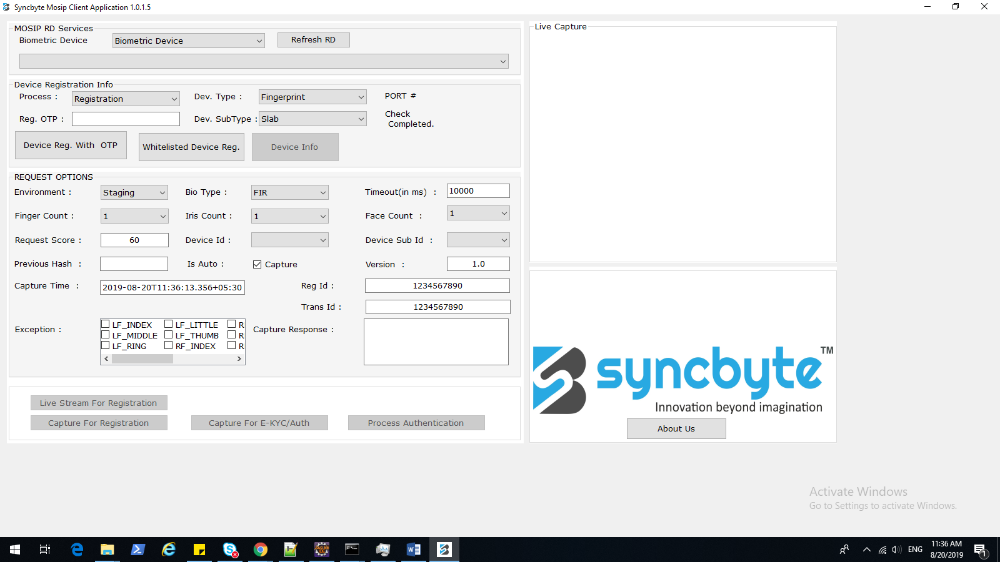
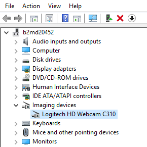

# Registration client - Real biometric device integration
   This document contains information regarding the installation of biometric devices and how to register the biometric device for capturing the biodata.
   
## REQUIRED BINARIES
   * SyncbyteMosipRDServiceSetup.exe
   * MosipClient_Debug.rar
   
### SyncbyteMosipRDServiceSetup.exe

    This is the service application which we have to run in order to install the driver dependencies of the concerned biometric devices, upon successful installation of this binary it will start an ever running service named SYNCBYTEMOSIPRDSERVICE.
	
### MosipClient_Debug.rar
    Upon unzipping this file you will find a runnable binary named MosipCleint.exe among other dependency files.
	
**MosipCleint.exe**
	Run this client application you will be prompted with a client UI  
		
		
MosipClient application is a client-side application which will be used to register the biometric devices such as fingerprint capturing device or iris capturing device to the **SYNCBYTEMOSIPRDSERVICE** which is running in the background.	

### Please follow the below-mentioned steps to register a biometric device with SYNCBYTEMOSIPRDSERVICE service

1. Connect the biometric device to the Laptop/Desktop through the USB port(make sure there is no restriction on your 
   machines USB port).
2. Start the MosipClient application by running MosipClient.exe file
3. Hit the button Refresh RD Upon hitting the button Refresh RD you will get the connected biometric device in a drop-down 
   below the Button, but the status of this device will be INACTIVE, I am assuming to connect a fingerprint device for the 
   purpose of this document
4. Configuring the DEVICE REGISTRATION INFO 
     Configure the following dropdowns 
		
	* Process		: Registration (Select from dropdown)
	* Dev. Type		: Fingerprint (Select from dropdown)
	* Reg. OTP		: MOS-4290-0604-2827 (Type, Set of OTP’s will be shared from the service provider)
	* Dev. SubType	: Slab (Select from dropdown)	
5. Hit the button Device Reg. With OTP 
6. Hit the button Refresh RD
7. Now you should be able to see (in the dropdown below Refresh RD button) the connected device will be in an ACTIVE state
8. Hit the button Device Info, you must get the response as mentioned below based on the connected device
9. Repeat the aforementioned steps to register some other device by changing the configuration accordingly.

### Device Info Response
 `[
  {
    "type": "Fingerprint",
    "subType": "Slab",
    "status": "READY",
    "deviceInfo": {
      "deviceId": "2a80d6ad-1dc8-496f-8b4a-dd78c36bdc55",
      "deviceSubId": [
        1,
        2,
        3
      ],
      "firmware": "FSM84C1.0",
      "deviceProviderName": "SYNCBYTE",
      "deviceProviderId": "SYNCBYTE.TCI322",
      "deviceModel": "DactyScan84c",
      "deviceMake": "Greenbit",
      "deviceExpiry": "2025-01-01T00:00:00.000+05:30",
      "certification": "L0",
      "timestamp": "2019-08-20T11:43:35.690+05:30"
    },
    "deviceInfoSignature": "MIIEJzCCAw+gAwIBAgIGAWxRROvlMA0GCSqGSIb3DQEBCwUAMIHCMSUwIwYJKoZIhvcNAQkBFhZzdXJlc2hiYWJ1QHN5bmNieXRlLmluMRgwFgYDVQQDEw9TVVJFU0ggQkFCVSBNQ0sxGzAZBgNVBAsTElNvZnR3YXJlIFNvbHV0a",
    "serviceVersion": "SB.WIN.001",
    "deviceSubId": [
      1,
      2,
      3
    ],
    "error": {
      "errorCode": "0",
      "errorInfo": "No Action Necessary."
    },
    "callbackId": "http://127.0.0.1:4501/"
  }
]
`

**Note:**  At any time you can check the log of any activity with the SYNCBYTEMOSIPRDSERVICE service either from the MosipClient or the code implementation

Location of the log file in windows machine:  **C:\Program Files\Syncbyte Innovations Private Limited\SyncbyteMosipRDService\MOSIPRDSERVICE.log**

## REGISTRATION OF PHOTO CAPTURE DEVICE
 Special measures should be in place when registering the photo capture device
 Apart from performing the above-mentioned steps, you have to specify the VID and PID of the connected device for the 
 service application.
 
### Follow the mentioned steps.

1. Find the VID and PID of the connected device (I have connected Logitech HD Webcam  to my machine)  
       * From windows, start panel go to  Device Manager  
       * In the device manager, you should see imaging devices among other devices  
           
       * Select Imaging devices it should give you the web came device that you have connected  
           
       * Click on the Device Information tab  
          
       * VID = 0x046D, PID = 0x081B

2. Please find the following **config.properties** file : **C:\Program Files\Syncbyte Innovations Private Limited\SyncbyteMosipRDService\source\ config.properties**
	And change the value of faceVID, and facePID to the VID and PID that you have found earlier.

