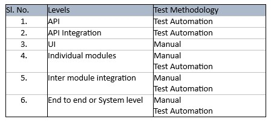
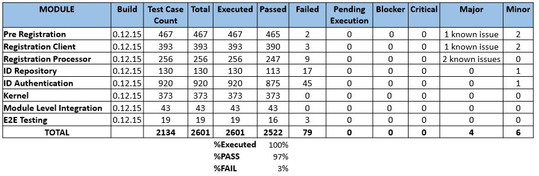

## Table Of Content

- [Scope](#scope-)
- [Documentation](#documentation-)
- [Key Points](#key-points-)
- [Code](#code-)
- [Test Reports](#test-reports-)
  * [1. In scope](#1-in-scope-)
  * [2. Not in scope](#2-out-of-scope--mosip-v01215-platform-)
  * [3. Executive Summary – Consolidated Quality Status](#3-executive-summary--consolidated-quality-status-)
  * [4. Types of Testing](#4-types-of-testing-)
  * [5. Test Execution Summary](#5-test-execution-summary-)
  * [6. Automation Test Reports](#6-automation-test-reports-)
- [Known Issues](#known-issues-)
- [Support Process (To Be Determined)](#support-process-to-be-determined-)
- [List Of Acronyms](#list-of-acronyms-)
## Scope [**[↑]**](#table-of-content)
This release is with **proxy biometrics**. This means that the implementation of Print system, SDK, MDM (MOSIP  Device Manager), ABIS (Automated Biometrics Identification System) and Biometric devices has been stubbed. Also, this version is tested for functionality. Non-functional requirements (Performance, Scale and Security) will be taken up in subsequent releases.

* Features included – Pre-Registration, Registration Client, Registration Processor, ID Authentication, Reference GUI implementation of Pre-Registration and Registration Client. 
* Features not included – Administration, Partner Management, Resident Services
## Documentation [**[↑]**](#table-of-content)
### 1. Platform Documentation 
Includes Functional requirements, Process flows, Architecture and High level design, Getting started and Deployment guide, Developer documentation etc.  
   [**Link to Platform Documentation**](Platform-Documentation)
### 2. Detailed Documentation
[**Low Level design**](/mosip/mosip/tree/0.12.0/docs/design) and [**Test cases excel**](/mosip/mosip/blob/master/docs/testing/Test%20automation/MOSIP-TCs-V1.0xlsx.xlsx)

## Key Points [**[↑]**](#table-of-content)

|Key Points|	Details|
|----|----|
|Pre Registration - Browser support |	Chrome 74.0.3729)|
|Deployment Script Environment|	Microsoft Azure|
|Registration Client – OS version|	Windows 10 (English version)  with TPM 2.0|
|Camera|	Logitech / Default windows camera|
|Scanner|	Canon lide 120|
|GPS|	GlobalSat BU-353-S4|
|Biometrics standard|	CBEFF format (Version - 0.12.15)|
|SMS gateway|	MSG91, Infobip|
|Registration Client – face capture |	OpenImaj - This is licensed for demo purpose only|
|Keystore|	SoftHSM|
|Antivirus|	ClamAV|
|Maps	|OpenstreetMap|
|Supporting key based digital signatures, not using digital certificates||	
|Transliteration|	ICU4J (Library with French, Arabic languages)|

## Code [**[↑]**](#table-of-content)
The code and automation tests are available on [**GitHub**](/mosip/mosip/tree/0.12.15). The code needs to be built and deployed as per the procedure documented in [**Building And Deploying MOSIP**](Platform-Documentation#10-building-and-deploying-mosip). We will actively support System Integrators during their first deployment.

## Tests [**[↑]**](#table-of-content)
**Testing Scope**
#### 1. In Scope [**[↑]**](#table-of-content)

|Title	|Description|
|------|------|
|Modules Tested|<li> Pre-registration (UI & Server) <li> Registration Client (UI & APIs) <li> Kernel (APIs) <li> Registration Processor (Server) <li> ID Authentication (APIs) <li> ID Repo (APIs)|
| Version Tag Tested|	0.12.15|
|Test Methodology| <li>  Manual <li>  Test Automation|
|Types of testing|<li>	 Smoke <li> Functional <li>  Integration <li> 	Regression|
|Testing Levels| |
|Configuration Parameters tested for| Refer to QA env properties file with suffix ‘qa’ in the filename, at [**Link**](/mosip/mosip-configuration/tree/master/config)|
|Browser Support|**Pre-Registration**    <li> Chrome – 74.0.3729.169|
|OS Support|**Registration Client**    <li> Windows 10|
|Language Support|French, Arabic, English|

#### 2. Not in Scope [**[↑]**](#table-of-content)

|Title|	Description|
|------|------|
|NFR Testing| <li> Scalability Testing <li> Performance Testing <li> Security Testing|
|Configuration Testing|<li> Testing is done for one set of approved production configuration <li> Changing the configuration parameters for various values (boundary values) and testing the impact of each such value on the platform code will be taken up in subsequent releases.|

#### 3. Executive Summary – Consolidated Quality Status [**[↑]**](#table-of-content)

|Sl. No.|	Module / Activity|Test Methodology|	Test Status|
|------|------|------|------|
|1|	Kernel	|<li> Test Automation	|PASS|	
|2|	Pre-Registration|<li> Tested Manually <li> Test Automation|PASS |
|3|	Registration Client|<li> Tested Manually <li> Test Automation|PASS|
|4|Registration Processor|<li> Tested Manually <li> Test Automation	|PASS |
|5|	ID Authentication	|	<li>  Test Automation	|PASS|
|6|	ID Repo	|	<li> Test Automation	|PASS|	
|7|Pre-Registration to Registration Client integration testing|	<li> Tested Manually|PASS	|	
|8|	Registration Client to Registration Processor integration testing|	<li> Tested Manually|PASS|	
|9|	Registration Processor to Pre-Registration integration testing|<li>  Tested Manually|PASS	|	
|10|	Registration Processor to Registration Client integration testing|<li> 	Tested Manually|PASS|
|11|	Registration Client to IDA integration testing|<li> 	Tested Manually|PASS		|
|12|	Registration Processor to IDA integration testing|<li> 	Tested Manually|PASS|
|13|	IDA to ID Repo|<li> 	Tested Manually|PASS	|
|14|Kernel API integration|	<li> Tested Manually <li> Test Automation|	PASS|
|15|	End to end functional testing|	<li> Tested Manually|PASS|	

#### 4. Types of Testing [**[↑]**](#table-of-content)

|Testing Type| Description|
|------|------|
|Smoke Testing|Tests to ensure basic workflows work fine|
|Functional Testing|Tests to ensure functionality of each module and overall system work fine in accordance with the given requirements|
|Integration Testing|Tests to ensure the inter module functionality works fine and in accordance with the integration requirements|
|Regression Testing|Tests to ensure that any change doesn't break existing functionality|
	
#### 5. Test Execution Summary [**[↑]**](#table-of-content)
  

#### 6. Automation Test Reports [**[↑]**](#table-of-content)
[**Automation report run on 0.12.15 on QA env**](/mosip/mosip/tree/master/docs/testing/Automation%20Test%20Reports)
## Known Issues [**[↑]**](#table-of-content)
 

## Support Process (To Be Determined) [**[↑]**](#table-of-content)
Process to be followed for support required, escalation matrix, etc.

## List Of Acronyms [**[↑]**](#table-of-content)
[**Refer to List Of Acronyms**](Platform-Documentation#12-list-of-acronyms)

