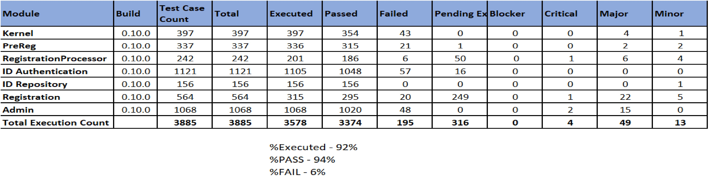

## Table Of Contents

- [Scope](#scope-)
- [Documentation](#documentation-)
- [Key Points](#key-points-)
- [Code](#code-)
- [Test Reports](#test-reports-)
  * [1. In scope](#1-in-scope-)
  * [2. Not in scope](#2-Not-in-scope-)
  * [3. Executive Summary – Consolidated Quality Status](#3-executive-summary--consolidated-quality-status-)
  * [4. Types of Testing](#4-types-of-testing-)
  * [5. Test Execution Summary](#5-test-execution-summary-)
- [Known Issues](#known-issues-)
- [List Of Acronyms](#list-of-acronyms-)
- [Deployment instructions](#deployment-instructions-)

## Scope [**[↑]**](#table-of-contents)
This release is with **real biometrics**. This means that MOSIP Platform is now integrated with SDK, MDS (MOSIP  Device Service), ABIS (Automated Biometrics Identification System) and Biometric devices. Also, this version is tested for Biometric functionalities. Non-functional requirements (Performance, Scale and Security) will be taken up in subsequent releases.

* Modules included
	* Pre-Registration 
	* Registration Client 
	* Registration Processor 
	* ID Authentication
	* Administration
	* Reference GUI implementation of Pre-Registration and Registration Client. 
* Modules not included
	* Partner Management
	* Resident Services
	* Reference GUI implementation of Administration

Module-wise features released as part of this release can be found [here](_files/release/1.0.0/MOSIP_Feature_Release_v1.0.0.xlsx)

## Documentation [**[↑]**](#table-of-contents)

### 1. Platform Documentation 
Includes Functional requirements, Process flows, Architecture and High level design, Developer documentation etc.

[Link to Platform Documentation](https://docs.mosip.io/platform/)

### 2. Detailed Documentation
* Low level design documents for respective modules is found below:
	* [Pre-Registration](https://github.com/mosip/pre-registration/tree/master/design/pre-registration)
	* [Registration Client](https://github.com/mosip/registration/tree/master/design/registration)
	* [Registration Processor](https://github.com/mosip/registration/tree/master/design/registration-processor)
	* [Authentication](https://github.com/mosip/id-authentication/tree/master/design/authentication)
	* {Administration](https://github.com/mosip/admin-services/tree/master/design/admin)
	* [ID Repository](https://github.com/mosip/commons/tree/master/design/kernel)
	* [Kernel](https://github.com/mosip/commons/tree/master/design/idrepository)
* Functional test documentation is found [here](https://github.com/mosip/mosip-functional-tests/tree/1.0.0).

### 3. Platform Configuration for RBR
MOSIP Platform can be configured to be used for Real Biometrics. Please find the [guide to configure MOSIP for real biometrics](Guide-to-configure-MOSIP-for-Real-Biometrics.md).

## Key Points [**[↑]**](#table-of-contents)

|Key Points|	Details|
|----|----|
|Pre Registration - Browser support |	Chrome 74.0.3729)|
|Deployment Script Environment|	Microsoft Azure|
|Registration Client – OS version|	Windows 10 (English version)  with TPM 2.0|
|Camera|	Logitech / Default windows camera|
|Scanner|	Canon lide 120|
|GPS|	GlobalSat BU-353-S4|
|Biometrics standard|	CBEFF format (Version - 0.9.0)|
|MOSIP Device Service (MDS)|	Version - 0.9.1|
|SMS gateway|	MSG91, Infobip|
|Registration Client – face capture |	OpenImaj - This is licensed for demo purpose only|
|Keystore|	SoftHSM|
|Antivirus|	ClamAV|
|Maps	|OpenstreetMap|
|Supporting key based digital signatures, not using digital certificates||	
|Transliteration|	ICU4J (Library with French, Arabic languages)|

## Code [**[↑]**](#table-of-contents)
The code and [automation tests](https://github.com/mosip/mosip-functional-tests/tree/1.0.0) are available on [GitHub](https://github.com/mosip/). The code needs to be built and deployed as per the procedure documented in [**Building And Deploying MOSIP**](Build-and-Deploy.md). We will actively support System Integrators during their first deployment.

## Test Reports [**[↑]**](#table-of-contents)
**Testing Scope**
#### 1. In scope [**[↑]**](#table-of-contents)

|Title	|Description|
|------|------|
|Modules Tested|<li> Pre-registration (UI & Server) <li> Registration Client (UI & APIs) <li> Kernel (APIs) <li> Registration Processor (Server) <li> ID Authentication (APIs) <li> ID Repository (APIs) <li> Administration (UI & APIs)|
| Version Tag Tested|	1.0.0|
|Test Methodology| <li>  Manual <li>  Test Automation|
|Types of testing|<li>	 Smoke <li> Functional <li> Integration <li> Regression|
|Testing Levels| |
|Configuration Parameters tested for| Refer to properties file at [**Link**](https://github.com/mosip/mosip-config/tree/1.0.0)|
|Browser Support|**Pre-Registration**    <li> Chrome – 78.0.3904.108|
|OS Support|**Registration Client**    <li> Windows 10|
|Language Support|French, Arabic, English|

#### 2. Not in scope [**[↑]**](#table-of-contents)

|Title|	Description|
|------|------|
|NFR Testing| <li> Scalability Testing <li> Performance Testing <li> Security Testing|
|Configuration Testing|<li> Testing is done for one set of approved production configuration <li> Changing the configuration parameters for various values (boundary values) and testing the impact of each such value on the platform code will be taken up in subsequent releases.|

#### 3. Executive Summary – Consolidated Quality Status [**[↑]**](#table-of-contents)

|Sl. No.|	Module / Activity|Test Methodology|	Test Status|
|------|------|------|------|
|1|	Kernel	|<li> Test Automation	|PASS|	
|2|	Pre-Registration|<li> Test Automation|PASS |
|3|	Registration Client|<li> Tested Manually <li> Test Automation|PASS|
|4|Registration Processor|<li> Tested Manually <li> Test Automation	|PASS |
|5|	ID Authentication	|	<li>  Test Automation	|PASS|
|6|	ID Repo	|	<li> Test Automation	|PASS|	
|7|Pre-Registration to Registration Client integration testing|	<li> Tested Manually|PASS	|	
|8|	Registration Client to Registration Processor integration testing|	<li> Tested Manually|PASS|	
|9|	Registration Processor to IDA integration testing|<li> 	Tested Manually|PASS|
|10| IDA to ID Repo|<li> 	Tested Manually|PASS	|

#### 4. Types of Testing [**[↑]**](#table-of-contents)

|Testing Type| Description|
|------|------|
|Smoke Testing|Tests to ensure basic workflows works fine|
|Functional Testing|Tests to ensure functionality of each module and overall system work fine in accordance with the given requirements|
|Integration Testing|Tests to ensure the inter module functionality works fine and in accordance with the integration requirements|
|Regression Testing|Tests to ensure that any change doesn't break existing functionality|
	
#### 5. Test Execution Summary [**[↑]**](#table-of-contents)
  

## Known Issues [**[↑]**](#table-of-contents)
 

## List Of Acronyms [**[↑]**](#table-of-contents)

Acronym | Expanded Form
-----|-----------------
ABIS | Automated Biometric Identification System
API | Application Programming Interface
ID | Identity
IDA | Identity Authentication
MOSIP | Modular Open Source Identity Platform
NFR | Non-Functional Requirements
OTP | One Time Password
SDK | Software Development Kit
TBD | To Be Determined
TOTP| Temporary One Time Password
UIN | Unique Identification Number
WIP | Work In Progress
CBEFF | Common Biometric Exchange Formats Framework
HSM | Hardware Security Module
TPM | Trusted Platform Module
SDK | Software Development Kit
MDS | MOSIP Device Service

## Deployment instructions [**[↑]**](#deployment-instructions)
Deployment instructions are available [here](https://github.com/mosip/mosip-infra-mt/tree/master/releases/1.0.0).