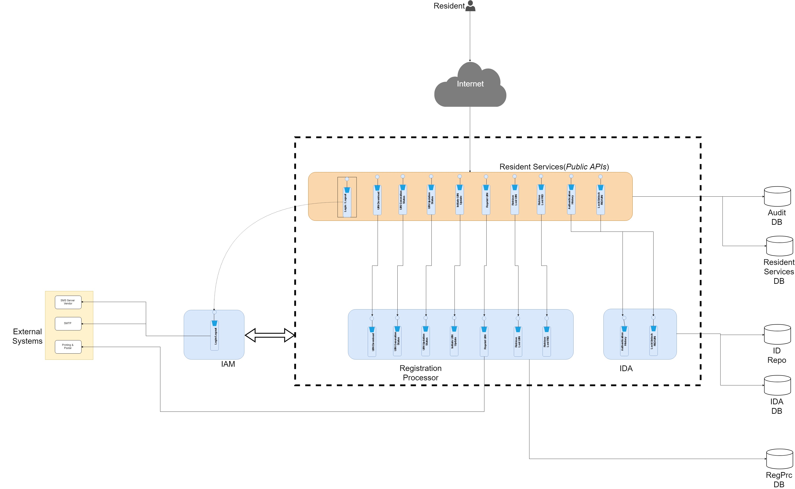

Resident services are the self services which is used by the resident themselves for the functionalities. The resident can login to the portal and do the functionalities such as lock/unlock authentication types, reprint UIN, view his/her authentication history etc., The services uses only the OTP method of authentication. 

## Architecturally Significant Use Cases
Following are the architecturally significant use cases which affects the architectural principles, 

### Ease of use
The user have to use these services with ease of use. Only the OTP is used as the means of authentication. Security is a trade off for the usability. There is no multi factor authentication is implemented except for OTP, to make the life of the user easy. 

### Secured services
The Resident services which can be invoked from the public domain should be secured enough, when the request goes to the backend modules such as Registration processor and ID Repository. The backend modules are highly protected and the permissions are added from the server side after the one-time OTP authentication is successful from the client side. 
The resident services are classified as "Public" services and in turn will call the "Private" services of Registration Processor or IDA. 
Except for the "/login" functionality, all the services in both the Public and Private area should be defined with authorization. 

### Expected work around time
The functionalities such as printing a new UIN card will be sent to a third parties for further action. During these actions no further actions of callbacks are handled by the Resident services. But, the result of the posting actions to these 3rd parties are tracked and maintained as part of the Resident services. 

### Performance
Since the Resident Services are public facing APIs, performance plays the key part. All the services should adhere to the minimum SLA which is defined. 

### Auditing
All the service calls should be audited properly for the later review purpose. Since, this is a public facing services, auditing plays an important role for various audits such as performance audit, security audit and for analysis purposes. 

## Logical view

