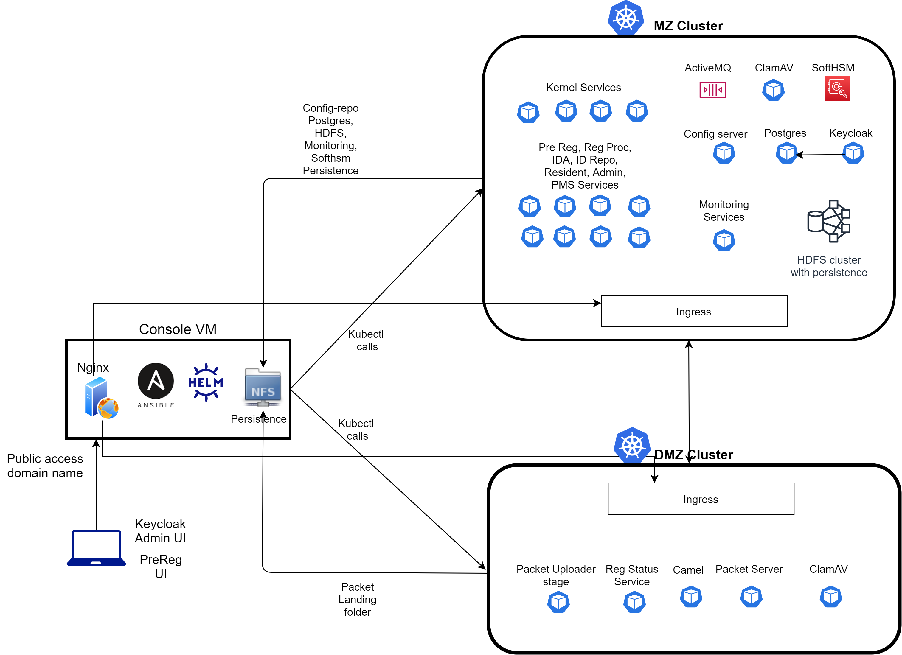

# Sandbox Installer

## Overview

The Sandbox is a safe environment isolated from your PC's underlying environment. You may use the sandbox to execute files without having to worry about malicious files or unstable programs impacting data on the system.

### System Requirement

This section describes handy information that is useful to know when operating the Sandbox Installer which is tested under mentioned configuration.

| Component | Number of VMs | Configuration | Persistence |
| :--- | :--- | :--- | :--- |
| Console | 1 | 4 vCPU\*, 16 GB RAM | 128 GB SSD\*\* |
| K8s MZ master | 1 | 4 vCPU, 8 GB RAM | 32 GB |
| K8s MZ workers | 9 | 4 vCPU, 16 GB RAM | 32 GB |
| K8s DMZ master | 1 | 4 vCPU, 8 GB RAM | 32 GB |
| K8s DMZ workers | 1 | 4 vCPU, 16 GB RAM | 32 GB |

\*vCPU: Virtual CPU

\*\* Console has all the persistent data stored under `/srv/nfs`. Recommended storage here is SSD or any other high IOPS disk for better performance

## Introduction

The Multi-VM Sandbox Installer is a fully automated deplorer that incorporates all MOSIP modules into a virtual machine cluster that can be either cloud or on premise.

The sandbox can be used for development and testing, while the Ansible scripts run MOSIP on a multi-virtual machine \(VM\) setup. 

_**Caution**_ - The sandbox is not intended for use by serious pilots or for production purposes. Also, do not run the sandbox with any confidential data.

### Minibox

In Minibox, note that for any form of load or multiple pod replication scenarios, this may not be sufficient. It is possible, however, to enable the feature to bring up MOSIP modules with lesser VMs as below:

| Component | Number Of VMs | Configuration | Persistence |
| :--- | :--- | :--- | :--- |
| Console | 1 | 4 vCPU\*, 16 GB RAM | 128 GB SSD |
| K8s MZ master | 1 | 4 vCPU, 8 GB RAM | 32 GB |
| K8s MZ workers | 9 | 4 vCPU, 16 GB RAM | 32 GB |
| K8s DMZ master | 1 | 4 vCPU, 8 GB RAM | 32 GB |
| K8s DMZ workers | 1 | 4 vCPU, 16 GB RAM | 32 GB |

## Precondition

_**Terraform**_ is a tool to securely and efficiently develop, edit, and update infrastructure. Using Terraform scripts available in _`terraform/`._the initial installation stage is achieved. AWS scripts are being used and maintained at present.

It is strongly recommended that the scripts be analyzed in depth before running them.

### Virtual Machines \(VMs\) Setup

Before, MOSIP modules installation process that runs on a preset time or when a predefined condition, need to have VMs set up on all Machines. The user must ensure if the **CentOS 7.8 OS** is installed on all the machines:

1. Create user 'mosipuser' on console machine with password-less _`sudo su`_
2. The hostname must match hostnames in `hosts.ini` on all machines. Set the same with

   ```text
   $ sudo hostnamectl set-hostname <hostname>
   ```

3. Enable Internet access on all machines
4. Disable _firewalld_ on all machines
5. Exchange `ssh` keys between console machines and K8s cluster machines so that ssh is password-less from console machines:

   ```text
   $[mosipuser@console.sb] ssh root@<any K8s node>
   $[mosipuser@console.sb] ssh mosipuser@console.sb
   ```

6. Make the console machine available via a public domain name \(e.g. sandbox.mycompany.com\)

   \(When you do not intend to access the sandbox externally, this step can be skipped\)

7. Ensure the date/time is in UTC on all machines
8. Open ports 80, 443, 30090 \(postgres\), 30616 \(activemq\), 53 \(coredns\) on console machine for external access
9. Make sure your firewall doesn't block the UDP ports \(s\)

### Software Prerequisites

To ensure proper installation, install these pre-requisites manually:

* Git
* Git Clone
* Ansible

On the Installation Options, click git to install on your machine:

```text
$ sudo yum install -y git
```

In User Home Directory, select **Git Clone** and switch to appropriate branch:

```text
$ cd ~/
$ git clone https://github.com/mosip/mosip-infra
$ cd mosip-infra
$ git checkout 1.1.2
$ cd mosip-infra/deployment/sandbox-v2
```

Install Ansible and create shortcuts:

```text
$ ./preinstall.sh
$ source ~/.bashrc
```

## Sandbox Architectural View



## Installing MOSIP

This section helps you to plan an installation of MOSIP suited to your environment. Before installing MOSIP, it is recommended that the scripts be analyzed in depth before running them.

### Site Settings

* Suited to your configuration, update hosts.ini. Make sure your configuration matches the system names and IP addresses
* In `group_vars/all.yml` change `sandbox_domain_name` to domain name of the console machine
* By default, installation scripts will try to fetch Letsencrypt's new SSL certificate for the above domain. If you already have the same, however, then set the following variables in the file group **`group_vars/all.yml`:**

```text
ssl:
get_certificate: false
email: ''
certificate: <certificate dir>
certificate_key: <private key path>
```

### Network Interface

It is the interconnection between a computer and a public or private network. If it is other than “**eth0**” by your cluster machines, update it to `group_vars/k8s.yml`

```text
network_interface: "eth0"
```

### Ansible Vault

In the Ansible vault _`secrets.yml`_file, all the secrets \(passwords\) used in automation are stored. To access the file, the default password is **'foo'**. Changing this password with the following command is recommended:

```text
$ av rekey secrets.yml
```

The contents of `secrets.yml` can be viewed and edited based on following command:

```text
$ av view secrets.yml
$ av edit secrets.yml
```

### Install MOSIP

When this equipment is connected to your machine it allows you to install MOSIP modules using command:

```text
$ an site.yml
```

If a message prompting you for password, enter default vault password **"foo"** to proceed installation.

## MOSIP Configuration

This section provides the following major sections to describe how to configure and verify the proper interface. The sandbox installs with default general configuration. To configure MOSIP differently, refer to the following sections:

* [DNS](#domain-name-system-dns)
* [Local docker registry](#local-docker-registry)
* [Private dockers](#private-dockers)
* [Sandbox access](#sandbox-access)
* [Secrets](#secrets)
* [Config server](#config-server)
* [Pre-Reg captcha](#pre-reg-captcha)
* [OTP](#otp-setting)
* [Master data](#master-data)
* [Pod replication](#pod-replication)
* [Taints](#taints)
* [TPM](#tpm-for-reg-client)
* [Pre-Registration Schema](#configure-pre-reg-for-id-schema)
* [Registration client](#registration-client-with-mock-mds-and-mock-sdk)

### Domain Name System (DNS)

DNS translates human readable domain names to machine readable IP addresses. A private DNS _\(CoreDNS\)_ is mounted on the console machine by default, and **`/etc/resolv.conf`** refers to this DNS on all machines.

However, if you want to use DNS cloud providers \(like Route53 on AWS\), disable the installation of a private DNS by setting the following flag:

```text
group_vars/all.yml:
    coredns:
      enabled: false  # Disable to use Cloud provided DNS
```

Ensure your DNS routing is taken care of by your cloud deployment. Uncomment the Route53 code for AWS in the scripts given in the:

```text
terraform/aws/sandbox
```

The **`corends.yml`** ``playbook configures the CoreDNS and updates the **`/etc/resolv.conf`** file for all devices. If a system needs to be restarted, re-run the playbook to restore **`/etc/resolv.conf`**.

### Local Docker Registry

This part contains information about hosting your own registry using the Local Docker Registry.

**Local Registry on Console**

Instead of using the default Docker Hub, you may run a local Docker registry. This is particularly useful when the Kubernetes cluster is sealed for protection on the Internet. With this sandbox, a sample Docker registry implementation is available, and you can run the same by triggering the following in **`group_vars/all.yml`**.

```text
    docker:
      local_registry:
        enabled: true
        image: 'registry:2'
        name: 'local-registry'
        port: 5000
```

Notice that this register is running on the computer on the console and can be accessed as **`console.sb:5000`**. Control is through _**http**_ and not through _**https**_.

Ensure that in this registry you pull all the appropriate Dockers and update **`versions.yml`**.

_**Caution**_: If you delete/reset this registry or restart the console computer, all the registry contents will be lost and the Dockers will have to be removed again.

**Additional Local Registries**:

If you wish to have additional local registries for Dockers, then list them here:

```text
    docker:
      registries:
        - '{{groups.console[0]}}:{{local_docker_registry.port}}'   # Docker registry running on console
```

The list here is necessary to ensure that _**http**_ access from cluster machines is allowed for the above registries.

### Private Dockers

When you set up a private registry, you assign a server to communicate with Docker Hub over the internet. If you are pulling Dockers in Docker Hub from the private registry, then provide _**`secrets.yml`**_ with the Docker Hub credentials and set the following flag in:

```text
group_vars/all.yml
```

Update with **`versions.yml`** your Dockers versions.

### Sandbox Access

When installing the default Sandbox, you must have a public domain name, so that the domain name refers to the console computer. However, if you want to access your internal network's Sandbox \(for example via VPN\), set the following in **`group_vars/all.yml`**:

```text
    sandbox_domain_name: '{{inventory_hostname}}'
    site:
      sandbox_public_url: 'https://{{sandbox_domain_name}}'
      ssl:
        ca: 'selfsigned'   # The ca to be used in this deployment.
```

A self-signed certificate is created and the sandbox access URL is [https://{{inventory](https://{{inventory) hostname}}'

### Secrets

All secrets are stored in **`secrets.yml`**. Edit the file and change all of the passwords for a secure Sandbox. For creation and testing, defaults will be used, but be aware that the sandbox will not be secure with defaults. In order to edit **`secrets.yml`**.

```text
$ av edit secrets.yml
```

If you update PostGres passwords, you will need to update their ciphers in the property files. See the section below on Config Server. To be able to find out the text password, all the passwords used **`in. properties`** were added to **`secrets.yml`**- some of them for purely informational purposes.

_**Caution**_ : Make sure that **`secrets.yml`** is updated when you change any password _**`in. properties`**_.

### Config Server

_**Config server**_ is one of the more popular centralized configuration servers used in a micro service-based application. For all modules, configurations are defined through property files located in the GitHub repository. For example, for this sandbox, the properties are located within the sandbox folder at [https://github.com/mosip/mosip-config](https://github.com/mosip/mosip-config).

You can have a repository of your own with a folder containing files for properties. On GitHub, the repo will be private. In group **`vars/all.yml`**, configure the following parameters as below \(example\):

```text
config_repo:
  git_repo_uri: https://github.com/mosip/mosip-config
  version: 1.1.2
  private: false
  username: <your github username>
  search_folders: sandbox
  local_git_repo:
    enabled: false
```

If private: true, then, in **`group vars/all.yml`**, update your GitHub username as above. Please change the password to **`secrets.yml`**:

```text
config_repo:
    password: {YOUR GITHUB PASSWORD}
```

The repo is cloned to the NFS mounted folder if local git repo is allowed, and the config server pulls the properties locally. This option is useful if the sandbox is secured without access to the Internet. You should search git-in locally for any changes. Remember, however, that you will have to push them manually if you want the changes to be reflects in the parent GitHub repo. When making improvements to the configuration repo, there is no need to restart the _config-server pod_.

If you have updated the default passwords in **`secrets.yml`**, create these password ciphers and update the changed password property files. After the config server is up, the ciphers can be created from the console machine using the following curl command:

```text
$  curl http://mzworker0.sb:30080/config/encrypt -d  <string to be encrypted>
```

The above command connects via input to the Config server pod of the MZ cluster. You may also use the script to encrypt all the secrets at once by the following methods:

```text
Context:
```

Several secrets are required in Ansible's **`secrets.yml`** in the config server property files. We use config server encryption to encrypt the secrets in order to prevent explicit text secrets in properties using the following command:

```text
curl http://mzworker0.sb:30080/config/encrypt -d  <string to be encrypted>
```

The script here converts all secrets in **`secrets.yml`** using above command implemented in Python.

**Prerequisites:**

* Install required modules using

  ```text
  $ ./preinstall.sh
  ```

* Ensure config server is running

  ```text
  Config
  ```

* Set the server URL in `config.py`
* If the URL has an HTTPS certificate and the SSL server is self-signed, set 

  ```text
    ssl verify=False
  ```

* Run the following command:

  ```text
  $ ./convert.py {secrets_file_path}
  ```

  In this sandbox **`secrets_file_path`** is **`/home/mosipuser/mosip-infra/deployment/sandbox-v2/secrets.yml`**

  Output is saved in **`out.yaml`**.

### Pre-Reg Captcha

Captcha protects your website from fraud and abuse. It uses an advanced risk analysis engine and adaptive challenges to keep malicious software.

* Get Captcha for the sandbox domain from "Google Re-captcha Admin" if you would like to allow Captcha for Pre-Reg UI. Get **reCAPTCHA v2** keys for _**"I'm not a robot"**_
* Set Captcha as:

  ```text
  google.recaptcha.site.key=sitekey
  google.recaptcha.secret.key=secret
  ```

### OTP Setting

* As below, to receive OTP \(one-time password\) over email and SMS set properties:
  * **SMS**
    * File:

      `kernel-mz.properties`
* Properties:

  `kernel.sms`

* **Email**
  * File:

    `kernel-mz.properties`
* Properties

  ```text
  mosip.kernel.notification.email.from=emailfrom
  spring.mail.host=smtphost
  spring.mail.username=username
  spring.mail.password=password
  ```

* You may want to run MOSIP in Proxy OTP mode if you do not have access to Email and SMS gateways, in that case you can skip Proxy OTP Settings.
* To run MOSIP in Proxy OTP mode set the following:

  ```text
    Proxy:
        File: application-mz.properties
        Properites:
            mosip.kernel.sms.proxy-sms=true
            mosip.kernel.auth.proxy-otp=true
            mosip.kernel.auth.proxy-email=true
  ```

  _**Note**_ : The default OTP is set to **111111**.

### Master Data

Before you start installing the sandbox, load country-specific master data:

* Ensure the Master Data **`.csv`** files are available in a folder, say **`my_dml`**
* Add the following line in **`group_vars/all.yml`** ``-&gt; **databases** -&gt; **`mosip_master`**

  ```text
        mosip_master:
        sql_path: '{{repos.commons.dest}}/db_scripts'
        dml: 'my_dml/'
  ```

### Pod Replication

For production setups you may want to replicate pods more than the default replication factor of **1**. Upgrade `podconfig.yml` to the same file. A separate production file can be generated and pointed to from **`group vars/all.yml`** ``--&gt; `podconfig` file.

### Taints

A taint allows a node to refuse pod to be scheduled unless that pod has a matching toleration. _Kubernetes_ offers the functionality of taints to run a pod solely on a node. This is especially useful during performance tests where you would like to assign different nodes to non-MOSIP components.

By default, in the sandbox, taints are not added. The following modules have been provided with provisions to allow taints for:

* Postgres
* Minio
* HDFS

  Set the following in group **`vars/all.yml`** to allow **`taint`. EXAMPLE:**

  ```text
  postgres:
    ...
    ...
    node_affinity:
        enabled: true # To run postgres on an exclusive node
        node: 'mzworker0.sb' # Hostname**. Run only on this node, and nothing else should run on this node
    taint:
        key: "postgres" # Key for applying taint on node
        value: "only"
  ```

  The node here is the machine on which you would like to exclusively run the module.

Ensure the above setting is done before you install the sandbox.

### TPM for Reg Client

By default, the sandbox installs a disabled Trusted Platform Module \(TPM\) Reg Client Downloader.

**Reg Client Downloader**:

```text
    #Playbook
    to install
    reg-client
    downloader
        #Inputs:
        #kube_config
        #prepare folder on nfs
        -hosts:console
        gather facts:true
        vars:
            reg_prop: '{{reg_client}}'
        roles:
        -{role: reg-client-prep}
```

Convert helm template to helm values:

```text
    - hosts: console
        vars:
        kube_config: '{{clusters.dmz.kube_config}}'
        install_name: 'reg-client-downloader' 
        helm_chart: '{{charts_root}}/reg-client-downloader'
        is_template: true
        helm_namespace: 'default'
        helm_values: '{{charts_root}}/reg-client-downloader/values.template.j2'
        helm_strings: ''
        roles:
            - {role:  helm}
```

To enable TPM to use trusted private/public Reg client machine private/public keys, do the following:

1. Update the registered client downloader TPM environment variable:

   ```text
    File: helm/charts/reg-client-downloader/values.template.j2
    Change:
    tpm: "Y"
   ```

2. If, before installing the sandbox, you have done the above, then you may skip this step. Otherwise, if the downloader reg client is already running on your sandbox, delete it and restart as follows:

   ```text
   $ helm2 delete reg-client-downloader
   ```

   \(Wait for all resources to get terminated\)

```text
    $ sb
    $ an playbooks/reg-client-downloader.yml
```

1. Add the name and public key in MOSIP-master/machine-master and MOSIP-master/machine-master table of the registered client machine in DB. Using TPM Utility, you can get your machine's public key

```text
    **TPM Utility**:
```

Utility to obtain public TPM keys along with the name of the computer

**Prerequisites:**

```text
Requires Java 11
```

**Build:**

```text
    $ mvn clean install
```

**Run:**

```text
    $ java -jar tpmutility-0.0.1.jar
```

\(Use jar-with-dependencies to run under target folder\)

```text
    Sample Output:
    {"machineName" : "S540-14IWL", "publicKey" : "AAEACwACAHIAIINxl2dEhLP4GpDMjUal1yT9UtduBlILZPKh2hszFGmqABAAFwALCAAAAQABAQDiSa_AdVmDrj-ypFywexe_eSaSsrIoO5Ns0jp7niMu4hiFIwsFT7yWx2aQUQcdX5OjyXjv_XJctGxFcphLXke5fwAoW6BsbeM__1Mlhq9YvdMKlwMjhKcd-7MHHAXPUKGVmMjIJe6kWwUWh7FaZyu5hDymM5MJyYZRxz5fRos_N9ykiBxjWKZK06ZpIYI6Tj9rUNZ6HAdbJH2RmBHuO0knpbXdB-lnnVhvArAt3KWoyH3YzodHeOLJRe_Y8a-p8zRZb5h1tqlcLgshpNAqb-WJgyq2xDb0RJwzuyjjHPmJrDqlBMXHestz-ADRwXQL44iVb84LcuMbQTQ1hGcawtBj", "signingPublicKey": "AAEABAAEAHIAAAAQABQACwgAAAEAAQEAw6CuS_sekZ02Z9_N3zz1fK_V3wm01PBcFM0nURerczjO2wqIxfmXpQQql3_S819nj_MwtkZ8K2ja0MRUJzJrmmbgBreFIGTa7Zhl9uAdzKghAA5hEaXV1YcxIl8m72vZpVX_dgqYzU8dccfRChsA-FxkVe5DCr_aXjVOUHjeXZRhQ1k-d7LzpBPVz-S69rx6W3bbxaZfV25HM93Hfm5P4aarYy0Wt0fJvv-Lmbyt0SIZFOQkYS8coW0-u8OiXm3Jur2Q8pu16q4F-Qpxqym-ACBFIsbkSCngQ_y4zGniK7WnS-dCSVhC-x1NscCq3PyXhoJOjSOdNqUkDX606Ic3SQ", "keyIndex": "BD:11:54:33:44:F9:5A:0B:B5:A6:B3:C1:F7:A8:28:47:0E:AA:20:21:01:16:37:89:D1:9C:8D:EC:96:5D:F5:A6", "signingKeyIndex": "41:EB:7E:7F:4F:A9:24:55:4C:5F:AB:3A:94:81:CF:75:C2:0B:92:DF:9B:89:47:D1:AD:B0:84:7A:F7:65:6A:88"}
```

**Machine Master Table:**

The publicKey, signingPublicKey, keyIndex and _signingKeyIndex_ - all of them to be populated in the _`machine_master`_ table of _`mosip_master` DB_.

1. Download the registered client from [https://{{sandbox](https://{{sandbox) domain name}}/registration-client/1.1.3/reg-client.zip

### Configure Pre-Reg for ID Schema

The sandbox comes with its default ID Schema \(in Master DB, `identity_schema` table\) and Pre-Reg UI Schema pre-registration-`demographic.json`. In order to use different schemas, do the following:

1. Ensure new ID Schema is updated in Master DB, _`identity_schema`_ `table`
2. Replace _`mosip-config/sandbox/pre-registration`-`demographic.json`_ with new Pre-Reg UI Schema
3. Map values in `pre-registration-identity-mapping.json` to `pre-registration-demographic.json` as below:

   ```text
         {
     "identity": {
         "name": {
             "value":< id of name field in your demograhic json >
             "isMandatory" : true
         },\
         "proofOfAddress": {
             "value" : < id of proof of address field in your demographic json>
         },
         "postalCode": {
              "value" : <  id of postal code field in your demographic json>
         }
     }
     }
   ```

4. Update the following properties in pre-registration-`mz.properties preregistartion.identity.name=< identity.name.value (above)>          preregistration.notification.nameFormat=< identity.name.value>`
5. Restart the Pre-Reg Application service

### Registration Client with Mock MDS and Mock SDK

**Download Reg Client:**

* Download zip file from:

  ```text
  https://{sandbox domain name}/registration-client/1.1.3/reg-client.zip
  ```

* Unzip the file and launch registered client by running _`run.bat`_
* Reg client will generate public/private keys in the following folder

  ```text
    c:\Users\<user name>\.mosipkeys
  ```

* You will need the public key and key index mentioned in _`readme.txt`_ for the later step to update master DB

**Run MDS:**

* Run mock MDS as per procedure give here: Mock MDS
* Pickup device details from this repo. You will need them for device info updates in the later step

**Add Users in Keycloak:**

* Make sure keycloak admin credentials are updated in **`config.py`**
* Add users like registration officers and supervisors in **`csv/keycloak_users.csv`** with their roles
* Run

  ```text
        **$ ./keycloak_users.py**
  ```

  **Update Master Data:**

* In the master DB DML directory, change the following CSVs. The DMLs are located in the `sandbox at /home/mosipuser/mosip-infra/deployment/sandbox-v2/tmp/commons/db-scripts/mosip-master/dml`
  * master-device\_type.csv
  * master-device\_spec.csv
  * master-device\_master.csv
  * master-device\_master\_h.csv
  * master-machine\_master.csv
  * master-machine\_master\_h.csv
  * master-user\_detail.csv
  * master-user\_detail\_h.csv
  * master-zone\_user.csv
  * master-zone\_user\_h.csv
* Run 

  ```text
  *update_masterdb.sh
  ```

  Example:

  ```text
        $ ./update_masterdb.sh /home/mosipuser/mosip-infra/deployment/sandbox-v2/tmp/commons/db_scripts/mosip_master
  ```

* _**CAUTION**_ : The above will reset entire DB and load it fresh
* You may want to maintain the DML directory separately in your repo
* It is assumed that all other tables of master DB are already updated

Device Provider Partner Registration:

* Update the following CSVs in PMS DML directory. On sandbox the DMLs are located at `/home/mosipuser/mosip-infra/deployment/sandbox-v2/tmp/partner-management-services/db_scripts/mosip_pms/dml`
  * pms-partner.csv
  * pms-partner\_h.csv
  * pms-policy\_group.csv
* Run _`update_pmsdb.sh`_. Example:

  ```text
    $ ./update_regdevicedb.sh /home/mosipuser/mosip-infra/deployment/sandbox-v2/tmp/commons/db_scripts/mosip_regdevice
  ```

* _**CAUTION\***_: The above will reset entire DB and load it fresh
* Some example CSVs are located at `csv/regdevice`

**IDA Check:**

Disable IDA check in registration-`mz.properties`:

```text
mosip.registration.onboarduser_ida_auth=N
```

**Launch Reg Client:**

1. Set Environment Variable `mosip.hostname` to {sandbox domain name}
2. Login as a user \(e.g. 110011\) with password \(MOSIP\) to login into the client

**Integrations**

_**Guide to Work with Real HSM**_

**Introduction:**

The default sandbox uses simulator of HSM called SoftHSM. To connect to a real HSM you need to do the following:

1. Create `client.zip`
2. Update MOSIP properties
3. Point MOSIP services to HSM

**client.zip:**

The HSM connects over the network. _`Client.zip`_, which is a package of self-dependent **PKCS11**_`client.zip`_ file is extracted from the artifactory when Dockers launch, unzipped, and install.sh is executed.

The zip must fulfil the following:

* Contain an `install.sh`
* Available in the artifactory

**`install.sh`**

This script must fulfil the following:

* Have executable permission
* Set up all that is needed to connect to HSM
* Able to run inside Dockers that are based on Debian, inherited from OpenJDK Dockers
* Place HSM client configuration file in `mosip.kernel.keymanager.softhsm.config-path` \(see below\)
* Not set any environment variables. If needed, they should be passed while running the MOSIP service Dockers

**Properties:**

Update the following properties in Kernel and IDA property files:

```text
mosip.kernel.keymanager.softhsm.config-path=/config/softhsm-application.conf
mosip.kernel.keymanager.softhsm.keystore-pass={cipher}<ciphered password>
mosip.kernel.keymanager.softhsm.certificate.common-name=www.mosip.io
mosip.kernel.keymanager.softhsm.certificate.organizational-unit=MOSIP
mosip.kernel.keymanager.softhsm.certificate.organization=IITB
mosip.kernel.keymanager.softhsm.certificate.country=IN
```

Ensure you restart the services after this change.

**Caution:** The password is highly critical. To encrypt it, make sure you use a really strong password \(using Config Server encryption\). In addition, Config Server access should be very tightly regulated.

**Artifactory:**

Artifactory is built as a Docker in the sandbox and accessed via services. In that Docker, replace the _`client.zip`_. The changed Docker can be uploaded to your own Docker Hub registry for subsequent use.

**HSM URL**

HSM is used by Kernel and IDA services. Point the TCP URL of these services to new HSM host and port:

```text
hsmUrl: tcp://{hsm host}:{port}
```

The above parameter is available in the Helm Chart of respective service.

**Integrating Antivirus Scanner**

In MOSIP, virus scanners can be implemented at different levels. ClamAV is used as an antivirus scanner by default. If you want your anti-virus \(AV\) to be incorporated, the same can be achieved as follows:

**Registration Client**

Running your AV on the registration client machine is sufficient. Not required for integration with MOSIP.

**Server**

This is implemented as a part of _**Kernel ClamAV**_ project project. MOSIP uses this project to scan registration packets. You may integrate your anti-virus \(AV\) in the following ways:

* _Option 1_

  The registration packets are stored in Minio. Several AVs provide traffic flow analysis in line with the stream to defend against hazards. This form of implementation based on the network can be carried out without any alteration of the MOSIP code. But to ensure that network traffic passes through your AV, a careful network configuration is required.

* _Option 2_

  To support your AV at the code level, the following Java code has to be altered. In `VirusScannerImpl.java`, the `scanFile/scanFolder/scanDocument` API must be implemented with your AV SDK.

**BioSDK Integration**

In `reg client`, `reg proc`, and `ida`, the biosdk library is included. The guide offers steps for these integrations to be enabled here.

**Integration with IDA** 

It is expected that Biosdk will be available as an HTTP service for IDA. The ID Authentication module then calls this service. To build such a service, refer to the _reference implementation_. `/service` contains service code; while `/client` contains client code that is combined with the IDA that connects to the service. This service can be operated as a pod or hosted outside the cluster within the Kubernetes cluster.

It is important to compile the client code into biosdk.zip and copy it to Artifactory. It is currently available at the following address:`/artifactory/libs-release-local/biosdk/mock/0.9/biosdk.zip`. This zip is downloaded by IDA dockers and installed during docker startup.

**Integration with Reg Proc**

The above service works for `regproc` as well.

**Integration of External Postgres DB**

**Sandbox Parameters**

```text
    TBD
```

\*\*\*\*

Make sure the Postgres is configured as 'UTC' for the time zone. This configuration is set to `postgresql.conf` when you install Postgres.

**Integration with External Print Service**

_**Introduction**_

MOSIP provides a reference implementation of print service that interfaces with the MOSIP system.

**Integration Steps**

Ensure the Following: 

1.  Compliant libraries, is reqartifactoryervices to link to HSM. MOSIP services install the same thing before the services start. The HSM vendor must have this library. The 1. Websub runs as [`https://{sandbox`](https://{sandbox) `domain name}/websub` on MOSIP and is accessible externally via Nginx. Websub runs on DMZ and nginx in the sandbox as configured for this access 
2.  Your service is able to register a topic with Websub with a callback url  
3. The callback url is accessible from MOSIP websub 
4. The print policy was established \(be careful about enabled/disabled encryption\) 
5. Print partner created and certs uploaded **DB Timezone**6. The private and certificate of print partner is converted to p12 keystore format. You may use the following command:

```text
    $ $ openssl pkcs12 -export -inkey pvt_key.pem  -in cert.pem  -out key.p12
```

1. This _p12_ key and password is used in your print service
2. Your print service reads the relevant \(expected\) fields from received credentials
3. Your print service is able to update MOSIP data share service after successfully reading the credentials

## Dashboards Guide

This guide includes numerous tips for using various dashboards made available as part of the default installation of the sandbox. The links to various dashboards are available at:

```text
https://{sandbox domain name}/index.html
```

### KIBANA

A default dashboard to display the logs of all MOSIP services is installed as part of the sandbox installation. To view the Dashboard:

* Go to Kibana Home
* On the drop down on the top left select **Kibana**-&gt;**Dashboard**
* In the list of dashboards search for **"MOSIP Service Logs"**
* Select the dashboard

### Kubernetes Dashboard

* Dashboard links:

    MZ: [`https://{sandbox`](https://{sandbox) `domain name}/mz-dashboard`

    DMZ: [`https://{sandbox`](https://{sandbox) `domain name}/dmz-dashboard`

* On the console machine, the tokens for the above dashboards are accessible at_`/home/mosipuser/mosip-infra/deployment/sandbox-v2/tmp`_. For each dashboard, two tokens are created - admin and view-only. View-only privileges are restricted.

### Grafana

* Link:

    [`https://{sandbox`](https://{sandbox) `domain name}/grafana`

* Recommended charts:

    11074 \(for node level stats\)

    4784 \(for container level stats\)

### Admin

Open the MOSIP Admin portal from the home page of the sandbox. Login with _superAdmin_ username, MOSIP password.

## Sanity Checks

The Sanity Check Procedures are the steps to verify that an installation is ready to be tested by a system administrator. In quality audits sanity check is consider as a major activity. It performs a quick test to check the main functionality of the software.

### Checks while Deployment

* During deployment all pods should be 'green' on the dashboard of Kubernetes, or both these commands would display pods in 1/1 or 2/2 state if you are on the command line.

  ```text
    $ kc1 get pods -A
    $ kc2 get pods -A
  ```

  Some pods that show status 0/1 Complete are Kubernetes jobs - they will not turn 1/1.

* Note the following namespaces

| Module | Namespace |
| :--- | :--- |
| MOSIP modules | Default |
| Kubernetes dashboard | Kubernetes-dashboard |
| Grafana | Monitoring |
| Prometheus | Monitoring |
| Filebeat | Monitoring |
| Ingress Controller | Ingress-Nginx |

* To check pods in a particular namespace. Example:

  ```text
  $ kc2 -n monitoring get pods
  ```

* If any pod is 0/1 then the Helm install command times out after 20 minutes
* Following are some useful commands:

  ```text
        $ kc1 delete pod <pod name># To restart a pod
        $ kc2 describe pod <pod name># Details of a pod
        $ kc1 logs <pod name># Logs of a pod
        $ kc2 logs -f <pod name># **Running log
        $ helm1 list# All helm installs in mzcluster
        $ helm2 list# All helm installs in dmzcluster
  ```

  Some pods have logs available in logger-sidecar as well. These are application logs.

* To re-run a module, helm delete module and then start with playbook. Example:

  ```text
        $ helm1 delete regproc
        $ helm2 delete dmzregproc
        $ an playbooks/regproc.yml
  ```

### Module Basic Sanity Checks

**Quick Sanity Check of Pre-Registration** 

1. Open Pre-Reg home page: 
2.  [https://{sandbox](https://{sandbox) domain name}/pre-registration-ui/ 
3. Enter your email or phone no to create an account 
4. Enter the OTP that you received via email/sms in the selected box, or enter **111111** for Proxy OTP mode 
5. Accept the Terms and Condition and **CONTINUE** after filling the demographic data 
6. Enter your **DOB** or age 
7. Select any of the _**Region, Province, City, Zone** from the dropdown_ 
8. Select any pin code from the dropdown 
9. Phone number should be 10 digits and must not start with 0 
10. **CONTINUE** after uploading required document of given size and type or skip the document upload process. \(Recommended: upload any one document for testing purposes.\) 
11. Verify the demographic data and document uploaded previously and **CONTINUE**. You may edit with **BACK** if required 
12. Choose any of the Recommended Registration Centre registration and **CONTINUE** 
13. Select date and time-slot for Registration and add it to Available Applicants by clicking on **+** and **CONTINUE** 
14. Now your first Appointment booking is done. You may view or modify your application in Your Application section

**Registration Processor Test Packet Uploader**

_**Prerequisites**_

```text
Python3 must have been installed during the standard deployment setup for the scripts here.
```

_**Auth Partner Onboarding**_

```text
IDA has to be on boarded as partner. Execute the partner onboarding scripts here.
```

_**Packet Creation**_

Refer to notes in `config.py` and `data/packet*/ptkconf.py` for various parameters of a packet. Parameters here must match records in Master DB.

Following example packets are provided. All these are for new registration:

* _Packet1_: Individual 1 biometrics, no operator biometrics
* _Packet2_ : Individual 2 biometrics different from above, no operator biometrics
* _Packet2_ : Individual 2 biometrics with operator biometrics of Individual 1

_**Clearing the DB**_

This is optional. To see your packet clearly, you may want to clear all records of previous packets in `mosip_regprc` tables:

```text
    $ ./cleardb.sh
```

Provide your `postgres` password.

_**Caution**_: Ensure that you want to clear the DB. Delete this script if you are in production setup.

_**Upload Registration Packet**_

Use the following command:

```text
    $ ./test_regproc.py
```

Verify

1. Verify the transactions as below:

   ```text
   $ ./checkdb.sh
   ```

   Provide `postgres` password. _**Note**_ that it may take several seconds for packet to go through all the stages. You must see a SUCCESS for all stages.

2. UIN should have got generated
3. The latest transaction must be seen in `credential_transaction` table of `mosip_credential` DB
4. Further, `identity_cache` table of `mosip_ida` db should have fresh entries corresponding to the timestamp of UIN generated

## Reset

Before we look at how to reset installation, you should ensure you have a recent backup of the clusters and persistence data.

Performing a reset will wipe out all your clusters and delete all persistence data. To reset your machine back to fresh install, run the following script:

```text
$ an reset.yml
```

If a message prompting you to confirm the reset of machine, select the option **“Yes/No”** to proceed.

## Persistence

Persistent data in the field of data processing is available over Network File System \(NFS\) that is hosted on console at location **`/srv/nfs/mosip`**.

For any persistent data, all pods write to this location. If required, you can backup this folder.

_**Note:**_

* Postgres is initialized only once and populated. Postgres is not initialized if persistent data is present in **`/srv/nfs/mosip/postgres`**. In order to force an init, execute the following:

  ```text
    $ an playbooks/postgres.yml --extra-vars "force_init=true"
  ```

* Postgres includes data from Keycloak. `Keycloak-init` does not overwrite any data, but just updates and adds information. If you want to clean up data from Keycloak, you need to manually clean it up or reset all postgres.

## Useful Tools

There are plenty of tools are installed with **`preinstall.sh`** to help in fact shortcuts commands to troubleshoot and diagnose technical issues or just little hacks that make tasks a little quicker.

### Shortcut Commands

```text
alias an='ansible-playbook -i hosts.ini --ask-vault-pass -e @secrets.yml'
alias av='ansible-vault'
alias kc1='kubectl --kubeconfig $HOME/.kube/mzcluster.config'
alias kc2='kubectl --kubeconfig $HOME/.kube/dmzcluster.config'
alias sb='cd $HOME/mosip-infra/deployment/sandbox-v2/'
alias helm1='helm --kubeconfig $HOME/.kube/mzcluster.config'
alias helm2='helm --kubeconfig $HOME/.kube/dmzcluster.config'
alias helmm='helm --kubeconfig $HOME/.kube/mzcluster.config -n monitoring'
alias kcm='kubectl -n monitoring --kubeconfig $HOME/.kube/mzcluster.config
```

The second part after adding above:

```text
$ source  ~/.bashrc
```

### Tmux

Tmux means that you can start a Tmux session and then open multiple windows inside that session. To enable it copy the `config file` as following:

```text
$ cp /utils/tmux.conf ~/.tmux.conf  # Note the "."
```

### Property File Comparator

This is tool to compare text and Property to find the difference between two text files**`(*.properties)`**:

```text
$ ./utils/prop_comparator.py <file1> <file2>
```

