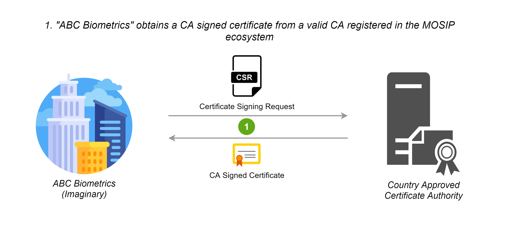
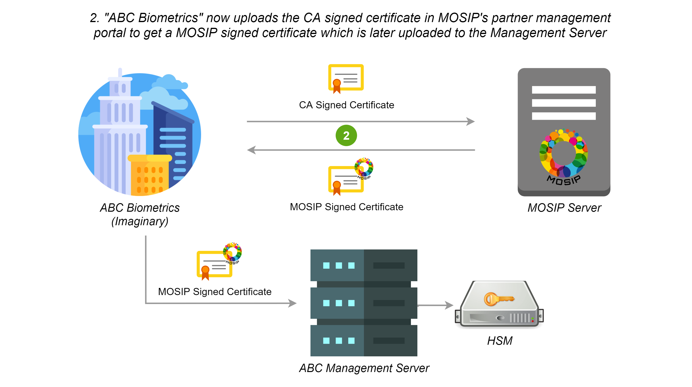
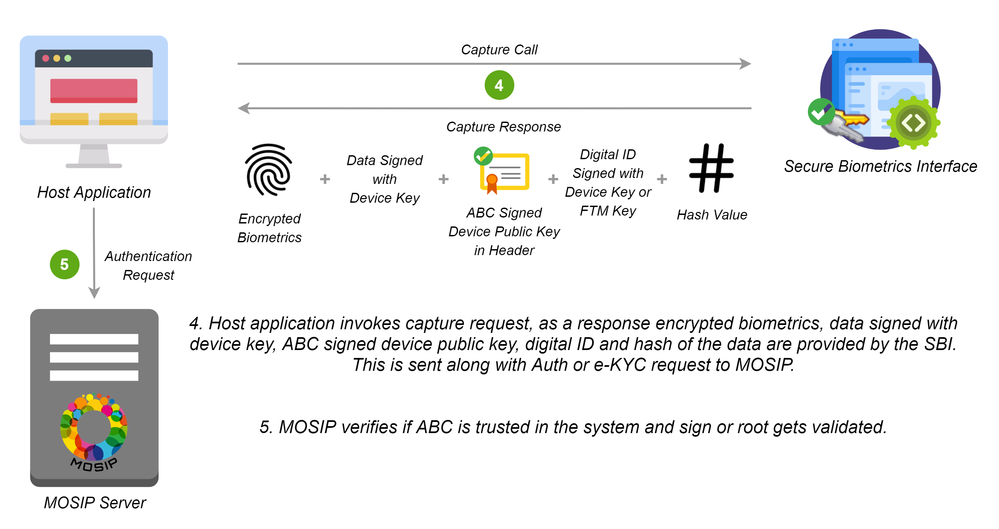

This specification document is to establish the technical and compliance standards/protocols that are necessary for a biometric device to be used in MOSIP solutions.

API specification version:  **1.0**

Published Date: June 23, 2021


This specification will be used in MOSIP LTS (1.2.0) release onwards with a backward compatibility to 0.9.5 MDS specification. 

MDS is now formally renamed as SBI. 

<!--
## Revision Note
Publish Date | Revision
-------------|--------
18-Jan-2021 | This is the first formal publication of this document as a version-ed specification. Earlier drafts are superseded by this document.
26-Feb-2021 | Updated the [FTM criteria](#certification) to include PCI PED 2.0 and CC.
08-Apr-2021 | We will be following datetime values in ISO 8601 with format yyyy-mm-ddTHH:MM:ssZ. The same has been updated throughout the document.
07-May-2021 | An optional parameter called spec version has been added in device discovery request
|0.9.5|Draft|24-May-2021|Clarification on hash and previousHash definition has been provided
-->

## Revision Note
Publish Date | Revision
-------------|--------
June 23, 2021 | This is the first formal publication of this document as a version-ed specification. Earlier drafts are superseded by this document.

## Glossary of Terms
Key | Description
----|------------
MOSIP Devices | A hardware capable of capturing biometric information. All devices that collect biometric data for MOSIP should operate within the specification of this document.
Device Provider | An entity that manufactures or imports the devices in their name. This entity should have legal rights to obtain an organization level digital certificate from the respective authority in the country.
FTM Provider | An entity that manufactures or guarantees the trustworthiness of the foundational trust module. This can be the device provider as well.
SBI 2.0 Certified Device / SBI 2.0 Device | A device certified as capable of performing all biometric functionalities (capture, processing), signing and encryption in line with this spec in its hardware trusted zone/FTM.
SBI 1.0 Certified Device / SBI 1.0  Device | A device certified as one where the biometric functionalities (capture, processing), signing and encryption is done on the host machine software zone as a separate service (protected from users or from other OS level applications) or at the device driver level.
FTM Provider Certificate | A digital certificate issued to the "Foundational Trust Provider". This certificate proves that the provider has successfully gone through the required Foundational Trust Provider evaluation. The entity is expected to keep this certificate in secure possession in an HSM. All the individual FTM trust certificates are issued using this certificate as the root. This certificate would be issued by the countries in conjunction with MOSIP.
Device Provider Certificate | A digital certificate issued to the "Device Provider". This certificate proves that the provider has been certified for SBI 1.0/SBI 2.0 respective compliance. The entity is expected to keep this certificate in secure possession in an HSM. All the individual device trust certificates are issued using this certificate as the root. This certificate is issued by the countries in conjunction with MOSIP.
Management Server | A server run by the device provider to manage the life cycle of the biometric devices.
FPS | Frames Per Second
Signature | All signature should be as per RFC 7515.<br>Header - The attribute with "alg" set to RS256 and x5c set to base64urlencoded certificate.<br>Payload - Byte array of the actual data, always represented as base64urlencoded.<br>Signature - Base64urlencoded signature bytes
ISO format timestamp | ISO 8601 with format yyyy-mm-ddTHH:MM:ssZ (Example: 2020-12-08T09:39:37Z). This value should be in UTC (Coordinated Universal Time).
Registration | The process of applying for a Foundational Id.
Auth | The process of verifying one’s identity.
KYC | Know Your Customer is the process of providing consent to perform profile verification and update.

---

## Device Specification
The specification documentation provides compliance guidelines to devices for them to work with MOSIP. The compliance is based on device capability, trust and communication protocols. A MOSIP compliant device would follow the standards established in this document. It is expected that the devices are compliant to this specification and tested and validated. The details of each of these are outlined in the subsequent sections.

### Device Capability
The MOSIP compliant device is expected to perform the following,

* Should have the ability to collect one or more biometric
* Should have the ability to sign the captured biometric image or template
* Should have the ability to protect secret keys
* Should have no mechanism to inject the biometric



For details about biometric specifications in MOSIP please view the page [MOSIP Biometric Specification](Biometric-Specification.md).



---

## Device Trust
MOSIP compliant devices provide a trust environment for the devices to be used in registration, KYC and AUTH scenarios. The trust level is established based on the device support for trusted execution.

Trust Level | Description
------------|---------------
SBI 1.0 | The trust is provided at the software level. No hardware related trust exists. This type of compliance is allowed to be used in controlled environments such as registration, however its recommended to use SBI 2.0 and above on all scenarios.
SBI 2.0 | The trust is provided by a secure chip or FTM with a secure execution environment. This type of compliance is used in uncontrolled environments such as Authentication or e-KYC. Usage of SBI 1.0 devices are not allowed in such scenarios.

### Foundational Trust Module (FTM)

Applicable for SBI 2.0 and above.

The foundational trust module would be created using a secure microprocessor capable of performing all required biometric processing and secure storage of keys. FTM could be a single chip (secure microprocessor), or a combination of chips or a set of hardware components that collectively offer the required trust levels. The foundational device trust would satisfy the below requirements.

* The module has the ability to securely generate, store and process cryptographic keys.
* Generation of asymmetric keys and symmetric keys with TRNG.
* The module has the ability to protect keys from extraction.
* The module has to protect the keys from physical tampering, temperature, frequency and voltage related attacks.
* The module could withstand hardware cloning.
* The module could withstand probing attacks.
* The module provides memory segregation for cryptographic operations and protection against buffer overflow attacks.
* The module provides ability to withstand cryptographic side channel attacks like Differential Power analysis attacks, Timing attacks.
* CAVP validated implementation of the cryptographic algorithm.
* The module has the ability to perform a cryptographically validate-able secure boot.
* The module has the ability to run trusted applications.

The foundational device trust derived from this module is used to enable trust-based computing for biometric capture. The foundational device trust module provides a trusted execution environment based on the following,
* Secure Boot
    * Ability to cryptographically verify code before execution.
    * Ability to check for integrity violation of the module/device.
    * Halt upon failure.
    * Ability to securely upgrade and perform forward only upgrades, to thwart downgrade attacks.
    * SHA256 hash equivalent or above should be used for all hashing requirements
    * All root of trust is provisioned upon first boot or before.
    * All upgrades would be considered success only after the successful boot with proper hash and signature verification.
    * The boot should fail upon hash/signature failures and would never operate in an intermediary state.
    * Maximum of 10 failed attempts should lock the upgrade process and brick the device. However chip manufacturers can decide to be less than 10.
* Secure application
    * Ability to run applications that are trusted.
    * Protect against downgrading of applications.
    * Isolated memory to support cryptographic operations.
    * All trusts are anchored during the first boot and not modifiable.

#### Certification
The FTM should have at least one of the following certifications in each category to meet the given requirement.

##### Category: Cryptographic Algorithm Implementation
* CAVP (RSA, AES, SHA256, TRNG (DRBGVS), ECC)



The supported algorithm and curves are listed [here](#cryptography).



##### Category: FTM Chip
(ONE of the following certifications)
* FIPS 140-2 L3 or above
* PCI PTS 5 or above (Pre-certified)
* PCI - PED 2.0 or above (Pre-Certified)
* One of following Common Criteria (CC) certification
	* https://www.commoncriteriaportal.org/files/ppfiles/pp0035a.pdf
	* https://www.commoncriteriaportal.org/files/ppfiles/pp0084a_pdf.pdf

##### System/Device Level Tamper (optional)
System/Device Level Tamper Responsiveness is recommended (not mandatory). In this case, FTM should be capable of showcasing Tamper Responsiveness (keys must be erased) against a tamper at the system/device level.

#### Threats to Protect
The FTM should protect against the following threats.

* Hardware cloning attacks - Ability to protect against attacks that could result in a duplicate with keys.
* Hardware Tamper attacks
    * Physical tamper - No way to physically tamper and obtain its secrets. 
    * Voltage & frequency related attacks - Should shield against voltage leaks and should prevent against low voltage. The FTM should always be in either of the states - "operational normally" or "inoperable". The FTM should never be operable when its input voltages are not met.
    * Temperature attacks on crypto block - Low or high the FTM is expected to operate or reach inoperable state and no state in between.
* Differential Power Analysis attack.
* Probing attacks - FTM should protect its surface area against any probe related attacks.
* Segregation of memory for execution of cryptographic operation (crypto block should be protected from buffer overflow type attacks).
* Vulnerability of the cryptographic algorithm implementation.
* Attacks against secure boot & secure upgrade.
* TEE/Secure processor OS attack (if applicable).

#### Foundational Trust Module Identity
Upon an FTM provider approved by the MOSIP adopters, the FTM provider would submit a self signed public certificate to the adopter. Let us call this the FTM root. The adopter would use this certificate to seed their device trust database. The FTM root and their key pairs should be generated and stored in FIPS 140-2 Level 3 or more compliant devices with no possible mechanism to extract the keys. 

The foundational module upon its first boot is expected to generate a random asymmetric key pair and provide the public part of the key to obtain a valid certificate from the FTM provider. The FTM provider would validate to ensure that the chip is unique and would issue a certificate with the issuer set to a FTM certificate chain. The entire certificate issuance would be in a secured provisioning facility, auditable upon notice by the adopters or its approved auditors. The certificate issued to the module will have a defined validity period as per the MOSIP certificate policy document defined by the MOSIP adopters. This certificate and private key within the FTM chip is expected to be in its permanent memory.



The validity for the chip certificate can not exceed 20 years from the date of manufacturing.



### Device
MOSIP devices are most often used to collect biometrics. The devices are expected to follow the specification for all levels of compliance and its usage. The  device is expected to be whitelisted with a fully capable PKI and secure storage of keys at the hardware.

* SBI 1.0 - A device can obtain SBI 1.0 certification when it uses software level cryptographic libraries with no secure boot or FTM.
* SBI 2.0 - A device can obtain SBI 2.0 certification when its built in secure facility with one of the certified FTM.

#### Device Identity
It is imperative that all devices that connect to MOSIP are identifiable. MOSIP believes in cryptographic identity as its basis for trust.

##### Physical ID
An identification mark that shows MOSIP compliance and a readable unique device serial number (minimum of 12 alphanumeric characters), make and model. The same information has to be available over a 2D QR Code or Barcode. This is to help field support and validation.

##### Digital ID
A digital device ID in MOSIP would be a signed JSON (RFC 7515) as follows,
```JSON
{
  "serialNo": "Serial number",
  "make": "Make of the device",
  "model": "Model of the device",
  "type": "Type of the biometric device",
  "deviceSubType": "Subtypes of the biometric device",
  "deviceProvider": "Device provider name",
  "deviceProviderId": "Device provider id",
  "dateTime": "Current datetime in ISO format"
}
```

Signed with the JSON Web Signature (RFC 7515) using the "Foundational Trust Module" Identity key, this data is the fundamental identity of the device. Every MOSIP compliant device will need the foundational trust module.

The only exception to this rule is for the SBI 1.0 compliant devices that have the purpose (explained below during device registration) as "Registration". SBI 1.0 devices would sign the digital Id with the device key.

Signed Digital ID would look as follows,
```
"digitalId": "base64urlencoded(header).base64urlencoded(payload).base64urlencoded(signature)"
```

The header in the digital id would have,
```
"alg": "RS256",
"typ": "JWT",
"x5c": "<Certificate of the FTM chip, If in case the chain of certificates are sent then the same will be ignored">
```

MOSIP assumes that the first certificate in the x5c is the FTM's chip public certificate issued by the FTM root certificate.

Unsigned digital ID would look as follows,
```
"digitalId": "base64urlencoded(payload)"
```
Payload is the Digital ID JSON object.



For a SBI 1.0 device that hasn’t obtained a certificate from the management server (deviceStatus = Not Registered), the digital id will be unsigned. In all other scenarios, except for a device discovery call (please see sections below), the digital ID will be signed either by the FTM key (SBI 2.0) or the device key (SBI 1.0).



##### Allowed Values
Parameters | Description
-----------|-------------
serialNo | This represents the serial number of the device. This value should be the same as printed on the device (Refer [Physical ID](#physical-id)).
make | This represents the brand name of the device. This value should be same as the value printed on the device (Refer [Physical ID](#physical-id)).
model | This represents the model of the device. This value should be same as the value printed on the device (Refer [Physical ID](#physical-id)).
type | This represents the type of the device. Currently, the allowed values here are "Finger", "Iris" or "Face". More types can be added based on the adopter's implementation.
deviceSubType | This represents the device sub type that is based on the device type.<br>For Finger - "Slap", "Single" or "Touchless"<br>For Iris - "Single" or "Double"<br>For Face - "Full face"
deviceProvider | This represents the name of the device provider. The device provider should be a legal entity in the country.
dateTime | This contains the time during the issuance of an identity. This is in ISO format.

### Keys
List of keys used in the device and their explanation.

#### Device Key
Each biometric device would contain an authorized private key (device key) for various signing purposes. For SBI 2.0, the device keys are created by the device providers inside the FTM. For SBI 1.0 the device keys must be generated within the TPM or the Windows Keystore of the host machine. The device keys are used for signing the biometric.

Once the device is deployed in the field/registration centre, during the initialisation, a certificate signing request (CSR) corresponding to the Device Key is generated and sent to the device management server. After necessary validations of the device, the device provider authorises the device by issuing a certificate. 

Device key is rotated frequently based on various scenarios,
* When device is connected first time to the host
* When the key rotation policy condition is met
* Any other requirements from adopter/device provider

All key rotation commands are issued by the device management server. 

By default MOSIP recommends 30 days key rotation policy for the device key. 

More details of the signing and its usage will be [here](#device-service-communication-interfaces).

#### FTM Key

Applicable for SBI 2.0 and above.

The FTM key is the root of the identity. This key is created by the FTM provider during the manufacturing/provisioning stage. This is a permanent key and would never be rotated. This key is used to sign the Digital ID.

#### MOSIP Key
The MOSIP key is the public key provided by the MOSIP adopter to the device providers and the partners. This key is used to encrypt the biometric data. Details of the encryption are listed below. We recommend rotating this key every 1 year.

### Device Trust  Validation
Following is an example device trust validation flow illustrated using an imaginary company "ABC".








## Device Service - Communication Interfaces
The section explains the necessary details of the biometric device connectivity, accessibility, discover-ability and protocols used to build and communicate with the device.

The device should implement only the following set of APIs.  All the API’s are independent of the physical layer and the operating system, with the invocation being different across operating systems. While the operating system names are defined in this spec a similar technology can be used for unspecified operating systems.  It is expected that the device service ensures that the device is connected  locally to the host.

### Device Discovery
Device discovery would be used to identify MOSIP compliant devices in a system by the applications. The protocol is designed as a simple plug and play with all the necessary abstraction to the specifics.

#### Device Discovery Request
```JSON
{
  "type": "type of the device",
  "specVersion": "SBI specification version"
}
```

#### Allowed Values
Parameters | Description
-----------|-------------
type | This represents the type of device. Allowed values here are "Biometric Device", "Finger", "Face" or "Iris".<br>"Biometric Device" - is a special type and used in case you are looking for "any" biometric device.
specVersion | This represents the spec version of the SBI. This is a mandatory parameter in SBI 1.0, but when requested the response the SBI supporting this spec version should respond to the discovery call. 

#### Device Discovery Response
```JSON
[
  {
    "serialNo": "Printed Serial Number of the device",
    "deviceStatus": "Device status",
    "certification": "Certification level",
    "serviceVersion": "Device service version",
    "deviceSubId": ["Array of supported device sub Ids"],
    "callbackId": "Base URL to reach to the device",
    "digitalId": "Unsigned Digital ID of the device",
    "specVersion": ["Array of supported SBI specification version"],
    "purpose": "Auth  or Registration",
    "error": {
      "errorCode": "101",
      "errorInfo": "Invalid JSON Value Type For Discovery.."
    }
  },
  ...
]
```

#### Allowed Values
Parameters | Description
-----------|-------------
deviceStatus | Allowed values are "Ready", "Busy", "Not Ready", and "Not Registered".<br><br>"Not Registered" denotes that the device does not have a valid certificate issued by the device provider for the device.
certification | Allowed values are "SBI 1.0" or "SBI 2.0" based on level of certification.
serviceVersion | Device service version.
serialNo | This represents the serial number of the device. This value should be the same as printed on the device (Refer [Physical ID](#physical-id)).
deviceSubId | Allowed values are 0, 1, 2 or 3. The device sub id could be used to enable a specific module in the scanner appropriate for a biometric capture requirement. Device sub id is a simple index which always starts with 1 and increases sequentially for each sub device present. In the case of Finger/Iris it's 1 for left slap/iris, 2 for right slap/iris and 3 for two thumbs/irises. The device sub id should be set to 0 if we don't know any specific device sub id (0 is not applicable for fingerprint slap).
callbackId | This differs as per the OS. In the case of Linux and windows operating systems it is a HTTP URL. In the case of android, it is the intent name. In IOS, it is the URL scheme. The call back URL takes precedence over future request as a base URL.
digitalId | Digital ID as per the Digital ID definition but it will not be signed.
specVersion | Array of supported SBI specification version. The array element Zero will always contain the spec version using which the response is created.
purpose | Purpose of the device in the MOSIP ecosystem. Allowed values are "Auth" or "Registration".
error | Relevant errors as defined under the [error section](#error-codes) of this document.
error.errorCode | Standardized error code.
error.errorInfo | Description of the error that can be displayed to the end user. It should have multi-lingual support.



* The response is an array that we could have a single device enumerating with multiple biometric options.
* The service should ensure to respond only if the type parameter matches the type of device or the type parameter is a "Biometric Device".
* This response is a direct JSON as shown in the response.



#### Windows/Linux
All the device API will be based on the HTTP specification. The device always binds to any of the available ports ranging from 4501 - 4600.  The IP address used for binding has to be 127.0.0.1 and not localhost.

The applications that require access to MOSIP devices could discover them by sending the HTTP request to the supported port range. We will call this port as the device_service_port in the rest of the document.

**_HTTP Request:_**
```
SBIDISC http://127.0.0.1:<device_service_port>/device
HOST: 127.0.0.1: <device_service_port>
EXT: <app name>
```

**_HTTP Response:_**
```
HTTP/1.1 200 OK
CACHE-CONTROL:no-store
LOCATION:http://127.0.0.1:<device_service_port>
Content-Length: length in bytes of the body
Content-Type: application/json
Connection: Closed
```



* The payloads are JSON in both the cases and are part of the body.
* CallbackId would be set to the `http://127.0.0.1:<device_service_port>/`. So, the caller will use the respective HTTP verb / method and the URL to call the service.



#### Android
All devices on an android device should listen to the following intent "io.mosip.device".

Upon invocation of this intent the devices are expected to respond back with the json response filtered by the respective type.


In Android, the CallbackId would be set to the appId. So, the caller will create the intent "appId.Info" or "appId.Capture".


#### IOS
All device on an IOS device would respond to the URL schema as follows,
```
SBIDISC://<call-back-app-url>?ext=<caller app name>&type=<type as defined in MOSIP device request>
```

If a MOSIP compliant device service app exists then the URL would launch the service. The service in return should respond back to the caller using the call-back-app-url with the base64 encoded json as the URL parameter for the key data.


* In IOS there are restrictions to have multiple apps registering to the same URL schema.
* callbackId would be set to the device service appname. So, the caller has to call appnameInfo or appnameCapture as the URL scheme.


### Device Info
The device information API would be used to identify the MOSIP compliant devices and their status by the applications.

#### Device Info Request
```JSON
{
  "type": "type of the device",
  "specVersion": "SBI specification version"
}
```

#### Allowed Values
Parameters | Description
-----------|-------------
type | This represents the type of device. This is a mandatory parameter in SBI 1.0. Allowed values here are "Biometric Device", "Finger", "Face" or "Iris".<br>"Biometric Device" - is a special type and used in case you are looking for "any" biometric device.
specVersion | This represents the spec version of the SBI. This is a mandatory parameter in SBI 1.0, but when requested the response the SBI supporting this spec version should respond to the discovery call.

#### Device Info Response
```
[
  {
    "deviceInfo": {
      "deviceStatus": "Current status",
      "serialNo": "Printed Serial Number of the device",
      "firmware": "Firmware version",
      "certification": "Certification level",
      "serviceVersion": "Device service version",
      "deviceSubId": ["Array of supported device sub Ids"],
      "callbackId": "BaseURL to reach to the device",
      "digitalId": "Signed digital id as described in the digital id section of this document.",
      "env": "Target environment",
      "purpose": "Auth  or Registration",
      "specVersion": ["Array of supported SBI specification version"],
    },
    "error": {
      "errorCode": "106",
      "errorInfo": "Device not found"
    }
  }
  ...
]
```

The final JSON is signed with the JSON Web Signature using the device key.

So the API would respond in the following format,
```
[
  {
    "deviceInfo": "base64urlencode(header).base64urlencode(payload).base64urlencode(signature)"
    "error": {
	  "errorCode": "106",
      "errorInfo": "Device not found"
	}
  }
]
```

#### Allowed Values
Parameters | Description
-----------|-------------
deviceInfo | The deviceInfo object is sent as JSON Web Token (JWT). For devices which do not have a valid certificate issued by device provider, the deviceInfo will be unsigned. For devices which are registered, the deviceInfo will be signed using the device key.
deviceInfo.deviceStatus | This is the current status of the device. Allowed values are "Ready", "Busy", "Not Ready", and "Not Registered".<br><br>"Not Registered" denotes that the device does not have a valid certificate issued by the device provider against the device.
deviceInfo.firmware | Exact version of the firmware (SBI 2.0). In case of SBI 1.0 this is the same as serviceVersion.
deviceInfo.certification | Allowed values are "SBI 1.0" or "SBI 2.0" based on the level of certification.
deviceInfo.serviceVersion | Version of the SBI specification that is supported.
deviceInfo.serialNo | This represents the serial number of the device. This value should be the same as printed on the device (Refer [Physical ID](#physical-id)).
deviceInfo.deviceSubId | Allowed values are 0, 1, 2 or 3. The device sub id could be used to enable a specific module in the scanner appropriate for a biometric capture requirement. Device sub id is a simple index which always starts with 1 and increases sequentially for each sub device present. In the case of Finger/Iris it's 1 for left slap/iris, 2 for right slap/iris and 3 for two thumbs/irises. The device sub id should be set to 0 if we don't know any specific device sub id (0 is not applicable for fingerprint slap).
deviceInfo.callbackId | This differs as per the OS. In case of linux and windows operating systems it is a HTTP URL. In the case of android, it is the intent name. In IOS, it is the URL scheme. The call back URL takes precedence over future requests as a base URL.
deviceInfo.digitalId | The digital id as per the digital id definition. For SBI 1.0 devices which are yet to obtain a certificate from the device provider, the digitalId will be unsigned. For SBI 1.0 devices with valid certificates issued by the provider, the digital id will be signed using the device key. For SBI 2.0 devices, the digital id will be always signed using the FTM key.
deviceInfo.env | This represents the target environment. For devices that are not registered, the environment is "None". For devices that are registered, send the environment in which it is registered. Allowed values are "Staging", "Developer", "Pre-Production" or "Production".
deviceInfo.purpose | Purpose of the device in the MOSIP ecosystem. Allowed values are "Auth" or "Registration".
deviceInfo.specVersion | Array of supported SBI specification version. The array element Zero will always contain the spec version using which the response is created.
error | Relevant errors as defined under the [error section](#error-codes) of this document.
error.errorCode | Standardized error code.
error.errorInfo | Description of the error that can be displayed to the end user. It should have multi-lingual support.



* The response is an array that we could have a single device enumerating with multiple biometric options.
* The service should ensure to respond only if the type parameter matches the type of device or the type parameter is a "Biometric Device".



#### Windows/Linux
The applications that require more details of the MOSIP devices could get them by sending the HTTP request to the supported port range. The device always binds to any of the available ports ranging from 4501 - 4600. The IP address used for binding has to be 127.0.0.1 and not localhost.

**_HTTP Request:_**
```
SBIINFO http://127.0.0.1:<device_service_port>/info
HOST: 127.0.0.1:<device_service_port>
EXT: <app name>
```

**_HTTP Response:_**
```
HTTP/1.1 200 OK
CACHE-CONTROL:no-store
LOCATION:http://127.0.0.1:<device_service_port>
Content-Length: length in bytes of the body
Content-Type: application/json
Connection: Closed
```



The payloads are JSON in both the cases and are part of the body.



#### Android
On an android device should listen to the following intent "appId.Info".

Upon invocation of this intent the devices are expected to respond back with the JSON response filtered by the respective type.

#### IOS
On an IOS device would respond to the URL schema as follows,
```
SBIINFO://<call-back-app-url>?ext=<caller app name>&type=<type as defined in MOSIP device request>
```

If a MOSIP compliant device service app exists then the URL would launch the service. The service in return should respond back to the call using the call-back-app-url with the base64 encoded JSON as the URL parameter for the key data.

In IOS there are restrictions to have multiple apps registering to the same URL schema.

### Capture
The capture request would be used to capture a biometric from MOSIP compliant devices by the applications. The capture call will respond with success to only one call at a time. So, in case of a parallel call the device info details are sent with status as "Busy".

#### Capture Request
```
{
  "env": "Target environment",
  "purpose": "Auth",
  "specVersion": "Expected version of the SBI spec",
  "timeout" : "Timeout for capture",
  "captureTime": "Time of capture request in ISO format",
  "domainUri": "URI of the auth server",
  "transactionId": "Transaction Id for the current capture",
  "bio": [
    {
      "type": "Type of the biometric data",
      "count":  "Finger/Iris count, in case of face max is set to 1",
      "bioSubType": ["Array of subtypes"],
      "requestedScore": "Expected quality score that should match to complete a successful capture. This value will be scaled from 0 - 100 for NFIQ v1.0. The logic for scaling is mentioned below.",
      "serialNo": "Physical Serial Number of the device",
      "deviceSubId": "Specific Device Sub Id",
      "previousHash": "Hash of the previous block"
    }
  ],
  "customOpts": {
	//max of 50 key value pair.
	//This is so that vendor specific parameters can be sent if necessary.
	//The values cannot be hard coded and have to be configured by the apps server and should be modifiable upon need by the applications.
	//Vendors are free to include additional parameters and fine-tuning parameters.
	//None of these values should go undocumented by the vendor.
	//No sensitive data should be available in the customOpts.
  }
}
```



Count value should be driven by the count of the bioSubType for Iris and Finger. For Face, there will be no bioSubType but the count should be "1".



#### Allowed Values
Parameters | Description
-----------|-------------
env | This represents the target environment. Allowed values are "Staging", "Developer", "Pre-Production" or "Production".
purpose | The purpose of the device in the MOSIP ecosystem. For devices that are not registered the purpose is empty. Allowed value is "Registration".
specVersion | Expected version of SBI specification.
timeout | Max time the app will wait for the capture. It's expected that the API will respond back before timeout if the requestedScore is met, or with the best frame at the timeout. All timeouts are in milliseconds.
captureTime | Time of capture in ISO format. The time is as per the requesting application.
domainUri | URI of the authentication server. This can be used to federate across multiple providers or countries or unions.
transactionId | Unique ID for the transaction. This is an internal Id to the application that's providing the service. Different id should be used for every transaction. So, even if the transaction fails after auth we expect this number to be unique.
bio.type | Allowed values are "Finger", "Iris" or "Face".
bio.count | Number of biometric data that is collected for a given type. The device should validate and ensure that this number is in line with the type of biometric that's captured.
bio.bioSubType | <ul><li>For Finger: ["Left IndexFinger", "Left MiddleFinger", "Left RingFinger", "Left LittleFinger", "Left Thumb", "Right IndexFinger", "Right MiddleFinger", "Right RingFinger", "Right LittleFinger", "Right Thumb", "UNKNOWN"]</li><li>For Iris: ["Left", "Right", "UNKNOWN"]</li><li>For Face: No bioSubType</li></ul>
bio.requestedScore | Upon reaching the quality score the biometric device is expected to auto capture the image. If the requested score is not met, until the timeout, the best frame during the capture sequence must be captured/returned. This value will be scaled from 0 - 100 for NFIQ v1.0. The logic for scaling is mentioned below.
bio.serialNo | This represents the serial number of the device. This value should be the same as printed on the device (Refer [Physical ID](#physical-id)).
bio.deviceSubId | Allowed values are 0, 1, 2 or 3. The device sub id could be used to enable a specific module in the scanner appropriate for a biometric capture requirement. Device sub id is a simple index which always starts with 1 and increases sequentially for each sub device present. In the case of Finger/Iris it's 1 for left slap/iris, 2 for right slap/iris and 3 for two thumbs/irises. The device sub id should be set to 0 if we don't know any specific device sub id (0 is not applicable for fingerprint slap).<br><br>Wherever possible SBI must detect if the placement of biometrics is not in sync with the deviceSubId. For example, if the deviceSubId is selected as 1 and if a right slap is presented instead of left, SBI must provide appropriate messages.
bio.previousHash | For the first capture the previousHash is SHA256 hash of a empty UTF-8 string. From the second capture the previous capture's "hash" is used as input. This is used to chain all the captures across modalities so all captures have happened for the same transaction and during the same time period.
customOpts | In case, the device vendor wants to send additional parameters they can use this to send key value pairs if necessary. The values cannot be hard coded and have to be configured by the apps server and should be modifiable upon need by the applications. Vendors are free to include additional parameters and fine-tuning the process. None of these values should go undocumented by the vendor. No sensitive data should be available in the customOpts.

NFIQ v1.0 in the scale of 0-100 (quality score).

Scale | NFIQ v1.0
------|-----------
81 - 100 | 1
61 - 80 | 2
41 - 60 | 3
21 - 40 | 4
0 - 20 | 5



"bio.bioSubType" is a mandatory parameter for Capture request. For cases where “any” biometrics are expected, an array of UNKNOWN can be passed equal to the count specified in bio.count.

The SBI must make sure of the following,
* Must not allow the capture of the same biometrics segment  wherever possible. 
* In case of fingerprint, if a multi finger scanner is used,and if bioSubType is passed as UNKNOWN, capture must return fingers in the order starting from IndexFinger to LittleFinger. 




#### Capture Response
```
{
  "biometrics": [
    {
      "specVersion": "SBI spec version",
      "data": { //data block in JWT format signed using device key
        "digitalId": "Digital Id as described in this document signed using FTM key (SBI 2.0)",
        "deviceServiceVersion": "SBI version",
        "bioType": "Finger",
        "bioSubType": "UNKNOWN",
        "purpose": "Auth",
        "env": "Target environment",
        "domainUri": "URI of the auth server",
        "bioValue": "Encrypted with session key and base64urlencoded biometric data",
        "transactionId": "Unique transaction id",
        "timestamp": "Current datetime in ISO format",
        "requestedScore": "Floating point number to represent the minimum required score for the capture",
        "qualityScore": "Floating point number representing the score for the current capture"
      },
      "hash": "sha256 in hex format in upper case (previous "hash" + sha256 hash of the current biometric ISO data before encryption)",
      "sessionKey": "Session key used for encrypting bioValue, encrypted with MOSIP public key (dynamically selected based on the uri) and base64urlencoded",
      "thumbprint": "SHA256 representation of the certificate (HEX encoded) that was used for encryption of session key. All texts to be treated as uppercase without any spaces or hyphens",
      "error": {
        "errorCode": "101",
        "errorInfo": "Invalid JSON Value"
      },
	  "additionalInfo": {
	    //Additional information can be sent by the SBI in key value pair.
		//max of 50 key value pair.
		//Vendors are free to include any number of additional parameters.
		//None of these values should go undocumented by the vendor.
		//No sensitive data should be available here.
	  }
    },
    {
      "specVersion" : "SBI spec version",
      "data": { //data block in JWT format signed using device key
        "digitalId": "Digital Id as described in this document signed using FTM key (SBI 2.0)",
        "deviceServiceVersion": "SBI version",
        "bioType": "Finger",
        "bioSubType": "Left IndexFinger",
        "purpose": "Auth",
        "env": "Target environment",
        "domainUri": "URI of the auth server",
        "bioValue": "Encrypted with session key and base64urlencoded biometric data",
        "transactionId": "Unique transaction id",
        "timestamp": "Current datetime in ISO format",
        "requestedScore": "Floating point number to represent the minimum required score for the capture",
        "qualityScore": "Floating point number representing the score for the current capture"
      },
      "hash": "sha256 in hex format in upper case (previous "hash" + sha256 hash of the current biometric ISO data before encryption)",
      "sessionKey": "Session key used for encrypting bioValue, encrypted with MOSIP public key (dynamically selected based on the uri) and base64urlencoded",
      "thumbprint": "SHA256 representation of the certificate (HEX encoded) that was used for encryption of session key. All texts to be treated as uppercase without any spaces or hyphens",
      "error": {
        "errorCode": "101",
        "errorInfo": "Invalid JSON Value"
      },
	  "additionalInfo": {
	    //Additional information can be sent by the SBI in key value pair.
		//max of 50 key value pair.
		//Vendors are free to include any number of additional parameters.
		//None of these values should go undocumented by the vendor.
		//No sensitive data should be available here.
	  }
    }
  ]
}
```

#### Allowed Values
Parameters | Description
-----------|------------- 
specVersion | Version of the SBI specification using which the response was generated.
data | The data object is sent as JSON Web Token (JWT). The data block will be signed using the device key.
data.digitalId | The digital id as per the digital id definition in JWT format. For SBI 1.0 devices, the digital id will be signed using the device key. For SBI 2.0 devices, the digital id will be signed using the FTM key.
data.deviceServiceVersion | SBI version
data.bioType | Allowed values are "Finger", "Iris" or "Face".
data.bioSubType | <ul><li>For Finger: ["Left IndexFinger", "Left MiddleFinger", "Left RingFinger", "Left LittleFinger", "Left Thumb", "Right IndexFinger", "Right MiddleFinger", "Right RingFinger", "Right LittleFinger", "Right Thumb", "UNKNOWN"]</li><li>For Iris: ["Left", "Right", "UNKNOWN"]</li><li>For Face: No bioSubType</li></ul>
data.purpose | The purpose of the device in the MOSIP ecosystem. Allowed value is "Auth".
data.env | The target environment. Allowed values are "Staging", "Developer", "Pre-Production" or "Production".
data.domainUri | URI of the authentication server. This can be used to federate across multiple providers or countries or unions.
data.bioValue | Biometric data is encrypted with random symmetric (AES GCM) key and base-64-URL encoded. For symmetric key encryption of bioValue, (biometrics.data.timestamp XOR transactoinId) is computed and the last 16 bytes and the last 12  bytes of the results are set as the aad and the IV(salt) respectively. Look at the Authentication document to understand more about the encryption.
data.transactionId | Unique transaction id sent in request
data.timestamp | Time as per the biometric device. Note: The biometric device is expected to sync its time from the management server at regular intervals so accurate time could be maintained on the device.
data.requestedScore | Floating point number to represent the minimum required score for the capture.
data.qualityScore | Floating point number representing the score for the current capture.
hash | sha256 in hex format in upper case (previous "hash" + sha256 hash of the current biometric ISO data before encryption)
sessionKey | The session key (used for the encrypting of the bioValue) is encrypted using the MOSIP public certificate with RSA/ECB/OAEPWITHSHA-256ANDMGF1PADDING algorithm and then base64-URL-encoded.
thumbprint | SHA256 representation of the certificate (HEX encoded) that was used for encryption of session key. All texts to be treated as uppercase without any spaces or hyphens.
error | Relevant errors as defined under the [error section](#error-codes) of this document.
error.errorCode | Standardized error code.
error.errorInfo | Description of the error that can be displayed to the end user. It should have multi-lingual support.

The entire data object is sent as a JWT format. So, the data object will look like,
```
"data" : "base64urlencode(header).base64urlencode(payload).base64urlencode(signature)
```
The payload is defined as the entire byte array of the data block.


#### Windows/Linux
The applications that require to capture biometric data from a MOSIP device could do so by sending the HTTP request to the supported port range.

**_HTTP Request:_**
```
CAPTURE http://127.0.0.1:<device_service_port>/capture
HOST: 127.0.0.1: <apps port>
EXT: <app name>
```

**_HTTP Response:_**
```
HTTP/1.1 200 OK
CACHE-CONTROL:no-store
LOCATION:http://127.0.0.1:<device_service_port>
Content-Length: length in bytes of the body
Content-Type: application/json
Connection: Closed
```


The pay loads are JSON in both the cases and are part of the body.


#### Android
All devices on an android device should listen to the following intent appid.capture. Upon this intent the devices are expected to respond back with the JSON response filtered by the respective type.

#### IOS
All devices on an IOS device would respond to the URL schema as follows.

```
APPIDCAPTURE://<call-back-app-url>?ext=<caller app name>&type=<type as defined in MOSIP device request>
```

If a MOSIP compliant device service app exists then the URL would launch the service. The service in return should respond back to the call using the call-back-app-url with the base64 encoded json as the URL parameter for the key data.

### Device Stream
The device would open a stream channel to send the live video streams. This would help when there is an assisted operation to collect biometric. Please note the stream API’s are available only for the registration environment.

This API is visible only for the devices that are registered for the purpose as "Registration".

#### Device Stream Request
```
{
  "type": "type of the device",
  "specVersion": "SBI specification version",
  "serialNo": "Printed Serial Number of the device",
  "deviceSubId": "Specific device sub Id",
  "timeout": "Timeout for stream"
  "dimensions": "Optional parameter for handling specific requirements such as exception photo stream. Please refer to the stream frame guidelines."
}
```

#### Allowed Values
Parameters | Description
-----------|--------------
type | This represents the type of device. This is a mandatory parameter in SBI 1.0. Allowed values here are "Biometric Device", "Finger", "Face" or "Iris".<br>"Biometric Device" - is a special type and used in case you are looking for "any" biometric device.
specVersion | This represents the spec version of the SBI. This is a mandatory parameter in SBI 1.0, but when requested the response the SBI supporting this spec version should respond to the discovery call.
serialNo | This represents the serial number of the device. This value should be the same as printed on the device (Refer [Physical ID](#physical-id)).
deviceSubId | Allowed values are 0, 1, 2 or 3. The device sub id could be used to enable a specific module in the scanner appropriate for a biometric capture requirement. Device sub id is a simple index which always starts with 1 and increases sequentially for each sub device present. In the case of Finger/Iris it's 1 for left slap/iris, 2 for right slap/iris and 3 for two thumbs/irises. The device sub id should be set to 0 if we don't know any specific device sub id (0 is not applicable for fingerprint slap).<br><br>Wherever possible SBI must detect if the placement of biometrics is not in sync with the deviceSubId. For example, if the deviceSubId is selected as 1 and if a right slap is presented instead of left, SBI must provide appropriate messages.
timeout | Max time after which the stream should close. This is an optional parameter and by default the value will be 5 minutes. All timeouts are in milliseconds.
dimensions | This is an optional parameter for handling specific requirements such as photo stream during exception. Please refer to the stream frame guidelines.<br><br>Format: mmmm. For example, value 6040 denotes 60mm(width) X 40mm(height) of the stream window.

#### Device Stream Response
Live video stream with quality of 3 frames per second or more using [M-JPEG](https://en.wikipedia.org/wiki/Motion_JPEG).

Preview should have the quality markings and segment marking. The preview would also be used to display any error message to the user screen. All error messages should be localized.

Preview must guide the resident on the correct placement of biometric on the sensor. It is recommended to use colour coding (Green for good placement, Red for incorrect placement) and audio, visual cues must be used. 


#### Error Response for Device Stream
```
{
  "error": {
    "errorCode": "202",
    "errorInfo": "No Device Connected."
  }
}
```

#### Windows/Linux
The applications that require more details of the MOSIP devices could get them by sending the HTTP request to the supported port range.

**_HTTP Request:_**
```
STREAM http://127.0.0.1:<device_service_port>/stream
HOST: 127.0.0.1: <apps port>
EXT: <app name>
```

**_HTTP Response:_**
HTTP Chunk of frames to be displayed. Minimum frames 3 per second.

#### Android
No support for streaming

#### IOS
No support for streaming

### Registration Capture
The registration client application will discover the device. Once the device is discovered the status of the device is obtained with the device info API. During the registration the registration client sends the RCAPTURE API and the response will provide the actual biometric data in a digitally signed non encrypted form. When the Device Registration Capture API is called the frames should not be added to the stream. The device is expected to send the images in ISO format.

The requestedScore is on the scale of 0-100 (NFIQ v2.0 for fingerprints). So, in cases where you have four fingers the average of all will be considered for capture threshold. The device would always send the best frame during the capture time even if the requested score is not met.

The API is used by the devices that are compatible for the registration module. This API should not be supported by the devices that are compatible for authentication.

#### Registration Capture Request
```
{
  "env":  "Target environment",
  "purpose": "Registration",
  "specVersion": "Expected SBI spec version",
  "timeout": "Timeout for registration capture",
  "captureTime": "Time of capture request in ISO format",
  "transactionId": "Transaction Id for the current capture",
  "bio": [
    {
      "type": "Type of the biometric data",
      "count":  "Finger/Iris count, in case of face max is set to 1",
      "bioSubType": ["Array of subtypes"], //Optional
      "exception": ["Finger or Iris to be excluded"],
      "requestedScore": "Expected quality score that should match to complete a successful capture.",
      "serialNo": "Printed Serial Number of the device",
      "deviceSubId": "Specific device Id",
      "previousHash": "Hash of the previous block"
    }
  ],
  "customOpts": {
    //max of 50 key value pair.
	  //This is so that vendor specific parameters can be sent if necessary.
	  //The values cannot be hard coded and have to be configured by the apps server and should be modifiable upon need by the applications.
	  //Vendors are free to include additional parameters and fine-tuning parameters.
	  //None of these values should go undocumented by the vendor.
	  //No sensitive data should be available in the customOpts.
  }
}
```


To capture the exception photo exception value for Iris or Finger should be send in bio.exception for bio.type = 'Face'. ICAO checks are not mandatory here but one face must be present within the frame.


#### Allowed Values
Parameters | Description
-----------|-------------
env | The target environment. Allowed values are "Staging", "Developer", "Pre-Production" or "Production".
purpose | The purpose of the device in the MOSIP ecosystem. For devices that are not registered the purpose is empty. Allowed value is "Registration".
specVersion | Expected version of SBI specification.
timeout | Max time the app will wait for the capture. It's expected that the API will respond back before timeout if the requestedScore is met, or with the best frame at the timeout. All timeouts are in milliseconds.
captureTime | Time of capture in ISO format. The time is as per the requesting application.
transactionId | Unique ID of the transaction. This is an internal Id to the application that's providing the service. Different id should be used for every transaction. So, even if the transaction fails we expect this number to be unique.
bio.type | Allowed values are "Finger", "Iris" or "Face".
bio.count | Number of biometric data that is collected for a given type. The device should validate and ensure that this number is in line with the type of biometric that's captured.
bio.bioSubType | <ul><li>Array of bioSubType for respective biometric type.</li><li>For Finger: ["Left IndexFinger", "Left MiddleFinger", "Left RingFinger", "Left LittleFinger", "Left Thumb", "Right IndexFinger", "Right MiddleFinger", "Right RingFinger", "Right LittleFinger", "Right Thumb", "UNKNOWN"]</li><li>For Iris: ["Left", "Right", "UNKNOWN"]</li><li>For Face: No bioSubType</li><li>This is an optional parameter.</li></ul>
bio.exception | <ul><li>This is an array and all the exceptions are marked.</li><li>In case exceptions are sent for face then follow the exception photo specification above.</li><li>For Finger: ["Left IndexFinger", "Left MiddleFinger", "Left RingFinger", "Left LittleFinger", "Left Thumb", "Right IndexFinger", "Right MiddleFinger", "Right RingFinger", "Right LittleFinger", "Right Thumb"]</li><li>For Iris: ["Left", "Right"]</li><li>This is a mandatory parameter.</li><li> For cases where "any" biometrics are expected, an array of UNKNOWN can be passed equal to the count specified in bio.count.</li><li>The SBI must make sure not to allow the capture of the same biometrics segment wherever possible and in case of fingerprint, if a multi finger scanner is used, and if bioSubType is passed as UNKNOWN, capture must return fingers in the order starting from IndexFinger to LittleFinger.</li></ul>
bio.requestedScore | Upon reaching the quality score the biometric device is expected to auto capture the image. If the requested score is not met, until the timeout, the best frame during the capture sequence must be captured/returned.
bio.serialNo | This represents the serial number of the device. This value should be the same as printed on the device (Refer [Physical ID](#physical-id)).
bio.deviceSubId | Allowed values are 0, 1, 2 or 3. The device sub id could be used to enable a specific module in the scanner appropriate for a biometric capture requirement. Device sub id is a simple index which always starts with 1 and increases sequentially for each sub device present. In the case of Finger/Iris it's 1 for left slap/iris, 2 for right slap/iris and 3 for two thumbs/irises. The device sub id should be set to 0 if we don't know any specific device sub id (0 is not applicable for fingerprint slap).<br><br>Wherever possible SBI must detect if the placement of biometrics is not in sync with the deviceSubId. For example, if the deviceSubId is selected as 1 and if a right slap is presented instead of left, SBI must provide appropriate messages.<br/>SBI must detect if the placement of biometrics is no insync with the deviceSubId. For example, if the deviceSubId is selected as 1 and if a right slap is presented instead of left, SBI must provide appropriate messages.
bio.previousHash | For the first capture the previousHash is SHA256 hash of a empty UTF-8 string. From the second capture the previous capture's "hash" is used as input. This is used to chain all the captures across modalities so all captures have happened for the same transaction and during the same time period.
customOpts | In case, the device vendor wants to send additional parameters they can use this to send key value pairs if necessary. The values cannot be hard coded and have to be configured by the apps server and should be modifiable upon need by the applications. Vendors are free to include additional parameters and fine-tuning the process. None of these values should go undocumented by the vendor. No sensitive data should be available in the customOpts.

#### Registration Capture Response
```
{
  "biometrics": [
    {
      "specVersion": "SBI Spec version",
      "data": {
        "digitalId": "Digital id of the device as per the Digital Id definition, signed using FTM key (SBI 2.0) or the device key (SBI 1.0).",
        "bioType": "Biometric type",
        "deviceServiceVersion": "SBI version",
        "bioSubType": "Left IndexFinger",
        "purpose": "Registration",
        "env": "Target environment",
        "bioValue": "base64urlencoded biometrics (ISO format)",
        "transactionId": "Unique transaction id sent in request",
        "timestamp": "2019-02-15T10:01:57.086Z",
        "requestedScore": "Floating point number to represent the minimum required score for the capture. This ranges from 0-100.",
        "qualityScore": "Floating point number representing the score for the current capture. This ranges from 0-100."
      },
      "hash": "sha256 in hex format in upper case (previous "hash" + sha256 hash of the current biometric ISO data)",    
      "error": {
        "errorCode": "101",
        "errorInfo": "Invalid JSON Value Type For Discovery.. ex: {type: 'Biometric Device' or 'Finger' or 'Face' or 'Iris' } "
      },
	  "additionalInfo": {
	    //Additional information can be sent by the SBI in key value pair.
		//max of 50 key value pair.
		//Vendors are free to include any number of additional parameters.
		//None of these values should go undocumented by the vendor.
		//No sensitive data should be available here.
	  }    
	},
    {
      "specVersion" : "SBI Spec version",
      "data": {
        "digitalId": "Digital id of the device as per the Digital Id definition, signed using FTM key (SBI 2.0) or the device key (SBI 1.0).",
        "bioType" : "Finger",
        "deviceServiceVersion": "SBI version",
        "bioSubType": "Left MiddleFinger",
        "purpose": "Registration",
        "env":  "Target environment",
        "bioValue": "base64urlencoded biometric (ISO format)",
        "transactionId": "Unique transaction id sent in request",
        "timestamp": "2019-02-15T10:01:57.086Z",
        "requestedScore": "Floating point number to represent the minimum required score for the capture. This ranges from 0-100",
        "qualityScore": "Floating point number representing the score for the current capture. This ranges from 0-100"
      },
      "hash": "sha256 in hex format in upper case (previous "hash" + sha256 hash of the current biometric ISO data)",
      "error": {
        "errorCode": "101",
        "errorInfo": "Invalid JSON Value Type For Discovery.. ex: {type: 'Biometric Device' or 'Finger' or 'Face' or 'Iris' }"
      },
	"additionalInfo": {
	    //Additional information can be sent by the SBI in key value pair.
		//max of 50 key value pair.
		//Vendors are free to include any number of additional parameters.
		//None of these values should go undocumented by the vendor.
		//No sensitive data should be available here.
	  }
    }
  ]
}
```

#### Allowed Values
Parameters | Description
-----------|-------------
specVersion | Version of the SBI specification using which the response was generated.
data | The data object is sent as JSON Web Token (JWT). The data block will be signed using the device key.
data.bioType | Allowed values are "Finger", "Iris" or "Face".
data.digitalId | The digital id as per the digital id definition in JWT format. For SBI 1.0 devices, the digital id will be signed using the device key. For SBI 2.0 devices, the digital id will be signed using the FTM key.
data.bioSubType | <ul><li>For Finger: ["Left IndexFinger", "Left MiddleFinger", "Left RingFinger", "Left LittleFinger", "Left Thumb", "Right IndexFinger", "Right MiddleFinger", "Right RingFinger", "Right LittleFinger", "Right Thumb", "UNKNOWN"]</li><li>For Iris: ["Left", "Right", "UNKNOWN"]</li><li>For Face: No bioSubType</li></ul>
data.deviceServiceVersion | SBI version
data.env | The target environment. Allowed values are "Staging", "Developer", "Pre-Production" or "Production".
data.purpose | The purpose of the device in the MOSIP ecosystem. Allowed value is "Registration".
data.bioValue | Base64-URL-encoded biometrics (in ISO format)
data.transactionId | Unique transaction id sent in request
data.timestamp | Time as per the biometric device. The biometric device is expected to sync its time from the management server at regular intervals so accurate time could be maintained on the device.
data.requestedScore | Floating point number to represent the minimum required score for the capture.
data.qualityScore | Floating point number representing the score for the current capture. Return NFIQ 2.0 scores for fingerprint.
hash | sha256 in hex format in upper case (previous "hash" + sha256 hash of the current biometric ISO data)
error | Relevant errors as defined under the [error section](#error-codes) of this document.
error.errorCode | Standardized error code.
error.errorInfo | Description of the error that can be displayed to the end user. It should have multi-lingual support.

#### Windows/Linux
The applications that require more details of the MOSIP devices could get them by sending the HTTP request to the supported port range.

**_HTTP Request:_**
```
RCAPTURE http://127.0.0.1:<device_service_port>/capture
HOST: 127.0.0.1: <apps port>
EXT: <app name>
```

**_HTTP Response:_**
HTTP response.

#### Android
No support for Registration Capture

#### IOS
No support for Registration Capture

---

## Management Server and Management Client
As explained in section [device trust validation](#device-trust-validation) the devices are expected to get connected with the management server and get a certificate issued by the device provider for its usage in the MOSIP ecosystem. 

### Management Server Functionalities and Interactions
The management server has the following objectives.

1. Validate the devices to ensure it's a genuine device from the respective device provider. This can be achieved using the device info and the certificates of the Foundational Trust Module.
1. Manage/Sync time between the end device and the server. The time to be synced should be the only trusted time accepted by the device.
1. Ability to issue commands to the end device for
    1. Cleanup of the device keys.
    1. Collect device information to maintain, manage, support and upgrade a device remotely.
1. A central repository of all the approved devices from the device provider.
1. Safe storage of keys using HSM FIPS 140-2 Level 3. These keys are used to issue the device certificate upon registration of the device with the Management Server. The Management Server is created and hosted by the device provider outside of MOSIP software. The communication protocols between the SBI and the Management Server can be decided by the respective device provider. Such communication should be restricted to the above specified interactions only. No transactional information should be sent to this server.
1. Should have the ability to push updates from the server to the client devices.


*As there are no adopter specific information being exchanged at the management server or at the FTM provisioning server, there are no mandates from MOSIP where these are located globally. However the adopter is recommended to have audit and contractual mechanisms to validate the compliance of these components at any point in time.*


### Management Client
Management client is the interface that connects the device with the respective management server. This could be a separate library running within the SBI or a simple set of API definitions talking to the management server over HTTPs. It's important that the communication between the management server and its clients are designed with scalability, robustness, performance and security. The management server may add many more capabilities than what is described here, But the basic security objectives should be met at all times irrespective of the offerings.

1. For better and efficient handling of devices at large volume, we expect the devices to auto register to the Management server.
1. All communication to the server and from the server should follow that below properties.
    1. All communication are digitally signed with the approved algorithms
    1. All communication to the server is encrypted using one of the approved public key cryptography (HTTPS – TLS1.2/1.3 is required with one of the [approved algorithms](#cryptography).
    1. All requests should have timestamps attached in ISO format to the milliseconds inside the signature.
    1. All communication back and forth should have the signed digital id as one of the attributes.
1. It's expected that the auto registration with management server has an absolute way to identify and validate the devices.
1. The management client or SBI should be able to detect the devices in a plug and play model.
1. The management client must connect to the respective management server on defined frequencies along with the status of the certificate and the device itself. Key rotation commands or any other instructions to the SBI should be triggered from the server as a response to this status check query from the SBI/management client. 
1. Should have the ability to detect if it's speaking to the right management server.
1. All upgrades should be verifiable and the client or SBI should have ability to verify software upgrades.
1. Should not allow any downgrade of software.
1. Should not expose any API to capture biometric. The management server should have no ability to trigger a capture request.
1. No logging of biometric data is allowed. (Both in the encrypted and unencrypted format)

## Certificates
The MOSIP server would provide the following retrieve encryption certificate API which is white-listed to the management servers of the device provider or their partners. The encryption certificate is used to encrypt the bioValue of a [capture API response](#capture-response).

### Retrieve Encryption Certificate Request URL
`POST https://{base_url}/v1/masterdata/device/encryptioncertficates`

**Version:** v1

### Retrieve Encryption Certificate Request
```
{
  "id": "io.mosip.auth.country.certificate",
  "version": "certificate server api version as defined above",
  "request": {
    "data": {
      "env":  "target environment",
      "domainUri": "uri of the auth server"
    }
  },
  "requesttime": "current timestamp in ISO format"
}
```

The request is sent as a JWT format. So the final request will look like,
```
"request": {
  "data": "base64urlencode(header).base64urlencode(payload).base64urlencode(signature)"
}
```

#### Allowed Values
Parameters | Description
-----------|-------------
request.data | The data object is sent as JSON Web Token (JWT).
request.data.env | The target environment for which you want to fetch the certificate. Allowed values are "Staging", "Developer", "Pre-Production" or "Production".
request.data.domainUri | unique URI per auth providers. This can be used to federate across multiple providers or countries or unions.

### Encryption Certificate Response
```
{
  "id": "io.mosip.auth.country.certificate",
  "version": "certificate server api version as defined above",
  "responsetime": "current datettime in ISO time format",
  "response": [
    {
      "certificate": "base64urlencoded certificate as x509 V3 format"
    }
  ]
}
```

The entire response is sent as a JWT format. So the final response will look like,
```
"response" : "base64urlencode(header).base64urlencode(payload).base64urlencode(signature)"
```

---


---

## Compliance

**SBI 2.0 Certified Device / SBI 2.0 Device** - A device certified as capable of performing all biometric functionalities (capture, processing), signing and encryption in line with this spec in its hardware trusted zone/FTM.

**SBI 1.0 Certified Device / SBI 1.0 Device** - A device certified as one where the biometric functionalities (capture, processing), signing and encryption is done on the host machine software zone as a separate service (protected from users or from other OS level applications) or at the device driver level. 

### Secure Provisioning
Secure provisioning is applicable to both the FTM and the Device providers.

1. The devices and FTM should have a mechanism to protect against fraudulent attempts to create or replicate.
1. The device and FTM trust should be programmed in a secure facility which is certified by the respective MOSIP adopters.
1. Organization should have a mechanism to segregate the FTM's and Devices built for MOSIP using cryptographically valid and repeatable processes.
1. All debug options within the FTM or device should be disabled permanently
1. All key creations needed for provisioning should happen automatically using FIPS 140-2 Level 3 or higher devices. No individual or a group or organization should have mechanisms to influence this behavior.
1. Before the devices/FTM leave the secure provisioning facility all the necessary trust should be established and should not be re-programmable.


*As there are no adopter specific information being exchanged at the management server or at the FTM provisioning server, there are no mandates from MOSIP where these are located globally. However the adopter is recommended to have audit and contractual mechanisms to validate the compliance of these components at any point in time.*


### Compliance Level
API     | Compatible
--------|-----------
Device Discovery | SBI 1.0 / SBI 2.0
Device Info | SBI 1.0 / SBI 2.0
Capture | SBI 2.0
Registration Capture | SBI 1.0 / SBI 2.0

---

## Cryptography
Supported algorithms,

Usage | Algorithm | Key Size | Storage
------|-----------|----------|---------
Encryption of biometrics - Session Key | AES | >=256 | No storage, Key is created with TRNG/DRBG inside FTM
Encryption session key data outside of FTM | RSA OAEP | >=2048 | FTM trusted memory
Encryption session key data outside of FTM | ECC curve 25519 | >=256 | FTM trusted memory
Biometric Signature | RSA | >=2048 | Key never leaves FTM created and destroyed
Biometric Signature | ECC curve 25519 | >=256 | Key never leaves FTM created and destroyed
Secure Boot | RSA | >=2048 | FTM trusted memory
Secure Boot | ECC curve 25519 | >=256 | FTM trusted memory



No other ECC curves supported.



## Signature
In all the above APIs, some of the requests and responses are signed with various keys to verify the requester's authenticity. Here we have detailed the key used for signing a particular block in a request or response body of various APIs.

Request/Response | Block | Signature Key
-----------------|-------|---------------
Device Discovery Response | Device Info | NA as it will not be signed
Device Discovery Response | Digital ID | NA as it will not be signed
Device Info Response | Device Info | <ul><li>NA in case of unregistered device</li><li>Device Key in case of registered device</li></ul>
Device Info Response | Digital ID | <ul><li>For SBI 1.0 device using device key</li><li>For SBI 2.0 device using FTM chip key</li></ul>
Capture Response | Data | Device key is used
Capture Response | Digital ID | FTM chip key is used
Registration Capture Response | Data | Device key is used
Registration Capture Response | Digital ID | <ul><li>For SBI 1.0 device using device key</li><li>For SBI 2.0 device using FTM chip key</li></ul>

## Error Codes
Code    | Message
--------|--------
0       | Success
101     | Unable to detect a biometric object
102     | Technical error during extraction.
103     | Device tamper detected
104     | Unable to connect to management server
105     | Image orientation error
106     | Device not found
107     | Device public key expired
108     | Domain public key missing
109     | Requested number of biometric (Finger/IRIS) not supported
5xx     | Custom errors. The device provider is free to choose his error code and error messages.
